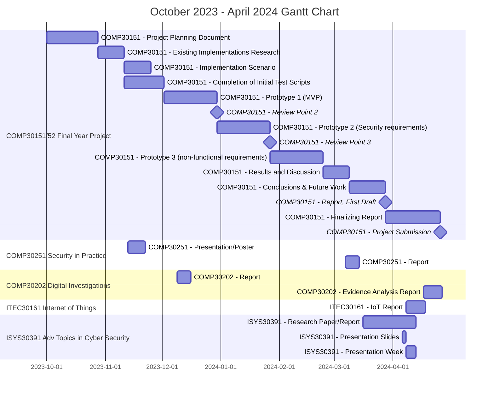

# COMP30151 - Project Planning Document - Jordan Foster (N0913799)

## Table of Contents

[TOC]

## 1 Introduction

A Dead Man’s Switch is a safety mechanism that deactivates (in the case of a fail-safe) or activates (in the case of a fail-deadly device) in the instance that no human intervention occurs (Wikipedia, 2023). In the context of computer science, they have in the past been used in nuclear deterrence systems such as and - unfortunately - for criminal purposes, despite their ethical potential in safety systems as evidenced by their physically engineered equivalents in machinery. A common digital example of a Dead Man’s Switch would be a system set up to transmit a pre-drafted e-mail if the user does not log into the system every 7 days; an analogue equivalent could be as simple and benign as the emergency pull-stop clip on a treadmill for if the user falls off.

Within the context of cybersecurity, DMS tools assume a threat model and primary adversary and therefore aim to assist with anti-forensic countermeasures as a result. Tools such as BusKill and USBKill through their fixed design and intended usage imply that this class of software can only ever be used as a part of an operational security plan for secure use of systems. This is not inherently bad - such practices are the expected norm in various high-assurance financial, military, intelligence and law enforcement work - but their past use as part of criminal operations work draws suspicion of illegality, and perhaps rightly so.

This idea of fail-safe and fail-deadly systems being two sides of the same coin is partcularly present here, as the ‘safe’ outcome for one actor is necessarily the ‘deadly’ outcome for another; a fact that provides a significant ethical quandry, as reflected in the Cold-War era concept of Mutually Assured Destruction, enforced by systems such as Russia’s Perimeter/Dead Hand and the UK’s Letters of last resort - where the initial concept of an individual’s incapacitation is scaled all the way to incapacitation of the state itself.

However the initial usage of a Dead Man’s Switch was rooted in the context of operator safety as a ‘Vigilance Device’. Machinery such as lawnmowers require them in the U.S. via legal mandate in the form of a switch that must be continually held down — see §1205.5 Walk-behind rotary power mower controls (Code of Federal Regulations) 2022 — and within public transport the use of Driver Safety Devices are commonplace. In these contexts their usage is entirely as a fail-safe, in contrast to their typical media-famous depictions as previously described; there is no metaphorical ‘sharp end’ that harms another upon activation, nor does the context indicate that morally the ‘actor’ shouldn’t be kept safe. As a result, such benign systems could be considered the primary — and possibly only unconditionally — ethical example of their implementation that currently exists.

Despite this ubiquity, fail-safe systems involving a human operator do not appear to have been adopted significantly into computing environments (at least in their archetypical form of protecting against an incapacitated actor). The likely strongest hypothesis for why this might be the case is simply that where extremely high-assurance is required, the human element is removed or otherwise mitigated - Operational Technology primarily exists to hand over processes that would formerly be trusted to a fallible human operator.

Within more typical workplaces however, human operators cannot be removed in their entirety; general computing environments heavily optimise human workflows but cannot supersede them entirely. Most of cybersecurity relies on mitigating this attack surface, but it is still a significant cause of issues. Amongst typical organizations, Verizon’s annual Data Breach Investigations Report (henceforth DBIR) has indicated in recent years that as many as 82% ([2022][@verizon2022DataBreach2022]) and 74% ([2023][@verizon2023DataBreach2023]) of breaches involve what they call ‘the human element’ - though the statistic has improved, it is still an alarming majority. This is not a recent issue either; access to data in previous decades is worse, but one journal ([Liginlal et al. 2009][@liginlalHowSignificantHuman2009]) states as many as 67% of breaches between January 2005 - January 2009 were specifically the cause of human error, while a later article ([Hughes-Lartey et al., 2021][@hughes-larteyHumanFactorCritical2021]) that checks a kaggle dataset (Archangell (pseud.), 2023) representative of HIPAA breaches from 2009-2017 indicates that over 75% of breaches could be cause by at least *some* form of human factors issues. Regardless of industry, the trend is obvious that in general computing environments such as those in the workplace, reliance on people --- and the attack surface it exposes --- is likely to be something high-security workplaces will have to contend with for many years to come.

The use of intensive technical controls means that the consequences of motoric or procedural errors can be comparatively minimized compared to the world of operator safety (where failing to perform an action could prove fatal). However, the more cognitively demanding nature of knowledge work leaves room for errors that do not follow a well-defined procedural path like in operator safety scenarios; controls against these kinds of ‘judgement’ errors seem comparatively minimal (perhaps due to their complexity). There have been some efforts within the space of behaviourism — specifically self-control — to engineer desired outcomes in a *personal* context, and in some sense, they appear to work.

To provide an example — the use of ‘social contracts’ via tools such as StickK and Beeminder push people to achieve their goals by putting in artificial ‘failure’ states in the form of a penalty fee if tasks are undone, focusing on one kind of use-case for a ‘dead man’s switch’–esque setup — that being a ‘fail-deadly’ system that activates if tasks aren’t done. Another form could be leveraging the concept of ‘precommitment’, where options to stray off task or away from an intended outcome are removed or otherwise neutered before starting a procedure (with the intent to be to prevent self-sabotage when willpower fails) — effectively acting as a ‘fail-safe’ system that restricts behaviour rather than punishing it.

Such products within the space show that perhaps there might be room in the cybersecurity space for a reapplication of the dead man’s switch concept for the purposes of *behavioural engineering* - where the tendencies and biases of human beings are acknowledged and designed around in a way that may mitigate the chance for the ‘chain-of-event’ type errors to occur that our technical controls cannot directly account for in all instances. With the understanding that such ‘failure states’ will vary across organisations and industries, the aim of this project is thus to produce a configurable framework with which to set up both *fail-safe* and *fail-deadly* implementations that scales to different scopes of ‘actor’ at the individual, group and organizational level, alongside the investigation, discussion and potential implementation of mock-up use cases of this software within different contexts at the different scales previously described.

## 2 Aims and Objectives

### 1.1 Project Aims

The main aim of this project is to produce a flexible toolset and framework that allows various 'triggers' and 'payloads' to be designed and tied together concurrently.

Secondarily through use of the above tool, another aim is to determine whether the implementation of *dead-man's switch*-style technology to lower-stakes, general/personal computing contexts would be viable, both through analysing current research and any existing products available on the market that could be adapted to the format, such as commitment devices --- and whether the tool produced as a result of a project could be easily adapted to those purposes, or what changes or additions would be required if not (and the viability thereof).

### 2.2 Objectives

1. Assess the current state of usage of *Dead Man's Switches* (or similar mechanisms) in contexts relevant to their usage in general computing environments and their efficacy; noting any research findings or real-life failure-state incidents that require consideration.
2. Identify any existing issues within the computing and cybersecurity space that could be potentially improved with the implementation of such a device, including (but not strictly limited to) security issues involving human factors and the current limits on human-computer interaction that may be a cause.
3. Note and discuss (if applicable) any potential ethical or legal concerns that may arise as a result of implementing a solution in the chosen area with the framework, using the BCS Code of Conduct as a basis.
4. Test, design and develop a prototype of the framework that meets the needed requirements for an MVP to be deployed in this context. If any additional requirements that can be generalized as part of the framework are realised, these should be noted in the report at this point of the project.
5. Given the success of the initial prototype, evaluate any potential risks from the perspective of potential red-team attacks against the software that attempt to disarm, disable or otherwise sabotage the base components of the framework. Include any potential increase in attack surface through implementing additional requirements as part of analysis.
6. Having considered the significance and relevance of any risks identified, consider the addition of countermeasures as security-based requirements. Implement these requirements according to prior analysis, prioritising requirements as time dictates.
7. Report the outcome of the project, bringing particular notice to any risks left unaddressed and any potential ethical or legal considerations to be made in further work.

## 3 Tasks and Deliverables

### 3.1 Tasks

#### 3.1.1 Research

1. Collect existing research or resources on implementations of 'devices considered to trigger based on incapacitation or failure of an operator or dependant process.'[^1]

2. Identify collated references and evaluate their relevance for discussion according to the following:
   - Availablity of information on the *design* of the system itself, so that potential faults can be noted and countermeasures/fixes evaluated if replication of similar issues is possible in the delivered project.
   - Availability of information pertaining to the *quality* of implementation (or lack thereof).[^2]
   - For experimental research, the measured outcome of the implemented device (does it improve the situation beyond margin-of-error)?[^3]

3. Having considered potential *general* implementation issues that may be encountered, begin looking at potential areas where the system can be employed to help provide a solution to the problem. Out of the areas chosen, note the following:
   - Any specific challenges related to the problem space that may be applicable to the implementation of the system.
     - Where prior research or study into the problem space exists, note any prototype or commercial solutions provided that are *not* comparable to the use of a DMS system and the efficacy of the solution provided.[^4]
   - How a specific configuration of the intended project outcome could improve this situation, preferably backed up with evidence (where similar prior work may exist).

4. Identify any potential ethical or misuse concerns that may arise with *this* specific solution demonstrated via the DMS framework - in particular:[^5]
   - Could the solution provided cause harm to another? If so, why - and does the risk caused fall within boundaries of lawful society (for example, to detect an intruder, or for defence purposes)?
   - What attack surfaces could be potentially exposed for use by a malicious actor, and in the context of its deployment, does the responsibility for protecting against these issues fall within the scope of the project?
     - Could the target of the payload be changed in an unauthorized manner?
     - Could the observer responsible for triggering the payload be modified to check for a different, undesired trigger?
     - Could the DMS system itself be rendered inert somehow?

5. For each concern identified, evaluate whether it is an issue that is dependant on *context-of-use* (external to the software itself) or as a result of any potential implementation issues?
   - Issues considered dependant on *context-of-use* should be discussed alongside potential countermeasures.
     - By necessity, some issues will likely need to be considered 'out-of-scope' for what a developer can reasonably engineer against, and in such cases policy will have to step in.
   - Issues as a result of implementation issues *must* be considered for inclusion into the requirements.

#### 3.1.2 Design \& Testing

1. Note any additional requirements that have arisen as a result of prior research or work, and re-evaluate any requirements that may now be considered of a lower priority (i.e., *MUST* → *SHOULD*) or out of the realm of feasibility in the project development timeframe.
   - Add these onto the table defined in [Expected Outcomes](#32-expected-outcomes).

2. For each requirement, determine what kind of test is best suited to assess its completion:
   - Where applicable, we will write a Gherkin language test script to tie directly as a form of unit testing via the `behave` module.
   - If this is somehow not applicable (such as for edge-cases), an acceptable alternative might be to fall back to standard unit tests, but we should prefer to define such edge-cases outright if at all possible.[^6].
   - High-level requirements (acceptance tests) may not be coverable via unit tests and thus may require manual scripting. Depending on implementation, a decision should be made as to whether this is scripted before development of the system (or relevant units) or after completion thereof.

#### 3.1.3 Implementation of functional requirements

1. Going through the functional (*MUST*) requirements as deemed applicable, implement each unit, **beginning with the underlying DMS system first.**. A test unit can satisfy several requirements at once, given that it makes sense to do so.
   - Identify which requirements successful implementation of this unit should satisfy.
   - For low-level requirements, begin writing unit tests based on the Gherkin test scripts provided.
   - Begin implementing the basic skeleton for the test units in a manner that will make them initially fail without an implementation.

2. Begin implementing code to make the test unit succeed according to the original requirement and/or test script.
   - Show any relevant design diagrams necessary for understanding of the implementation (if applicable).
      - The report will be written as a Literate Program; codeblocks will generally be left out of the submitted report in favour of high-level explanation, except for where circumstances dictate otherwise.
        - Doing this allows us to couple the report and project closely enough to allow for explanations for any needed deviations from the PPD (either due to time, technical barrier or other blocker).
   - Write code to satisfy the unit test that has been created within the Report, alongside a high-level overview of what changes have been made. Where relevant, show the underlying code that proves that the resultant work will pass the unit.
     - If for whatever reason the the test cannot be passed and the Gherkin Script or requirements must be modified, state why this is the case and the changes that have been made to the project going forward.

3. Continue the above loop (steps 1-4) such that an 'ongoing log' of progress is defined within the report as part of agile development process.[^7]

#### 3.1.4 Implementation of non-functional and security Requirements

1. After initial production of the FYP, identify any potential attack vectors for the *generic DMS system* upon which the example use-case is built.
2. Identify any potential attack vectors for the scenario-specific observer and payload threads that are created for use.
3. Discuss the significance of any vectors theorized, what potential countermeasures would be, and (if relevant) whether these countermeasures are to be added as additional *SHOULD* requirements to be implemented.
4. For each non-functional (*COULD*) and security (*SHOULD*) requirement, go through the same unit testing and implementation process explained in Sections [3.1.2](#312-design--testing) and [3.1.3](#313-implementation-of-functional-requirements).
   - For any requirements left unimplemented by the end of the process, explain why this is the case and display any existing high-level work that may be done on it (to be discussed as part of *Results and Discussion*).

### 3.2 Expected Outcomes

The expected outcome of this project is to produce a python-based commandline utility that allows the setup and teardown of various types of vigilance control scenarios through the use of a framework. The intent is that for a MVP the system would allow configuration via a commandline utility such that it can be used with existing OS tools, particularly within UNIX ecosystems.

Given that we require an example scenario for demonstration purposes and evidence that this tool has potential for ethical or benign use, part of the MVP is that we do as such using our developed tooling.

Our *baseline* set of project requirements for the *underlying DMS system* are defined thus, and use the following terms:

- *MUST* requirements are the minimum acceptable for the MVP to be functional.
- *SHOULD* requirements are expected for secure usage of the end-product, but their lack of implementation **should not affect progress towards MVP.**
- *COULD* requirements are **considered to be feature extensions,** and their lack of fulfilment **should not affect the functional security of the project in any meaningful way, or affect MVP progression.**

|     ID      |                Description                 |
| :---------: | :----------------------------------------- |
| `DMS-REQ-1` | The DMS *MUST* provide a commandline utility that allows the 'loading' of serialized functions from a file. |
| `DMS-REQ-2` | The observer thread *MUST* communicate any trigger signals to the payload process. |
| `DMS-REQ-3` | The payload thread *MUST* acknowledge any received trigger signals for sender confirmation purposes. |
| `DMS-REQ-4` | The payload thread *MUST* communicate the outcome of any trigger attempts to all relevant components of the DMS. |
| `DMS-REQ-5` | The termination of the payload or observer threads *SHOULD* be observable by other components of the DMS via the lack of a heartbeat signal. |
| `DMS-REQ-6` | The DMS *SHOULD* support the signing of pre-made functions to ensure code trust is verified before execution. |
| `DMS-REQ-7` | The DMS *SHOULD* allow the user to view the underlying source code of a pre-made function before choosing to load it to prevent malicious code execution. |
| `DMS-REQ-8` | The DMS *COULD* allow the individual components of the system to be setup across systems through use of networking protocols. |
| `DMS-REQ-9` | The DMS *SHOULD* support some level of anti-tampering functionality against external sources. |
| `DMS-REQ-10` | The DMS *COULD* support resuming the state of the system in the event of a **planned** system shutdown by recording the state of processes. |

These are not set in stone due to the nature of the project and will likely be expanded upon to some extent to accomodate the specific demonstration scenario chosen, but any changes are expected to be thoroughly documented in the Report due to the outlined process (see [Tasks](#31-tasks)).

### 3.3 Expected Project Scope

Our Minimum Viable Product is to produce a Python module that is capable of interoperation with current tooling to allow the multithreaded setup of various 'dead-man's switches' (defined by the connection of an 'observer' thread identifying a 'trigger' event and thus activating an associated 'payload' thread). The underlying assumption is that these threads *may*[^8] be tied together through a base class written expressly for this purpose, and that the end-user for an MVP scenario will be familiar enough with Python and the REPL to write their own custom classes to set up a scenario. Desired expansions of this would include the expansion of this into a commandline utility that allows the usage of '*pickled*' (serialized) classes to be loaded, allowing a setup to be loaded by someone other than the initial developer (such as a system administrator). Given that unpacking serialized classes is considered inherently insecure due to its potential for arbitrary code execution, we may also decide to make use of HMAC hashing with the associated `hmac` module as recommended in the `pickle` module's documentation.

The architecture of a given DMS setup itself is intended to consist of three threads that handle different functions; the 'observer' thread checks for a context-specific outcome, and notifies the main controller (`dmsClass`) and the 'payload' thread of the trigger condition[^9]. The 'payload' thread is designed such that once triggered it requires no further intervention from other threads. Further extension might allow the disarming or interruption of the payload from the 'signal' thread, but allowing configurability after initial arming of the device is *not* intended to be part of the MVP. The 'signal' class is intended to primarily act as a logging server to which `dmsClass`, the observer, and the payload report - though it may optionally support configuration or resetting of the device, this is also intended as a potential avenue of expansion; in the event that it would be explored we would likely limit the scope of such to the following:

- Changing of initial parameters of the *thread function* itself[^10].
- 'Resetting' of the observer thread to its initial state (for example with 'multiple-strike' failure systems).
- The ability to disarm a payload in progress, given that this functionality has been coded into the payload itself by the author.

For the purposes of preventing scope creep however, the ability for the 'signal' controller to interact with other parts of the system beyond receiving messages from `dmsClass` is considered a possible extension and not part of the MVP. Similarly, the movement from standard I/O pipes to networking sockets is considered as a possibility that would allow the DMS to be deployed in a distributed manner, but adds enough complexity that this is considered a stretch goal only if time absolutely allows.

#### 3.3.1 Scope of Security Enforcing Functions \& Requirements

Being written in Python, the underlying DMS framework will necessarily be running as a userland (*Ring 3*) application. This helps keep the tool portable, but limits the scope of what attacks can be fought against, as it will be subject to the Host OS' process scheduler. The tool may be able take appropriate anti-tamper measures against interference from other processes and (some) interrupt signals from the process scheduler, but any critical hardware, driver or OS-level failure events **cannot be defended against.** Thus, the following assumptions are made about the deployment envionment:

1. The system that the DMS is running on is free of any malware that operates at a level *lower than ring 3* (userland).[^11]
2. Sufficient system hardening measures have been taken, such that it is unlikely that an attacker has achieved privilege escalation via **known** exploits or the usage of stolen credentials in the event they gain *remote access* to the system.
3. The risk of the host system suffering a power outage or system failure has been mitigated via external means such as use of a battery or *Uninterruptible Power Supply* (PSU).
4. At time of activation, the device running the *payload* process is not in a sleep or hibernation state, or otherwise unable to carry out its task.
5. If the functionality implemented by `DMS-REQ-5` (heartbeats) is not enabled, the device running the *observer* process is not in a state whereupon it is unable to contact the *payload* process (sleep or hibernation) upon triggering.
6. It is assumed that any attackers do not have *physical access* to the device running the DMS. If `DMS-REQ-5` (heartbeats) and `DMS-REQ-8` (distributed setup) are implemented and enabled, this aspect only applies to the system running the *payload* thread.

Other assumptions about a threat model may need to be made as requirements are approached in the project report. These will be explicitly defined where relevant.

### 3.4 Project Milestones

The following milestones are intended to be reached:

1. Ethics application submission (RP1)
2. Submission of PPD
3. Established scenario for implementation
   - Get this checked with supervisor
4. Completion of Initial Test Scripts
5. Prototype 1 (Review Point 2, MVP)
   - Report (and by extension, code) state discussed with supervisor at this point
6. Prototype 2 (*Security* requirements)
7. Prototype 3 (*non-functional* requirements)
8. Showcase Entry and Review Point 3
9. Report, First Draft
10. Project Submission
11. Project Showcase

## 4 Gantt Chart

## 5 Resources

### 5.1 Research Resources

- Zotero is an open-source reference manager for use in academic contexts. It will be used to store and annotate papers, books and other resources during research, and to generate style-accurate citations and references.
  - `scite-zotero-plugin` is a Zotero plugin provided by scite.ai, an online service to evaluate discussion surrounding a paper. In the context of Zotero it is used to list the number of supporting/disputing citations and to access the scite.ai report itself (which does not require a paid subscription).
- Google Scholar will be used to search for and obtain papers related to the project.
- Given that a lot of literature on vehicular safety is quite old, *WorldCat* will be sometimes used to find an equivalent book or document (such as a reprint) when the cited book cannot be directly sourced.
- NTU's Library OneSearch will be used to access papers or request interlibrary loans when an open-access version of a resource cannot be found.

### 5.2 Implementation Resources

- The main report will be initially written using `lmt`, a small program written in Go that allows for markdown files to be used for Literate Programming. This will be used to couple the report process to the development cycle for reasons outlined in earlier sections.
- `pandoc` will be used alongside manual editing to convert the markdown file into the university-templated `.docx` report to be submitted.
- The DMS system itself will make use of Python 3, and *may* use the following modules:
  - `subprocess`/`threading` (preferably the former)
  - `os`
  - `abc`
  - `pickle`/`shelve`
  - `argparse`
  - `hmac` (or some other digest/signature mechanism to *authenticate/verify serialized functions*)

### 5.3 Testing Resources

The following Python 3 modules will be used to facilitate the testing process:

- `pytest` will be used as the primary unit testing framework.
  - This will likely be primarily used for low-level requirements.
- the `pytest-bdd` module will be used for Integration and End-to-End tests, and will be written in a manner following *Behaviour Driven Development.*
  - It will likely be employed mostly to satisfy high-level requirements.

The main reference for following *Behaviour-Driven Development* practices will be Automation Panda's *BDD 101* series (Knight, A., 2023). It provides reference on using `pytest-bdd` and advice on how best to write Gherkin scripts for features, among other things.

## 6 Risks

To evaluate potential risks to the project, we will be using a *Risk Matrix*, following a blogpost by Asana (2022) as a guideline. Risks are identified by type, severity, likelihood, and impact. Risk *Types* that will be used are as follows[^12]:

- Strategic risks, relating to potential errors in decision, such as tools used or evaluated timelines.
- Operational risks,  such as mistakes in planning or communication.
- Technical risks, such as loss of data or property damage.

Risks themselves are rated on a scale of 1-5 on severity and likelihood, and the resultant risk impact is a value of 1-25 calculated by the product of both.

It is as follows:

| Risk ID | Risk Type | Risk Description | Severity, 1-5 $(S)$| Likelihood, 1-5 $(L)$ | Risk Impact $(S\times{I})$ | Countermeasure(s) |
| :-: | :-: | :-- | :-: | :-: | :-: | :-- |
| 1 | *Technical* | Source-code and other deliverables could be lost, setting the project back.  | 5 | 2 | 10 | All project code and documents are regularly committed to a private *GitHub* repository. |
| 2 | *Operational* | Project completion could become difficult due to scope creep, either by the choice of scenario or due to subsequently identified non-functional and security requirements. | 3 | 3 | 9 | A *critical path* is to be identified at each stage of requirement fulfilment (functional -> security -> non-functional). These requirements are to be implemented first and *in defined order* before other requirements are implemented (or their absence is to be explained to the reader). |
| 3 | *Strategic* | The overhead of the *Literate Programming* process may extend the time for tasks longer than expected. | 2 | 2 | 4 | The use of `lmt` means that at any point, existing code may be 'tangled' from the report into their respective source files, and development can *continue independently* from the report. |
| 4 | *Strategic* | The overhead of unit testing and writing of *Gherkin* test scripts may extend the time for tasks longer than expected. | 2 | 2 | 4 | *Gherkin* scripting can be dropped in favour of manual acceptance testing, with screenshots and explanation. |
| 5 | *Strategic* | Insufficient information on prior implementations of *Dead Man's Switches* may be found to significantly affect the trajectory of the project. | 2 | 5 | 10 | The research focus of the report will shift to give more weight to any *new* applications of a *Dead Man's Switch*. Any additional requirements will be entirely evaluated on the requirements of the scenario chosen, and additional time may be allocated to this task to compensate. |
| 6 | *Strategic* | No potential applications of the *Dead Man's Switch* in new fields are found that *would be viable to use as a scenario* within the timeline allotted. | 5 | 2 | 10 | In the event this occurs, a meeting will be arranged with the project Supervisor as soon as possible with the intent to find a scope-appropriate application from research done. As an alternative, the possibility of taking an existing known or thought-of application - with citation provided - and elaborating upon it to a level appropriate for project scope. (*Note: this is extremely unlikely as early research taken before starting term indicates that there are at least two fields that may act as candidates.*) |
| 7 | *Strategic* | The only viable scenario options for the *Dead Man's Switch* are those not related to the degree being studied (BSc Computer Systems (Cyber Security)). | 2 | 1 | 2 | It may be agreed upon to focus more on the robustness of the underlying *Dead Man's Switch* framework through the addition of more security requirements. Effort relating to scenario-specific requirements outside of the MVP will be entirely directed towards security requirements and any non-functional requirements whose fulfilment has necessary security implications that require addressing. More time will be spent evaluating the potential attack surface of the end product at both the scenario and framework-level to help produce these requirements. |
| 8 | *Operational* | The state of the project misaligns with the desired deliverables and outcomes due to lack of communication with the project supervisor. | 2 | 4 | 8 | As suggested in lectures, weekly contact with the supervisor will be aspired to. This may be in the form of updates or arranged meetings, depending on whether discussion is required. |
| 9 | *Operational* | Tasks take longer to fulfil than their stated timeframe on the Gantt Chart. | 2 | 2 | 4 | Tasks are rescheduled according to circumstance and other commitments may be rescheduled or dropped as required. |
| 10 | *Technical* | Libraries chosen for development are unsuitable for fulfilling certain requirements. | 1 | 2 | 2 | Due to the development methodology being followed this should be caught when attempting to implement the requirement. It will be noted at that point in the report and any changes made in libraries used or implementations will be noted. |

## 7 Career Aspirations

The completion of this project will require notably more consideration of LSEPIs than others may within the same space. The tech industry considers these aspects at all times, but sometimes the realm of ethics may not be one that is as considered as others. Being able to critically think about a project's ethical implications is one that I believe is important to a career looked back upon with pride - rather than regret - and particularly within the context of the UK Defence industry, which I worked in as part of my Industrial Placement with BAE Systems Digital Intelligence and may return to upon graduation.

This factor may not only be significant from purely an ethics standpoint in such a case; it may also be important from the perspective of an individual responsible for the keeping of potentially sensitive knowledge, work and information which - on pain of the 'need to know' principle - may necessarily be vague in its application. Knowing whether a given project or development of technology is morally palatable to me requires me to be able to consider the potential uses of my work without a specific use-case in mind - something I have to consider with this project also. 

Being able to see this in advance and avoid projects or pieces of work that might weigh on my conscience is a significant factor that contributes to the trustworthiness of a person to hold a security clearance, and failure to do so properly in some cases could have real career consequences in this space, such as a loss of or inability to gain clearance (and thus, the effective ending or halting of my career in any industry that requires a security clearance).

From the perspective of the tech industry in general, it must be admitted that Python is very much a 'comfort zone' language for me, and one that I have partially chosen in order to be able to meet the project deadlines. In this respect not much is being learned, and to some extent a lack of experience with various languages is a point of concern for my career readiness. I had originally wanted to play with the idea of learning Steel Bank Common Lisp for this project to investigate the idea of a Domain-Specific Language for the observer and payload functions - but part of good project management is to realize when to stick to what you know compared to integrating new tech due to potential overhead. 

My familiarity with Python and its modules fits well for the open-ended nature of the demonstration scenario in this instance, so I have instead decided to leverage my familiarity with the language to pick up and experiment with various software development practices - not all of these will be used in many positions (*Literate Programming* is particularly one that sees minimal use), but for all of this I will pick up a significant amount of transferrable skills: the method of development will allow me to better translate requirements into features; write good tests both as a software and test engineer; get better at writing documentation by putting it 'first' and get better at operating with 'chunks' of work in respect to Agile (which is popular in many organizations). 

All of these are somewhat harder to learn through simply reading documentation (unlike a language) and are best picked up through immersion - this project acts as a good excuse to do exactly that.

## 8 Legal, Social, Ethical and Professional Issues (LSEPIs)

### 8.1 Legal Issues

#### 8.1.1 Potential for the project's use as an 'article' as defined under section 3A of The Computer Misuse Act, 1990

Given the intended configurability of the system, there is the possibility that a user could feasibly create a set of 'observer' and 'payload' functions for use that could be employed using the DMS framework as a *logic bomb* or *time bomb* installed as part of unauthorized access to a system with a payload that could cause damages to an individual or organization.

Due to the potential for a given configuration of the DMS to be considered a cyberweapon, UK legislation must be consulted. The original form of the *Computer Misuse Act 1990* itself does not contain a section relevant to this, but a subsequent (*Police and Justice*) Act passed in 2006 adds (c. 37) *Section 3A* to the act, and another (*Serious Crime*) Act passed in 2015 amends section 3A to include section 3ZA (c. 9), defined within the same Act.

For the purposes of complete legal analysis, we will assume that any user that has used the tool in a malicious manner has committed a crime under all sections mentioned (Section 1, 3 and 3ZA). Given that we have defined which textual amendments are relevant, we may now directly quote the revised, digital edition of the *Computer Misuse Act 1990* (*legislation.gov.uk, 2023*); emphasis mine in all cases.

Throughout the Act the term 'article' is used; Section 3A(4) defines it thus:

> In this section “ article ” includes any program or data held in **electronic form.**

Section 3A(1) is the first of relevant passages:
> *A person is guilty of an offence if he makes, adapts, supplies or offers to supply any article **intending** it to be used to commit, or to assist in the commission of, an offence under [section 1, 3 or 3ZA].*

The Project Planning Document should show that the author's intent is not to provide a cyberweapon in any form as part of the project itself; to be unambiguous about this **the demonstration scenario chosen should not represent such a use case.**[^13] These checks may be made as part of an additional ethics sign-off form.

Section 3A(2) continues as follows:

> *A person is guilty of an offence if he supplies or offers to supply any article **believing that it is likely to be used to commit, or to assist in the commission of, an offence** under [section 1, 3 or 3ZA].*

The *Crown Prosecution Service* offers legal guidance (2023) to prosecutors attempting to leverage the *Computer Misuse Act 1990* in their cases. On Section 3A(2) it notes the following:

> 'Likely' is not defined in the CMA but, in construing what is 'likely', prosecutors should **look at the functionality of the article and at what, if any, thought the suspect gave to who would use it.**
> ...In the offence under Section 3A(2), the **relevant mens rea is 'belief' and mere suspicion is not enough.**

It should stand to reason that the mere production of a Project Planning Document that considers LSEPIs is more than enough evidence that the author has had to deeply consider potential issues of use. The functionality of the 'article' could be admittedly contentious due to its configurability; though it should be noted that any malicious payload would have to be explicitly *written* by the user, or provided to them by *another user* that serialized the functions - the DMS framework would have an undeniable hand in 'linking' the components together, but this in itself is benign enough that it wouldn't be *directly* responsible for a violation of Sections 1, 3 or 3ZA. Regarding 'belief', it stands to reason that neither the University or its employees - as source-code submission is required for the module - will use the program for a CMA offence.

It also asks prosecutors to consider a series of factors when evaluating the strength of a case dependant on 3A(2). We will answer them in the context of this project now:

> - Has the article been developed primarily, deliberately and for the sole purpose of committing a CMA offence (i.e. unauthorised access to computer material)?

No. For the production of the DMS framework itself, it would be written neither for the primary *or* sole purpose of commiting a CMA offence, and any misuse of it for the purpose of cybercrime would be an outcome explicitly acknowledged as possible, but not deliberately designed for. The idea of attempting to audit that *what* the DMS framework is running is *legal* is something impossible to implement with technical controls in a manner that is robust to circumvention efforts.

In addition, as stated prior, any malicious payload would have to be explicitly written by *a* user of the program, rather than the author - whether the leveraging of the DMS framework would legally be considered as the author's contribution to such misuse is uncertain. The only sentencing case involving a successful charge under Section 3A[^14] - R v Martin (2013) - was appealed, with the transcription of the court's decision to reject the appeal - [2013] EWCA Crim 1420 - stating the following:

> 22. Finally, counts 12 and 13 concerned software called Jaindos, which is a program that can be used to instigate DOS attacks and Cyber Ghost, both of which were on the appellant's computer equipment.

Attempting to find out more about Jaindos was unsuccessful (likely for good reason); however as the court states that the IP address involved in the DOS attack "appeared to be based in the United States", it might be a reasonable guess to assume 'Cyber Ghost' is referring to the VPN service of the same name. Given that the company that provides the service was not also prosecuted under Section 3A(2) - despite VPNs being commonly used in cybercrime, even in 2013 - and the CPS' explicit requirements for *mens rea* to be established, it stands to reason that a situation where a bad actor uses a piece of software for a CMA offence that was *not initially provided for that purpose* might have some form of legal precedent in favour of the software vendor.

> - Is the article available on a wide scale commerical basis and sold through legitimate channels?

Any commercialisation of the project would be explicitly outside of the scope of what would be produced as part of a final year project. This project is not being created in collaboration with a client, either. In the event that it ever was, it would be done so through legitimate channels and with respect to the law - but the principle point here is that this is a null factor for any consideration of legality within the project itself.

> - Is the article widely used for legitimate purposes?

In the context of the final year project, the only use of this tool would be in a manner that is presumably legitimate as a result of it requiring sign-off from the university. As stated before, the University may desire additional reassurance on this front through additional documents and forms, and discussion of any potential issues in this regard with the project supervisor have been ongoing and will continue.

> - Does it have a substantial installation base?

Although it would be preferred to be able to display the final year project code as part of a portfolio (for example on GitHub), the aforementioned legal concerns are likely to restrict this, in which case the only 'installation base' would be the device(s) used for development, the device used for the demonstration. Any potential prospective employers that might request to see the project work would likely be in direct violation of copyright law if they were to use the project themselves (assuming it has not been published on GitHub), and thus it can be reasonably safe to assume that they do not count as users for this purpose.

To summarize, the author **does not believe the proposed project, in the scope of its production or its distribution thereof for marking purposes, would be likely to constitute an offence under the Computer Misuse Act 1990.** This analysis has only been undertaken in an attempt to exhaustively prove such a point and allay any concerns.

#### 8.1.2 Additional Considerations for The University

The report itself, being part of a Literate Program, could also theoretically count as an 'article' under the legal definition provided under Section 3A(4), if it is in a digital format. Given that the rights to the submitted report are surrendered to Nottingham Trent University, however, the institution is by all means able (and encouraged) to redact parts of the report as seen fit if they intend to use it for other purposes.

It is assumed that the university as an organization would have a very strong legal defence against any potential allegations under Section 3A of the Act, as it would presumably not distribute the report to any parties with the intent to faciliate a crime, and would also not distribute the report to anyone believing it could be used for criminal purposes (thus *mens rea* cannot be established).

It should also be noted that a printed copy of the report could be reasonably argued to be a type of *data* or a format of a *program*, given that it is encoded information, but it would not be in an electronic form - and so *might* not legally be considered an 'article' under the definition provided by Section 3A(4). Perhaps at worst a weak argument could be made that a printed copy is a representation of an electronic form and thus is equivalent - but there is no legal precedence for such a case in the UK, and a transcribed copy created with a typewriter or through writing would counter this argument. This point is raised to note that the distribution of any printed copies of the report may possibly enjoy a more robust legal defence.[^15]

### 8.2 Social Issues

Referencing section 1 of the *British Computer Society's Code of Conduct*, members of the organization must follow a set of requirements relating to the public interest, among which is the following:

> a. [You shall] have due regard for public health, privacy, security and wellbeing of others and the environment.
> ...
> d. [You shall] promote equal access to the benefits of IT and seek to promote the inclusion of all sectors in society wherever opportunities arise.

The intent for this project as a flexible framework to allow the implementation of a 'Dead Man's Switch' style device is to allow the free exploration of new applications of the technology that may benefit society at large, rather than to act as a tool that may instead undermine society or allow individuals to break the social contracts we agree to as a collective. This is particularly affirmed by the idea of using the Dead Man's Switch as a form of commitment contract; though typically contracts are between two entities, there would be nothing in the framework that would prohibit such a concept from scaling to an agreement amongst a set of parties.

One proposed usage that may benefit a community or society at large is to use the framework as a form of accountability, either amongst the collective or against an asymmetric power. One example might use the Dead Man's Switch to track whether an auditing or standards authority has been keeping up with its stated responsibilities (the 'observer'), with the 'payload' being an automated post on social media (such as twitter) that tags or is addressed to the relevant government account(s) to prompt an explanation of any seen lapse in duties. Another amongst a community with a common goal might observe whether all parties have upheld any responsibilities that exist as a result of agreements or pledges - this might be to see that everyone in a cycling club has shown up consistently (for a low-stakes example).

There are many situations where an automated 'watcher' with its functions and underlying codebase being permissively licensed and accessible to collaboration could be a great public good; in addition, the transparency afforded by openly usable code in an accessible language could help directly counter the problem of 'who watches the watchers' that is sometimes raised with organizational bodies that require funding (and are thus prone to influence).

One argument may be made for accessibility that only a certain subsection of society will have the ability to program in Python to the standards required to use the tool to its fullest extent; solving this problem would be another task entirely, possibly involving a low or no-code solution, and so considered outside of the scope of this particular body of work. However this is a worthwhile point, and it will hopefully be discussed as part of future work.

### 8.3 Ethical Issues

As has been discussed in Section 8.1 (Legal Issues), a proper analysis of the ethics of this project cannot be undertaken without the consideration that it may venture into legal ambiguity.[^16] Regardless of law, however, it must be acknowledged that some may leverage the tool for malicious purposes that are in and of themselves unethical. The only true solution to this would be to create a bespoke solution for a pre-defined, 'ethical' scenario - which the author firmly believes would undermine the hypothesis that such technology has greater ethical uses beyond its use in mechanical safety systems, and the intent to support exploration of this through the project's end result.

That being said; to show that we have an interest in exploring this aspect we should set forth some guidelines that prevent the project from straying into unethical territory. We will use sections 1a., 1b., and 1c of the BCS Code of Conduct as reference:

> a. [You shall] have due regard for **public health, privacy and wellbeing** of others and the environment.
> b. [You shall] have due regard for the **legitimate rights of Third Parties.**
> c. [You shall] conduct your professional activities **without discrimination** on the grounds of sex, sexual orientation, marital status, nationality, colour, race, ethic origin, religion, age or disability, or of any other condition or requirement.

The proposed guidelines to ensure the project progresses ethically are as follows:

1. The chosen demonstration scenario will not involve an unconsenting external party, either for the purposes of 'observation' or as a target for a 'payload'; and in the case of a consenting party, the demonstration must be assured and evidenced not to cause harm, be it of a bodily, mental, financial, social or legal nature.
2. The chosen demonstration scenario should not disproportionately affect individuals or demographics in a *negative manner*, and scenario options that could have this risk may not be chosen unless there can be a significant argument made that:
   i. The risk presented to a demographic is a result of wider societal misuse of a technology that - were it not for unethical application by an end-user - does not perpetuate harm in and of itself.[^17]
   ii. That the production of the *scenario-specific* observer and payload code for this purpose would not perpetuate any existing unethical actions caused by other uses of similar technology, either by making it more accessible or by deepening the extent of harm possible.
   iii. That there is a viable application of the related technology as a *Dead Man's Switch* scenario that could provide a societal or ethical good (or at *absolute* minimum, be considered benign), proven by the scenario itself and not undermined by any subsequent implementation.
3. Any *positive affect* on a demographic by the chosen demonstration scenario should not be such that it provides an advantage, benefit or other boon such that a resultant *power asymmetry* is created or perpetuated that could result in discrimination via comparative deprivation at the societal, organizational, educational, or legal levels.[^18]
  
### 8.4 Professional Issues

The relevant sections in the BCS Code of Conduct here are Sections 3 (*Duty to Relevant Authority*[^19]) and 4 (*Duty to the Profession*). They will be treated separately for the purposes of analysis.

#### 8.4.1 *Duty to Relevant Authority* (Nottingham Trent University)

   Sections 3a, 3c and 3d of the BCS Code of Conduct correspond to Nottingham Trent University's *Student Charter* (2023), though some sections are explicitly covered by separate documents that Students are obliged to adhere to as part of the charter.

   Section 3a refers to the proper carrying out of professional responsibility with "due care and diligence", which would be part of the responsibilites set out in the charter itself.

   Section 3c, covering acceptance of "professional responsibility", would fall under the University's *Academic Integrity Policy*, which would be Section 17C, Part E (Regulations) of the associated *Quality Handbook.* (Nottingham Trent University, 2023). Compliance with this policy would involve the pledge to not commit any form of academic irregularity, nor to assist any other students with the process; this is something that the University as an authority would ensure as part of regular academic procedure when submitting work.

   Section 3d refers to the concept of the misuse of confidential information relating to the authority, excluding when compelled to be legislation or when permission is given. From a student perspective, this would be primarily covered by adherence to the *Computer Use Regulations* (Nottingham Trent University, 2023). The demonstration of the Dead Man's Switch scenario may brush up against these regulations, specifically section 7.5:

   > You must not install software on a University computer, or system, without gaining the prior approval of Digital Technologies Service Desk, by [...]

   It is assumed that to some extent there is due process for demonstration of a final year project on University computers, but some additional measures for assurance's sake may need to be undertaken by *Digital Technologies* to check that the demonstration of the chosen scenario does not violate any other sections of the policy.

   Finally, section 3b notes the avoidance of a "conflict of interest" between a member and their relevant authority. Given approval this should not be the case, but as outlined in section 8.1.2 (*Additional Considerations for The University*) there may be some legal aspect of the project report due to its use as a Literate Program that could constitute a conflict of interest in accepting the submitted document, if its potential legal definition as an 'article' under the relevant (*Computer Misuse*) Act could induce risk for the University. It may unfortunately be the case that this specific programming practice cannot be followed as a result of that, but this remains to be seen.

   Section 3e of the BCS Code of Conduct has been considered largely irrelevant to the context of the final year project, but its adherence could be proven by the attempt at transparency at the potential capabilities of this project and any resultant issues as part of this document.

#### 8.4.2 *Duty to the Profession*

The first set of relevant sections (4a and 4c) of the BCS Code of Conduct refer to the upholding of the reputation of the profession and BCS respectively:

> a. [You shall] accept your personal duty to uphold the reputation of the profession and not take any action which could bring the profession into disrepute.
> c. [You shall] uphold the reputation ad good standing of BCS, the Chartered Institute for IT.

The reputation and good standing of both the profession and the BCS should be upheld through the demonstration and continued upholding of relevant standards of work through this document and the associated report.

Section 4b, on the other hand, is related to professional development:

> b. [You shall] seek to improve professional standards through participation in their development, use and enforcement.

The implementation of *Literate Programming*, *Behaviour Driven Development* and Agile methodology as part of the development process - as defined in Section 3 (Tasks and Deliverables) - indicates that there is a vested interest in working with these software development standards by using them in a project as a means to become a better engineer.

## References

- §1205.5 Walk-behind rotary power mower controls (Code of Federal Regulations) (United States) Order 2023 S.I. 2023/1205

[@verizon2022DataBreach2022]: zotero://select/library/items/RKC6M9UA
[@verizon2023DataBreach2023]: zotero://select/library/items/YC32ISAI
[@liginlalHowSignificantHuman2009]: zotero://select/library/items/7KWGGTMW
[@hughes-larteyHumanFactorCritical2021]: zotero://select/library/items/T7WYW4CZ
[@StickKTour2023]: zotero://select/library/items/INT5MCK7

## Footnotes

[^1]: We use this somewhat broad definition due to a wide range of terms (*Dead Man's Switch* is an infrequent label); most well-known terminology mainly refers to manned devices, yet many similar - and thus potentially relevant - existing implementations in computer systems may not involve a human operator at all. Where possible, we will note and link any specific terminology used by sources.
[^2]: Particularly regarding any *issues* encountered that can neutralise, redirect or inappropriately trigger the DMS system, whether an external force or actor is required or not.
[^3]: Outcomes that are ineffective *and* irrelevant to a software implementation may be removed from citation in the report, *unless* its inclusion is worthy for discussion or otherwise noteworthy.
[^4]: We should prefer academic-quality research on this, but where this is not available (for example, for some small-scale commercial or open-source solutions) the efficacy of the solution should be derived from user feedback and/or theoretical evaluation of any issues that might render this an inadequate solution for the space.
[^5]: Evaluating the ethics of the underlying DMS system *itself* should be noted under [Legal, Social, Ethical and Professional Issues](#8-legal-social-ethical-and-professional-issues-lsepis). The specific solution decided to be used as example may also require additional sign-off from the University (from the perspective of potential malicious use by another actor, as all testing will be done in a simulated environment).
[^6]: Naturally, some edge-cases or low-level requirements may only be identified during development. We intend to use `lmt` to define the code within the report itself as part of a Literate Program (see [Resources](#5-resources)), and if such requirements or edge-cases are to be identified they should preferably be added as soon as possible, with appropriate test script defined.
[^7]: The author acknowledges that the structure of the report is such to potentially encourage a more structured development approach akin to *waterfall* methodologies or equivalent, but as there will not be perfect information regarding coursework and workloads from other modules by the deadline of PPD submission, some amount of uncertainty must be admitted; and plans may alter as a result. Thus an agile methodology is being leaned towards, with the hope that the combination of writing the report as a Literate Program alongside the 'containment' of Agile's less structured nature to Section 4 (Implementation) will keep the report readable to examiners while ensuring accuracy to the actual dev process.
[^8]: The possibility of the removal of `dmsClass` as a middleman beyond the initial set-up is considered, leaving the way for direct communication between observer, signal and payload threads. Doing so would reduce the possibility for a 'livelock' style situation to occur where one of the threads crashes and thus the entire system is rendered inert.
[^9]: The 'trigger' of an observer may signal multiple times to allow for 'multiple-strike' scenarios, but the handling of any given trigger signal is left to the payload implementation.
[^10]: This would necessitate a reset of the thread in any case.
[^11]: To protect against tampering at a lower level than this would require development of a device driver or kernel module. This is not an easy (or familiar) task and certainly not doable to an acceptable standard within the timeline of the project, though would be an area for further work.
[^12]: The Asana blogpost provided notes that financial risks are also to be considered, but given that the project is to be built using existing devices, software and tooling and requires no specialist hardware in this instance, this are to be considered out of scope. Similarly, external risks are those relating to the likes of natural disasters - although they would pad out the risk matrix nicely, they show little indication of project-related foresight and thus will be excluded for brevity's sake.
[^13]: Not to mention that such a demonstration would directly undermine the working theory that such tools can be applied in ways that are ethical and outside of the context of being used as a cyberweapon or antiforensic measure.
[^14]: Seemingly, according to the CPS webpage on the *Computer Misuse Act 1990* (2023).
[^15]: It is unknown whether any judge would look to case law in any other jurisdictions as guidance for any case involving legal gray areas with no precedence; but it should be noted that in a similar vein, this concept was tried through the export of the PGP cryptosystem's source code as a hardback book to counter export controls in the United States. Charges were never levied, and subsequent rulings confirmed that this was legal (Wikipedia, 2023), though the manner in which it was done may not translate to the UK well (First Amendment rights, of which it has no equivalent).
[^16]: Though the concept of something being 'Ethical' transcends whether it is legal to do or not, the legality of something is still somewhat intertwined with its ethics, as many well-established laws have come about as a result of society collectively deeming something unethical and thus worthy of punishment under the justice system.
[^17]: In more simplified terms, this **must not** be a **weapon or tool of destruction or oppression that could affect a demographic in manners related to the body, mind, quality of life, social perception or property.**
[^18]: A demonstration scenario could, for example, help close a gap in equality between a less fortunate or able demographic and those in a better position, but it may not in the process create a new inequality or opportunity for one thereof in line with the aforementioned stipulations.
[^19]: The 'authority' in this case being Nottingham Trent University.