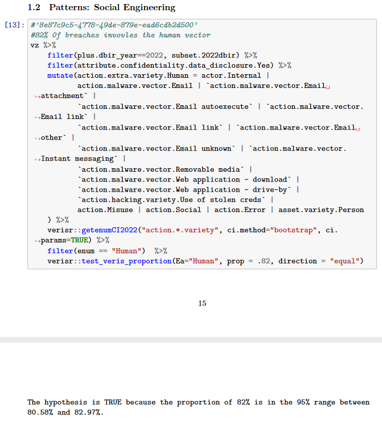

# COMP30151 - Project Planning Document - Jordan Foster (N0913799)

## Table of Contents

- 1 Introduction
    - 1.1 General overview
    - 1.2 Prior Literature
    - 1.3 Relevant problems within project domain
    - 1.4 Placing project within a wider context
    - 1.5 General implications/assumptions
- 2 Aims and Objectives
- 3 Tasks and Deliverables
    - 3.1 Tasks
    - 3.2 Expected Outcomes
    - 3.3 Expected Project Scope
    - 3.4 Project Milestones
- 4 Gantt Chart
    - 4.1 Project Milestones
    - 4.2 Project tasks/Deliverables
    - 4.3 Other Milestones
- 5 Resources
    - 5.1 List of resources to be used
    - 5.2 Sources of information required to conduct the project.
- 6 Risks
- 7 Legal, Social, Ethical and Professional Issues (LSEPIs)
    - 7.1 Legal Issues
    - 7.2 Social Issues
    - 7.3 Ethical Issues
    - 7.4 Professional Issues

## 1 Introduction

### 1.1 General overview <!-- 1a. Explain the topic and give a general overview to the project -->

A [*Dead Man's Switch*](https://en.wikipedia.org/wiki/Dead_man%27s_switch) is a safety mechanism that deactivates (in the case of a *fail-safe*) or activates (in the case of a *fail-deadly* device) in the instance that no human intervention occurs (Wikipedia, 2023). In the context of computer science, they have in the past been used in nuclear deterrence systems and - unfortunately - for criminal purposes, despite their ethical potential in safety systems as evidenced by their physically engineered equivalents in machinery. A common digital example of a Dead Man's Switch would be a system set up to transmit a pre-drafted e-mail if the user does not log into the system every 7 days; an analogue equivalent could be as simple and benign as the emergency pull-stop clip on a treadmill for if the user falls off.

Particularly within the context of cybersecurity - where most pre-existing open-source and open-access work is concerned - tools assume a threat model and primary adversary; they therefore aim to assist with anti-forensic countermeasures as a result. Tools such as [BusKill](https://en.wikipedia.org/wiki/BusKill) and [USBKill](https://en.wikipedia.org/wiki/USBKill) through their fixed design and intended usage imply that this class of software can only ever be used as a part of an operational security plan for secure use of systems. This is not inherently bad - such practices are the expected norm in various high-assurance financial, military, intelligence and law enforcement work - but their past use in civilian and otherwise independent work draws suspicion of illegality, and perhaps rightly so. However if their implementation in design is considered an ethical imperative in the context of human operation of machinery, it can stand to reason that there are also such usecases within the context of computer systems - and one particular low-hanging fruit in this scenario would be the use of them in blue-team scenarios as a way to leverage aspects of behavioural psychology to limit the attack surface of the 'human factor', as it is commonly viewed as the weak link in high-security environments.

### 1.2 Prior Literature

### 1.2.1 Proving that Human Factors are a 'weak link' in modern cybersecurity

Evidence that the human factor is a signifcant cause of breaches is somewhat difficult to quantify with statistics, since the exact percentages differ across studies due to differences in datasets. Nonetheless, we will attempt to establish that a consenus exists across both academic circles and private security firms that this is the case.

Amongst independent studies held by corporate entities, The *Data Breach Investigations Report* ([Verizon, 2023](https://www.verizon.com/business/resources/T6cd/reports/2023-data-breach-investigations-report-dbir.pdf)) - henceforth referred to as *DBIR* -  indicates that up to 74% of the breaches in its dataset involved what they refer to as "the human element" which encompasses social engineering, errors and misuse. This is significantly lower than prior estimates; The previous year's report ([Verizon, 2022](https://www.verizon.com/business/resources/Tb42/reports/dbir/2022-data-breach-investigations-report-dbir.pdf)) states that "this year, 82% of breaches in the DBIR involved the human element."

The full PDF report of the 2022 edition offers the raw underlying data on GitHub ([Verizon, 2023](https://github.com/vz-risk/dbir/tree/gh-pages)) that their analysis is derived from in the form of an `.rda` file[^1]. Using this RDA file, the 2022 subfolder has a 'fact check' PDF ([Verizon, 2022](https://raw.githubsercontent.com/vz-risk/dbir/tree/gh-pages/2022/dbir_facts_rev2022_v1.pdf)) that shows some R 'unit tests' written to confirm facts from the dataset that is [also within the repository](https://raw.githubusercontent.com/vz-risk/dbir/tree/gh-pages/2022/dbir_figure_data_rev2022_v1.Rda). From this, we can verify their claim that "82% of breaches involves the human vector":

It should be noted that both reports directly state in Appendix A that "all contributors received instruction to omit any information that might identify organizations or individuals involved" - meaning that we cannot really ascertain any geographical bias - and states throughout that all data was obtained through the *Vocabulary for Event Recording and Incident Sharing* (VERIS) framework, which thus implies a dataset that represents only the subsection of breached organizations that opt into its use.

For a more geographically-bound set of data, some other (Ingham, L., 2018; Anon., 2018; Marshall, L., 2018; Jones, K., 2018) articles say as many as 88% of cases in the UK in 2018 were the cause of human error - citing a study by risk solution firm *Kroll*; though unfortunately the primary source cannot be found here. A *primary* source that uses the ICO's data includes CybSafe (2020) who claims that 90% of breaches reported to the ICO in 2019 were the cause of human error. Unfortunately, both of these sources cannot be verified directly since they use data from the ICO that has been acquired through Freedom of Information requests alongside public data; the former is only released to the organization(s) or individual(s) that request it, and reports on both statistics decline to provide indicators as to *where* the datasets can be found, so we have no choice but to admit that no UK-based studies backed by an accessible dataset can be found.

Within academic literature, One journal article (Liginlal et al. 2009) states that 67% of all breaches recorded from January 2005 - June 2008 were via human error. However, accurate statistic analysis from this point is once more scattered; other articles such as *Human error: an overlooked but significant information security problem* (Wood, Banks 1993) allude to a *Computerworld* article written on 25 May 1987 that is supposedly based on a study performed by *Datapro Research Corp.*; unfortunately the reference provides little more information than this.

However, another academic source is of far higher quality - a U.S. centric article published in Heliyon (Hughes-Lartey et al. 2021) analyses a Kaggle dataset (Archangell (pseud.), 2023) which contains the *United States Department of Health \& Human Services* (DHHS) records of HIPAA breaches from 2009-2017. The report contains rigorous explanation of the underlying maths behind the findings including models and equations used; for the purposes of brevity, it makes one distinct observation that matters for the argument that human factors significantly effect breach consequences (emphasis mine):

> *"...in this case [Fig. 2], human factors that led to a breach, attributed 48.02% to a breach of theft and 27.11% to [Unauthorized Access/Disclosure], giving them a **combined share of 75.13%.**"*

Within this same section the article's authors go on to show that the involvement of a human factor is statistically a predictor for a subset of breach types, namely those involving *Hacking/IT incidents* (HITi), *Improper Disposal* (ImD) and *Unauthorized Access/Disclosure* (UAD). Thus far, this is the strongest indicator that our hypothesis is true across a large timespan, though it should be noted that the scope of the dataset to HIPAA data by necessity means that this only represents the medical industry within the U.S.

Throughout all of this, it should be noted that there is likely room for debate on whether certain breaches can be attributed primarily to user error, as opposed to insufficient organizational guardrails - the most comprehensive review on existing data breach papers that currently exists (Schlackl et al. 2022) notes that many reports that focus on these aspects are "often conceptual or descriptive in nature, narratively retelling how certain breaches occurred." Despite this, we can reasonably conclude that human factors at minimum significantly contribute to the likelihood of worse breach outcomes in cases where they are reported, and in some readings can be interpreted as the *main cause of breaches in the modern security landscape.*

### 1.2.1 Current Models of Human Factors & Risk Analysis

The *Generic Error-Modelling System* (GEMS) appears to be the scientific gold standard on categorizing various types of *human error* (Reason 1990) - with its originating work seeing significant mention across related papers in various fields. Given that it has been battle-hardened, it seems like as good a terminology as any to use as basis for our work. over time, it has been expanded to better fit 'human factors' rather than just errors - and thus we will follow such development so that we can understand current terms.

in Chapter 2 of his book, Reason (1990) begins by categorising errors in one of three 'performance' levels; *skill-based* ('slips' and 'lapses' [of memory]), *rule-based* errors, and *knowledge-based* errors. Table 3.2 in the same section attempts to summarise the distinctions between these, though the relevant takeaways are that skill-based errors typically occur as part of the routine, whereas rule and knowledge-based errors happen within the unknown as part of the problem-solving process.

Carayon et al. (2005) attempts to expand upon this by acknowledging the difference between *unintended* and *intended* actions, expanding the model from one of 'human error' into one of 'human factors' within a risk-management context. Unintended actions include skill-based errors and rule-based errors[^2], wherein the latter involves the misapplication or lack thereof of a *good* rule, or correct application of a poorly-designed rule. Within intended actions, they make note of knowledge-based *Mistakes* - wherein an error is made as a result of a novel action wherein there is "no procedure or rule in place to serve as a guide" - and *Violations*, which include malicious compliance through security-relevant actions; applications of relevant action that no not correspond with relevant policy or procedure, and deliberate acts of sabotage.

Finally, Pollini et al. (2022) - in an attempt to apply human factors to cybersecurity - further categorises unintended and intended actions by whether they were 'intentional' or 'unintentional' *violations* of a security rule - some result in *unintentional* violations of security as a result of a *non-deliberate* (skill-based 'slips' and 'lapses') or *deliberate* (rule or knowledge-based 'mistakes') action, whereas *intentional* violation of procedure includes that *due to incompetence* ('Violations') and that due to *intentional malice* ('Malicious Violations').

Given the differences in terminology used across these sources and the application of this model under differing contexts, the following table summarizes how GEMS has evolved into a usable form for cybersecurity:

| "Incorrect security actions" (Pollini et al., 2022) | "Actions" (Carayon et al., 2005) | "Performance level" (Reason, 1990) | Taxonomy (Pollini et al., 2022; Reason, 1990) | Description (Pollini et al., 2022; Carayon et al., 2005) |
| :-------------------------------------------------: | :------------------------------: | :--------------------------------: | :-------------------------------------------: | :------------------------------------------------------: |
| *"Accidental and non-deliberate actions determining a violation of a security rule"* | "Unintended actions" | skill-based level | Slips | *"Incorrect actions in tasks that are routine and require only occasional conscious checks; these errors are related to the attention of the individual [performing actions relevant for security/performing the security action]"* |
| - | - | - | Lapses | *"Memory failures in security actions, such as omitting a planned action, losing one's place, or forgetting security-relevant intentions"* |
| *"Deliberate actions determining an unwanted violation of a security rule"* | "Intended actions" | rule-based level | Mistakes (rule-based) | *"Application of a bad rule relevant for security"*, *"Inappropriate application of a good rule relevant for security"* (Pollini et al., 2022) or *"Failure to apply good security rule"* (Carayon et al., 2005) |
| - | - | knowledge-based level | Mistakes (knowledge-based) | *"Intentional act involving faulty conceptual knowledge, incomplete knowledge, or incorrect action specification, leading to the unwanted violation of a security policy or procedure"* (Pollini et al., 2022), *"related to performing a novel security action for which there is no procedure or rule in place to serve as a guide"* (Carayon et al., 2005)
| *"Deliberate violations of a security procedure with no malicious intent"* | - | Not originally defined | Violations | *"Intentional deviation from security policies or procedures due to underestimation of security consequences (can be either routine or exceptional)"* (Pollini et al., 2022) or *"Security-relevant actions that are inconsistent with security policies and procedures"* (Carayon et al., 2005)
| *"Deliberate violations of a security procedure with malicious intent"* | - | Not originally defined | Malicious Violations | *"Intentional deviation from security policies or procedures for the purpose of sabotaging the system"*

#### 1.2.1.1 Which types of Human Factors can be mitigated through the use of technology?

Current research on this area tends to converge on two types of solution; the use of vigilance systems in order to 'check' that a worker is not so fatigued so as to not be able to perform operations (colloquially known as our 'Dead Man's Switch') is the typical -  and older - of the two. Modern work seems to focus more on the idea that we can 'measure' fatigue by continually 'polling' for signs of fatigue on the part of the human operator - both of these are typically employed through the lens of machinery that by necessity must have a 'weak link' in the form of an operator, and we will assess current work and attempt to reframe it in the context of secure computer use and the issues surrounding security fatigue.

One article (Sethu et al., 2022) focusing on the mitigation of human factors issues in nuclear power plants (NPPs) is fairly ambitious with the breadth of 'scope' to which technology can be applied to human factors issues, since it posits use of artificial intelligence as a method for evaluating and validating NPP operator actions through their use in Operation Validation Systems, alongside for real-time monitoring what they define as 'Fitness for Duty' amongst NPP operators by observing cognitive factors that indicate fatigue. Notably the article affirms that where possible. The latter however is merely an extension of the concept already employed by vigilance devices within machinery in various industries. 
 

### 1.2.2 Evaluation of current countermeasures to 'slips' and 'lapses' as defined in GEMS

#### 1.2 Option 1 - Behavioural Self-Control

The main identifiable usecase is to discourage someone from bad or undesired behaviour, or the termination of consistent desired behaviour. Such mechanisms exist for use in a civilian context in the form of a [Commitment Device](https://en.wikipedia.org/wiki/Commitment_device), which encourage the 'locking in' of a future action or set thereof by rewarding 'triggering' of the good behaviour or punishing recognition of the bad behaviour. There are many bits of software that are already designed for this purpose, but can be considered somewhat 'bespoke' due to their fixed punishments or attestation systems:

- [StickK](https://stickk.com) relies on human 'referees' to confirm that a contract has been fulfilled.
- [Beeminder](https://beeminder.com) instead takes data from various API endpoints to programmatically determine what has been fulfilled.
    - This limits the user to certain platforms for their progress that may be unsuitable for the goal at hand...
        - Or poorly programmed such that they can be easily gamed by a technically competent individual.

Most of these systems rely on fiscal punishment, which - although adjustable - may be ineffectual for wealthier users and inaccessible to the poorest. A system that can be tweaked for specific use may allow for more effectual systems to be produced, such as those that provide positive reinforcement over negative reinforcement <!-- see research rabbit for citations -->.

Given that the scope of uses is vast, an accessible and extensible framework upon which to build such software systems upon seems to be the best starting point. This however presents other potential issues, which will be discussed later.

### Option 2 - Enforcement of OPSEC by workers in security contexts

The primary 'weak link' of a fully-fledged security plan in high assurance environments is the human element; adversaries will tend towards social engineering practices; sufficiently funded APTs (Advanced Persistent Threats) will often use tactics such as blackmail and general social pressure as a form of social engineering.

As such, OPSEC is a [primary point of concern](https://www.npsa.gov.uk/security-campaigns) in national infrastructure protection efforts in the UK. Many systems in place require that the user read and acknowledge some *Security Operating Procedures* (SyOPs) before using them, but rarely require the user to continually perform an action during use, such as reauthenticating or re-reading said SyOPs.

This can leave a potential gap for exploitation in several aspects.

Firstly, not implementing a 'vigilance device' style setup in a computer system could leave opportunity for unauthorised access if the initial user is not at their desk, or is otherwise rendered absent.

Secondarily (and perhaps more likely), a human operator not being continually reminded of their obligations during device usage may make them more inclined to a lapse of judgement in certain scenarios that may lead to a successful social attack.

Since the nature of a SyOP may differ wildly depending on environment, systems in use, and project sensitivity, a system that is configurable might be the best option for these scenarios. Typically a systems administrator would be responsible for managing company-wide parts of working at a specific assurance level, and a scripting language such as Python might be a more familiar fit here.

However, these tools could also be put in effective use by DevOps engineers that might seek to use such a tool to set 'reminders' for developers to prevent accidental damage if parts of infrastructure are deemed to require changes to meet deadlines. Any scenarios where a person acting quickly may make mistakes or oversights that would be costly to security would be a good fit for such a use case.

### 1.2 Prior Literature <!-- 1b. Demonstrate familiarity with the background literature. -->

https://heinonline.org/HOL/LandingPage?handle=hein.journals/unilllr2016&div=13&id=&page=

https://www.sciencedirect.com/science/article/abs/pii/S0160791X17300921

https://ieeexplore.ieee.org/abstract/document/10049917

https://heinonline.org/HOL/LandingPage?handle=hein.journals/lmulr4&div=5&id=&page=

https://www.jstor.org/stable/26041775 

### 1.3 Relevant problems within project domain <!-- 1c. Identify a problem(s) which is relevant to the topic -->

TBC

#### 1.3.1 Robustness against tampering or sabotage

Software-based implementations of dead-man's switches are inherently vulnerable to potential runtime changes that may encourage exceptions or unknown program states that may disable, inadvertantly *enable* the switch or otherwise result in unintended functionality. As such, development of these tools requires special considerations that may not necessarily be made for the average software project. Issues faced may include:

- Exploits of weak code:
    - [Memory Safety](https://en.wikipedia.org/wiki/Memory_safety) issues that are easily exploited
        - [Stack Overflows](https://en.wikipedia.org/wiki/Stack_overflow) and [Buffer Overflows](https://en.wikipedia.org/wiki/Buffer_overflow)
        - [Use-after-free](https://en.wikipedia.org/wiki/Dangling_pointer) Errors
    - [Memory Leaks](https://en.wikipedia.org/wiki/Memory_leak) that occur as a result of unsafe programming
    - If concurrency is involved, the intentional invocation of:
        - [Deadlocks](https://en.wikipedia.org/wiki/Deadlock)
        - [Race Conditions](https://en.wikipedia.org/wiki/Race_condition)
        - [Synchronization](https%3A%2F%2Fen.wikipedia.org%2Fwiki%2FSynchronization_%28computer_science%29) issues that may cause any of the above or any 'problem'-style manifestations thereof such as the [*readers-writer problems*](https://en.wikipedia.org/wiki/Readers%E2%80%93writers_problem)

Most of these issues can be solved by using known *memory safe* programming languages, and undertaking [Defensive Programming](https://en.wikipedia.org/wiki/Defensive_programming) measures.

- Modification, Deletion or Creation of external resources
    - Removal of dependencies, such as software libraries or frameworks
    - Disabling of OS functionality crucial to triggering or resetting of the DMS
        - Network stacks, filesystems, Process schedulers, Drivers, other software tools that are executed on failure or reset state, etc.
            - This would include interrupt signals such as SIGINT, SIGTERM or SIGKILL for UNIX systems
        - Kernel modules also apply.
        - Any tampering with hardware would propagate to the DMS through the OS.

##### 1.3.1.1 Exploitation by initial user of software to undermine prior intent

This scenario only applies in instances where a user that initially set the device to act as a form of precommitment (see §1.4) may later attempt to use an oversight in its design to sabotage their own aims. In such instances, the user should be considered an adversary on the same level as a malicious actor for the purposes of threat modelling and defensive measures. If anything, we may assume that the user attempting to disarm their prior armed payload in an 'illegitimate' manner will have more understanding of the presumed state of the software than an outsider.

Given the intended configurability of our software, to some extent we must relent against certain classes of 'exploitation' by a user (such as intentional weak programming of their 'observation' or 'payload' code to include backdoors) and trust that when arming the device they were operating under a more rational state that anticipated later attempts to 'stop' the DMS in this sense, if used as a commitment device.

#### 1.3.1 Robustness against incidental changes to program state, particularly as a result of [Software Aging](https://en.wikipedia.org/wiki/Software_aging)

<!-- For long-term deployments of a Dead Man's Switch we must consider various -->

#### 1.3.2 Reliance on external interactions in complex scenarios

#### 1.3.3 Lack of standardization across computing environments

#### 1.3.4 Handling permanent 'activations' that otherwise obstruct a trigger scenario

### 1.4 Placing project within a wider context <!-- 1d. Place the topic in a wider context. -->

<!-- To justify our creation of a device capable of malicious usage we must first provide some justifiable contexts where it can be of legitimate use. The primary ethical, civilian usecase of such a device is as a [Commitment Device](https://en.wikipedia.org/wiki/Commitment_device) -->

### 1.5 General Implications/assumptions <!-- 1e. Identify any general implications for the project. -->

## 2 Aims and Objectives

This project aims to produce an extensible framework for producing vigilance and dead man's switch devices as a means to assess what potential usecases are available for the technology outside of the context of antiforensics. The primary usecase that will be focused on throughout this project is a 'nudge device' to reinforce human behaviour, both within a self-improvement and OPSEC context.

To facilitate this, it is intended that a flexible 'library' that allows various 'triggers' and 'payloads' to be designed shall be developed in Python and able to be demonstrated via an example use-case in line with the above.

## 2.2 Objectives

    
## 3 Tasks and Deliverables

### 3.1 Tasks

1. Evaluate what the current usecases of these devices are and in what aspects of their implementation could be adapted for an ethical purpose in the context of use in a computer system.
2. Given an accurate definition of what these systems have in common, investigate what issues within ethical problem spaces could be partially or fully solved by implementation of such a solution. refer to existing solutions within the space where relevant, and use the BCS Code of Conduct as a reference when determining whether the implementation would be ethical and legal.
3. Understand what issues within the problem space might affect the viability of the solution provided. Generate a set of additional requirements on top of the generic 'framework' requirements outlined in the PPD if necessary.
4. Define a set of functional and non-functional requrirements based on a given 'example' scenario based on the problem space.
    * The following **functional** test types (requirements defined as **MUST**) are deemed applicable:
        * User Acceptance tests in line with *feature-based* requirements.
        * Smoke tests in line with *stability* requirements.
        * During development, we will define *sanity* tests for any defects that are noted during implementation of a unit.
            * Our regression testing will be performed after the 'design-development' cycle of each unit. To continue onto the next requirement, the following must be true:
                1. **All** existing unit tests for **functional** testing must pass.
                2. **All** new unit tests for 'sanity' testing must pass.
    * The following **non-functional** test types (requirements defined as **MAY**) are deemed applicable:
        * *Portability* testing across several desktop computing environments.
        * *Security* testing for any *known* CVEs that might affect the project, or 'adversarial' failure scenarios such as tampering.
        * *non-functional* tests do **not** need to pass to continue onto the next requirement, but any that are *not ultimately implemented* should be noted and the reasoning for their removal should be discussed in the report's 'Results and Discussion' section.
5. Define a set of *Gherkin* test scenarios in line with *Behaviour Driven Development* according to previously written requirements.
  * This will cover *User Acceptance Testing* as we define them in accordance with meeting our requirements.
6. Implement an initial 'skeleton' for these test scenarios in the form of unit tests.
7. For each requirement, undergo design work that defines how the unit will work at a high level.
8. Implement the backend for the relevant test scenarios according to design, such that these unit tests pass.
    * Define any 'sanity' unit tests for defects discovered during the implementation process and ensure that these pass also.
9. Document and report on:
    1. Research findings on this project, steps 1-3
    2. Implmentation of this project:
        * Tests, 4-6
        * Design & Implementations, 7-8

### 3.2 Expected Outcomes

The expected outcome of this project is to produce a python-based commandline utility that allows the setup and teardown of various types of vigilance control scenarios through the use of a framework. The intent is that for a MVP this can be activated through Python's integrated REPL utility as a bare minimum, though a desired extension of this would allow configuration via a commandline utility such that it can be used with existing OS tools, particularly within a UNIX ecosystem.

Given that we require an example scenario for demonstration purposes and evidence that this tool has potential for ethical or benign use, part of the MVP is that we do as such using our developed tooling. Our intended example is the use of a dead-man's switch to encourage and enforce proper OPSEC for a hypothetical system via such science-based tricks.

Our set of MVP requirements are defined thus:

| ID | Description |
| :-: | :--------: |
| `DMS-LLR-1` | The *Dead Man's Switch* MUST make use of a |

### 3.3 Expected Project Scope

Our Minimum Viable Product is to produce a Python module that is capable of interoperation with current tooling to allow the multithreaded setup of various 'dead-man's switches' (defined by the connection of an 'observer' thread identifying a 'trigger' event and thus activating an associated 'payload' thread). The underlying assumption is that these threads will be tied together through a base class written expressly for this purpose, and that the end-user for an MVP scenario will be familiar enough with Python and the REPL to write their own custom classes to set up a scenario. 

Our demonstrable end-product will be written as an example scenario. Desired expansions of this would include the expansion of this into a commandline utility that allows the usage of '*pickled*' (serialized) classes to be loaded, allowing a setup to be loaded by someone other than the initial developer (such as a system administrator). Given that unpacking serialized classes is considered inherently insecure due to its potential for arbitrary code execution, we may also decide to make use of HMAC hashing with the associated module as recommended in the `pickle` module's documentation.

Given the open-ended nature of such a project, some barriers must be defined that restricts the direction development will go, based on feasibility:

### 3.4 Project Milestones

## 4 Gantt Chart

### 4.1 Project Milestones

### Project Tasks/Deliverables

### Other Milestones

## 5 Resources

### 5.1 List of Resources to be used

### 5.2 Sources of information required to conduct the project

## 6 Risks

## 7 Legal, Social, Ethical and Professional Issues (LSEPIs)

### 7.1 Legal Issues

### 7.2 Social Issues

### 7.3 Ethical Issues

### 7.4 Professional Issues

# Footnotes

[^1]: Unfortunately as of time of writing, the raw data behind 2023's report has not been committed.
[^2]: It should be noted that Carayon et al. (2005) seem to bundle what Reason (1990) considers as 'slips' (motoric errors) and 'lapses' (cognitive or recall-based errors) under one umbrella of 'slips', and instead uses 'lapse' to refer to what Reason considers a 'rule-based error'.
  Considering that later work that references Carayon *and* Reason (Pollini et al., 2022) follows Reason's *initial* taxonomy, and that the use of 'lapse' in this context appears to be an obstruction to understanding, **we will elect to follow the original taxonomy as defined by Reason and maintained by Pollini et al.**

  
# References