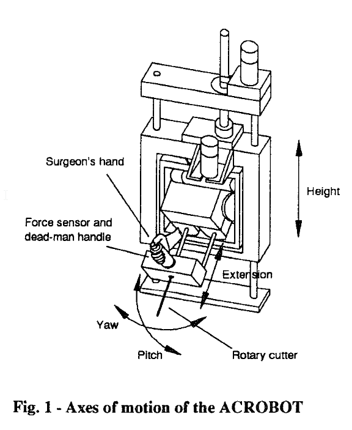
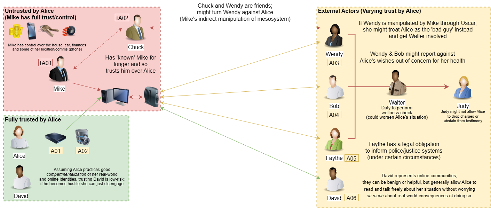
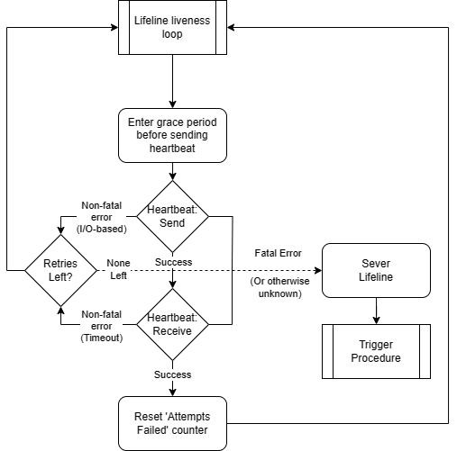
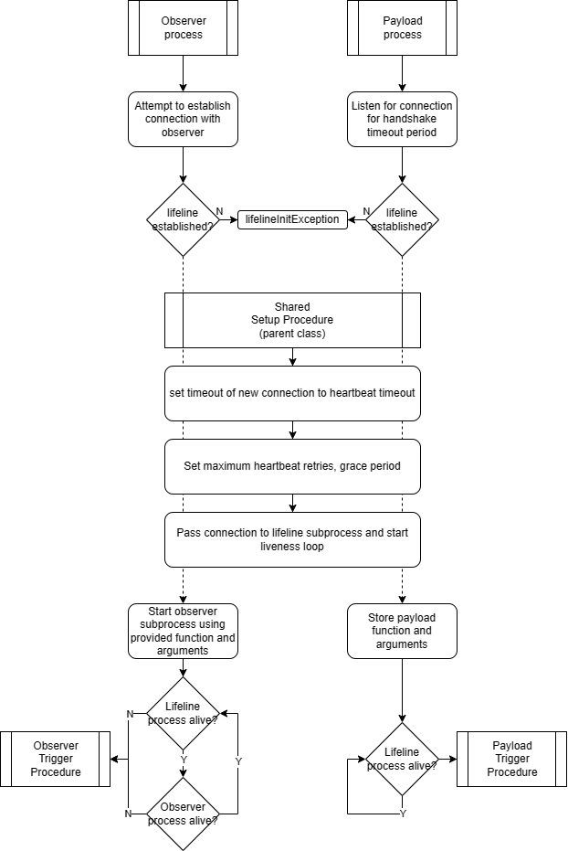
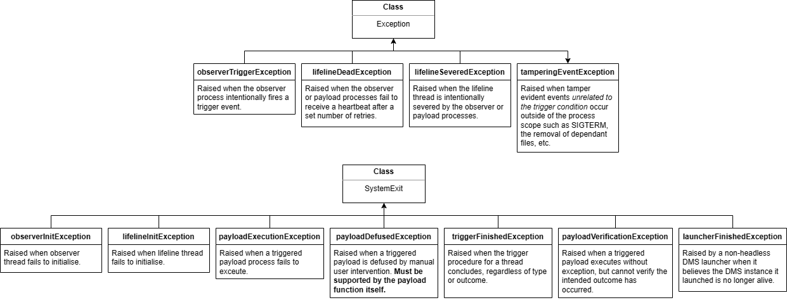
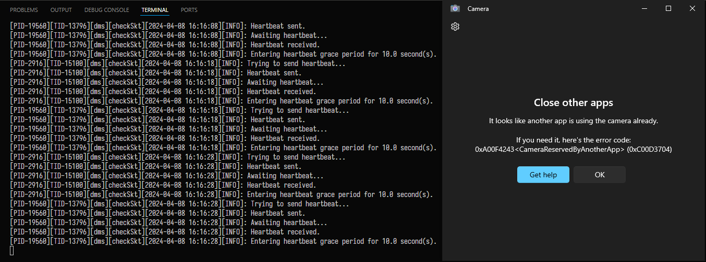
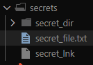
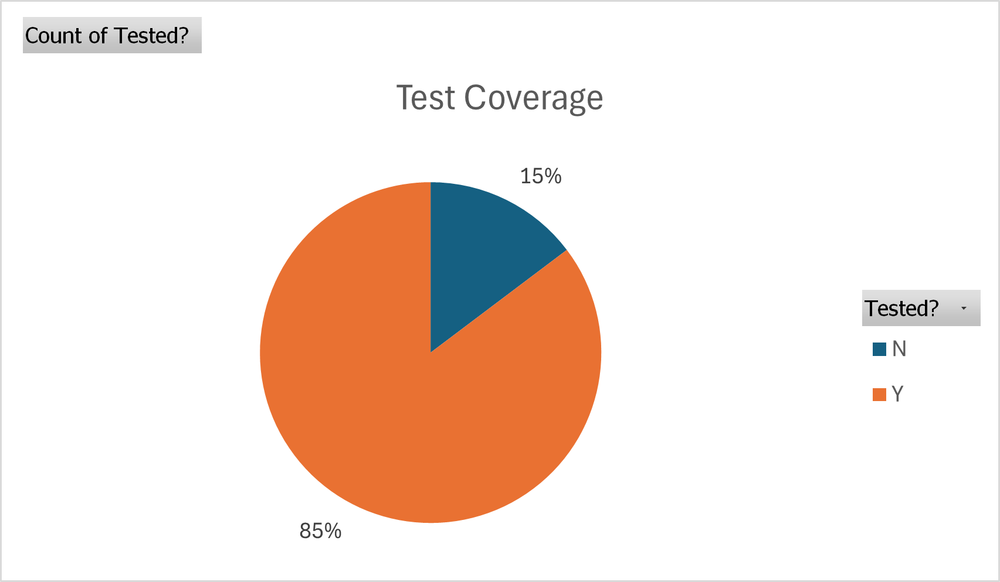
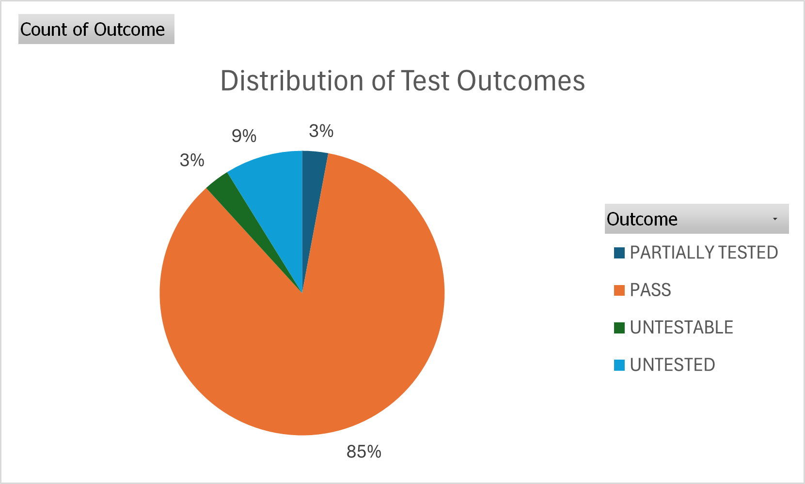
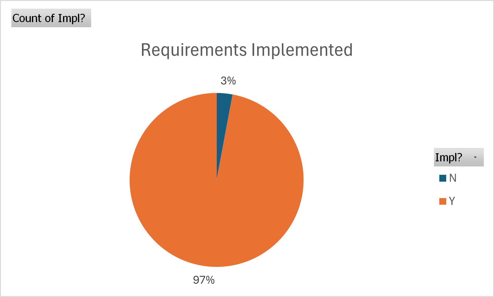

# COMP30151: Project Report - Jordan Foster (N0913799)

## i. Abstract

The Dead Man's Switch (DMS) is a conceptual security apparatus that ensures the safety and control of failure states for operator-bound systems, generally within the context of an incapacitated user. They have seen classical usage in various safety systems, as well as a 'panic mechanism' for antiforensic purposes within computer systems, though not many usecases outside of this. It is believed that there are many areas where the concept could be applied to great success in other domains and systems, and as a personal security tool.

The project discussed in this report aims to produce a flexible, configurable implementation of a dead man's switch that allows for the usage of swappable trigger conditions and outcomes such that different usecases can be explored with ease. To demonstrate that the production of this tool is viable, an example use case of the tool within the context of Domestic Violence (DV) was explored via a review of the state of knowledge surrounding the issue, revealing a potential application of the DMS concept as a means to ensure secure computer usage for the 'pre-separation' victim trying to acquire resources and support to facilitate exit from a hostile environment. An example case study was produced in support of this, with requirements being informed by a threat modelling procedure informed by external resources related to *Operational Security* (OPSEC), and specific observer and payload functions were produced as an example of the implementation being adaptable to different scenarios.

The resultant deliverable met most defined requirements and acted as a solid proof-of-concept for the viability of both the modular architecture and the application of the tool as an operational countermeasure within the context established. However there are some noted issues with lack of robustness to external interference, false positives and inaccessibility as a tool that prevent the recommendation of its usage in a real-world context. The solution provided detects trigger conditions in a way that does not require intervention from a user, or technical expertise to understand at the abstract level, but has some notable issues with false positive detections and reliability; the payload function produced allows for deletion of secrets against a UI-bound adversary as an antiforensic measure that, although suitable for the capabilities of the usecase specific threat actors, would not remain hidden under professional forensic analysis without use of auxillary tooling.

## ii. Acknowledgements

Firstly, I would like to heavily thank my supervisor - Jake Street - for his assistance on helping this project come to life and reach completion. When I had initially presented the concept there was not much more to the idea than me wanting to produce a dead man's switch with configurable components, and the hypothesis that there were actual usecases for the tool outside of as a means of detection for an incapacitated operator, or as a means of coercion via antiforensic and consequential means. His support and guidance helped identify a viable use case for the project (the application of the tool to the problem of Domestic Violence) and provided subsequent direction on where the resultant findings from the field should be translated into a designable and deliverable project. As may perhaps be evident by the length of this report - apologies to him and the moderator in advance while assessing this - there were a few times where the scope of the project appeared to grow endlessly (particularly when conducting the literature review) and the end goal appeared to vanish from my perspective; it is not an exaggeration to say that were it not for Jake's assistance in seeing where the project could potentially go (and where it shouldn't, for completion's sake...!) that the deliverables required for submission would never have come about.

Secondly, I would like to thank the family that kept me fed and sane throughout the final year of my undergraduate studies, which I spent as a commuter student. Much of the work this year even outside of the final year project has been an exercise in me unintentionally finding the largest possible 'boulders', and then proceeding to only realise their weight when I was already halfway up the hill and couldn't drop them and try again. This report is also a testament to that, and for all intents and purposes the month of April has temporarily transformed me into the being that undergraduates become familiar with - the nocturnal, caffeine-bound creature known in whispered tones as the 'final year student'. Mum has thankfully been understanding and especially supportive; I plan to make amends in turn by fixing my sleep schedule after this month.

I would also like to thank the field of researchers that provided such an extensive body of literature on the issue of domestic violence such that I, as someone with no prior experience, could obtain reasonable understanding and appreciation of the complexities of the issue and its associated fields and institutions. I am especially thankful for the works of Matthews et al (2017) and Slupska and Tanczer (2021), as well as Stark (2009)'s work on *coercive control theory* - as without these findings I would have been firstly unable to justify the application of security and operational procedure to the DV usecase and subsequently been able to find an area ('pre-separation') where the application of a well-designed technical countermeasure would have been a viable option for the individual. Hopefully for Slupska and Tanczer, the methods with which the project requirements were defined and the project designed and developed were at least adjacent to the intended outcomes of their work on designing security tools applicable to the DV context.

Additionally, I would like to express my gratitude towards Sefik Ilkin Serengil, the developer responsible for the `deepface` library (Serengil, 2024) which powers most of the usecase-specific observer function. I had no experience with machine learning, computer vision or facial recognition prior to this project, and finding libraries that used the same underlying image processing libary between OpenCV and dlib was problematic. Serengil's work provided a unified interface from which face detection, verification and emotion recognition was possible, with results from one step being able to be handed over to the next. I am not so sure that the early roadblock of trying to convert cropped faces from OpenCV's frame format to Dlib's frame format for emotion recognition in another library would have been bypassed in time for the project timeline to not be significantly compromised had I not found this alternative. In the same vein, I would also like to thank the authors of the Python `subprocess` library, for it was the entire reason that the DMS could even run in the background, and for the subsequent `multiprocessing` library's existence (which allowed me to bypass limitations in Python's *Global Interpreter Lock* and create an observer function that was actually performant).

Finally, I would like to thank my peers in NTU's Developer Society (DevSoc) for tolerating the ramblings of a man in the depths of senioritis, rushing to get everything done in time for deadlines.

## iii. Table of Contents

[TOC]

## iv. List of Figures and Tables

Figure 1. Depiction of the ACROBOT system present in Davies et al. (1997)
Figure 2. Case study diagram depicting fictional scenario upon which our solution will be applied.
Figure 3. Use case diagram showing basic format of the solution to be implemented.
Figure 4. Program flow diagram depicting the 'liveness' loop for the lifeline thread.
Figure 5. Program flow diagram depicting the handshake and initalization procedure for the observer and payload processes.
Figure 6. Program flow diagram depicting the payload and observer trigger procedures.
Figure 7. Class diagram depicting the various exceptions that the DMS processes can exit with to signal outcome.
Figure 8. Program flow diagram depicting the launch procedure performed by `dms-launcher.py`.
Figure 9. Shell command template through which the DMS system is launched.
Figure 10. Templated codeblock demonstrating the format of all observer and payload function source files.
Figure 11. Program flow diagram depicting the 'thread creation and observation pipeline' of the main thread of the usecase specific observer function.
Figure 12. Diagram mapping trigger condition dependencies on subprocedures.
Figure 13. Small program flow diagram depicting the exception handler present in each subprocedure of the observer function.
Figure 14. Program flow diagram depicting the frame acquisition process.
Figure 15. Screenshot demonstrating that the current observer function does not permit the use of a video device by other applications while the DMS is running.
Figure 16. Program flow diagram depicting the face detection thread.
Figure 17. Program flow diagram depicting the face verification thread.
Figure 18. Program flow diagram depicting the Facial Emotion Recognition (FER) Thread.
Figure 19. Program flow diagram depicting the FER Averaging Process.
Figure 20. Example codeblock depicting the dictionary format of the average FER ratings for a given idenity over a sliding window period of the last $X$ frames in which they were identified.
Figure 21. Program flow diagram depicting the Forbidden Emotion Detection Process.
Figure 22. Program flow diagram depicting the implementation of the four payload phases (defusal, execution, alert, verification) within the usecase specific payload function.
Figure 23. Program flow diagram depicting the defusal phase of the usecase specific payload function.
Figure 24. Screenshot evidencing the proof-of-concept defusal GUI mechanism implemented in the usecase specific payload function.
Figure 25. Screenshot depicting outcome of manual defusal of payload.
Figure 26. Screenshot depicting outcome of expiry of the defusal period.
Figure 27. Program flow diagram depicting the execution phase of the usecase specific payload function.
Figure 28. Screenshot showing initial secrets folder used during informal testing.
Figure 29. Screenshot showing removal of secrets as evidenced by payload logs.
Figure 30. Program flow diagram depicting alert phase of the usecase specific payload function.
Figure 31. Screenshot evidencing correct receipt of unsigned, unencrypted alert e-mail
Figure 32. Screenshot evidencing correct receipt of signed, unencrypted alert e-mail
Figure 33. Screenshot evidencing correct receipt of unsigned, encrypted alert e-mail
Figure 34. Screenshot evidencing correct receipt of signed, encrypted alert e-mail
Figure 35. Program flow diagram depicting verification phase of usecase specific payload function.
Figure 36. Screenshot demonstrating limitations of secret removal via payload.
Figure 37. Image of detected 'unknown' face, obtained using `--dump-frames` argument; showing that false positives were being obtained when the camera was covered.
Figure 38. Image of example false positive image, showing that the model in use (GhostFaceNet) sometimes suffers from overfitting.
Figure 39. Pie chart showing percentage of project requirements that were tested.
Figure 40. Pie chart showing distribution of test outcomes by percentage.
Figure 41. Pie chart showing percentage of project requirements that were implemented.

Table 1. Tabulation of the types of economic abuse as initially defined by Adams et al. (2008), and progressed by Postmus et al. (2012).
Table 2. Corroboration of terminology within existing literature referring to the DMS concept by field, term and functionality.
Table 3. Risk register of threats and vulnerabilities present within the DV case study.
Table 4. Table depicting initial list of requirements as defined in the Project Planning Document.
Table 5. Table depicting new set of requirements, updated in respect to greater understanding of project requirements and of the domestic violence usecase.
Table 6. List of new and modified high-level requirements following assessment of the initial form of the usecase specific observer function.
Table 7. List of new and modified low-level requirements following assessment of the implementation details of the usecase specific observer function.
Table 8. List of new and modified high-level requirements following assessment of the initial form of the usecase specific payload function.
Table 9. List of new low-level requirements following assessment of the implementation details of the usecase specific payload function.
Table 10. Final list of requirements that the resultant implementation will be developed and tested against.
Table 11. List of command line arguments for `dms-launcher.py`.
Table 12. List of mandatory command line arguments that must be implemented in all function source files as part of the observer and payload processes (which load the function).
Table 13. List of command line arguments unique to the usecase specific observer function. 
Table 14. List of command line arguments unique to the usecase specific payload function.
Table 15. List of environment variables loaded from `.env` when the `--alert` commandline argument is provided to the usecase specific observer function.
Table 16. Test script for standard functionality of DMS launcher component.
Table 17. Test script for headless launch functionality of DMS launcher component.
Table 18. Test script for handshake retry functionality of DMS launcher component.
Table 19. Test script for manual interrupt functionality of DMS launcher component.
Table 20. Test script for `--reject-noframe` trigger condition within usecase specific observer function.
Table 21. Test script for `--min-faces` trigger condition within usecase specific observer function.
Table 22. Test script for `--max-faces` trigger condition within usecase specific observer function.
Table 23. Test script for `--reject-faces` trigger condition within usecase specific observer function.
Table 24. Test script for `--require-faces` trigger condition within usecase specific observer function.
Table 25. Test script for `--known-faces` functionality within usecase specific observer function.
Table 26. Test script for `--reject-unknown` trigger condition within usecase specific observer function.
Table 27. Test script for `--reject-emotions` *non*-trigger condition within usecase specific observer function.
Table 28. Test script for `--reject-emotions` trigger condition within usecase specific observer function.
Table 29. Test script for edge case where `--min-faces` is less than 0 within usecase specific observer function.
Table 30. Test script for edge case where `--max-faces` is less than `--min-faces` within usecase specific observer function.
Table 31. Test script for edge case where no trigger conditions provided within usecase specific observer function.
Table 32. Test script for edge case where `--max-buffer-size` less than `--sliding-window-size` within usecase specific observer function.
Table 33. Test script for edge case where an identity path that does not exist has been provided to `--known-faces`, `--required-faces` or `--reject-faces` within usecase specific observer function.
Table 34. Test script for edge case where an invalid `--log-level` is provided to the launcher, observer or payload.
Table 35. Test script for edge case where an identity path is not mutually exclusive between `--required-faces` and `--reject-faces` within usecase specific observer function.
Table 36. Test script for edge case where an emotion undetectable by `deepface` is provided within usecase specific observer function.
Table 37. Test script for edge case where the forbidden emotion threshold is below the lower bound of 0 within usecase specific observer function.
Table 38. Test script for edge case where the forbidden emotion threshold is above the upper bound of 100 within usecase specific observer function.
Table 39. Test script for basic functionality of usecase specific payload function.
Table 40. Test script for sending unsigned, unencrypted `--alert` within usecase specific payload function.
Table 41. Test script for sending signed, unencrypted `--alert` within usecase specific payload function.
Table 42. Test script for sending unsigned, encrypted `--alert` within usecase specific payload function.
Table 43. Test script for sending signed, encrypted `--alert` within usecase specific payload function.
Table 44. Test script for checking `--defuse` functionality in usecase specific payload function.
Table 45. Test script for checking `--defuse` expiry in usecase specific payload function.
Table 46. Test script for checking explicit lifeline severence detection in generalized DMS system.
Table 47. Test script for checking lifeline death detection via absence of heartbeats in generalized DMS system.
Table 48. List summarizing test results and associated requirements.
Table 49. List summarizing which project requirements were implemented and/or tested, and the results of each.
Table 50. List showing which requirements were untested, unimplemented or otherwise unmet.

## 1 Introduction

<!-- 
Select an area of knowledge for investigation and identify an existing method(s), technique(s), algorithm(s), or system(s) suitable for improvement. Plan, and therefore timetable, a program of research and development, as laid out below. 
-->

The Dead Man's Switch (DMS) is a tool that has classically been considered one of control and coercion in contemporary media, being used to ensure the perpetuation or execution of outcomes in a manner that has been ethically ambiguous in use. Despite this, the author believes that the tool as a means of assurance and security is one that has unfortunately been unexplored within the context of civilian and ethical usecases, such that there is a significant area of opportunity for such usecases to be explored, and areas where the tool can see greater use identified.

Typical usage of the dead man's switch has been for safety in operator action (Fruhstorfer et al., 1977; Fairfax, 2000; Davies et al., 1997) across automotive, industrial and medical industries, where the risks of tool or operator failure to human life can be considered significant enought to warrant countermeasure. It has also seen usage via the concept of the 'kill-cord' - something intended to be pulled as a consequence of a failure event - for similar purposes (Boyles et al., 1979), and this idea has been perpetuated in computer software (Altfield, 2024; Kescher, 2023; Wang, 2023; Walker, 2023; hephaest0s (pseud.), 2023; Anon., 2024f), generally for antiforensic purposes and in the implicit context of criminal activity (or, at least, activities against authority). The context of use within computing devices is unfortunate; the author believes that these tools have greater use as assurance of security that does not involve such usecases.

One such potential usecase of a Dead Man's Switch identified was as a tool for Domestic Violence (DV) victims to keep aspects of their lives safe from their abusers; existing services, though by no means useless - indeed, they are valuable - sometimes are ineffectual for victims on the basis of specific cirumstances not being accomodatable or misunderstood; McDermott and Garofalo (2004) note that sometimes victim usage of formal DV support services can sometimes backfire, and Santoniccolo et al. (2023) note that for minority demographic victims (such as those in same sex relationships), barriers to usage exist that prevent full efficacy. In addition to this, it is noted that the escape process for domestic violence victims is arduous; one model defined by Matthews et al (2017) and developed by Slupska and Tanczer (2021) notes a 'pre-separation' phase where a victim may be unable to access many contemporary resources, and operational countermeasures to ensure the victim can be assisted with obtaining the resources and positioning needed to exit this pre-separation phase and gain access to contemporary support may be an area for investigation that results in the use of a DMS as an acceptable countermeasure.

This project thus aims to investigate the current usecases and designs of the DMS concept, such that universal design considerations and challenges can be derived. From this, knowing the exact problems that the DMS concept resolves and the issues it must face in deployment, the state of the domestic violence issue will be reviewed to assess the applicability of the DMS concept as a tool to assist 'pre-separation' phase victims in safely and covertly obtaining the resources and connections needed to be able to obtain wider societal support. If the review identifies a niche in which the DMS can be employed as a computer-bound countermeasure as part of a wider operational plan, then it may be possible to identify and implement a use usage of the DMS concept away from its contemporary leanings to demonstrate the tool's potential for use.

### 1.2 Plan

The report will begin in Chapter 2 with a brief review on existing solutions and designs of historical and contemporary DMS systems with the intent of understanding the strengths, limitations and common features that will enable the production of a general modular architecture upon which computing-based uses of the DMS concept can be drafted and developed. This will be followed by a review into the literature describing the state of the domestic violence issue including theory on its existence, how it manifests and external factors that affect the ability for victims to obtain needed support, alongside the specific theories of the abuser and the methodologies employed in order to maintain control over a victim and a review on what theories surround the psychology of the victim that may need to be considered in the design of the solution provided, and what methodologies are available and employed by victims to handle an ongoing domestic violence situation, and the efficacy thereof. The limitations of current research will be identified alongside any areas where findings are inconclusive, and from this the plan is to be able to identify a niche where the applicaiton of a Dead Man's Switch may be another useful tool for a victim in conjunction with - and the support of - existing services, resources and tools.

From this, Chapter 3 will identify new areas where the Dead Man's Switch concept can be applied in the context of domestic violence. This will be supported by a fictional case study where the victim could potentially see use of the DMS concept in employment, wherein the requirements of the solution provided will be informed by the specific vulnerabilities identified as a result of threat modelling the vulnerabilities the victim threats, and identifying those that are both within scope of what the DMS can act as a countermeasure for and are of significant enough danger to the victim for the deployment of such a system to be a worthwhile venture. From this specific trigger condition and payload requirements will also be derived, informing the implementation efforts within Chapter 4.

Chapter 4 will first establish the universal architectural requirements of the DMS system and how these should be implemented to ensure the security of the solution provided. From this general infrastructure will be designed, produced and explained to be used as a basis on which the usecase specific trigger condition and payload functionality will be designed and implemented according to requirements, with specific documentation on usage options provided. The focus will be on explanation of the various functions, threads and procedures with which the system operate, through the use of appropriate explanatory diagrams.

Chapter 5 will produce a set of initial Gherkin test scripts outlining the desired functionality, followed by a tabulated test script outlining instructions, expected outcomes, input test data (if applicable) and the actual outcome of the step during test execution, with steps being marked as passed, failed or unexecuted respectively. From this a summary of test results mapped to requirements will be shown, and the success of the project will be quantifed by which requirements were implemented, which were tested, and if so, the outcome of said tests. From this observations of test coverage, outcome and implementation will be mad, resulting in discussion; requirements that were not implemented and/or tested, alongside those that failed tests, will be discussed to determine why these outcomes occurred, and what would have been done differently with hindsight will be noted, providing an idea of where areas for improvement in the design, planning and execution of the project are present.

To finish, Chapter 6 will note the observations made in previous chapters to draw a conclusion of the overall success of the project relative to its aims and objectives; areas where objectives were not met or left implicit will be noted, and general areas for improvement and future work in the solution provided, the ideas proposed and the case study used will be discussed. This will include an assessment of the project outcomes against existing legal, social, ethical and professional issues (LSEPIs), including where things changed from the initial issues proposed in the project planning document, and whether the approach taken has risen any other concerns. This will be succeeded by a reflection on the project in terms of career and life aspirations, and where the project has furthered those aims or introduced new ones, alongside further plans after the submission of the project and conclusion of undergraduate studies.

## 2 Context

### 2.1 Current State

#### 2.1.1 Current uses of the DMS concept

By the historical nature of DMS systems being used to deterr and intimidate, we must consider the state of their usage in both a protective and aggressive context, to understand the context in which our tool might be used.

This chapter will firstly cover current uses of the DMS concept, including fail-safe/secure systems, Vigilance Monitoring Devices (VMDs), Kill-cords, Stop mechanisms, Systems that operated based on ‘proxies’ of input/intent and non-operator bound systems such as watchdog timers. We will then move onto the applications of the systems themselves, including their historical use in aspects of game theory and as part of warfare. We then move onto performing a complete review of the domestic violence literature to gain an understanding of the scope of the field such that a context of use for the DMS concept can be implemented.

##### 2.1.1.1 Uses of the DMS concept as a defensive measure (*'fail-safe/secure' systems*)

We will make the distinct definition that a *fail-safe* system is one that protects the user from a given threat by responding accordingly in a way that *neutralises the impacts of a realised risk. to the operator, the environment, or others.* A *fail-secure* system is one that protects *access* to a resource, building or area in the event of it being triggered, rather than protection of envrionments or person(s).

###### 2.1.1.1.1 Vigilance Monitoring Devices (VMDs)

The typical implementation of a DMS as a failsafe is in railway systems with the use of a *Vigilance Monitoring Device* (VMD) - this is a version of the DMS that *triggers by default* and thus requires consistent interruption by the user. The intent is to not only check for incapacitation of the driver, but also to recognize a low enough level of attention to cause risk. The efficacy of this method of 'repeated distraction' has been long considered ineffectual for this latter purpose within academic literature, however - one historical chapter of a book on vigilance (Fruhstorfer et al., 1977) hypothesizes and subsequently proves that these vigilance assurance processes are able to be performed in the very 'low-vigilance' scenarios they purport to protect against, due to subconscious proceduralization.

Despite this, the concept of using the Dead Man's Switch to check for vigilance is sound, even with the flaws in the medium itself - perhaps a system that changes to make proceduralization difficult could be used, or - as used by the authors themselves - monitoring of neuropsychological indicators of low vigilance states could be done as an alternative (in a future where the technology can be modified for use outside of a lab setting).

###### 2.1.1.1.2 'Kill-cords'

Another common use of the DMS concept is in the use of 'kill cords' in vehicles which are attached to the user; if the user falls off the vehicle or otherwise has it run away from them, the cord is pulled and a circuit is shorted, cutting the engine off (and possibly hitting the breaks). One example of this is explored in a journal article (Boyles et al., 1979) on the use of snowmobiles in the Antarctic. The system itself is simple and mechanical, utilising a 3.5mm headphone jack with a paracord drilled into it; when the jack is inserted the contacts that cause the ignition to short are kept apart; when the cord is pulled, the jack exits and the short reoccurs. Whereas the absence of change indicates a trigger scenario in the prototypical context, in this case it must be 'signalled' that the operator is incapacitated through active 'pulling' of the cord.

Implementing the DMS this way leaves little room for errors of an electronic or computational nature, increasing reliability. However the possibility of wear must still be considered in these instances - with repeated usage the 'grip strength' of the jack itself will lessen, which could result in a dangerous situation where the ignition is unexpectedly shorted resulting in an incident.

The 'kill-cord' implementation is the primary context in which the DMS has been applied to the computing space, as a form of physical security to ensure the confidentiality of information in the event of separation of the user from the computing device. Actual hardware has been produced for this purpose, as seen in the *BusKill* software, which either locks the screen or shuts down the device (Altfield, 2024) when a specially designed USB cable with a magnetic breakaway is removed. Another implementation that uses generic USB devices is *hephaest0s'* USBKill (2023), which can be configured to run a user-written procedure when a whitelisted device is *removed* from the system. The LiveOS Linux distribution TAILS also contains a 'kill-cord' in the form of a memory erasure procedure that triggers when the USB or DVD running the OS is removed (Anon., 2024g).

The unfortunate reality of such tools in a computing context, however, is that they are often used by cybercriminals. TAILS itself states that it is intended for use by *anyone* that is vulnerable against a stronger adversary - such as activists, whistleblowers, journalists and those suffering abuse - but this same dynamic is present between law enforcement and criminals, and this must be acknowledged (see Section 2.1.1.2). Such systems that use the OS to run antiforensic measures also implicitly trust it, meaning that the efficacy of such solutions depends entirely on the functionality of underlying hardware and firmware, and the assumption that the enacting OS is not compromised such that a triggering of the countermeasure or its realisation thereof is blocked.

###### 2.1.1.1.3 Stop mechanisms for machinery and tools alongside mobility and rehabilitation

The DMS concept is generally known as a 'deadman switch' in this area; one example is the use of on operating valve for blast cleaning nozzles that must be held open during use - this is mandated by OSHA, as initially defined in section 1910.244(b) and later explicitly clarified as a "dead-man" control by a subsequent standards interpretation by the *Directorate of Enforcement Programs* (Fairfax, 2000).

An example of the DMS in an actual design is seen through the use of an *Active Constraint Robot* (ACROBOT) for the purposes of performing knee surgery with a rotary cutter (Davies et al., 1997). Within the paper, it is seen that the operating surgeon must continually depress a force sensor while operating the device. This, in combination with the surgeon only being allowed to backdrive the mechanism within certain regions, helps improve the safety of the device - while still allowing for more complex procedures than those allowed by passive powered robots and unpowered systems.



Figure 1. Depiction of the ACROBOT system present in Davies et al. (1997)

Stop mechanisms also see usage in mobility and rehabilitation systems. One open electric network standard for wheelchairs, M3S (Linnman, 1996), uses a dead man's switch associated with a joystick that activates *any time* it returns to a netural position; something that may be quite common when powering an electric wheelchair. The system takes care to allow for delay so that components with inertia such as motors may stop smoothly, and the author particularly notes the improved safety of 'failure-by-default' DMS systems compared to those that require action that may be difficult for disabled persons to perform in a timely manner.

###### 2.1.1.1.4 'Smart' systems that trigger based on *proxies* of an operator's input or intent

Due to its electromechanical origin, most DMS systems work under the assumption that a human operator always has their finger on the 'pulse' of the system - be it via a vigilance device, kill-cord, or a button, lever or pedal that must be continually 'pressed' during usage. This assumption works well for situations where the interface between operator and machine is direct and fixed, and the outcome of deactivation is a safe one in all possible failure states.

This naturally begins to fall apart in complex enviromnents and systems: metrics for what constitutes a 'dead-man' situation may be unclear; there may be significant latency in operator input and, most seriously, there may be many failure states - some unpredictable; the 'optimal response' may not always be the same on that basis. One context where this is the case is with driving. Vehicles are sometimes intentionally given no input, and since danger situations are often defined by environment - 'other drivers' - failure states are unpredictable at best; even in internal systems failures, simply cutting power to the engine or forcing the breaks on is not the best situation (such as if it would cause a pile-up).

The primary solution played about with in such cases is to make the DMS 'smarter' - more complex - than typical devices which shy away from complexity out of reliability concerns. Regarding driving specifically, one prototype testbed (Ahsan et al., 2012) operates in three components; an *image processing* module that uses computer vision to assess the orientation and speed of the vehicle, passed onto the *control unit* - which determines proper action - and then an interfacing unit that converts intent to outome via traditional controls. In effect, this implementation could almost be considered a form of 'robo-operator' in that it can act as a secondary driver in the instance that the primary driver is incapacitated (even if its actions are just to pull over in the paper cited); this is not too dissimilar to the 'co-piloting' concept as used when learning to drive - where the instructor can take control - and in aviation systems to accomodate for fatigue. The primary limitation of this method is that proxies can often allow for false positives under the guise of 'better safe than sorry' - so the strength of any response must be accordingly measured to allow for correction in such cases.

###### 2.1.1.1.5 Systems that trigger *without operator involvement* (*'watchdogs'*, *'heartbeats'* and *fault detection*)

Some fail-safe systems are self-triggered such that an action or lack thereof from an operator is not part of the failure state (such as component failures). One example of this is the *watchdog timer* (Anon., 2024i), which is a 'failure-by-default' system that continually counts down towards a fail-safe action (such as power cycling) unless it is 'kicked' (restarted) continually - something also known as a *'heartbeat' signal*.

Not all watchdog systems immediately shut down the system upon inital timer expiry, however - 'multi-stage' systems have early watchdog expiries trigger a non-critical response (such as a corrective action) and then start the next timer in line. Each stage in such a system results in increasingly drastic action upon expiry, with the final stage tending to result in a complete system reset. Given that some failure events are the culmination of several lesser events going unchecked and cascading, such an implementation allows for a measured 'scale' of responses so that events that the system can recover from do not result in an excessive 'correction' (system reset or shutdown). Some other systems, in the typical 'fail-safe' context of engineering, detect faults and react accordingly in a manner that feels a bit more akin to the concept of the 'kill-cord'.

Often such systems that exclude the operator are explicitly considered to *not* be a 'Dead Man's Switch', on the basis that there is no 'man' involved. This makes sense, but the distinction between a human and 'robotic' operator in the context of computer systems is blurry - automation software exists that allows actions to be programmed exactly as a human would do so, and the introduction of machine learning and AI technologies further blurs this distinction as devices gain abilities that, abstracted, were previously assumed to be entirely human (such as visual identification, 'reasoning' and 'creativity'). Combine this with the layers of APIs, frameworks, libraries and other scaffolding that human-computer interfacing is built upon, and there are many areas where the 'signal' to stop or absence thereof (in the case of a 'fail-by-default' system that requires heartbeats) can be lost via system bugs or failures between the 'sender' (operator) and 'receiver' (payload). Thus, digital applications of DMSs must by necessity consider and implement such internal checks and balances to ensure reliability.

##### 2.1.1.2 Uses of the DMS concept as an coercive measure (i.e., *'fail-deadly' systems*)

The term 'fail-deadly' is classically - in a military sense - used to refer to a policy or system that results in automatic and severe consequences for an adversary that commits to an attack or otherwise proactive action against the user, typically in the form of damages. It can functionally be considered the inverse of the 'fail-safe' or 'fail-secure' concept, where the DMS itself is used to *realise* a risk rather than prevent it. Fail-deadly systems typically operate upon deterrence theory, where the *threat* of consequence is enough to prevent an undesired outcome (often - but *not exclusively* - against an 'other'); but there is nothing precluding the possibility of such a system being used as a basis for *compellence* instead - where the projected threat of force an unactivated 'fail-deadly' DMS provides can be used to encourage a desired action. To whit, in the context of the 'carrot-and-stick' metaphor, fail-deadly systems threaten to be the stick that is swung.

However we must also consider that sometimes, the protection against a risk being realised (the concept of the 'fail-safe') in itself can also act as a form of deterrence against an adversary (such as in the case of anti-forensics, where careless action could ruin a case before it even begins). Such risk can be used to compell others to perform actions under threat of intentional triggering of the fail-safe, meaning that effectively both 'types' of DMS can be used aggressively.

As such, this section will cover **both** the uses of fail-safe and fail-deadly systems for the purposes of coercion; it is not a use-case considered explicitly *ethical* in any case - at best it can be considered benign if self-targeted to force an undesired but beneficial behaviour (such as exercise), and at worst it can be considered blunty *unethical* - but the flexibility of DMSs to be used in such a sense means they must be considered at minimum for a complete moral and ethical analysis of potenial usecases.

Due to the nature of 'fail-deadly' systems being used for specific purposes during isolated incidents, much of this section will be a series of individual case studies, rather than review of established 'concepts' and use-cases as with fail-safe systems.

###### 2.1.1.2.1 Uses of 'fail-deadly' systems within deterrence theory

<!-- Massive Retaliation/Mutually Assured Destruction, Launch on Warning 
also see blackmail, assange/snowden
-->

The typical example of a fail-deadly system being used for deterrence purposes is the military doctrine of *Mutually Assurred Destruction* (MAD); Wherein a nation-state with nuclear second-strike capability can theoretically deter a rational agent with the same capacity from attacking them through the threat of apocalyptic outcome (Anon., 2024d). It could be argued that much of modern political theory and action is only possible due to the chilling effect of such doctrine, but this is not foolproof; the doctrine assumes all agents are rational - an area in which humans are falliable - and even assuming perfect rationality, the model of MAD is such that actors are incentivised neither to initiate a conflict *or* disarm themselves; something that can easily lead to lockstep.

It is not unrealistic to say that the social and political dynamics that undermine the validity of such concepts are complex enough to be outside of the scope of this report. Indeed, some nation states use second-strike procedures that would entirely be digital if not for the requirement of senior approval, and this in and of itself has lead to nuclear close calls that have only been prevented due to human intervention and doubt (See Anon., 2023a). The 'rationality' of actually firing back once confirmed that a nuclear armament is imminent is difficult to determine as at such a point the underlying 'pre-war' state has been discarded by a theoretically irrational action (firing at all).

However the concept of fail-deadly systems as a use of deterrence does not necessarily have to be of stakes so high as to cause apocalypse; the concept could also be applied in peacetime to ensure things like the maintenance of economic ties through a 'mutually assurred recession'. Such concepts are of debatable ethics however, and the use of a digital system capable of false positives for such a thing could read as reckless at best.

###### 2.1.1.2.2 Uses of 'fail-deadly' systems as a means of compellance

<!-- Beslan siege? Bill Rothstein and Marjorie Diehl Armstrong 
the concept of 'nuclear peace', where nuclear deterrence has been used to
compel adversaries to take different courses of action
(primarily a politics thing...)
-->
The use of MAD (see Section 2.1.1.2.2) oddly enough leads credence for some to the concept of 'nuclear peace', wherein the threat of escalation allows all parties to be more amenable to methods of resolving conflicts that do not require the use of force. This, like the concept of MAD itself, is of questionable stability, however - we already see in the modern day that the threat of nuclear destruction does not prevent war and escalation in and of itself, and often just results in proxy conflicts instead surrounding states without nuclear capability themselves.

The underlying idea itself here is that an actor capable of ensuring retaliation for being 'attacked' subsequently can use said leverage to perform actions that would, normally, have resulted in noncompliance or an attack in the first place. This naturally assumes that the person being compelled cares about the consequences for noncompliance in the first place, and that no action the compellee is dictated to do by the compellant is deemed of *worse* consequence than the punishment for non-compliance in the first place. This is a complex - daresay impossible - risk for the compellant to calculate accurately, as it is dependant on the entirety of the compellee's character; their values, morals, financial situation, social class/status, beliefs and society all factor into whether such a gambit pays off. Obtaining perfect information on this is virtually impossible, since people can act contrary to what factors would suggest, and do not easily convey thoughts.

###### 2.1.1.2.3 Uses of 'fail-deadly' systems on the self or consenting other

<!-- Commitment devices, social contracts, etc. -->
This is the primary form of 'fail-deadly' application that is applied in morally benign and/or acceptable contexts; a person desiring to push themselves towards an action that is helpful long-term but painful in the short-term may lock themselves into a 'contract' to compell them towards an action that is ultimately good for them, or to prevent a self-sabotaging act; the latter being classically known as 'akrasia'. In the context of behavioural psychology, mechanisms that prevent akrasia are known as 'commitment devices' (Anon., 2024b).

Commitment devices encompass a wide range of strategies, but leverage the concept of reward and punishment as a driving force. There are primarily two approaches; removing or reducing the possibility for unwanted acts (deterrence), or threatening consequence for failure to perform an action (compellance). The latter, being 'active', is the closest to the DMS concept; contemporary deterrence measures are often passive (e.g., locking away junk food) and not reactive, such as seen with the kSafe (Kitchen Safe, 2024), which locks items away on a timer.

Commitment devices that are reactive ('compellant') in nature tend to be on either side of the 'carrot-and-stick' divide. The concept of gamification (and by extension, persuasive design) focuses heavily on the idea of rewards ('carrots') for performing desired behaviour, and is prevalent across many industries and areas such as education, crowdsourcing, health and gambling - all with varying morality, on the basis that aspects of human psychological behaviour can be 'hacked' to steer someone towards a different outcome. Thus, the line between assistance and coercion in such cases is a thin one - if the user and provider/designer's desired outcomes do not align to the same 'optimal' path, these systems necessarily stray from ethicality by sabotaging the user, potentially in a way that remains undetected if the user is still enjoying themselves.

Far more transparent are services and tools that act as the 'stick' - in the typical 'fail-deadly' sense - though this transparency makes them less likely to see uptake. Providers such as StickK (stickK.com LLC, 2024) and Beeminder (2024) have users pledge to a goal or habit, where failing to meet requirements results in a financial penalty. Some conflict of interest is unfortunately inherent, as the provider seems to profit on failure of the user. Non-financial punishments may fare better, but are often bespoke, such as sites that delete everything written if nothing is typed in a given period, to overcome writer's block - the integration of such ideas with the DMS concept entirely could produce interesting outcomes. The introduction of a human referee in such cases acts to enforce commitments, though to be ethical the user must initially consent to the commitment and have options for potential flexibility (such as in the case of an emergency).

Most current solutions on the market tend to target a very specific 'area' of commitment that needs a solution. As stated before, the kSafe entirely focuses upon deterring actions that are exclusively performed through an item for that purpose - for example, locking away items such as games controllers or food. Handling less tangible 'actions' or those that are tied to objects that see frequent use in general life (such as the computer) is more difficult. Digital services like StickK are limited to what they can observe, and as such often use analogue means of accountability (like referees) instead, which (as an effective employee of the service) are expensive; as such most solutions in this space are for a bespoke purpose and are inflexible to personal minutiae.

The use of a configurable DMS for this purpose may allow for similar control over 'digital' akrasia (such as procrastination on the web) as is possible in the physical world, as most contemporary tools must grant themselves levels of control significant enough to be a security concern. For 'stick' based approaches, programmatic means of determining progress or goal completion seem to be preferred.

#### 2.1.2 State of understanding regarding DV and its countermeasures

##### 2.1.2.1 Patterns of abuse

An early concept that focused on the context of abuse was a 1979 theory by Lenore Walker known as the *Cycle of Abuse* (see Fisher 2010, pp. 256-261), which suggests that domestic violence incidents occur on a cyclical basis within established relationships: tension builds to a head resulting in an incident, which is then followed by reconcilliation efforts by the abuser which results in a presumed amnesic phase of calm.

There are suspicions (again, see fisher 2010, pp. 256-261) that this model is inaccurate; Fisher claims '1,500' women were surveyed - Walker (2009) herself contradicts this in the original work, stating "over 120 detailed stories" and that she "[had] listened to fragments of over 300 more[...]" - and that responses were anecdotal in nature; Fisher also notes that some critics (notably, not directly cited) point out that many women did not necessarily perceive themselves as victims of abuse. Indeed, in a later work Walker (2009) notes that those surveyed self-volunteered to try and identify whether they *were* being abused and that "[it was] difficult to distinguish between those women living in unfuflilling and unhappy marriages and those in battering relationships".

In addition, questioning appeared to be unstructured, as Walker states that when "[she] began, [she] did not know what questions to ask, so [she] let [the women] tell their stories in their own ways". A footnote in a later work (Walker 1989) clarifies that her questioning up to that point - 1989 - was a mix of "forced-choice and open-ended questions in a systematic format", though whether this tracks with her original work is unclear; regardless this questioning "later became the model for the Battered Woman Syndrome Questionnaire [used in forensic evaluation]", so it would likely have been decently regarded for the time period as a method for expert testimony.

The lack of pinnable methodology here unfortunately hinders the reproducibility of Walker's findings though, and thus the ability to ascertain the validity of her theory; given that within Walker (2009) she outright discourages the use of her study as a dataset from which to generalize trends (and the prior evidence supporting as such), it seems unwise to base threat modelling and design decisions entirely upon it - though it may be useful as an aid to thought.

##### 2.1.2.2 Cultural and Social factors

###### 2.1.2.2.1 Intergenerational Violence

Adjacent to Walker (2009)'s theory of *intrapersonal* violence (see section 2.1.2.1.1) is the concept of *intergenerational* violence, which has been similarly referred to as the *'Cycle of Violence'*; summarily, the idea that persons abused in youth - by family or others within society - have a tendency to become abusive themselves.

One chapter (Widom and Wilson, 2015) of a larger summative work on the state of violence and mental health (Lindert and Levav, 2015) states that the groundwork is based on the context of *social learning theory* (that children learn behaviours through imitation of higher-status 'others') and that children who are rejected in their attempts to bond with their caretaker - something necessary for well-adjusted outcomes, according to *Attachment Theory* - tend to view ambiguous social situations later in life with a bias towards hostility, and have impeded ability to handle stress and emotion, either through an overtly aggressive (abusive) response or insufficient empathy (neglect).

This is notable for our design, because such behaviours may propagate across communities according to *social contagion theory* (see Christakis and Fowler, 2013); for example, given that LGBTQ+ people are more susceptible to abuse (McGregor 2023), it might be theorized that could have negative effects on hypothetically supportive communities too - as one study on DV within LGB communities (Bornstein et al., 2006) indicates that support was difficult to get due to the deep social integration of the abusers with the LGBTQ+ community at large. Thus, we have to consider the possibility that usage of a dead man's switch to communicate with external confidants may be ineffective if the supporting community also carries some of these traits - which they may, if they themselves are survivors.

In the same breath, it is crucial to state that within the same work (Widom and Wilson, 2015) it is noted that "most individuals *do not* become violent offenders as adults". This lack of connection of cause and effect is at least noteworthy and tarring both a supportive survivor and abuser with the same brush of 'prone to behavioural corruption' on the basis of 'abused people abuse people' could very well be unhelpful at best and plays right into isolative strategies of control at worst. Nonetheless, the possibility may be considered when modelling threat to realise the likelihood and consequences of such a risk being realised.

However some critiques must be made before blindly applying it to DV; it should be noted that using arrests as a proxy for violent action if anything would result in underreporting, and that the phrasing implies the encompassment of *any violence, public or private*. Many cases of domestic abuse *do not* result in appropriate outcomes for the assailant due to the 'covert' nature of non-physical abuse - see Stark (2012, p.205) - so perhaps this indicates low rates of transferrence for *delinquent* (rather than domestically abusive) tendencies.

Behavioural genetics are also regarded, and the idea that maltreatment could result in gene-environment interactions that predispose a person to violence is considered. However it should be noted that particularly in the context of *complex traits* - traits that do not adhere to the *Mendelian* (single-gene, 'dominant-recessive') model of inheritance - non-replication is a concern (Winham and Biernacka, 2013). Studies related to the gene associated with this potential (MAOA) is noted by Winham and Biernacka to have been criticised for replication issues also, though they also cite consistently supportive findings in recent times.

The authors of the chapter on *intergenerational violence* (Widom rather than Maxfield, specifically), in their discussion of MAOA, cite further studies that indicate the efficacy of the MAOA gene differs based on ethnicity, but these are self-referential also. Given this, alongside the lack of clear consensus regarding the weighting of MAOA and its activation on perpetuation of violence, and past issues with replication, genetic factors that may affect the trustworthiness of any confidant(s) with which the DMS is trusted in context of deployment will not be considered further.

###### 2.1.2.2.2 Societal indifference and support for domestic violence

In societies that place a high value on honor and values that facilitate its maintenance and improvement, domestic violence is generally viewed as a means for a man to reclaim honor lost as a result of spousal infidelity, and women are expected to maintain loyalty in the face of this abuse (Vandello and Cohen, 2003). In some cultures, domestic violence appears so accepted to be considered necessary even by those vulnerable to it, such as other women, as seen in a meta-analysis on the issue in Ethiopia (Guracho and Bifftu 2018) - wherein perceived transgressions including incompetence, lack of sexuality, lack of loyalty and even suspicion of infidelity are all considered beatable offences by female respondants to the point of considering abusive punishment as a form of affection (perhaps as a manifestation of a trauma bond). Contributing to such culture, even in societies that consider the act distasteful, is the occasional belief that DV is a private family matter - perhaps comparable to alcoholicism or a gambling addiction - and that the state bringing such matters into the sunlight and making attempts to solve the problem is a violation of rights and privacy (Hajjar 2004, p.10; Bailey 2012).

In combination with previous review of intergenerational violence, the significance of culturally and physically external safe-spaces - such as those provided by information technologies - appear to be high to victims in these situations; as when localized structures of power fail to recognize the issue, external cultural influences act as the only support. This is something easily seen within Western society as LGBTQ+ individuals in communities where coming out would be dangerous and/or otherwise unadvisable seek and benefit from support online (Craig and McInroy 2014). Ensuring the availability of external support in a covert manner is crucial - something that a DMS implementation may be able to assist with.

##### 2.1.2.3 Legal and Enforcement Factors

###### 2.1.2.3.1 Legislation that perpetuates abuse

Law that perpetuates the domestic violence issue is primarily that which is tied with marriage; restrictive law regarding the rights of residence for immigrants married to citizens can act as an unintentional power asymmetry between the abuser - a citizen - and the victim, who is not and therefore loses the right to live in the country if they choose to leave a relationship (Narayan 1995). More explicitly, where law and some subsets of pious belief are intertwined, the rights of a wife within the marriage are considered lesser than the rights of the husband, as can be seen in Egypt, which has a separate divorce process for women and man that advantages the latter (*Human Rights Watch*, 2004).

Law in any country can be modelled as being at least partially based on culture such as tradition under the German historical-school of law (Mautner 2011), but sometimes long-standing law can be internalized by citizenry as a form of morality in and of itself on the basis that breaking the law is seen as immoral - see the *procedural justice model of compliance*, as discussed by Jackson et al. (2012) - and this may propagate outside of the domain of the state that enacts them. Law defines and denies rights, and this can cause confusion when crimes are committed by persons that are considered either acceptable or unprosecutable in their countries of birth; indeed, in some U.S. DV cases a 'cultural defence' has been successfully used to limit sentencing in such instances on the basis of misunderstanding (Gallin 1993), which could be argued to undermine the rights of the victim in preference of the abuser.

###### 2.1.2.3.2 Difficulty of Prosecution

Perhaps as a *consequence* of minimization of violence and its intergenerational nature (see section 2.1.2.2), some survivors of DV do not wish to be involved in the prosecution process or to even have their abuser prosecuted to maintain a sense of privacy and personhood, as is shown by Bailey (2012) - who argues that this desire should be respected by U.S. authorities. Of particular interest is her point that individualist privacy and personhood are strongly held values within American culture, and the subsequent implicit suggestion that these values should take priority over that of justice and 'greater good' (if one views DV left unpunished a *societal* harm).

Although the angle of protest is different here - being sympathetic to the survivor rather than the abuser - the fundamental argument that the state should not interfere in matters of the survivor is unfortunately adjacent to the idea that the state should not intervene in 'family matters' or 'matters of the faith' as seen in other cultures, as touched upon in section 2.1.2.2. It is outside of the scope of this report and the education of the author to provide extensive commentary on this complexity, but ultimately this shows that each state must balance minimization of DV incidents through prosecution while not causing further psychological damages to the survivor; the relative importances of which will depend on societal values.

This matter is worsened by historical stigma against mental health (Zartaloudi and Madianos 2009) and callousness regarding DV incidents (see section 2.1.2.2.2); meaning the problem cannot simply be 'quashed under the gavel' - so to speak - and requires multifaceted action. In the short-term, perhaps the best thing judges and juries can do is educate themselves on consequences of past decisions to the survivor, and how that might affect their own.

###### 2.1.2.3.3 Law Enforcement

Law enforcement often act as first responders to domestic violence situations, and for this role they are not particularly suited. Fulambarker (2020) uses the concept of role theory applied to a study of eight participatory officers across 6 different U.S. departments consisting of "semi-structured", one-hour interviews to identify a few key problems with DV situations that officers face.

Amongst these are the lack of clarity regarding role and the inherent ambiguity of situations - particularly the pressures of handling dangerous situations in both the classical, preventionist sense - that aims to limit immediate consequence via possibly drastic action - and how this contrasts with the slower, perhaps more 'considerate' approach required by a social worker. In combination with this, the perceived lack of 'social worker'-type skills and lack of ability to reach proper resolutions to domestic violence scenarios contributes to what Fulambarker notes as 'role overload' for officers, where the demand of their role(s) leads to adverse effects; this could potentially make them worse at responding to future situations.

Historical policy (James 1994) has been for officers to avoid arrests if able due to tendencies for the victim to wish to drop charges - something still in place today, as previously shown (Bailey 2012) - and take more of a peacemaker role that may have contributed to the 'dual-role' mindset that officers appeared to show overwhelm towards in Fulambarker's study. James also notes that as DV has moved from a misdemeanor to a criminal charge in the U.S., so too have states moved towards 'no-drop' prosecution policy, and allowing arrests based on probable cause. The resultant effect of this is that modern law expects officers to treat this as a societal issue - equivalent to assault and battery - while implicitly also having them take on a caretaker role. While it is perfectly expected that an officer should be capable of working in both an arresting and peacekeeping capacity, the complexity of domestic incidents can lead to incorrect judgements and actions that worsen the situation.

Danis (2003) notes that the consensus on arrests being an effective method of preventing revictimization is mixed, and that it can have unintended consequences, such as perhaps *increasing* the risk of future retaliation from the abuser in the case of on-scene arrests (as opposed to warrants). Furthermore, it is noted that having an officer take the role may in some cases reduce the victim's desire to seek help through intervention, including those within communities that distrust the police and unofficial migrants that may fear deportation if 'the law' gets involved (also see section 2.1.2.3.1). Danis also notes that sometimes officers use family and neighbours as 'interpreters' of a situation to compensate for their own lack of knowledge, which can embarass victims and enrage abusers.

To summarize, the potential for violence when being the first responder to a DV situation, combined with a lack of specialist training and prior skepticism of police can result in a situation that makes it difficult for officers to handle situations well, and encourages victims to not 'raise the alarm' for fear that things become worse.

Perhaps a more generalist sign that officers may not always be the best 'first repsonders' to DV incidents is the idea that police families are more prone to having domestic violence incidents themselves; Blumenstein (2009), in a survey of a convenience sample of officers within departments that had a survey distribution mechanism within Tampa, Florida, assessed 90 respondants with questions on the *Revised Conflict Tactics Scale* (CTS2) to determine whether alignment to values shown in traditional policing subculture correlates with engagement with abuse. Blumenstein found that within this dataset, there was a correlation between alignment and likelihood of engagement in *psychological abuse* but *not* physical violence; however this may be inaccurate due to geography (a singular area), the possibility of self-censorship on the respondants' part, and a primarily caucasian male dataset due to the sampling method.

Blumenstein concludes that perhaps the types of people that *enter* police roles are perhaps of a disposition more likely to result in abuse, and that viewing the issue through the lens of 'police culture' might be the wrong approach, although more studies are needed to confirm or deny as such. As if to demonstrate the lack of consensus regarding causes for this issue however, an earlier paper (Aamodt et al., 1998)'s meta-analysis on the personalities of law-enforcement using the *Minnesota Multiphasic Personality Inventory* (MMPI) seems to indicate there is no association between the scales identified in "police personalities" and those present in the "batterer personality" of the MMPI. The entirety of the police demographic took the test for a reason (employment) that indicates voluntary participation compared to batterers however, and the reason thereof once again may have affected responses according to 'expected conduct' (a person with abusive tendences is not, theoretically, a good candidate for police work).

The resultant conclusion that can be made is that it is difficult to analyse for any personality-based indicators that create a 'direct-link' between officer and abuser, besides the correlative aspect, as cited in Blumenstein and Aamodt et al.'s work (see Sgambelluri, 2000; Reming, 1998, respectively). Regardless of the actual truth of the matter, even a 'folklore truth' that this might be the case can make victims untrusting of police on top of any potential existing cultural and class-based influences that might already contribute.

##### 2.1.2.4 Psychological aspects of the abuser relevant to design

Much of psychology literature on the archetype of the abuser attempt to profile personality traits that define an abuser through questionnaires, but come to varying conclusions as to the best working theory - whether there is a 'typology' of abusers, or just congruent traits.

For example, Rode et al (2015) determines in their study of a mixed-gender (46.3/53.7% in favour of men) sample of 227 persons aged 19-67 that both the sample and its gendered subgroups "do not differ from the general population" - though an earlier work of Rode's (2010) appears to group a sampled population into typologies through k-means clustering, seemingly demonstrating the difficulty of determining proper interpretation of data. Other studies such as Gadd and Corr (2017) take the idea that typologies are insufficient, but that personality traits that are risk factors for abuse can still be considered. Regardless of discourse, consideration of relevant traits may be useful in assessment of risk likelihood and impact; however this is something best assessed on an individual basis, with associated 'abuser factors' influencing direction of analysis rather than end result.

In terms of psychological *theory*, one literature review on theories of violence (King 2012) notes that one approach to understanding the psychology of the abuser is the usage of *implicit theory*, built upon a 'pathological belief system' (see Walker and Bright 2009) obtained through childhood experience (see Polaschek et al., 2009). Through reading Polaschek et al.'s work, King identifies potentially relevant theories as to why offenders may use violence:

1. Through an environment where violence is the norm, offenders view the act as a tool to be used as means to an end (as may have been used against them or their peers).
2. Violence is a necessary deterrent and tool to thrive in a world built upon it; either to dominate ("Self-Enhancement") or to protect ("Self-Preservation").
3. The offender may use violence as a means of authority, either "in the service of others or to maintain the social order".
4. The offender may view themselves as 'forced' to use violence or otherwise unable to regulate violent impulses.

Much of King's review focuses on 'violent criminals' rather than domestic abusers, which encompasses a wider range of violence and necessarily implicates a bias of the underlying sources towards *physical* abuse (since physical harm is easier to prosecute and make criminals of than mental harm); however, in the context of this project where we use this information to undertake threat modeling, the adversary is primarily viewed in context of harms realizable (of *any* type), to which awareness of the 'belief system' of an adversary might assist as an indicator of 'approach'.

An *adversary-centric* approach to threat modeling - as described by Cohen (2020b) - is atypical to the standard 'attack-surface' based model, but given prior research on the general sociological and legal issues surrounding DV it can be assumed that by default, most victims have a large 'attack surface' that they cannot do much about without wider societal change (and by extension, neither can the DMS in consideration of design). Thus, consideration of adversarial 'axioms', as Cohen describes in another article (2020a), might be better leveraged; with an initial focus on the scenario-specifics *supplemented* by 'good practice', rather than the inverse.

Typically, security threat modeling of adversaries assumes the scope of organizations or political agents that may act with some predicatability; this might seem irrational to apply to something as emotional as abuse, but *coercive control theory* (Stark 2009) seems to indicate that this idea of 'intellectualizing the abuser' may hold some weight. Even despite this, the field of security is no stranger to modeling adversaries with incomplete information, and to accomodate for the unpredictability of the abuser typical concepts such as reducing 'attack surface' and 'protecting assets' may be used to cover the victim when the abuser does not appear to act according to predictable adversary models.

##### 2.1.2.5 Strategies of the abuser relevant to design

The concept of *coercive control theory* (Stark 2009) considers many modern aspects of abuse to be premeditated and malevolent in nature from the perspective of needing to enforce previously 'hard' power asymmetries into softer projections thereof through methods of control instead. Though primarily constructed through the lens of feminist theory (and so once more, perhaps unrepresentative of abuse in LGBTQ+ couples), Stark also notes its origination from comparison of 50s' domestic violence with those in nonfamilial situations, such as "hostages, [POWs], inmates, mental patients and [cult members]", including the tactics used thereof.

According to Stark, this intentionality occurs as a result of modern sensibilities making abuse covert; in societies with egalitarian values, abuse must be personal and direct, but undetectable by external parties; and thus we might consider that the contemporary abuser is schooled - consciously or otherwise - in tactics of violence from those with power, experience, and monopoly - such as (in some incarnations): the state, corporation, church, or dictator. This may affect our design on the basis that - adjusted for scale and context - the abuser might be modelled as a form of *Advanced Persistent Threat* (APT), meaning our tool must fit into the associated paradigms of security, both digitally (internally to the integity of the DMS and its environment) and physically (in terms of its usage as part of a wider strategy and any risk considerations its use brings).

###### 2.1.2.5.1 Economic Abuse

Economic abuse appears to be a concept only recently defined as separate from general physical and psychological abuse. Historically, the primary tool used for measuring the problem in an individual appears to have been the Scale of Economic Abuse (SEA), as defined by Adams et al. (2008). However due to the wide range of questions in the original SEA, it appears to have been modified in studies that reference it for studies on economic abuse, such as Postmus et al. (2012); the initial issues perceived by researchers is further defined by a literature review on the subject internationally, also by Postmus et al. (2020), which indicates a large majority of studies seem to have used a variety of methods. Only five studies appeared to use the SEA or its modified equivalent, SEA-12 - the latter validted by Postmus et al. (2016) - and many appear to have instead used tools for measuring *Intimate Partner Violence* (IPV) that simply include items of economic abuse.

The original SEA's constructs *have been validated* (Adams et al., 2015), and so perhaps this is simply the result of a lack of prior effective tools for measuring economic abuse; the constructs of economic abuse - that being *Economic Exploitation, Control* and *Employment Sabotage*, the latter added by Postmus et al (2012) - appear to be used by 14 of the papers sampled according to the review, so the work appears to carry weight taxonomically at least. The constructs themselves can be generally described as follows:

| Construct | Type of Abuse | Example item - Postmus et al. (2012) |
| :-------: | :------------ | :----------------------------------- |
| *Economic Exploitation* | Use of victim's reserved finances without their consent in a way that worsens their financial situation. | "Spend the money you needed for rent or other bills." |
| *Economic Control* | Aggressive collection/withholding of financial intelligence from the victim. | "Demand to how how money was spent"; "Keep financial information from you." |
| *Employment Sabotage* | Actions that prevent the victim's financial independence through means of paid labor. | "Do things to keep you from going to your job" |

Table 1. Tabulation of the types of economic abuse as initially defined by Adams et al. (2008), and progressed by Postmus et al. (2012).

Later, Adams et al (2020) created a revised scale in the form of SEA2; it reduces the number of items - a key issue raised in Postmus et al (2012) - and revises the phrasing of *Economic Control* to *Economic Restriction*, perhaps to better encapsulate the concept of 'employment sabotage' as defined by Postmus et al (2012). It has less (59) citations as of time of writing compared to SEA'1' (657), but appears to build upon that work, and so may see increasing use in future studies.

In the concept of our design, the primary concern is the use of constructs in terms of its use in threat modeling and the impact of economic abuse on deployment of the tool. It is considered that perhaps the DMS concept cannot be applied readily to mitigate what is known as 'Employment Sabotage' by Postmus et al. (2012), although it does have undeniable impact on efficacy (if purchase of technology is required for deployment).

Perhaps more worthy of consideration in this context are *Economic Control/Restriction* and *Exploitation*, which focuses on the capacity for the abuser to remove finances from the victim; the abuser can only remove currency and prohibt paid activities that they can see directly or via outcome, and so use of the DMS to protect communications channels with persons outside of the abuser's remit - for example, to exchange cash, cryptocurrency, or to use a bank account the abuser is unaware of - may be a significant need. As a result of this, the potential for economic abuse must also be considered in threat modeling and risk assessment efforts for our fictional case study.

This communications use-case is already inadvertantly supported by certain messaging platforms already - such as WhatsApp (2023) and Signal (2023) - but they may be restricted to certain countries or (in the case of the latter) cryptocurrencies that cause friction, and the abuser may already be aware of these methods, reducing their efficacy. As such, the DMS might be flexibly adapted to protect the security of comms channels for labor and covert exchange of currency that, by necessity, have been adapted for purpose.

###### 2.1.2.5.2 Mesosystemic Abuse

In one literature review on post-separation abuse (Spearman et al., 2023) the concept of *mesosystemic* abuse - that pertaining to community connections with the victim - is cited as one frequently used by abusers.

Tactics vary, and for various ends: destruction of connections with the victim is a strategy used to facilitate social and physical isolation - later discussed in section 2.1.2.4.5 - and in some instances mutual connections are leveraged in order to keep the victim within reach. Socially powerful abusers may make localized use of negative campaigning tactics such as smearing and social undermining that affect the victim's ability to not only remain safe, but to even attempt to thrive.

Rarely does an abuser operate alone in such cases, as others are often 'recruited' for the cause, be they aware of the abuser's nature or not - often an asymmetry in levels of trust and closeness between the abuser and victim from the recruitee's perspective can be a deciding factor, and allows for the abuser to have further reach beyond what they can themselves achieve; a person might not believe a statement from the abuser themselves, but a rumour spread with several degrees of separation and spoken by a person more 'trustworthy' might be believed readily on first exposure. From the project perspective, it might be considered that such coordination of persons for the purposes of abuse could be a form of 'organized' abuse - and so perhaps tactics applicable to 'large scale' abuses of power, such  systemic abuse, might also be somewhat applicable within mesosystems, as indicated before with parallels to negative campaigning.

Spearman et al. also mentions how technology (expanded upon in section 2.1.2.4.3) can remove typical 'walls' the victim can put up against the abuser, such as moving to another city or country; communications can "overcome geographical boundaries" and can cause the shadow of an abuser to follow the victim, even when they themselves are not present. A particularly insidious and outwardly-adjusted actor may even take these measures while the victim is still in the abusive relationship in order to dispel the idea that they can 'escape' their situation at all.

Given the potential for use of communications technology to provide support to the abused when nobody local will (see Craig and McInroy 2014), the consideration of mesosystemic factors that may contribute to destruction of these systems should be a risk that accounted for in threat modeling at minimum, though the ability to implement complete countermeasures via the DMS design alone may be debatable.

###### 2.1.2.5.3 Technology-Facilitated Domestic Abuse (TFDA)

TFDA primarily refers to the leverage of existing communications, location and networking infrastructure that allows an abuser to extend their 'reach' beyond the 'tangible world' - that of finances, physicality and localized mesosystems. One review by Afrouz (2023) shows that perpretrators have a wide variety of tools at their disposal. For the purposes of simplification, tools and methods available to the abuser can be categorized in terms of usecase; Intelligence/Surveillance (Tracking apps/spyware; 'cyberstalking' of profiles - both via old/reused credentals, 'publically accessible' means and parental controls; and use of *Open-Source Intelligence* - or OSINT - tools), Harassment (Contact via media platforms, phonecall/text spam and other means of harassment of the victim and mesosystem) and Coercion (threatening to reveal intimate photos/videos online, or using tech to covertly capture compromising material).

In the same review it appears that many aspects of mesosystemic abuse and coercion are present as extensions of their use in non-technological contexts; harassment is conducted over social media and through other users, whereas coercion is performed in the context of - for example - threatening to release intimate content, or threats of revealing Personally Identifiable Information (PII); an action colloquially known as 'doxing'. For the purposes of harm through harassment and coercion, technology augments existing 'offline' methods by allowing them to grow in reach and consequence.

In addition, the abuser need not rely on the mesosystem or offline apparatus to gather intelligence, as these methods can leave a trace that can alert the victim to their presence; through the use of anonymization tools, social media and *open-source intelligence* (OSINT) tools and techniques, a determined or skilled adversary can obtain information and query it using modern data analysis techniques, all while remaining anonymous or psuedonymous. For this reason, TFDA appears to be difficult for police to prosecute for, based on ambiguity regarding what is admissible evidence (see George and Harris, 2014).

To properly model TFDA-based threats to the victim however, defining abuser capability in terms of *competence* and *access* rather - as Freed et al (2018) does - is more useful; the vast majority of abusers have a limit to their technical capabilities, being 'UI-bound' - but *do* often have 'ownership-based access' through being a device provider, and can compromise credentials by coercing the victim or attempting to 'brute force' into accounts. Effectively, in cybersecurity terminology, they are an 'authenticated adversary' - with the 'insider threat' being the most similar organizational equivalent. On this basis from a design context it might be best to assume the victim's computing environment as a 'low-trust' one, and design accordingly.

Perhaps because of its more invisible nature, Afrouz (2023) notes that in contrast to what is typically ascribed for dealing with online harassment - just 'logging off' or removing one's presence online - many victims tend to keep in contact with abusers; having a consistent line of communication means that they can more accurately assess mood and actions and prepare accordingly (effectively, a form of counterintelligence). Simply 'cutting off' the abuser is difficult in an online context as (like in the real world) they can simply relay information or contact through the mesosystem. Due to the hyperconnectivity the internet provides, the victim may perhaps have to isolate themselves more deeply in the digital world than the physical world (see Section 2.1.2.4.5) to achieve the same effect of safety - something that assists the abuser in establishing the feeling of 'omnipresence' (as used by Afrouz, 2023) over the victim, remotely affecting their mental state.

It should not, however, be assumed that in a context where the abuser can 'only' use TFDA (for example, in the context of *post-separation abuse*) that their capacity for harm is purely over the digital medium; existing legal, state and organizational apparatus can be used in combination with intelligence to enact harm, and with enough recent PII collected on the victim, the abuser can make moves to once again establish *physical* presence in the victim's life, allowing for typical methods of *Intimate Partner Violence* (IPV) to occur. Sometimes the abuser does not even have to carry the stick themselves; in the adjacent context of cyberbullying often law enforcement is leveraged via actions such as 'swatting' (making a fake call and pretending that an incident requiring armed response is occurring at the victim's address) being a problem frequently faced by people that are 'digitally public', such as influencers (Jaffe 2016).

TFDA tends to escalate after separation, becoming the primary means of abuse according to Afrouz, and often abusers partaking in TFDA are more technologically savvy than their victims, to the point where some lacking in technical skills struggled with identification of TFDA (see Freed et al., 2017). This extends to those that might potentially help, as Afrouz also identifies; some frontline workers assisting in mitigting TFDA are lead to give advice without significant enough confidence on how best to address the issue (see Freed et al., 2018). The legal system appears to lack enough knowledge of the issue to know how to make such law applicable, and in some cases this has made prosecution difficult (see Henry et al., 2020).

The underlying conclusion, then, is that the victim's protection against TFDA in the current year is a mostly personal process; a fact shown by Afrouz (2023) (see Zaidi et al., 2015), referencing a study of female technical competency relating to its impact in TFDA, wherein Zaidi et al. states that 40% of the participants noted a move to learn about technology following TFDA out of need for empowerment.

In the interim while understanding around TFDA and subsequent effective legal and service-based countermeasures improve, victims ultimately require familiarity with aspects of personal privacy and security, much like the civil servant, banker, or officer/soldier that inherently become targets for abuse and attack based on role and responsibility. To expect the victim to do this entirely alone at great cost (and perhaps without requisite social connections) would be unfair however, and so resources (see Bazzell 2022) and specialist services exist that can assist with this. However this implicitly excludes persons of a lower socioeconomic background that might not be able to afford the costs of such measures; in line with *coercive control theory*, we might also assume that countermeasures used by the victims of 'organized' abuse (such as those in oppressive regimes or crisis situations) might have some level of applicability, alongside other vulnerable persons; such resources are free and readily accessible, such as those provided by the *Electronic Frontier Foundation* (2015).

###### 2.1.2.5.4 Social and Physical Isolation

Isolation of the victim from the rest of the world (both in a physical and social sense) can generally worsen outcomes. Rural areas of the world are frequently the subject of study within DV literature, and factors (Loxton et al., 2003) such as general lack of access to resources, needing to keep 'good faith' with the community that provides what little is available and the comparative great expense of leaving the abusive relationship contribute greatly to the issue. It can be seen that being suffering from DV in a rural area amplifies all components that prevent *anyone* from exiting the relationship, such as (as previously stated) distrust in law enforcement due to the 'small world' nature of rural communities, and that the mesosystem (being all-encompassing or 'everyone-knows-everyone' in such cases) is easily reachable and manipulable by the abuser, leading to a desire not to 'rock the boat' that extends beyond immediately involved parties (Krishnan et al., 2001).

The issues of isolation are not entirely mitigated by existence within areas of high-population density either, however, and if anything it appears as though rural communities merely inadvertantly optimise for social isolation and abuser control of the mesosystem, rather than cause it exclusively; Bornstein et al. (2006) show in their qualitative study of LBT (Lesbian, Bisexual and Trans) communities within Seattle that this issue propagates even within large metropolitan areas, and the same issues are raised by respondants in interviews as have been noted by Loxton et al. and Krishnan et al., such as issues surrounding pre-existing community bias and stigma; one respondant in Bornstein et al. (2006) is quoted as saying that "[Gay people] just don't want to hear [about the abuse]".

It might be considered that the commonality between social isolation in both rural and queer communities might be that the communities are, themselves, isolated also; rural communities are isolated by years of history and current decisions to remain so, and queer communities are isolated by historical need of protection of one another from wider society, and so it might be further *assumed* that this is a significant risk factor for being a DV victim in the first place (vulnerable people come together on commonality of need, and in some cases, we must refer to the idea that 'hurt people hurt people' - see section 2.1.2.2.1).

However it should be noted that vulnerable people also likely *need* close-knit support networks to be well - Craig and Mcinroy (2014) identify that for LGBTQ+ people growing up in areas that are intolerant of the demographic (in some cases, like aforementioned rural communities), having a separate, supportive online community is a crucial factor in healthy establishment of identity during childhood. Through similarity of oppressive control - the DV victim against speaking out and the queer child against coming out; effectively disruption of the 'peace' - we might consider that perhaps the same concept of a supporting external community applies to *any* vulnerable individual in an environment hostile to their existence.

In terms of applicability to the project, it might be assumed that an external support community is *required* for a DV victim to go through the process of leaving an abusive relationship, be it within the same physical locality or not; given that the DMS - being a digital system - has better knowledge of digital environments than external (analogue) ones, it could be effectively applied in ensuring that the digital mesosystem is not poisoned by the physical one - that the 'outside world' does not enter the victim's safe space.

In essence, then, the issue of isolation in the context of DV can be effectively connected to unwilling particiption in a hostile mesosystem, and that under coercive control theory, *isolation* is an end goal of the abuser, achieved through manipulation of the mesosystem (see section 2.1.2.4.2) - and so in common security parlance, we might consider the 'mesosystem' to be an *asset* the victim wishes to protect from an *adversary* (the abuser) to prevent the impacts of *isolation* (thought to be of high *likelihood* through our review so far).

##### 2.1.2.6 Psychological aspects of the victim relevant to design

In using Stark (2009)'s theory on coercive control to model the means and tactics of the abuser, we might also consider that as the 'enemy' of the abuser, the aware DV victim might also share some parallels to enemies of power; and thus might be empowered by the tactics and theories of subversive elements. However we must also note the wide range of motives and aims of typical subversives; while all subversives wish to have the detail of their movements hidden, some wish for outomes too significant to hide. Indeed for some, the visibility is the endgoal - but assuming the same applies for the victim is a dangerous fallacy, as the knowledge of active subversion by the abuser is likely to enrage them into harsh punishment.

In addition, discovery of the victim's movements and tools therein might make their support network vulnerable, if the abuser acts as part of a structure - such as where the role of abuser is societally ingrained - meaning that ideally, by the time the abuser (presumably) inevitably discovers the actions or movements of a victim working to free themselves, they are out of harm's reach and unchasable. In this sense a victim that has to take matters partially or fully into their own hands (a scenario all too common, as illustrated prior) shares more in common in terms of threat modelling with the journalist and spy, being subversive actors that must also protect their confidants; thus consideration of concepts of tradecraft in identification of victim psychology and countermeasures may be an important design consideration.

Finding distinct psychological markers that act as a risk marker for suffering DV is difficult due to the mentally transformative nature of victimization; however Pereira et al. (2020) notes that suffers of abuse during childhood are more likely to suffer from abusive relationships in adult life also, drawing upon the previously discussed concept of *intergenerational violence* (see section 2.1.2.2.1).

Further leveraging this idea is a recent umbrella review (Hogg et al., 2023) supporting the theory of comorbidity between traumatic childhood experiences and later mental disorder, and another questionnaire-based, cross-sectional study (Gupta et al., 2023) indicating that *Intimate Partner Violence* (IPV) amongst persons suffering from psychiatric disorder is common (though importantly, this is a risk factor more for victimization than perpretration).

It should also be noted that study on a german populace (Clemens et al., 2023) indicates a significant overlap between perpetrator and victimization roles - sometimes with the reporter having been both at different points - and notes that this likelihood of combination is directly proportional to age, and inversely proportional to household income. However the greatest indicator for *both* victimization and perpetration amongst subjects for *all types of abuse* (but especially physical) were *Adverse Childhood Experiences* (ACEs), perhaps suggesting that this overlap is one more relating to childhood trauma than psychiatric disorder (even though the former impacts the latter as established by Hogg et al).

What we can somewhat theorize given the above studies is that the victim and abuser might share some aspects of psychology through shared background. The full extent of these and their accuracy seems sparse in academic literature, but from an operational security perspective (which by necessity involves consideration of operator psychology) we might consider that both victim and abuser might share some of the *'cruel world hypothesis'* as established by *implicit theory*; see Section 2.1.2.4, King (2012).

Specifically, we can perhaps assume that some subsets of 'pre-separation' victims follow the application of Polaschek et al. (2009)'s 'pathological belief system' against themselves - one where the tenets of the beliefs act as maladaptive rationalization of their situation. This idea might apply only in some contexts, like those where abuse is a culturally accepted fact of life - see section 2.1.2.2.2, Guracho and Bifftu (2018) - review of academic literature suggests that this idea of 'learned helplessness' might manifest for different reasons in societies where abuse is maligned - notably, the context where Stark (2009)'s *coercive control theory* applies. Childhood abuse might be an appropriate proxy for cultural acceptance (given that it implicates a violent norm in 'the family'), but this is an entirely separate topic of research in itself.

From a design perspective these models of victim psychology inform our knowledge surrounding the 'operator' in our security model, perhaps whether we should be careful to prevent misuse of the DMS to 'reflect abuse' back onto the intial abuser, or whether we operate on the assumption that the victim might be prone to OPSEC failure due to psychological factors, or similar considerations.

##### 2.1.2.7 Strategic countermeasures of the victim relevant to design

###### 2.1.2.7.1 Coping Mechanisms

Research on how psychological theory around coping works has been argued to apply differently to contexts of domestic violence as defined by Waldrop and Resick (2004). Conceptually they note that coping has been categorized by various criteria; whether the coping mechanism is *approachful* (for example, talking about the issue) or *avoidant* (i.e., denial of the situation) in nature, and whether the mechanism itself is *cognitive* (changing how you think) or *behavioural* (actions taken to reduce stress). The two also indicate that coping behaviours may be defined by constraints in one's situation, and so use this amongst a lack of sampling of domestic violence victims as a basis on which to call for further research.

At this point it should be noted that some coping mechanisms the victim may employ might be incompatible with the proactive use that the DMS would require; in particular, those using *avoidant* coping mechanims might be unsuitable candidates for its use; in the timeline of abuse from pre-separation, to mid-separation to post-separation, it would be considered that those with avoidant coping mechanisms are likely to potentially be suffering from pre-separation abuse, and so are in a position where sociological, psychological and communitarian efforts would be primarily effective in helping the victim realize their ability to break out of circumstance (something which the DMS can assist with).

Unfortunately, avoidant coping mechanisms might be utilised by quite a large proportion of the population; persons with maladaptive cognitive schemas ('frameworks' for interpreting experience) tend to be associated with *avoidant* ('disengagement') coping mechanisms according to Calvete et al. (2007)'s study of a sample of 298 battered women; in their overview of the literature they also note that although cognitive schemas are difficult to change, traumatic experiences *can* disrupt pre-existing ones, and put maladaptive schemas in their place. The subsequent conclusion is, then, that perhaps the archetypes commonplace in abuse relationships (those traumatically affected, both in past and present) might be mostly in that 'pre-separation' state, and so they require human assistance over technological aid (see section 2.1.2.7.X).

However we should note that even though the use of a DMS might not be fully applicable to pre-separation abuse, the nature of abuse can mean that progress can backslide, and a 'separation in progress' can be brought back by the abuser; we should thus take note of what kinds of coping mechanisms are specific to DV as a concept, so that we can assess their relevance when threat modelling. It is perhaps not incorrect to model that the victim themselves might sometimes pose risks to themselves due to the abuser's psychological manipulations, and we may need to consider this fact in the employment of security strategy to a situation.

For a more low-level perspective on what coping mechanisms are used, Lempert (1996) notes a few patterns amongst a self-selected sample of 32 female survivors, derived from in-depth interviews that consisted of open-ended questions to allow narratives to be delivered in the interviewee's words. Lempert uses the term "invisibility phase" in reference to attempting to hide the abuse, from the public and the self; this can be likened to the 'pre-separation' concept of abuse in our own terminology.

Lempert derives some potentially relevant insights; some survivors appeared to have altered their behaviour to 'keep the peace' and avoid negative definitions (such as insults or slurs relating to promiscuity, laziness, or homeliness). This inevitably could not match as abuse escalated, and ensuing cognitive dissonance provided distress. Face-saving strategies were employed to maintain the "invisibility phase"; and, Lempert theorizes, to maintain a sense of self - by leaving the problem unspoken (and themselves 'unvictimized'), the problem becomes 'non-existent' and therefore unreal (in essence, an advanced form of *avoidant* coping).

Some survivors also took the simultaneous belief that only *they* could help themselves, yet were powerless to do so. Perhaps in this sense technological aids like the DMS might be able to provide a sense of empowerment without making the unknown 'known'; leveraging concepts like anonymity and psuedonymity might provide enough of a 'protective barrier' to people in this phase of abuse to more easily break their cognitive distortions.

Despite all this, Lempert notes that in the studies, there appears to be a noted 'progression' in stratagem, going from preservation of the relationship (*avoidant* coping, denial) to *analysis* of why they were abused and its effect on their selves (approachful, *cognitive* coping), followed by attempts to prevent it from occurring again (approachful, *behavioural* coping), and an overarching realisation that the problem was a *social* (and not *personal*) one.

Within this, then, the narrative is constructed that DV victims going from 'pre-separation' to 'mid-separation' are not passive *or* powerless - indeed, Lempert warns against this as disempowering - and so it might be considered that the movement from a 'pre-separation' ("invisible") state to a 'mid-separation' ("visible", open) state of play is one that the victim reaches themselves.

Though the DMS might not be able to operate in the capacity of 'ensuring communications' here, it could be applied to *assist* the victim in a way that will never 'tell' on its user; its usage in this context *should* be explicitly as a tool for use, observation and benefit of the victim *alone*, by their definition. Perhaps technology, in this sense, can help the victim along the 'assistance pipeline' where humans and services cannot, much like a journal or first aid kit might - the victim has complete autonomy over it, and so can trust it wholly. Such cases by necessity empower the victim by assuming they are the authority on the accuracy of their own 'threat model', and perhaps this assumption of 'engineer knows best' is what prevents current technological aids from helping in all circumstances.

###### 2.1.2.7.2 Formal services and assistance

Many services for domestic violence assistance appear to be of grassroots origin, such as shelters, hotlines, and counseling and advocacy services. This can make evaluation of their efficacy somewhat complex, as one study on the topic across 87 state-funded Illinois-based agencies (Bennett et al., 2004) notes, having to instead create new outcome measures in their own evaluation due to the ineffiacy of existing solutions. Bennett et al's findings were that funding for shelters generally produces positive results based on endorsement of key outcome statements by eligible participants, but the limitations of such findings are severe due to the context of this being the first statewide evaluation as such; data was self-reported, had no control group and were collected by providers (not the researchers), meaning random sampling/selection was not employed. The subsequent image painted is that determining the efficacy of shelters as a strategy for victims is difficult via typical data analysis.

Perhaps services and advocacy are more useful in terms of their ability to make victims aware of the circumstances of their situation and progress out of the "invisibility" phase by daring to make the issue visible (and so destigmatized) themselves. As seen in previous sections (2.1.2.3) and by a review by Øverlien and Holt (2019), the invisibility issue of DV makes it hard for the likes of law enforcement and the justice system to operate effectively with victims in a way that recognises their circumstance. Øverlien and Holt also raise a necessity that the victim be a significant part of the process by having their voice be heard, so that the - at that time current - limited understanding of research on 'the victim experience' can be improved; something they note has been critiqued as something limiting effective intervention (see Edleson, 1999).

However it should be noted that sometimes advocacy and services backfire for the victim, as noted by McDermott and Garofalo (2004); in previous sections (2.1.2.3.2, 2.1.2.3.3) it is noted that the law and the officer are ill-equipped to handle the circumstance by having to wrestle between the idea of viewing domestic violence as a problem *society* needs to deal with, or one that the victim must - although assisted - handle themselves; the former approach being one that strips victim autonomy (as previously discussed in Section 2.1.2.3.2 and argued by Bailey, 2012). It might be thought that this does not apply to grassroots advocacy either, but McDermott and Garofalo (2004) also note one occasion in which a victim is encouraged by an advocate to refer to an incident as a beating, when they themselves by prior experience considered the usage of the term incorrect. Though the advocate may have been well-natured in this instance, in some cases their attempts to 'inform' can actually disempower victims as can be seen in this case; and perhaps experiences like these might contribute to formal support being perhaps less useful than it could be.

In addition, it should be noted that the services and types of approach that victims or survivors require differ dependant on demographic. For those not typically part of the heteronormative narrative on DV, cultural and identitarian barriers can mean that a different approach is required; for example, one study focusing on support services for Asian male DV victims (Cheung et al., 2009) suggests that feelings of shame and expected roles of masculinity are factors for a lack of self-reporting amongst male victims, and cites the importance of anonymous usage of services in such cases. A meta-analysis focusing on Same-Sex Intimate Partner Violence, or *SSIPV* (Santoniccolo et al., 2023) notes that victims in such cases often end up seeking informal sources of help over formal ones, with sources noting that the latter were often unhelpful, or had barriers to usage such as 'low awareness and knowledge of the phenomenon [of same sex DV]'. The underlying message is that formal theory cannot be universally applied to all cases, and that understanding of what is needed for demographic minorities of abuse is crucial.

If the DMS is used as a means to keep the victim 'connected' with the outside world, it might be worth consideration as to whether those connections might actually harm progress for the victim. These cannot be necessarily mitigated within the DMS, but a different context of use might be a better fit that allows shelters and other formal services to keep their niche. As indicated in Cheung et al.'s work and discussed prior, perhaps the ability of technology to provide anonymity can be a help in this regard, and the DMS can provide an anonymous 'safeguarding' system that simultaneously keeps the link from professional services present while allowing for autonomy.

###### 2.1.2.7.3 Informal communities

Sometimes, informal communities and trusted contacts are the only people that a victim feels they can disclose information to. This can cause several complications, however; Trotter and Allen (2009) note that despite social networks being a crucial part of ensuring safety and wellbeing - often being preferred *before* formal services - negative or mixed responses were unfortunately common in their study of 54 respondants. One of their resultant conclusions is that from an outside perspective is that by no means should victims have to rely solely on informal communities; though for countless reasons mentioned earlier, we can easily see that many victims *have* no other option, be it due to cultural stigma, insufficient legal systems, or shelters focused on handling common 'victim demographics' (heterosexual women) at the accidental expense of victim minorities.

In addition to this we cannot deny that from an ethical standpoint, informal supporters of a DV victim are themselves affected by hearing stories; one review by Gregory et al (2017) on related literature shows that being in a 'supportive role' for a DV victim, or being witness to tragedy as a result of another's DV situation can contribute to psychological affectations such as PTSD (alongside a general risk of suffering harms from the abuser themselves).

Given that it has been previously noted (see Section 2.1.2.6) that poor mental health is an increased risk factor for later abuse, it might be cautioned that in some sense, perhaps being a caregiver or informal helper for a DV victim might increase the risk that said helper themselves suffers from DV in future life; an aspect that implies that epidemological theory - particularly social/emotional contagion theory (see Christakis and Fowler, 2013) - might apply to the context of domestic violence too, though community violence and neighbourhood crime rates are notably *not* associated with IPV (Meyer et al., 2023).

Despite this, Gregory et al. (2017) notes that risk factors for caregivers might be a significant reason as to why some DV victims feel they must keep silent (effectively 'quarantining' themselves from others), and their findings indicate at least some *transmission* of traits (perhaps shared trauma). Perhaps different from typical narratives on epidemiology noted in the review is the idea that those who have experienced DV - directly or otherwise - both identify current victims more easily and feel a need to provide support for them; something the review cites - see Staub and Vollhardt (2008) - as a 'survivor mission'; this in many ways can act as part of the healing process.

It might be considered that by modelling aspects of domestic violence in this way, that perhaps the use of certain technologies relating to maintaining social interaction during the 2020 COVID-19 pandemic might also be a useful way to consider the context in which the DMS is applied; sometimes professional, in-person assistance is required - as the shelter worker, psychologist and doctor act as psychological equivalents to physical health - and for other cases the assistance of supportive peers (with consideration to potential contagion) is useful, such as when the victim cannot access professional services.

One percieved flaw present with this modelling perspective might be the comparative ineffectuality of support services that are 'remote' rather than in-person, particularly of the informal variety, but this can be seen to be false, and indeed online communities can be used to build up the 'self' and identity in a way that might not be so accessible via official channels; Craig and McInroy (2014) notes the internet being used in this aspect for LGBTQ+ youth growing up in otherwise hostile environments, for example, but even within the context of DV there is evidence of a similar approach working there; Hurley et al (2007) note that online domestic violence support communities allow the victim to construct and observe the self through the narratives they construct - a concept known as the 'generalized other', and something that could be a significant part of the understanding process for victims in the "invisibility" or pre-separation phase of abuse. Noting the significance of this and potential reliance on digital spaces if the abuser is restricting physical freedoms of the victim, the implementation of a DMS might be useful to ensure that these support networks either stay open or allow for authorities/formal communities to become involved if the situation worsens to the point where informal communities can no longer help.

###### 2.1.2.7.4 Retaliatory, Violent and Self-Preservative Measures

Violent reprisal by DV victims, as one might expect, is often done in situations where it is perceived that there is no other option. In Walker (2009)'s work on the subject (which appears to act as an original 'starting point' of research), she observes that the typical 'case study' of a 'battered woman' (in heteronormative terminology, befitting of the time) is, importantly, one that believes only 'they' can change their situation - as previously observed in Section 2.1.2.6's study of Lempert (1996) - and that doing so is possible.

Victims that committed homicide had partners that used violence frequently of brutal fashion that was constantly worsening over time, including death threats and commands to either kill the abuser themselves or to commit suicide. In essence, the circumstances that appear to result in homicide appearing as a viable option are the worst-case scenario for a victim, and may be representative of wider systemic failure to combat the DV issue as a whole.

Whereas in previous sections reviewing DV literature the heteronormative bias of samples used has been noted as a shortcoming, regarding homicide the physical differences in strength between those assigned male at birth and those assigned female must be noted to be an unavoidable factor in understanding the nature of such actions; most women, Walker observes, ended up utilising weapons and means of violence that mitigated or removed the physiological disadvantage that was presumably at play - 75% used firearms, though Walker writes that "in many of these cases, the woman did not choose to use a gun but shot the abuser after he threw a gun at her, in some cases ordering her to shoot him before he shot her." Some women hired contract killers to do the job on their behalf; given the circumstances, though, it might be considered that Walker only observes this high prevalence of arms usage because those that did *not* use weapons against their abuser in a crisis situation likely died during the confrontation, or failed to commit homicide.

Whether these same dynamics apply in relationships where both parties (by being assigned the same sex at birth, or otherwise being of more similar musculoskeletal frame due to early-life hormonal treatment than sexual dimorphism would typically allow) seems an area seemingly unresearched, depsite its area for use by defence or prosecution-led argumentation in a court of law; Ahumada and Milena (2012) produce the closest approximation through viewing the application of Walker's theories and the subsequent use of *Battered Woman Syndrome* (BWS) via the lens of lesbian and gay couples, but, perhaps due to lack of case law, limited research appears to exist on how this issue applies in general, and none on queer couples outside of the realm of homosexuality. Ahumada and Milena note that there are at least some 'common threads' between BWS in heterosexual and homosexual couples, but see the gendered nature of BWS as enough of a barrier to proper viewing of the issue to call for a new, neutrally-gendered approach.

Regardless of issues described prior, the undeniable power differential in Walker's demographic of abuse (male-on-female, heterosexual) means that even existing self-defence legislation can be harsh; Hubble (1997) observes in an article on this issue that in some cases, retaliation occurs in 'non-confrontational settings', such as when the abuser is asleep or otherwise not posing an active threat, falling afowl of the requirements in some legislation that 'necessity' of the homicide is *reasonably* required (terminology that is loose, but workable), alongside that the belief must also be *genuinely* held - something subjective enough that proving as such is difficult.

Some feminist writers, according to Hubble, seek to have the definition of 'necessity' of homicide be *objectively* defined by the law rather than subjectively so. Hubble (perhaps rightly) refrains from injecting opinion into his analysis, but perhaps this is a 'loosening of the rules' that acts an extension of the (as seen in Section 2.1.2.3, and again, perhaps rightful) distrust in systemic process that has lead to the homicide in the first place, and such advocacy that this is a good first step may promote nihilism that legal systems can ever prevent heavily violent abuse cases from reaching this point, and that self-defence is the only option.

From the perspective of the DMS' design, at least, to accept this would be to admit that the technology itself would be entirely useless in preventing such an outcome, and that if threat of death is involved, no 'fail-deadly watchguard' can prevent the outcome in the first place; something clearly false, if its use as a 'fail-deadly' device by whistleblowers - persons that might be attacked with organizational, not personal, might (see Zetter, 2013) - is clearly seen.

It is considered, then, that (voluntary, on the part of the victim/survivor) surveillance (or proxy thereof) that involves the DMS might instill the fear of law in the murderously violent abuser once more, and prevent such outcomes - though in such cases, feminist observations (as noted by Hubble) and those of Ahumada and Milena (2012) are correct that self-defence legislation must better accomodate for victim circumstance in the event homicide of the batterer still occurs. Perhaps a better idea, instead (and observed somewhat in existing solutions by Section 2.1.2.7.5 below), is the idea of using the DMS as part of technology that aims to react to violence far before stakes reach homicidal levels, as in such instances the relative 'coolness' of such situations might be necessary buffer to compensate for the inability of technology alone to capture all aspects of the established complexity of ongoing DV in general.

###### 2.1.2.7.5 Technological Countermeasures

It is known that TFDA (See section 2.1.2.5.3) is easily facilitated by abusers, and that it has affects the victim's ability to use technology itself - under high levels of risk and stress, they struggle to identify UI details, privacy/security features, and acting upon instructions, as noted by Slupska and Tanczer (2021). Quite a few DV victims, then - particularly those after the 'physical control' phase and in the 'escape' and 'life apart' phases of IPV as defined by Matthews et al (2017) and later adapted by Slupska and Tanczer (2021) - appear to disconnect from use of technology, at least in Matthews et al (2017)'s sample; In less extreme cases by deleting accounts and having less of an online presence, but in more severe cases by destroying devices, or removing internal components (such as batteries and SD cards) and hiding them on their person.

Such measures appear to be fuelled by fear and low technical expertise; Freed et al (2018) notes in their study that the establishment of abuser 'omnipresence' (through spyware) resulted in what the authors refer to as belief in the abuser being "magical" (to disambiguate, having the perceived untracable/undefinable ability of the abuser to find them). Cybersecurity experts familiar with threat modelling might consider such countermeasures as excessive in all threat models except for state-targeted whistleblowers, but rather than dismiss this as paranoia, a common thread is identfiable between the (perceived) threat model of the unexpertised IPV victim and (actual model of) the whistleblower on-the-run; that being lack of knowledge regarding adversarial 'reach' (what can the adversary compromise), meaning they must fall back to 'undeniable truths' based on expertise. One that works for both would be 'technology *thought* to be compromisable is unusable for operational purposes', for example.

Thankfully, for the victim's threat model, more measured responses can be made based on data that allows awareness of the abuser as a profilable adversary; given what Freed et al (2018) notes about the average abuser (see Section 2.1.2.5.3), a useful proxy for a 'secure' system in the context of TFDA might be defined as to whether someone can 'compromise' assets only using UI-based tools or services. This is not a high bar to reach by any means; most organizational efforts focus on securing against career criminals and state actors (Advanced Persistent Threats, or APTs) rather than UI-bound attackers who might, usefully, be considered archetypically similar to 'script kiddies' (the latter being a colloquialism present in hacker and cybersecurity language that pejoratively refers to persons - often juvenile - that lack the ability to write their own exploits and must rely on prepackaged tools).

Knowing this adversary archetype allows us to create a more measured threat model, which is crucial for re-establishing trust in technology for the victim as a tool of empowerment that allows for things such as helplines, legal assistance, and a life away from the abuser, and that thus, a safe life is very much possible through good cybersecurity practice alone. Unfortunately for the viability of the project, this means that the 'big guns' of technological solutions aren't needed, and indeed likely increase the risk of abuser misuse more than they assist the post-separation victim - though a DMS could be useful for alerting during automated counterintelligence efforts against the abuser, such as evaluating whether the abuser might be able to discover a new location.

Perhaps a more applicable context where a DMS can assist is by allowing for secure use of computers in an *ongoing* abusive relationship, and indeed this appears to be where many solutions in the space focus; one review (Kouzani 2023) notes the prevalence of machine-learning driven violence detection systems, both applied to signs of real-world violence via cameras, microphones and ambient sensors, and to digital communications through sentiment analysis; alongside uses of anti-stalking technologies to detect tracking devices, spyware, keyloggers and hidden cameras.

Other technologies, such as those that are already enjoyed in a general sense for enhanced security (such as password managers and 2-factor authentication) and those used for rehabilitation of abusers (such as virtual reality) are also mentioned, but Kouzani concludes that AI-based solutions for detecting ongoing abuse (digital and physical) appear to be the most effective as of current, and are often used *in conjunction* with other solutions, technical and otherwise; though Kouzani also warns that "the limited availability of large datasets poses a risk in accurate predictions [that reduce accuracy in combination with dataset and/or algorithmic biases]". Combining metrics from the likes of ambient sensors, communications and smartphones, then, might allow for a 'normalisation' of error in such a case.

Though Kouzani's work establishes there is still room for technology to assist in the *pre-separation* phase of abuse where the abuser has physical control, the main problem with such solutions is that they are designed and written for a specific usecase in mind, and can rely on expensive technologies that may be inaccessible for those with little socioeconomic power (something acknowledged in the review itself). This is further excacerbated by ethical, privacy and security concerns - as previously noted by Matthews et al (2017) - that may exist in the technology, and are already latent in the victim, especially where cultural barriers exist.

Integration that makes sense for victim countermeasures thus appears difficult, because available technologies - which endpoints the victim uses, their trustworthiness (both in a cybersecurity sense and due to the impact of 'omnipresence', see as previously discussed using Freed et al., 2018) and the availability of external, supporting actors such as communities, individuals, services and the state all affect what *makes sense* to use as a solution. For example - a device that uses machine learning to detect signs of violence and contacts police will never be used by a victim that has had bad prior experiences calling them manually.

The 'concept' of the dead man's switch - detect the presence of something, or sustained lack thereof, and react accordingly - is one that is ultimately leveraged in all of these tools, and the ability to have a framework that manages most of the underlying architectural 'cruft' of handling this aspect could be useful in adapting the solution to a desired thing to detect (the 'observation' metric) and the desired reaction (the 'payload') in a way that flexibly *respects victim autonomy* might be crucial for uptake, as can be inferred by the myriad reasons for why victims do not engage with systems explored in this literature review. Each case, ultimately, is complex and requires the victim to be able to have a say in how they want to be protected from harm, within the bounds of morality and law.

### 2.2 Limitations of current research and areas for further work

#### 2.2.1 Biases of sexuality, gender and ethnicity in sample demographics for DV research

Many studies on DV victims feature a sample demographic that meet statistic majorities; studies on abusers broadly consist of males, and on victims, females; for both, heterosexuality is a norm. This to some extent cannot be escaped due to demographic statistics; these majorities are hardly fabricated by any means - most abusers likely really *are* male and most victims likely really *are* female - see Ghani et al. (2019), where this is stated to have at least been historically 'true' from an academic perspective - but the prevalence of male-female pairings (and thus, cisgendered, heterosexual relationships) means that the underlying theories and discussions in many of these papers may only *somewhat* apply to minority demographics.

As we can see throughout the literature review (see Section 2.1.2.2.2), the forms in which domestic violence manifests and the attitudes of the victim and abuser to the situation differs based on cultural, social and legal norms; as has been shown via Vandello and Cohen (2003) and Guracho and Bifftu (2018)'s work, aspects of the *reasoning* behind why abusers abuse and victims are left trapped differ based on societal environs; Vandello and Cohen demonstrate that in societies that accept it, the abuser is afforded a 'right to control', and the victim is blamed and abuse considered a form of corrective discipline.

It is not unreasonable to assume that if reasoning behind abuse and its endurance thereof changes, so might the actions taken - or lack thereof - by both parties, alongside any such effects. Prior research in Section 2.1.2.7.2 (see Cheung et al., 2009; McDermott and Garofalo, 2004; Øverlien and Holt, 2019) indicates that viewing victim and/or survivor support inflexibly simply *does not fit* the reality, and that the circumstances surrounding the victim are varied enough - even *within* societies, nevermind *across* - that protocols, terminologies, and treatments  for the psychological aspects of DV cannot be nearly as uniformly applied as the physiological (assault and battery).

Though the state of domestic violence literature on different cultures and societies is by no means sparse, the foundational theories of the field are built from a certain theoretical narrative; that of feminism, looking at Walker's work (who in many ways appears to be one of the pioneers of modern DV theory). The problem arises not from the application of feminist theory itself - indeed, feminism has been essential to recognition and study of the problem in the first place - but in some instances, the foundations of its thought are difficult to extend. Namely, in instances where patriarchal power dynamics do not apply *as* strongly; that being certain subsets of platonic, romantic and sexual expression in modern society, and relationships that are outside of the typical dichotomy of heterosexuality, gender, and even sexuality at all (the LGBTQ+ community). Research does exist on these edge cases (see Bornstein et al., 2006; Santoniccolo et al, 2023) but is limited by what appear to be cultural and societal barriers; these prevent deeper understanding of whether existing DV theory applies when feminist theories of power in relationships - where DV is viewed through the biases of a heteronormative, cisgender and allosexual lens - might not. The time where this research question can be answered without significant societal bias seems a long way off, and its resolution possibly depends on whether the LGBTQ+ community's values are assimilated into wider society, much like feminist theory before it.

In the context of this project, then, the resultant conclusion to make is that whatever solution is made may be based upon theory that may not apply to all demographics, and that the efficacy of the tool might be limited by the limitations of the field itself. Care should be made during the design process that the assumptions upon which decisions are made can be considered reasonably unlikely to shift with existing projections for further work in the field as discussed above, and that potential issues with accessibility and bias in the technologies used are either accounted for or noted in discussion.

#### 2.2.2 Lack of consideration of risks of tech deployment, and the prevalence of the *human element* in TFDA

Technology is servile to whoever has access to it, and access controls suffer from one key limitation; that *proxies* of the authorised person's *presence* and (unpressured) *consent* are measured. The five factors of authentication (What you *know, have or are*, *where* you are or *what* you do) show as such, and by the means of which computers measure these things - via passwords, devices and programs - they can be necessarily coerced, forged, or otherwise acquired. Abusers, being established as 'UI-bound' attackers - see section 2.1.2.5.3, Freed et al (2018) - must necessarily rely on social engineering efforts earlier than more advanced attackers might due to the ease with which a system can be viewed as 'secure' by the adversary (i.e., "I cannot exploit this via technological means").

If the abuser's ability to manipulate mesosystems (see Section 2.1.2.5.2) and mental state through action (See Section 2.1.2.5 in its entirety, though this idea is at least somewhat tautologic within the field) are any indication, it would be useful to model the average abuser as using social engineering as their primary method of attack. The attack vector exposed by people (the targets of social engineering) is a significant one - Verizon Business' *Data Breach Investigations Report* (2023) indicates that 74% of their breaches $(n=4,482)$ were at least partially contributed to by *some human element*, so it can be seen that a particularly determined abuser might have more reach than initially thought.

On top of this, it might be theorized (importantly, this is not measured in the dataset) that most of the persons in Verizon's sample were of a better mental state than a victim would be as a user on basis of demographic normalisation; it has been documented - see Section 2.1.2.7.5, Slupska and Tanczer (2021) - that at least under the DV context, victims, being under high levels of stress and risk, struggle to use systems. It might thus be a logical next step to conclude that in the personal context, victims as a demographic might be especially susceptible to some forms of social engineering (such as coercion or emotional manipulation), and more likely to accidentally commit an error - aspects that lead to breaches.

The reason as to which all of this is noted is that technological countermeasures for DV appear to sidestep this challenge, if recent reviews - see section 2.1.2.7.5, Kouzani (2023) - are interpreted correctly; risks of technological misuse by the abuser and issues of privacy and safety are acknowledged, but consideration as to how the 'human element' plays into this cannot be seen. The typical cybersecurity dichotomy is also one of protecting the 'user' from the 'system', and makes the assumption that the system itself is *less* problematic (perhaps because system security is more controllable); but due to the complex requirements of the victim, the rigid, to-spec production of a secure system could be in fact *harmful* to the user if it results in outcomes that make their situation worse.

To provide an example; several of the solutions reviewed by Kouzani (2023) use machine learning to detect signs of violence and react accordingly, necessarily implying the setup - and *concealment of* - a technological device with sensors as part of deployment by the victim. Noting that machine learning systems have been prone to bias in the past (Navarro et al., 2021), and that the 'reaction' such a system must produce (intervention) necessarily alerts the abuser to its presence, the fact that such a system faces issues surrounding correct activation need be explored; they cannot detect nuance (indeed, even outside persons get it wrong), sentiment of the victim (do they want interventionist assistance *right now*) or even evaluation of whether the victim's sentiment regarding intervention is *worth consideration* - it is a reasonable assumption that both victims and abusers, being participants in a scenario fuelled by emotion, are not always rational actors or thinkers and that sometimes, following a victim's wishes could result in more harm than violating said wishes - meaning that in some instances the 'triggering' of the system could be considered the semantic equivalent of throwing oil on a fire to try and starve the flame of oxygen.

Perhaps such thinking is unproductive in consideration of how technology can assist the victim against an abuser, being preemptively dismissive of the help it can provide, but this seems to be the attitude that some victims - rightly - might have against new technologies due to the sheer prevalence of TFDA (See sections 2.1.2.5.3, 2.1.2.7.5); thus this aspect must be considered heavily in regards to how it might affect the nature of Human-Computer Interactions (HCI) with any solutions and the implications on *both* system security and personal security (to whit, how the users affect the system and how the system affects the users in turn). Slupka and Tanczer (2021) note the difficulty of implementing migitative strategies for TFDA due to design choices benefitting both victim and perpetrator, and identify the current limitations of cybersecurity applied to IPV due to its origination from organizational contexts (militaries and businesses), calling for influence from IPV researchers regarding the research and development of digital countermeasures to allow the adaptation of existing cybersecurity theory to accomodate for the uniqueness of IPV as an issue; evidently, there are many classical assumptions in security that simply do not apply in the same way in a DV context, and must be recreated or adapted.

In the subsequent context of the design of the DMS and its cybersecurity considerations, the primary useful constructs that exist are those relating to the modelling of the adversary and the victim; both are generally technologically unskilled, utilise aspects of OPSEC and various forms of espionage and OSINT to compensate via manipulation, destruction, and creation of the mesosystem and life resources, and the abuser can - and *should* - be considered to meet the adversarial model of the 'insider threat'. The technological rigidity of such solutions and their potential to 'misfire', 'aim off-target' or 'overreact' as a result of their inherent power to affect should also be a prime consideration when building the DMS as a solution; in many aspects due to its potential for misuse, the technological DV countermeasure can be considered to be a weapon - a tool that projects force ultimately indiscriminate in function - and should be designed with such a visualization in mind.

Slupska and Tanczer (2021) demonstrate a system-based approach in their discussion of challenges, consisting of designing the **system**, identifying *threats* that can be realised with it, evaluating a **response** to said threats and subsequent **validation** of analysis in an example of creating a smart lock; similar works in this space seem scarce, and so referring to their work during the design process as a sound basis on which to create secure systems that are considerate of nuances in IPV appears paramount.

#### 2.2.3 Inconsistency and inaccessibility of documentation on uses of the DMS concept in general

Terminiology surrounding the use of the 'Dead Man's Switch' (as in, the concept that we have demonstrated through example and described earlier in this report) is contested, and various terms are used interchangably to mean many different things, all of which could be considered some form of 'Dead Man's Switch', in the context of detecting proxies of human incapacitation. To demonstrate the sheer scope of this problem of like terms, a table is presented:

| Field(s)/Context(s) | Term(s) | Functionality Described |
| :-----------: | :-----: | :---------------------- |
| Public Transport, Power Tools | "Dead Man's Switch/Handle", "Deadman's" | Continually 'activated' device that triggers fail-safe mechanisms on release, acting as a proxy for driver incapacitation. |
| Public Transport | "Vigilance Device", "Dead Man's Vigilance Device" (Anon., 2024c), "Sifa/*Sicherheitsfahrschaltung*" (German train systems) (Anon., 2024e), "Driver Safety Device" (British Railways trains), "Driver Vigilance Device" | As above, but with additional requirement to occasionally release and re-apply the switch. Implemented to prevent false-negative scenarios where driver is incapacitated but keeps the DMS held; see the *Waterfall train disaster* (Anon., 2023b). |
| Cybersecurity, Espionage, Military | "Dead Man's Switch" | 'fail-deadly' system that requires continual 'resets' from an authenticated individual to prevent its triggering. Used to either protect a system from inspection if the user is caught or to act as a form of defensive blackmail ("if you do X, Y will happen.") |
| Cybersecurity, Vehicular Safety | "Kill-cord" | Adjacent to a 'kill-switch' (device that triggers fail-safe when activated), but through implementation (cord, rope etc., attached to operator) implies use in detecting operator incapacitation through removal from the seat. In the context of cybersecurity such devices are used to prevent against being suddenly removed from a device containing sensitive work. In vehicles, they are used to detect 'man overboard' scenarios (e.g., falling off a speedboat). |
| Computer/Systems Engineering | "Watchdog timer", "Watchdog", "Heartbeat", "Fault detection" | Thread or subroutine that confirms health/liveness of system-critical processes, similar to the 'Dead Man's Switch' in cybersecurity. Often used to allow safe handling of hardware failure, such as input devices. Logically, may be used in some safety systems as part of 'defence-in-depth' against failure of the DMS (operator-facing) system itself. |

Table 2. Corroboration of terminology within existing literature referring to the DMS concept by field, term and functionality.

Within the review of existing Dead Man's Switch literature the effort has thus been made to describe these systems in terms of how the concept of 'protecting against operator or system incapacitation' can be implemented in different ways. The inclusion of watchdog-type systems that do not *directly* monitor input or a device connected to the operator can be argued to fall outside of this definition, but in earlier sections (2.1.1.1.4, 2.1.1.1.5) the counterargument is made that at a certain level of system complexity, the typical 'dead man's switch' cannot be effectively implemented without also implementing verification of the underlying health of the components that make up said switch; particularly in computing usecases (which remain somewhat unexplored), the 'inputs' that make up a dead man's switch may indeed be components used in normal operation of the device, and so they are symbiotic in nature.

Finding academic-quality resources on the design - and even **existence** - of DMS systems is also difficult, due to their nature of implementation as part of complex commercial systems and devices that have information obscured and abstracted via design documents (customer-facing, operator-facing, and internal) and trade secrets.

To demonstrate how this issue manifests - one *rumoured* example of a DMS system for which primary sources of its existence were untracable was within the *Bombardier Incentro AT6/5* low-floor trams commonly used by *Nottingham Express Transit* (NET), which supposedly used a capacitive touch sensor-based vigilance device, according to the Wikipedia article on Dead Man's Switches (Anon., 2024c) which - despite the general inadvisability of reliance upon the service at an academic level - has at times been resorted to as a last-hope guideline for which fields, areas, works, projects, events and even authors should be referenced and searched using Google Scholar in an attempt to find descriptions and examples of their design and use suitable for academic citation. Wikipedia's statement of DMS systems being present on NET trams itself is riddled with requests for citation within the page itself; trying to find official, properly citable documents from NET or Bombardier on the spec of the *Incentro AT6/5* as a primary source proved impossible, and going about directly contacting Bombardier or NET for this information would likely be unfruitful due to NDAs, and so this example **cannot be confidently stated as factual** (despite the apparent usefulness of being able to access resources regarding a vehicle in active use in the city Nottingham Trent University is located). This was by no means the only example where a historical or current implementation of the DMS had to be left undiscussed on basis of hearsay and inferential evidence being all that was accessible.

Often during review, descriptions of historical DMS systems were only *rarely* findable through archival services such as *The Wayback Machine*, and with incomplete bibliographic information, meaning that citation and confirming the veracity of sources was impossible; furthermore, many times actual documentation was hidden in books with citations that provided insufficient information on the actual chapter or page(s), meaning requesting interlibrary loans through input forms was effectively impossible. The examples shown in the review are those thankfully crafted as a result of scientific articles and papers produced by persons aiming to implement, document or evaluate the DMS concept within specific contexts, alongside instances where Health and Safety standards authorities have mandated their inclusion in tools and products (necessitating a description of the specific implementation deemed acceptable).

To summarise, because of the DMS' *apparent* inception within company-manufactured transport, such as the Birney Safety Car (see Young 1997) - there is an apparent 'black hole' present in the literature on Dead Man's Switches that requires extensive review, research and discovery efforts beyond the scope of what this report can provide, and so it is quite possible that analysis on the details (and thus flaws) of prior DMS implementations is incomplete.

#### 2.2.4 Replicability of DV research

Though on basis of frequency of research in certain aspects of DV, criminological and psychological literature can be considered reasonably accurate due to similar findings by other studies, the nature of how participants in many studies were sourced - victims were volunteers, abusers were incarcerated, studies on officers relating to prevalence of DV were sampled from specific police departments in specific countries - belies a sense of unease regarding the ability to replicate findings and conclusions.

Some samples - like the convenience sample of police officers in Blumenstein (2009)'s study of whether officers were likely to commit abuse - are fundamentally difficult to replicate because of the sheer specifity of the population surveyed; a specific U.S. state - Tampa, Florida - of self-volunteering officers only within departments that had a survey distribution mechanism *at the time of research* - implying handling of the surveys by the departments themselves (a potentially biased party) and a constantly changing variable of *which departments had a survey distribution mechanism* - indicate that even if Blumenstein's conclusions are correct, it may be quite some time before the study can undergo an attempt at replication (and perhaps replication of this specific sampling method is inadvisable). Blumenstein themselves even note the problematic nature of this sampling methodology in the discussion section of the paper itself.

Even in contexts where established DV theory is present, the ever-shifting nature of abuse is problematic for *future* replication of underlying theory in pioneering work. The influence that culture, society, law, the economy, the mesosystem - *the world at large* - has on how it is seen, perpetuated, mitigated and escaped is a factor that cannot be ignored, as has been seen throughout the review (inexhaustively, see sections 2.1.2.2, 2.1.2.3, 2.1.2.5.1 and 2.1.2.5.2). Theories and models for DV must therefore be constantly evolving and changing, as does the world. Some aspects of abuse will stay the same - physical violence will never *not be considered abusive* by the field, for example - but how those aspects are *conveyed* by abusers and victims alike will change both with resources they gain and lose, as well as with awareness or lack thereof by the mesosystem, populace and state. Examples of this are already apparent throughout the review - Stark (2009)'s *coercive control theory* would simple have no reason to be followed by an abuser in a society where abuse is simply *accepted* or even *encouraged*, and indeed Stark mentions that aspects of coercive control theory only appear within societies that outwardly condemn abuse.

Similarly, Vandello and Cohen (2003)'s observation of domestic violence as a means to 'regain honor' amongst men, and Guracho and Bifftu (2018)'s observation of 'right to discipline' in Ethiopian instances of DV do not appear to apply in societies where masculine honour and typical gender roles are downplayed. Evidently, these gendered observations are not the sole reasons for abuse, due to its occurence in same-sex relationships (where heterosexual gender roles - at least at first glance - might not apply); the essence of abuser and victim psychology for same-sex relationships might be the same, but what *influences* these myriad aspects in *what way* and to *what extent* is a research question seemingly impossible to engineer study conditions for.

The issues the field faces in this regard can be directly seen in how it affects the usefulness of services for persons outside of the historical norm for domestic abuse samples, such as men, and the LGBTQ+ community. Presenting theories for how this might be rectified is a problem outside of the scope of this report, and the replication crisis has been a heavily documented and discussed issue in the sciences; but this aspect in many ways affects the ability of technical solutions to scale in complexity, as the more complex a system the more inflexible it is to being configured for specific requirements of the scenario.

#### 2.2.5 Lack of studies for determining efficacy of technological countermeasures to DV

In terms of theoretical, *technical* efficacy, Kouzani (2023) notes in their review the relative efficacy of technical measures, and as stated before, notes levels of accuracy for various machine learning models; values are high (In many cases > 90%, and on at least one trained model an accuracy rating of 100% is stated), but this still doesn't help to assess the efficacy of these models *in context of use;* Does using solutions - such as machine learning algorithms to detect signs of verbal abuse over social media - actually *improve* outcomes for DV victims, or not? Such a question is difficult to answer due to the aforementioned (section 2.2.4) malleability of the DV issue to the ever-changing nature of surrounding environs - there are quite simply too many variables to assess this in a statistical manner with any kind of reliability, and so hueristic, feedback-based methods of evaluation must be used to compensate as a result.

Due to the sensitive nature of DV as a field, also, sampling of victims and abusers in a way that accurately represents the reality is difficult; the majority of studies on victims appear to be on those that are in the 'post-separation' phase of abuse - or even completely free from their former abuser's continued presence at all - by the nature of accounts and questionnaire responses being framed in the historical tense. Attempting to include persons currently suffering abuse, or those not entirely safe is something that transgresses boundaries of ethics and morality, as by nature of participation in the study they may be put at increased risk. As a result, then, the field in general has an issue with a lack of documentation on what works during the pre-separation phase of abuse due to inability to survey victims, meaning that evaluating what works for people *currently being abused*, particularly solutions that exist within the area of abuse, such as the technological innovations outlined in Kouzani's review (that monitor for signs of violence, both visually and aurally) is close to impossible.

Due to the strong ability for technology to affect a situation, perhaps calling for better sampling of efficacy in the pre-separation context for evaluating solutions is unreasonable, and instead evaluating the strength of a design based on the completeness of DV-specific security analysis as has been recommended and exemplified by Slupska and Tanczer (2021) is a useful measure as of current. In the interim, DV research struggles to focus on the problem of getting a victim 'out' of the pre-separation phase due to these barriers, and it is suggested at this point that looking into ethical ways of sampling such a demographic might be a worthwhile venture not just for the field of DV, but for many other fields as well to evaluate the efficacy of their own suggestions to assist with the problem.

#### 2.2.6 Inherent inflexibility of theoretical frameworks, and solutions based upon them, against requirements for victim autonomy

In some ways, there is a clash between the validity of the victim as a source of 'truth' about what is being felt and identified and the need for medical authority in relation to the issue of DV. For the victim, there is the inherent possibility of avoidant coping mechanisms (see Section 2.1.2.7.1) alongside 'rationalization' of abuse at the cultural and societal level (see Section 2.1.2.2.2) which can mean that in some cases the victim is treated similarly to someone who cannot fully rationalize the need for their own care, and so medical diagnosis must be referred back to - this is a somewhat outdated notion, but might still influence some aspects of application of theory, especially in relation to pre-separation abuse scenarios where the victim is still trapped and thus has little comfort except to cope with the circumstances until an opporunity for change presents itself.

What falters is the assumption in some aspects of theory and care that victims are still in that area of needing their experiences labelled for them by DV support workers and similar at the point where they seek to engage with formal services and professional help - see section 2.1.2.7.2, McDermott and Garofalo (2004); in this instance it can be at least reasonably assumed that the victim is aware that what they are going through is something that is not their fault and can be escaped, and so autonomy of the victim to have their conclusions about past events in this phase should be subject to some form of deference by those supporting them.

Perhaps less obvious is the need for victim autonomy even within the pre-separation phase; not just for identification of what is happening to them, but to also properly identify what services and forms of assistance would help or hinder their specific situation; unfortunately abusive situations do not follow a formula and so in respect to handling a sensitive situation, the victim is the 'expert' in identifying what measures would worsen their situation and which would help. In regards to services, theories, models and tools that help victims obtain resources, prevent incidents and generally begin an escape from their situation, they *should* reasonably defer to the victim's judgement of danger - if the victim does not want an intervention that would worsen the situation from their perspective, then ethically this should be respected unless a confident argument can be made that not intervening would lead to an outcome more dangerous than the norm for the victim (such as death or hospitalisation). Pragmatically, assessing this in the moment is difficult and mistakes will be made, but the spirit of approach is still encouragable and may lead to preferable outcomes. Other fields such as the study of aggression and physiology might be able to provide helpful insight and guidance for crisis workers that could potentially find themselves using technical solutions that detect violence to determine whether an intervention is necessary.

In regards to solutions, Kouzani (2023)'s review discusses - but does not focus on - victim autonomy of how the systems proposed are leveraged, or how they are implemented, or what things they are willing to allow to be monitored and what they wish to keep private, given that they have been fully educated on how the information they provide could be used in both a supporting and adversarial manner. All technical solutions produced for an issue as sensitive as DV must respect such aspects regardless, but the level of trust a victim must put into a technical solution pre-separation is far greater than that of the *post-separation* victim; whereas the post separation victim can at worst be put in the position where they must relocate, change jobs, or otherwise uproot their life in the event the abuser catches up to them, the pre-separation victim risks life-changing or terminal harms, both of a physical and psychological nature due to still being within the 'abuser's domain'.

In addition, removal of technology that violates trust might generally be considered easier for the post-separation victim, as they are already operating from an area where they both have the mindset and ability to distrust technology and not be self-reliant upon it; the pre-separation victim, while they might also not trust technology due to TFDA's prevalance at all stages of abuse, is significantly more reliant on the tools they *do* have to trust (voluntarily or otherwise) due to the inherent 'visibility' of ditching untrusted devices (not answering texts, no longer recieving location updates, etc.) and likely economic controls that limit procurement of expensive goods and countermeasures. Thus it can be seen that technical solutions for DV victims must empower victim autonomy as much as possible, given they may be forced to have little choice in what technologies they can afford to use, both from a fiscal and security perspective.

#### 2.2.7 Lack of research into methods to 'rebuild' victim trust in support systems and technologies

The lack of victim trust in technologies, services and their environment is one that has been consistently documented throughout this literature review's sections; dependant on situation, some victims, psychologically-speaking, cannot place trust in family (2.1.2.2.1), society (2.1.2.2.2), justice (2.1.2.3.1, 2.1.2.3.2), responders (2.1.2.3.3), their communities (2.1.2.5.2, 2.1.2.7.3), support services (2.1.2.7.2), technology (2.1.2.7.5), or even - in the best case scenario for the abuser - themselves (2.1.2.7.1, in the context of *avoidant* coping). Whether the distrust is well-placed or not is not the focus of this section; in some cases that facet of the problem has been discussed extensively prior, and in others commentary has been spared on tacit admittance of having to limit the scope of research surrounding the complex psychological, sociological and legal minutiae that lead to some phenomena observed.

What can be noted without author expertise on the subject is that the problem of trust appears to be a big one in research of and support for the issue, and not one that has any universal solution; for some areas mentioned, a solution is certainly not within the scope of what academics can influence alone, requiring attention and compassion regarding the problem from authorities in law, the courts, welfare, and the state. Roads to 'one-and-done' solutions are nonexistent; next steps are based on incomplete information ever changing in veracity, and long-term improvements the product of generational effort. In the short term, areas and studies that interface directly with victims have far more effect, simply by listening to and documenting victim experiences - the voices of many a participant in the samples used are crucial to construction of underlying arguments to push for the changes needed in society at large to continually shine light on the issue and reduce its prevalence, publically and in the privacy of homes.

Perhaps where more obvious changes can be made are within the scope of technology itself, as it has a lot to answer for in the context of TFDA. The assumption can reasonably be made that for some victims, technology *is an adversary unto itself* - it is riskier to use it compared to the benefits it can bring, in some instances. The reliance of society on technology makes this calculation of risk that victims must constantly make a hidden one, as some aspects of technology are so thoroughly intertwined with societal participation that they fundamentally cannot be avoided (inexhaustively; banking, health and medicine, welfare and procurement of goods). Things like an e-mail, address and phone number are mandatory for some services at minimum.

Technical countermeasures to the issue of DV must thus consider this aspect when 'selling' their usefulness to victims, and the best way this can be done from the start is by considering every potential angle of misuse; what data is collected and what inferences can be derived from them? How can sensors be used to gather information that might be used by an abuser? How can - if at all - the system protect against access by a credentialed adversary, or access by the victim in a state of coercion? The kind of information that can be gathered from a device depends not only on the context of its use, but any potential 'chatter' from the device in an idle state; sometimes mere knowledge that a device is on from questioning - i.e., "what is this device on my network? Why is this plug in use?" and other such questions - can be enough for a pre-separation victim to be especially harassed.

It is recalled from prior readings (section 2.1.2.2.2, 2.1.2.4) that despite earlier mention of "intellectualizing the abuser" via *coercive control theory* to try and build counteractive stratagem, the abuser *can* act irrationally with impunity - due to lack of consequence - and so even suspicion of 'foul play' (from the abuser's perspective) is dangerous. Thus, the designer of the technical DV countermeasure must be transparent with the victim not only in expressing any attack surface, as mentioned prior, but in design and, importantly, *form*; what does the device do, what are its dimensions and appearance; how are inputs collected and processed; for *what purpose/output*, and the *generalised* security implications of any implementation details and countermeasures taken. Bluntly, the long-term pre-separation victim is the expert on the specifics of their own threat model and so researchers and engineers can only claim what is *best practice*; what is effectively being proposed here is a non-technical portrayal of the methodology Slupska and Tanczer (2021) has put forth, as has been cited frequently throughout discussion of current limitations.

#### 2.2.8 Lack of research into solutions identifying the need for 'covert' support of the victim in pre-separation stages of abuse

As has been touched upon in section 2.2.7, there is an implicit sidestepping of the issue of *accomodating the victim's threat model* in the production of solutions. A frequent criticism thought of when reading about the solutions reviewed in Kouzani (2023)'s work was along the lines of "how do you propose these systems are deployed in an environment that is hostile to the victim, and seeks out and punishes subversive action?" Many systems in place assumed the use of a camera or microphone, and while there are no end of 'spy devices' on the market, these frequently are limited in battery size, and in quality of sensors/recording due to 'footprint' constraints.

Because this factor appears to have been left unconsidered, it is uncertain how the computer vision or voice transcription models listed in Kouzani (2023)'s review work with photo or video from small-sensored cameras that struggle to see in low-light conditions, or with microphones that might not be very good at capturing clear enough sound to prevent false positives. In addition to this only certain types of microphones may be suitable for use in covert devices, due to the power requirements for a device that might stay in a hidden position for long periods of time. The need for cabling of devices - for power, and networking - is also a consideration that might require obscurement from an abuser, and one apparently not often considered.

Thankfully, models of architectural design present in the IoT industry can help with producing effective solutions; the pre-separation victim's environment is one considered insecure and thus untrusted, and perhaps to some extent the external services they access, if the victim directly authenticates to them (see section 2.1.2.8.2) and so can be coerced by the abuser. However in terms of physical, endpoint-based security, external servers and services ('the cloud') are mostly ironclad against a UI-bound attacker; the subsequent architectural narrative made visible is that devices within the victim's domain might benefit from being treated similarly to devices that would be present in 'fog' or 'edge' computing architectures. The focus of the IoT industry in these regards is mainly one of optimizing latency, throughput, and power consumption, but the consideration of these 'zones' - the fog, the edge and the cloud - in the security-centric context of 'trust zones' might be an appreciable framework upon which to limit the attack surface the abuser can exploit.

Even considering that the context of IoT work and the threat model of the victim have a lot in common - shared requirement for low-power devices, problems with endpoint security, a progressive lack of 'environmental control' as things stray further from heavily secured, connected datacenters, and a primary usecase of 'collecting input' - it is crucial to note that above all else, having *covert* implementations (both in terms of any devices implanted, and the nature of any processing or result thereof) is more important for the victim than typical metrics of efficacy. If a device fails to record an incident that occurs but does so silently, this can be bad (and reduces victim trust in the system), but if the incident is along the expected norm for what the victim suffers on a day-to-day basis, there may be other opportunities. If the device is reliable, but not covert, an amplified, angered retaliation to any kind of 'surveillance' of the abuser could prove dangerous.

Since covert, embedded surveillance devices are the favoured technologies of classified industries, finding current, open-access research on much of this might prove difficult or even impossible. Despite this, modelling aspects of the victim's situation as similar to those of an agent (scaled down for a less funded, less skilled, one-man adversary) seems to be a useful direction for further work; Stark (2009)'s *coercive control theory* creates the implict idea of the victim as the subversive, as has been touched upon in section 2.1.2.6, and so long as his theory holds weight, so too might a similar model; researching historical aspects of both state and civilian surveillance (even that used by the abuser) might show insights as to where typically 'organizational' or 'bigger actor' methods of assistance might be helpfully inversed to assist the victim (who will be more aligned with 'underdog' types, such as investigative journalists and other vulnerable persons).

## 3 New Ideas
<!--
Propose a NEW method, technique, algorithm or system to eliminate or reduce existing limitations.
-->
### 3.1 Creation of a flexible DMS system to allow for robustness to changes in environment and context

The literature review on current DMS systems shows that in all cases, a bespoke implementation is provided that is specified exactly to purpose. Rationale for this is easily apparent in many cases, as they deal with physical and embedded systems that are unique in nature; libraries for creating DMS systems are apparently minimal due to a combination of factors; in commercial systems, including those that are pre-computation, differences in design of the systems the DMS is intended to work with shapes its development - the systems are implemented first and the DMS after, which partly might be considered unavoidable for complex projects.

In the space where hardware and software intersect on equal terms, however - such as in the Internet of Things (IoT), or in industrial systems - standardized protocols and hardware seems to be default, as we see standardized microcontrollers in play due to the low-specificity of requirements in some cases. There is already evidence to show that embedded systems can be built around software protocols such as MQTT when there is room to play with implementation like this, and so it might be thought that the same could apply to the DMS concept; implementation of a functional DMS in software is not itself difficult (if-then constructs and while loops do exactly this, in the *absolute* loosest sense), but doing so in a way that (in terms of the fundamental trigger -> reaction procedure) is *robust*, *secure* and *flexible* to new inputs and outputs, and can be deployed in varying contexts appears to be something not done before to any significant extent.

In the more rigid context of the trigger scenario for a DMS being representative of incapacitation of a human operator, various implementations of sofware-based Dead Man's Switches are present (Altfield, 2024; Kescher, 2023; Wang, 2023; Walker, 2023; hephaest0s (pseud.), 2023; Anon., 2024f), though this has typically been within varying contexts of antiforensics and 'track-covering' activities in a cybersecurity context, or as a hobby project.

Of note is that all of these are written for a specific use-case, be it to monitor processes, the insertion or removal of an unknown USB device, or whether an SMS message is left unreceived, despite the aforementioned hardware design limitations being loosened significantly in a general computing environment, which might allow for some sort of homogenization of implementation and thus allow for larger amounts of trust (within the scope of what well-written, well-reviewed computer software can mitigate against). Why this might not have been done is difficult to ascertain, due to the variety of reasons for their development; hobbyists might simply have not wanted to take their projects in that direction, while persons who needed high assurance might have found themselves writing their dead man's switches independently to ensure trustworthiness, assuming their own competence (and thus, we cannot cite them as sources). In the further context of antiforensics, current software DMSs take a coercive stance by projecting a cost to incapacitation by 'threat of dire consequence' - a symptom of the restrictive threat models such persons self-operate under.

There is clearly a gap in the area of DMS systems in availability and assured quality; producing and configuring one requires significant technical competence at minimum, and they are often written as one-off, fit-for-purpose (but not retrofittable) solutions. This is problematic from several angles; persons who might benefit from the protection of a DMS but are not minded towards software development and security must find analogue alternatives, which are even costlier to set up, maintain, and ensure robustness, for one. Systems themselves (due to their bespoke nature) are not modular in the slightest, meaning that consistencies between all permutations of a DMS (as said before, the trigger -> reaction procedure and securing against its subversion) are not leveraged to the extent that they should be. DMS use cases vary wildly by their very nature, but the cost of 'change' in this instance can be made cheaper in terms of time and security by modularizing constituent parts and ensuring their individual soundnesss and robustness.

### 3.2 Providing a technical solution for safe usage of victim devices that is usable regardless of ability

Even in the context of technical professionals, the best security tools are those designed to be as difficult to use incorrectly as possible. the solutions provided by Kouzani (2023) in many instances imply some capacity for configuration by the victim, something that seems inherently exclusionary towards some demographics of victims that - for whatever reason - might struggle with such tasks. Although it might be understood amongst cybersecurity professionals that removing a USB stick or doing a 'hard shutdown' on a device is typical protocol, conveying these ideas to people not well-versed in the mechanics of how computers work is an unreasonable expectation - systems that do not behave according to user expectation or understanding are not good security products, since they widen the attack surface of the human element by introducing room for error.

Abstractions allowable by current technology such as facial recognition systems facilitate the extension of human-computer-interfaces to meet the *user's* natural faculties of communication, rather than requiring that the user meet the system halfway. In the context of safe computer usage this, at face value, can only be a good thing - anything that prevents undesired usage of the system according to requirements helps reduce the possibility of 'tool failure' - where the falliability of the system compromises operations, often to a heavy extent. The concept of compartmentization is thrown about quite significantly within the context of operations, information and communications security (abbreviated OPSEC, INFOSEC and COMSEC respectively) as collorary to this; tool failure is viewed as an inevitability and the consequences dire, so risk is reduced by limiting how many assets are protected by one countermeasure. Such concepts originate in military and intelligence work and have gradually transferred to the playbooks of subversive actors; the underyling line is that no solution produced can be wholly protective of the victim, and that sadly for a victim at high enough risk, works that have adapted this theory to help civilians such as the Electronic Frontier Foundation's *threat modelling resources* (2015) are arguably unavoidable required reading.

On the part of developers of security solutions, then, the best that can be done is design of the system around a *specific* threat model, and outlining *what* the solution *cannot* protect against by scope. Examples of this exist thoroughly across many products, such as ProtonVPN (Team Proton [pseud.], 2017), Whonix (Anon., 2023c) and Tails (Anon., 2024h). Unfortunately most documentation of threat models assume the line of illegality, which is unapplicable to a victim of DV in the cases outlined by Stark (2009)'s *coercive control theory* - such adversarial behaviours only tend to manifest in contexts where the abuser *lacks impunity* due to the illegality of their actions and so must conceal the violence; the victim should - in theory - have the advantage of being supported by the system here (though in practice this doesn't always work, as covered in our literature review see sections 2.1.2.3 and 2.1.2.4). In addition, their documentation assumes familiarity with the technology and security literature by method of phrasing - these things need to be abstracted in the direction of perhaps being *over* cautious to be helpful to less technically-inclined demographics.

Tools such as facial recognition and other computer vision-based technologies can reduce the possibility for human factor-based failure. This is at the cost of increased risk of tool failure, but assuming an adversary that is not technical (*unlike* the adversaries modelled by our previous examples) means that tool failure is perhaps not quite *as* catastrophic. Failure of a tool within this threat model should be complete and fail-safe for the victim at minimum; but the *size of failure* required for a non-technical abuser to realise what is going on is far larger than the threat models proposed by other tools (which model against adversaries of activists and journalists - namely the state and political opponents).

Using computer vision tools, we can use more understandable and immediate signs of the victim's safe use of the computing device no longer being assurred that don't require intentionality in input from the user - signs such as not looking at the screen, body language that suggests interruption, or even the presence of another being in the room can all provide signs to 'shut down' that can be used when the victim is caught unawares.

The decision to use the DMS concept as a form of endpoint security over the initial idea discussed in the PPD ('alerting' confidants if the victim has not used the device/been in contact in a while) has been reached as a result of becoming more informed about the nature of issues victims face; although maintaining contact and control over the mesosystem is a crucial matter in fighting against DV, for pre-separation victims especially (those support services tend to reach the *least*) autonomy has been established as a heavy need in order to allow victims trying to escape to begin subversive action on *their own terms* - the initial decision to leverage the support of the mesosystem and/or contacts was made upon the assumption that in order to help the victim, they themselves necessarily *had to pass trust to someone outside of the abuser's immediate influence* (much like support services assume in their capacity to help) in a way that severely limits freedom of discretion; it is this issue of discretion that limits adoption of theoretically helpful services such as support shelters, the law and the justice system to those safe enough in life and mind to be candid about their victimhood, past or present. Providing options to victims in this manner can help close the gap between pre-separation and ongoing/post separation phases of recovery, as the 'leap of faith' required to cross that gap currently appears to be a significant factor. The concept of the DMS and other security/privacy based tooling can be one of many supportive options that the pre-separation victim can engage - and, importantly, *disengage* - with as their threat model requires.

### 3.3 Establishing threat model of the proposed solution

#### 3.3.1 Case Study

In establishing this case study, several fictional characters will be created. Naming conventions will be adopted from the fields of cybersecurity and cryptography - see Wikipedia, (Anon., 2024a) - in line with Slupska and Tanczer (2021)'s recommendations for the fields of sociology and security to collaborate regarding technical countermeasures to DV.

Given the origin of these naming conventions in evaluating the security of cryptosystems, current usage of such archetypes intentionally focus more on the *role* of each participant to fit the generic requirement of secure communication, and so some elaboration is required. When a statement is made about an actor, it will be in regards to what prior review indicates is consensus around archetypical DV situations, and so it will be qualified with a relevant citation.



Figure 2. Case study diagram depicting fictional scenario upon which our solution will be applied.

**Alice** is a victim of domestic violence in the situation this report has previously referred to as the 'pre-separation' phase, also known as the invisibility (see Lempert 1996; Øverlien and Holt, 2019) or physical control, 'beginning escape' (see Matthews et al., 2017; Sluspka and Tanczer, 2021) phase. **Mike** (`TA01`) is her abuser, and is actively using tactics of *Economic, Mesosystemic and Technological* abuse (see sections 2.1.2.5.1, 2.1.2.5.2 and 2.1.2.5.3) and has made efforts to keep her *socially and physically isolated* from peers (see section 2.1.2.5.4) through the former. Mike and Alice are in a society where domestic abuse is considered culturally and legally unacceptable, and so Stark (2009)'s *coercive control theory* can be thought to apply, and Mike **wants to keep the situation unknown to others.**

Mike has almost complete control over Alice's use of devices, having destroyed devices of hers in the past (see Matthews et al., 2017); they have a shared PC that Alice is monitored through, but Mike is a *UI-bound adversary* (see Freed et al., 2018) and so is **incapable of monitoring what Alice does outside of what is observable via a UI interface.** Mike has no objections to attempting to break into devices or accounts of Alice's and will pressure her into divlulging information about things he thinks she knows about that he doesn't. To avoid ambiguity, it is assumed that **Mike *will* eventually gain access to any account of Alice's that he knows about** (see Matthews et al., 2017). Mike historically has been more knowledgable about technology than Alice (see Afrouz 2023), and has used this leverage as control in installing tools such as spyware (see Matthews et al., 2017).

Due to Mike's pervasive control over her use of technology, Alice has had to learn quickly about its use after various incidents (see Matthews et al., 2017), with the help of a few confidants. **Bob** (`A04`) is a real-life friend that knows Alice's situation and is on her side, as Mike has had a history of doing this. **He has not reported things to police on her request, on the agreed-upon stipulation that he will break said promise if he thinks she is in severe danger** - something Alice is worried about, but ended up accepting out of a need for help. He is somewhat technically minded and so has given her an external hard drive (`A01`) with a live operating system on it, and taught her how to use it so that it can be used on the shared PC. This hard drive also contains a *secure password database* (`A02`) that she stores some credentials on. Both assets are unknown to Mike, and must stay that way - at best he would destroy the hard drive, but at worst he would gain access to the password database - and potentially put some of Alice's contacts at risk.

Through Bob's efforts, Alice has been able to regain online contact with **Wendy** (`A03`), an old friend that has known her before Mike's abusive nature started becoming apparent. Wendy has met **Chuck** (`TA02`), which concerns Alice. Chuck is a friend of Mike's, but barely knows Alice; they are not on bad terms, but Chuck has known Mike longer, and so likely believes whatever Mike says to him. Alice isn't sure whether Chuck and Wendy are in contact, and so is worried about being turned on by her - despite potentially needing her help in the future to escape Mike.

Faythe (`A05`) is a volunteer counselor at a mental health support service that Alice has been trying to use covertly to better understand her situation. Alice mostly trusts Faythe socially, since she has no relation to her current mesosystem of Mike, Chuck, Wendy and Bob, but is careful about what she talks about around her in case she is legally obligated to disclose something to **Walter** or **Judy** (*the police and/or a prosecutor/judge, respectively*), or otherwise inadvertantly creates risk. There are also some nuances in the situation that Faythe doesn't fully understand (see section 2.1.2.7.2; McDermott and Garofalo 2004), and this means that conversations with Faythe are not *always* a safe space for her.

Alice's concerns regarding the involvement of Walter and Judy are less to do with treating them as adversaries but moreso as factors that would make the situation worse; Walter has shown up to the property before when a neighbour made a call, and it resulted in a later incident from Mike; Walter was unable to make an arrest at the time due to lack of criteria, and so he had to check things were alright by asking the neighbour that made the initial call (see Danis 2003). Alice is also terrified of the idea of the matter ending up in court, as she does not wish to testify about the situation to in court at this point in time. In general, she views the involvement of law enforcement and the courts to be an unacceptable outcome.

Finally, perhaps the most valued confidant Alice currently has is **David** (`A06`), an online friend she met on a pseudonymous forum where domestic violence victims and survivors talk about experiences and support one another (see Hurley et al., 2007). She can talk freely on this forum and to David without concerns of it affecting her real life too heavily, though she still feels some need to redact some information out of concern that Mike or another, unknown adversary could link her online identity to her real one. She also feels comfortable with the idea that if she ever feels unsafe interacting on the forum or with David, she can simply abandon the pseudonym - there are few other places where she feels as socially free, and so it is of great importance to her that she protects this 'online' mesosystem of hers that is free from Mike's influence (see section 2.1.2.7.3).

Given that Alice's main means of contact is via a shared device that she and Mike use - herself via the LiveOS - she wants to be absolutely sure that at minimum, Mike never knows about the password database, and at absolute best, does not know that she is using a LiveOS by catching her in the act. She has some amount of operational precautions she takes against this, but is aware they fail and would like some form of technical failsafe in place.

#### 3.3.2 Defining a threat model for Alice

Threat modelling techniques have typically existed for the securing of organizational-scale operations or projects, and so tend to focus on the idea of 'secure development' of a project. For example, The UK's *National Cyber Security Centre* (2024) provides one four-question process based upon the *Threat Modelling Manifesto* (2024) that defines objective, risk, countermeasures and evaluation. This, however, raises concerns as to whether this applies to small groups or individuals. Due to the classified nature of 'known-adversary' operations that work on this scale (such as those within intelligence and security agencies), citing organizational resources is difficult. Frequently within security and cybersecurity however, we often see presentations from former criminals ('black hats' in hacker terminology) on their methodology in a manner that is fairly battle hardened, and from a mix of this and case studies on 'OPSEC failures' we can see what works and what doesn't at the individual level. One presentation by a former darknet vendor (Bent, 2022) cites a similar 5-step methodology they used that appeared to be quite successful (based on difficulty of initial prosecution), adapted for individual work as follows:

1. What do we want to accomplish?
2. What are we building (what do we need to do it?)
3. What can go wrong?
4. What are we going to do about it?
5. Did we do a good job?

The main distinction between Bent's methodology and the NCSC's is one of objective - since the latter does not ask the question of "what do we want to accomplish", instead omitting it in favour of "what is being built". In the latter context of a secure project, the thing being built *is the objective* - whereas in the former, the construction of scaffolding is purely to facilitate the execution of the operation itself (and for no other reason). In the DV context, this order of focusing on the specifics of the end goal followed by the tools to do it is preferred, since Alice's goal is to escape Mike regardless of means. The idea, though, is that implementation of a well-designed DMS system can be a reliable countermeasure to  subset of threats and/or vulnerabilities for some threat models.

The main problem with this strategy is that it is entirely focused on the idea of 'doing something or building something' and protecting operational assets alone. This type of model alone is unrealistic for Alice, since she will also have pre-existing assets that she will want to defend from Mike (such as her wellbeing, or the safety of her contacts). Thus, it will need to be combined with threat modelling procedures that focus on the *continued security of existing assets.* A threat model that considers *information security* (INFOSEC) is likely somewhat laterally applicable here, since only the means of attack and defence change against digital assets (rather than the nature of models themselves).

Given that INFOSEC is the primary concern of most IT organizations defending against cyberattacks, there are a variety of approaches to each individual component, and varying methodologies for each segment, focusing mostly on securing IT systems. Unfortunately, this means they aren't really applicable to Alice's context, and trying to retrofit them for this purpose would likely give an inaccurate model; attacks on computer systems are predictable and categorical, unlike attacks on operations or individuals or their non-informational assets. In the context of digital privacy, however, the context of 'asset-based' threat modelling for the individual has been considered by various sources (carrotcypher [pseud.], 2024; Privacy Guides, 2024; Electronic Frontier Foundation, 2015), and this can be reasonably applied to any asset an individual might hold:

1. What do we want to protect?
2. Who do we want to protect it from?
3. How likely is it that we need to protect it?
4. How bad are the consequences if we fail?
5. How much trouble are we willing to go through to prevent these consequences?

It can be clearly seen that there is some amount of overlap between the steps taken to protect assets and the steps taken to protect an operation or project. Alice benefits from both models, but doing them both separately would cause an unnecessary amount of overlap and potentially overcomplicate the threat model upon which the requirements of the DMS would be considered. A 'hybrid' model for an actor that needs to operate while protecting assets unrelated to the operation can be constructed as follows:

1. What do we want to accomplish?
2. What do we need to do it?
3. What do we need to protect?
4. Who are we protecting it from and what are their motives, resources and methods?
5. What can go wrong?
6. How likely is it to happen?
7. How bad are the consequences?
8. What are we going to do about it?

Taking this 'high-level' approach to things helps construct an understanding of the situation aligned from the victim's perspective rather than an engineering perspective, and subsequently helps avoidance of unnecessary scope screep via overly-paranoid countermeasures against Alice's adversaries. In addition, it is recognised that only a subset of Alice's threat model is assisted by a technical countermeasure, and defining the entire model helps limit scope. Her threat model is subsequently defined in later sections.

##### 3.3.2.1 What does Alice want to accomplish, and what does she need to do it?

1. What does Alice want to accomplish?
   - Alice wants to escape Mike's abuse by being **physically separate from him.**
2. What does she need to do it?
   - Access to shelter/accomodation that Mike *is not aware of.*
   - Ability to travel without reliance on Mike.
   - Financial independence from Mike to afford basic amenities.
   - Trusted social contacts that can assist with the above and act as a 'collective barrier' against Mike.
   - Independent access to the internet, a trusted computing device and communications infrastructure that Mike is not aware of.
   - Separate, secure and independant credentials to services, online and offline, that Mike is not aware of.

##### 3.3.2.2 What does she need to protect that is relevant to scope?

3. What does she need to protect?
   - Knowledge of existence of the following by potential adversaries:
     - Stored finances independent from Mike (fiat/banking/etc.)
     - Means, patterns and times of travel.
     - Any shelters/safehouses she may need to use.
     - Any assets that enable her to engage with formal support (shelters/police/the law) on her own terms.
     - Any assets that enable her to communicate with others without Mike's knowledge.
   - Her continued, unknown and safe access to the internet, a computer, and means of communication, as stated in #2.
     - By extension, her continued, unknown and safe access to independant credentials to services (online and offline), as stated.
   - Her physical and mental health and safety.
   - Any autonomy she currently has under Mike, since further measures of control could make it harder to escape.
     - (Sources of autonomy not reliant on Mike's goodwill are naturally preferred and obtaining and keeping them safe may take priority for Alice).
   - Her contacts (from manipulation by Mike)
   - Her ability to autonomously interact with the following based on safety:
     - Formal services and the law (in regards to her situation).
     - Police officers
     - Informal systems, such as friends and online communities

It is at this point that the first set of scope restrictions can be applied, based on what a DMS system can reasonably protect against, what it cannot, and what it might jeopardize.

Protecting against adversarial knowledge can be considered as a form of data protection, and thus is better considered as part of INFOSEC. While a DMS could potentially be a physical control against unauthorized access to this information, other methods such as encryption are likely to be more effective initial countermeasures.  The DMS might be combined with these to prevent access to a *trusted device* as part of defence-in-depth, however, and so this concept of endpoint protection is the primary consideration in design. In this vein, many of the resources Alice requires to escape from Mike (social, financial, etc.) cannot be directly provided or protected by the DMS - but any indirect, digital assets that maintain access to these resources (such as credentials, communications channels and internet access) might be a fair scope in which to place the solution.

Alice's physical and mental health are not assets that the DMS can realistically protect against in entirety. What can be acknowledged is that a false positive *or* negative from the DMS may carry heavy consequences in this regard, and this will be something acknowledged in risk management. In accordance with this, Alice's current autonomy is something that is better suited to OPSEC countermeasures in how Alice goes about her escape plan rather than relying on the DMS, and is thus considered out of scope for protection by the solution.

A partial caveat to this however is the protection of Alice's contacts, both from manipulation from Mike and as a method to increase her autonomy. As noted with protection of digital resources, some requirements of the DMS might be considered under the context that this is something that Alice desires. Autonomous interaction with systems, services and the law is something the DMS can protect in the context of ensuring the possibility *cannot be taken away* from Alice, but it cannot assist her if someone has legal obligation to report on her behalf. The suggested countermeasure, as described prior, would then be to advise Alice to practice OPSEC in terms of what she decides to divulge to whom; this might include whether she chooses to show her face, her surroundings or even her voice based on individual trust. Such decisions are complex and on a specific basis; no expert can wholly advise Alice on this problem as some aspects are best known by herself, but OPSEC *could* point out where certain bits of 'metadata' could leak (for example, her location while on a call). Regardless, this aspect of Alice's threat model is firmly out of scope for what the DMS can provide.

Because an ideal technical countermeasure Alice implements should not increase risk unneccessarily, the list might thus be categorized into what the DMS is *unlikely* to affect, what it *could* affect, and what it can explicitly *protect*.

The DMS is unlikely to affect the following:

- Whether Alice's contacts are manipulable by Mike or another adversary in the mesosystem
- Alice's ability to choose *not to interact* with contact(s) on basis of safety.

The DMS could affect the following via a *false positive:*

- Whether a given contact chooses to contact Walter and/or Judy out of concern for Alice's safety
- Her ability to access her secure computing environment, the internet, and her credentials.
- The ability to build the resources she needs to escape Mike via digital means.

The DMS could affect the following via a *false negative:*

- Her health and safety, if its failure to trigger means that Mike discovers her plans
- Alice's existing autonomy under Mike, if any.
- Access to any resources that require the use of the digital assets she has been provided.

From this outline, one reasonable assumption must be made for the deployment of the DMS to be an acceptable risk, even before a formal outline is made; **Alice accepts that the risk of losing whatever autonomy she currently has under Mike is less than the continued risks to health and safety of keeping Mike in her life.** This might seem like an obvious assumption to make, given the case study, but as established by the literature review (see Section 2.1.2.7.1, *avoidant coping mechanisms*) it is not necessarily one that applies in all domestic violence cases. This is an unfortunate limitation of the solution, and one to be discussed in depth in the relevant section.

##### 3.3.2.3 Defining Alice's Adversaries

4. Who are we protecting it from and what are their motives, resources and methods?

Alice's primary adversaries are Mike and Wendy. Wendy as an 'insider threat' is unlike the typical definition, as she does not have Alice's trusted environment; she instead has access to her mesosystem (through being a trusted contact, and potentially unknown existing connections). Mike on the other hand might not have full access to Alice's mesosystem, but has full control over any endpoint or physical asset that he is aware of, as he can coerce Alice into revealing it. Together, they present a disjointed but strong control over the safety of Alice's 'home' life and her 'social' life.

Mike's resources revolve around his majority control of Alice's *current* resources, such as travel, finances and devices. He may thus be capable of arbitrarily 'removing' resources from Alice to prevent her from achieving her goals in a way not easily counterable in the pre-separation stage of abuse, and so operating under Mike's radar is paramount for Alice. Given that from an ethical standpoint it is not expected that Alice can 'stand up' against Mike if he knows about something and acts accordingly, we model that Mike 'knowing about something' potentially jeopardizes the entire operation. From this perspective, Mike's primary motives are to maintain his existing control over her life and to *gather intelligence* about any recent changes that might limit existing controls, so that he can sabotage them.

The ways Mike can gather intelligence are primarily limited by his presumed technical expertise, where he is technically savvy but not able to 'hack'; he would be unable to perform *signals intelligence* (SIGINT), for example. Mike is likely limited to the following:

- What he can find out about her on the internet using *open-source intelligence* (OSINT)
- What he might *see* her doing, directly or via cameras using *imagery intelligence* (IMINT)
- Whatever his 'insider' (Wendy) might tell him, or what he picks up in the mesosystem, modellable as a form of *human intelligence* (HUMINT).

Wendy's motivations might simply be to spread gossip about Alice to others within the mesosystem; a partial countermeasure for this is for Alice to appear as uninteresting as possible by default as a form of cover. In terms of resources, she is quite limited in breadth; she has access to Alice's partial trust, and any shared comms lines or social connections they might have - at minimum this would be any 1-to-1 conversations they have, but could also include group chats or other 'cells' (such as if she needs both Wendy and Bob's help for something). She thus might be capable of low-skill, hueristics-based *communications intelligence* (COMINT) based on the direct contents of her conversations with Alice, or metadata thereof, including people that they both have shared knowledge of, or that Wendy knows Alice is communicating with. This could be as simple as 'reading between the lines' of what Alice says, or noting when she is online or how long she takes to see or respond to a message.

Since the DMS may directly affect Alice's access to communications based on the need to protect her operations from Mike, its triggering might provide some form of trace over this channel in the form of how it affects associated metadata, such as when she was last online, when she read a message or how long she has been inactive. To limit the amount of risks we note to those with a certain amount of relevance to the DMS, only adversarial threats relevant to the scope of what design can affect are considered, being: any traces the DMS leaves behind that may cause a risk, alongside any risks relating to Mike's discovery of her secure computing environment or any relevant COMINT that Wendy might derive from Alice being *unable* to use her computing environment due to the DMS triggering.

##### 3.3.2.4 Risks, Likelihood and Impact

5. What can go wrong?
6. How likely is it to happen?
7. How bad are the consequences?
8. What are we going to do about it?

| Risk ID | Description | Likelihood | Impact | Countermeasure |
| :-----: | :---------- | :--------- | :----- | :------------- |
| 1 | The DMS fails to automatically trigger in an instance where it should have ('false negative'). | Dependant on *reliability* of detection proxy. | High; could potentially lead to compromise of the operation. | The DMS should be implementable as part of a wider, comprehensive shutdown protocol to reduce likelihood of tool failure ('defence-in-depth'). |
| 2 | The DMS automatically triggers in a situation where it shouldn't have ('false positive'). | Dependant on *accuracy* of detection proxy in identifying the original 'trigger event'. | Medium; could potentially lead to legal intervention if a contact believes Alice is in danger if not. | The DMS should allow for Alice to configure a 'grace period' between a trigger event and the subsequent payload (shutdown) that allows for authenticated, manual override. |
| 3 | Due to a DMS trigger event, indirect legal intervention occurs against Alice's wishes, even in event of perfect functionality. | High; Alice's wishes may not necessarily be respected by legal and moral obligation. | High; Police intervention could result in Alice's assets being found out on basis of Mike figuring out 'why it happened', or a dangerous abuse incident occurring afterwards. It may also merely delay a dangerous incident rather than prevent it entirely. | Alice either chooses to communicate the existence to the DMS to few, heavily-trusted parties to prevent this, or previous 'grace-period' requirements allow for Alice to selectively interrupt the DMS if it provides more danger than safety. In the case of the former, the DMS should have a **default-disabled** means to communicate to outside parties that it has been triggered as part of the payload. |
| 4 | Wendy gains awareness of Alice's operation and reports it to Mike. | Medium if Alice contacting Wendy is not itself 'unacceptable' to Mike; Very High if it is. | Very High; Mike merely gaining awareness of the fact that Alice is operating against his wishes is enough to assume compromise of assets via coercion. | Alice must practice OPSEC and COMSEC and has to selectively evaluate the risks of a given confidant being an adversary, and must trust others **explicitly and only if absolutely necessary to operations**. The DMS should make reasonable accomodations to prevent leakage of system state and operational conditions to external entitites **by default.** |
| 5 | Faythe may be legally obligated to divulge information to authorities against Alice's wishes. | Medium; Faythe will be obliged to divulge under what conditions this must occur to Alice if she asks, and Alice can subsequently change what she communicates based on this. | Medium; legal intervention is explicitly overt, and can indicate that Alice is seeking help from a specific individual, but does *not* divulge the methods; Mike may demand that Alice stop talking to Faythe, and might enter a period of increased vigilance and paranoia for a time. | Alice practices reasonable OPSEC by restricting what information she divulges to Faythe ('need-to-know') on an ongoing basis. **Out of scope for the DMS.** |
| 6 | A malicious actor within Alice's online community realises enough information about her pattern of usage and/or life and uses this intelligence to link her pseudonym and real-world identities | Dependant on amount of metadata available to an adversary when a given Communication Event (CE) between Alice and the community occurs. | Medium; this link has to be communicated to a known real-world adversary (Wendy or Mike) in order to be significant. Potential likelihood of the impact being realised increases with time. | Alice must be aware of the metadata surrounding a given communication event and the contents of said communications. **Out of scope for the DMS.** |

Table 3. Risk register of threats and vulnerabilities present within the DV case study.

### 3.4 Evaluating requirements based on established threat model

The initial list of requirements defined in the project planning document were as follows:

|  ID | Description |
| :-: | :---------- |
| `DMS-HLR-1` | The observer component **MUST** communicate any trigger events to the payload component. |
| `DMS-HLR-2` | The DMS setup utility **MUST** operate independently from any component processes so that the tool can be set up and left to work in the background. |
| `DMS-HLR-3` | The payload component **MUST** alert other components to the outcome of an activation. |
| `DMS-HLR-4` | Any given DMS component that dies unexpectedly **MUST** show this to components that depend on it to allow for failure state handling. |
| `DV-HLR-1` | The scenario-specific observer ‘trigger prevention mechanism’ **MUST** be reasonably accessible for the victim to use in terms of availability, setup and technical ability required. |
| `DV-HLR-2` | The scenario-specific payload **MUST** provide the victim’s support network with an alert that the victim has not used the prevention mechanism. |

Table 4. Table depicting initial list of requirements as defined in the Project Planning Document.

The original context in which `DV-HLR-2` was written was surrounding the idea that contacts within the support network are to some extent more trustworthy than the victim's internal suroundings, and prioritises this over victim autonomy in such cases. This was a naiive approach caused by the lack of knowledge, and through the literature review it is reasonable (see Sections 2.1.2.7.1, 2.1.2.7.2 and Bailey 2012) to instead derive the idea that maintenance of victim autonomy over all else is paramount to adoption of useful tools due to the low risk appetite pre-separation victims have by necessity of survival.

While it is true that some level of trust is required for Alice to receive outside support in the first place - and that the end goal is to help Alice to transition to a 'default trusted' environment - a willingness to accept some risks has also been assumed, both implicitly (via the case study) and explicitly (See sections 3.3.2.2, 3.3.2.4). The working theory underlying the necessity of pre-separation technical solutions is that 'inherent trustworthiness' of services and tools alone is not acceptable at the pre-separation phase, due to the risk of unintentional harm (See sections 2.1.2.7.3, 2.1.2.7.5; 2.2.2, 2.2.7, 2.2.8), and that tools should either yield to the user or be (*accessibly*) opinionated in implementation and documentation so that the victim can easily assess risk (e.g., previous discussions of existing solutions in sections 2.1.1, 3.1 and 3.2). There is a significant gap in the 'market' of tools that *yield* to user intervention of the triggering process, and this will be a partial focus of the DMS solution provided.

In line with the above, `DV-HLR-2` is not entirely misguided, but requires rewriting in accordance with the countermeasure associated with 3. We also note that the phrasing of `DV-HLR-1` assumes a specific implementation, so we rephrase its wording to allow for room if our implementation differs from the requirement (for example, if the observer isn't responsible for 'prevention of a trigger event'). The rest of the in-scope countermeasures as defined in section 3.3.2.4 can be reasonably mapped to requirements, allowing for a new list:

|  ID | Description |
| :-: | :---------- |
| `DMS-HLR-1` | The observer component **MUST** communicate any trigger events to the payload component. |
| `DMS-HLR-2` | The DMS setup utility **MUST** operate independently from any component processes so that the tool can be set up and left to work in the background. |
| `DMS-HLR-3` | The payload component **MUST** provide information regarding the outcome of an activation. |
| `DMS-HLR-4` | Any given DMS component that dies unexpectedly **MUST** show this to components that depend on it to allow for failure state handling. |
| `DMS-HLR-5` | Both *trigger* and *payload* mechanisms within the DMS **SHOULD** prefer to use existing, low-level functionality of its execution enviromment where reasonable, to limit the possibility of byzantine failure to the OS and hardware layers. |
| `DV-HLR-1` | The scenario-specific ‘defusal mechanism’ **MUST** be reasonably accessible for the victim to use in terms of availability, setup and technical ability required. |
| `DV-HLR-2` | The scenario-specific payload **COULD** provide the **optional, default-disabled** ability to communicate its activation to outside parties within the victim’s support network. |
| `DV-HLR-3` | The DMS **SHOULD** have a configurable 'grace-period' between a trigger event and activation of the subsequent payload that allows for a manual override via the 'defusal mechanism'. |
| `DV-HLR-4` | The DMS and its individual components **SHOULD** make reasonable efforts to *limit the amount of metadata it produces* in both unactivated and 'triggered' states, based on forensic ability of adversaries, known and unknown. |
| `DV-HLR-5` | The *programmatic flow* of a triggered DMS in terms of the triggering 'event' and subsequent payload 'response' **SHOULD** be **reasonably abstractable** to the user in order to allow for manual replication of the process to faciliate understanding of its operation. |

Table 5. Table depicting new set of requirements, updated in respect to greater understanding of project requirements and of the domestic violence usecase.

#### 3.4.1 Adapting existing ideas shown by technological countermeasures to DV to covertly ensure secure computer usage.

Kouzani (2023)'s review of technological countermeasures to DV notes the efficacy of hueristic analysis of situations as a countermeasure to domestic violence, but as discussed in section 2.2.2, we note that the problem of cover and/or concealment of such countermeasures is left undiscussed. To establish proper definitions for terms, we cite some references; McCadden (1995) - in the context of unconventional operations (read: 'clandestine' operations where preventing knowledge of existence as paramount) - defines cover as "the assumption of some ostensible legitimate status to conceal the hand of intelligence or operations personnel and protect their activities". Security researcher Grugq (2013) notes in a case study of an article by Lankenau (2013) that there are two types of cover - 'cover for status' (who you are, such as a disguise to evade suspicion) and 'cover for action' (a reason why you're doing something). We consider that Alice is likely unable to 'cover for status' within her own home, and even so we consider this to be outside of her threat model, where her primary adversary is aware of her, and vice versa. However, she does need 'cover for action' -- Mike should not be able to tell the operation is ongoing until it is 'too late'.

Perhaps evidently from prior analysis, we note that cover is preferred to concealment; concealment has a wide variety of definitions depending on context, but the overarching concept is that concealment is about *hiding* things from adversaries, with the implication that something is being *concealed* because its discovery is impetus for suspicion - because there is no 'excuse', like with cover - and thus evidence of *concealment* implies awareness of something that will be viewed poorly (a 'guilty conscience', to use familiar phrasing).

This is the implicit problem that needs to be solved in many of the countermeasures proposed in Kouzani's review, since detection of some DV indicators (such as 'violent' movements) implicates the need for access to high-quality data (overt surveillance). Thankfully, we note that modern technology in the 21st century provides *superb* cover for having cameras and microphones in an environment; modern devices exist. Everyone has a phone; laptops have webcams and internal microphones, and everything is increasingly capable of environmental observation. We note that the usecase of a phone as a form of countersurveillance (identifying adversarial movements, capabilities and knowledge) has already been implemented by the *Haven* android app (Guardian Project, 2024), which utilises a device's accelerometer, camera and microphone, alongside its ambient light and power sensors to surveil an environment for changes and alert a user. However we consider this to be an incomplete solution for a few reasons; the application only sends *alerts* (no 'panic' functionality is available) and it defends against a specific threat; "Evil Maid" attacks (as named by Rutkowska, 2009), wherein a device is covertly tampered with while the user is absent for the purpose of later compromise (such as a login password), named as such for the assumed attack context of a device left in a hotel room while the user is away. We consider the attack Haven protects against to be one entirely unapplicable to Alice's threat model, since Mike is first incapable of the technical ability required for such an attack (being UI-bound, see section 3.3.2) and secondly has no need for secrecy (it is assumed that if Mike is already aware of Alice's operation, he will simply coerce any information out of her that he believes exists - again, see section 3.3.2).

More readily applicable is the idea of protecting Alice's secrets if she is *discovered* using the device, or if she is put under duress - as we see with more classical 'kill-cord' solutions for computers (Altfield, 2024; Kescher, 2023; Wang, 2023; Walker, 2023; hephaest0s (pseud.), 2023; Anon., 2024f), but another issue is typically present with the types that require manual 'triggering'; the assumption is made that Alice is never put in a situation where she fails to perform the triggering procedure. This is unreasonable, as one could easily imagine her being in a situation where Mike discovers her performing operational actions (most of which she won't be able to provide cover for, such as contacting others, or arguably even the use of operational assets) and she has a 'freeze' response and is thus unable to deactivate the device - a risk that is very likely to be realised. Furthermore, many existing solutions assume higher threat models than Alice's (things like police raids or 'home invasions') and thus perform device-wide shutdowns or wipes which are clearly evident - something that Mike would easily notice occuring, and would likely result in escalation of the situation. They thus cannot be easily employed as 'drag-and-drop' solutions for Alice's situation; she needs something that cannot be easily detected when running, or when activated (such that Mike should not have any reason to suspect something was *hidden* from him, as mentioned in regards to *concealment*).

We note that though the implicit usage of some of the solutions provided by Kouzani's review appear to require overt deployment, we do note that the 'running' of such systems would likely be reasonably hidden given good excuse for the sensors required being employed in a situation, and the 'payloads' they prescribe (contacting authorities) can be reasonably hidden upon activation (at least, until the consequences of activation become apparent). The gaps that can and should be filled by our solution are those relating to *covert* deployment - through usage of sensors in existing technologies, acting as 'cover for status' (a regular device raises no suspicion) and 'cover for action' (cameras and microphones are not necessarily usage-evident, and if so, excuses can be reasonably, though not entirely made) - *covert* activation (at the 'trigger point'), and *non-reliant* on user interaction (though interruptible if accidentally triggered, see section 3.3.3) past the setup phase.  

For our 'observation' component in design of the DMS - that is, the part that detects trigger conditions - we note three general requirements for a solution:

- The observer should be able to trigger based on environmental conditions without Alice's intervention.
- The observer should be reasonably covert, such that its existence is not easily divulged when armed or triggered.
  - It should implement technologies provided by existing devices to provide cover for the DMS' existence.

And subsequently, append the following high level requirements to the list:

|  ID | Description |
| :-: | :---------- |
| `OBS-HLR-1` | The observer should be able to trigger without an explicit action on Alice's part. |
| `OBS-HLR-2` | The DMS should configurable to obscure that it is actively running to a UI-bound adversary not checking for running processes. |
| `OBS-HLR-3` | The observer should be designed such that the fact that active surveillance is occuring should not be evident to an adversary. |
| `DV-HLR-6` | The DMS solution as a whole should be usable on a typical device that Alice would have, such that there is adequate cover for the existence of required sensors. |

Table 6. List of new and modified high-level requirements following assessment of the initial form of the usecase specific observer function.

##### 3.4.1.1 Defining specific requirements for the observer function itself

Given that we have established that the use-case defined requires that the DMS is employed as a means to ensure that Alice's use of her secure environment has countermeasures against unwanted intruders during active usage, we also note a few considerations that might lead Alice to want specific features of the DMS:

- Alice may be concerned of someone in the shared mesosystem between her and Mike that she is not aware of specifically (an 'unknown unknown' that may be against her - see Chuck (`TA02`) in section 3.3.1) discovering her use of the secure environment and tipping off Mike.
- Alice may be concerned of being removed from the device while she is conducting sensitive activities, such that he has authenticated access to one or more of her assets.
- Alice anticipates a situation where she may be coerced via threat, but Mike is not specifically present - meaning that she is using her secure environment 'securely' but is under duress - and wants the DMS to have some way of detecting this.
  - She also fears a situation where someone she somewhat trusted becomes hostile - potentially due to influence from Mike or his friends - and she cannot remove them from the environment
    - primarily, this concern would be with Wendy (`A03`)
- Given that Alice's secure environment is on a removable disk (`A01`, see section 3.3.1), she may want to use her secure environment away from home dependant on where Mike is and what he is doing; she picks quiet environments, but the activities she is performing are sensitive and she fears places becoming 'busy' with curious people, and her not realising this fact until it is 'too late' to avoid divulging information (under risk of people taking action 'on her behalf').
  - This is not necessarily a direct threat to the operation itself but may lead to questions and 'misguided help' that worsen her situation.
- Alice worries about using the DMS 'wrongly' such that it is rendered inert, (for example if a sensor cannot be used by the observer when setting up because she is using other applications), and wants the DMS to detect this.
  - Similarly, she is worried about someone taking advantage of this kind of thing to compromise the DMS; opening a camera application to take control of the camera is something Mike could do easily.
- Alice anticipates situations where she may have to show someone that she trusts but does not know well (e.g., support workers) sensitive information on her secure environment; she does not want the DMS to trigger because they are unrecognized, but also wants to ensure she does not accidentally leave the device completely unattended until this has finished.
  - Alice desires this feature because she anticipates that she may forget to secure the device if the period away is short enough, and wants the DMS to accomodate for this.
- Obviously, Alice wants the DMS to trigger if it recognizes a known adversary in the scene, such as Mike.

We generally consider that the best way to detect *people's existence* or *absence* in a scene considering high-level observer requirements (see section 4.1.1) may be to employ detection and verification of faces, and detection of *emotions* on those faces. Though a coarser method than the 'DV-detection' methods employed by the solutions in Kouzani (2023)'s review, we note that the operational requirements of the solution - make sure that Alice's secure environment/device is *only* being used or observed by people *she either authorizes or does not explicitly deny* - we note that it integrates well with `DMS-HLR-6`, and is reasonably reliable - most devices either have a camera or might feasibly have one as a peripheral, and all laptops (what Alice may decide to use or have access to outside of the house) are more or less guaranteed to have access to a webcam of servicable quality.

The other ubiquitous option - microphones - generally tend to be of worse quality than cameras in desktop/laptop devices, and we note that there are readily-available countermeasures against detection of sound or voice than detection of presence since the former exist as a result of action. An adversary can choose not to perform actions that would create noise, or perform actions in a way that would not create a 'trigger' noise; or - if the device is detecting 'expected' noise activity instead - can record and replay sounds easily. In contrast, a person can obscure their identity, but cannot 'cease to exist' in a scene without exiting it, nor can they do the same to someone that *should* be in a scene. Since a user must always be *present* in the place where a secure device is located to use it (being sat in front of it), we consider the use of facial detection and verification in combination with emotional recognition as the most robust solution possible for the objectives and requirements that have been previously defined.

As such, we translate the previous considerations into the following low-level, *observer-specific* requirements:

|  ID | Description |
| :-: | :---------- |
| `OBS-LLR-1` | The observer **SHOULD** be able to detect an *unknown person* in view as a trigger condition, if configured to do so. |
| `OBS-LLR-2` | The observer **MUST** be able to detect the removal of a *trusted person* from the scene as a trigger condition, if configured to do so. |
| `OBS-LLR-3` | The observer **SHOULD** be able to detect *signs of duress* on an otherwise 'safe' person in view as a trigger condition, if configured to so. |
| `OBS-LLR-4` | The observer **SHOULD** be able to detect *an excess of people* in view as a trigger condition, if configured to do so. |
| `OBS-LLR-5` | The observer **SHOULD** be able to detect if the *camera is in use by another application* as a trigger condition, if configured to do so. |
| `OBS-LLR-6` | The observer **SHOULD** be able to detect that *not enough people* are in view as a trigger condition, if configured to do so. |
| `OBS-LLR-7` | The observer **MUST** be able to detect that a *known adversary* is in view as a trigger condition, if configured to do so. |

Table 7. List of new and modified low-level requirements following assessment of the implementation details of the usecase specific observer function.

#### 3.4.3 Ensuring the covert deletion of computer secrets from a compromised session

We have established the requirement for a covert observer component that does not divulge the fact it is actively monitoring the secure environment Alice is using, but some consideration must also be put into the payload of the DMS. Alice's secure password database (`A02`) is the primary link she has to contacts and credentials for her secure environment, but generally she might also have other files she wishes to keep safe. The way that the files are deleted should be such that a threat actor of Mike's capability should not be able to retrieve the file directly (i.e., through the OS itself), and it should not be evident that they ever *did* exist, assuming that Mike was unaware of `A02` at the time the DMS was triggered. This is because Mike realising he cannot gain access to Alice's credentials (through them having existed, but not any longer) even if he attempts coercion may very well anger him and lead to a worse incident - something we wish to avoid for users if possible.

We should also consider what the deletion of `A02` looks like to Alice's contacts who are not aware of how she is contacting them; from their perspective they may not be able to distinguish between her being coerced or discovered (and implicitly, in danger) and her simply being inactive, and vice-versa - so Alice thinks she needs a way to send a 'final message' that alerts that the DMS has been triggered, indicating that she might be in danger. Because of this, she can then who she informs about the existence of the DMS. She might inform Bob (`A04`) and Faythe (`A05`) - because they have specific stipulations and duties of care respectively that indicate they might get authorities involved prematurely if Alice cannot be contacted, a way for Alice to explicitly signal 'I need help' may give her additional time if she is unable to use her secure environment (`A01`) or password database (`A02`) for an extended period of time, without prior notice to inform them with (perhaps she needs to move urgently).

However, she worries that Mike might be able to impersonate her if he can gain access to the accounts without finding out about `A01` or `A02` (perhaps through word-of-mouth and social engineering, if he wants to see what she's using the accounts *for*). She considers it to be unlikely that Mike wouldn't just threaten this information out of her instead at this point, but she considers that it might be a problem if she ends up being able to move away from him in the short term (i.e, as she approaches the 'post-separation' phase of DV recovery). Bob recommends that she has a way that messages cannot be read by people other than her and the recipient, and for the recipient to tell that it's her. She also doesn't want it to fire off without warning her though, so she'd like an opportunity to defuse the payload if necessary (perhaps if she's accidentally configured the DMS wrong and it identifies a trigger condition that she did not want).

At this point, we put forward some high-level requirements, but we also rename the ID of some prior requirements to match our naming convention shown in Section 4.1.2. `DV-HLR-1`, `DV-HLR-2` and `DV-HLR-3` all are *payload* requirements for the usecase scenario, and so not really related to the scenario itself in this instance. We keep the `DV-REQ` format for *general DMS requirements added by the scenario,* but we intend to rename these three into the `PL-REQ` format to fit with our new requirements. With that said, here is a preliminary set of high-level requirements:

|  ID | Description |
| :-: | :---------- |
| `PL-HLR-1` | The scenario-specific ‘defusal mechanism’ **MUST** be reasonably accessible for the victim to use in terms of availability, setup and technical ability required. |
| `PL-HLR-2` | The scenario-specific payload **COULD** provide the **optional, default-disabled** ability to communicate its activation to outside parties within the victim’s support network. |
| `PL-HLR-3` | The scenario-specific payload **SHOULD** have a configurable 'grace-period' between a trigger event and activation of the subsequent payload that allows for a manual override via the 'defusal mechanism'. |
| `PL-HLR-4` | The scenario-specific payload **MUST** delete any provided assets upon activation. |
| `PL-HLR-5` | The scenario-specific payload **SHOULD NOT** allow deleted assets to be easily recoverable via usage of the desktop environment. |
| `PL-HLR-6` | The scenario-specific paylod **SHOULD** ensure that no traces are left behind of any assets, configuration files or key material required to do its job. |
| `PL-HLR-7` | The scenario-specific payload's 'alert' functionality **COULD** have an *optional* means for recipients to verify that the message came from the DMS itself, and not an imitator. |
| `PL-HLR-8` | The scenario-specific payload's 'alert' functionality **COULD** implement some form of *optional* encryption so that the contents of sensitive alert messages cannot be read by persons that are not the intended recipient. |

Table 8. List of new and modified high-level requirements following assessment of the initial form of the usecase specific payload function.

##### 3.4.3.1 Defining specific requirements for the payload function itself

There are no outstanding edge cases that may seem apparent to the end user by default, but ensuring some of the high level requirements is difficult because of the general complexities of operating systems. We consider that there are some potential outcomes:

- Assets appear to be deleted from the perspective of the payload function, but have not actually been deleted from the OS.
- Assets cannot be deleted due to currently being in use ('locked') via other programs in the operating system.
- Attempts to alert given contacts fail due to networking, authentication or other issues.
- Traces of execution are left in the environment due to execution failure.
  - The payload is function is killed prematurely during execution either intentionally (by an adversary) or coincidentally (i.e., system shutdown).
- Generically, some aspects of a payload function (in Alice's case, perhaps the alert) may not be independently verifiable beyond the execution of a step itself not failing.

Additionally, for `PL-HLR-7` and `PL-HLR-8` (and for the alert functionality in general) we note that integrating this functionality may be difficult and fragile with contemporary messenger applications due to varying implementations. We choose to use e-mail and PGP as a communications medium and signing/encryption method; e-mail is readily available (everyone has it) and easily implemented on desktop platforms (unlike telephony/texting); PGP is built on top of e-mail such that if an e-mail is signed but not encrypted, then a recipient without the ability to use PGP functionality can still read the message contents. PGP is not a perfect cryptographic tool by any means and has some issues with prolonged communications due to a lack of forward secrecy - a single keypair is used for all conversations, and so compromise of a private key compromises *all messages* over *the entire history of that key's use* - so for general conversation we recommend Alice use a different tool. But for one-shot, 'alert'-style e-mails from the DMS - assuming a disposable key good for one signed 'alert' due to `PL-HLR-6` - forward secrecy is a non-concern.

Besides this, PGP's cryptographic primitives are still strong enough for use - it isn't post-quantum secure (but few implementations are, though this is changing), but Mike probably cannot crack standard ciphertext anyway; and the metadata concerns of e-mail are likely not a problem for Alice's threat model, since Mike likely has bigger problems to worry about than *where* and *when* the e-mail was sent by the time an alert gets out.

We define some low level requirements as a result of the above:

|  ID | Description |
| :-: | :---------- |
| `PL-LLR-1` | The scenario-specific payload **MUST** make efforts to confirm that operations it performs during execution have the desired outcome through *verification.* |
| `PL-LLR-2` | The scenario-specific payload **SHOULD** provide information about where it failed to delete assets, if at all, in line with `DMS-HLR-3`. |
| `PL-LLR-3` | The scenario-specific payload **SHOULD** provide information about where it failed to alert contacts, if at all, in line with `DMS-HLR-3`. |
| `PL-LLR-4` | The scenario-specific payload **SHOULD** provide information when a given operation initially succeeded but did not result in the desired outcome, such that verification fails. |
| `PL-LLR-5` | The scenario-specific payload **MUST** allow for alert e-mails to be sent from a specified sender over SMTP. |
| `PL-LLR-6` | The scenario-specific payload **MUST** allow for alert e-mails to be sent to a specified recipient over SMTP. |
| `PL-LLR-7` | The scenario-specific payload **COULD** allow for alert messages to be signed as coming from the DMS using a one-time private PGP key. |
| `PL-LLR-8` | The scenario-specific payload **COULD** allow for alert messages to be encrypted using a recipient's public PGP key. |

Table 9. List of new low-level requirements following assessment of the implementation details of the usecase specific payload function.

### 3.5 Final list of requirements

From our previous sections detailing and amending requirements (sections 3.4), we now have the following final list of requirements:

|  ID | Description |
| :-: | :---------- |
| `DMS-HLR-1` | The observer component **MUST** communicate any trigger events to the payload component. |
| `DMS-HLR-2` | The DMS setup utility **MUST** operate independently from any component processes so that the tool can be set up and left to work in the background. |
| `DMS-HLR-3` | The payload component **MUST** provide information regarding the outcome of an activation. |
| `DMS-HLR-4` | Any given DMS component that dies unexpectedly **MUST** show this to components that depend on it to allow for failure state handling. |
| `DMS-HLR-5` | Both *trigger* and *payload* mechanisms within the DMS **SHOULD** prefer to use existing, low-level functionality of its execution enviromment where reasonable, to limit the possibility of byzantine failure to the OS and hardware layers. |
| `DV-HLR-1` | The DMS and its individual components **SHOULD** make reasonable efforts to *limit the amount of metadata it produces* in both unactivated and 'triggered' states, based on forensic ability of adversaries, known and unknown. |
| `DV-HLR-2` | The *programmatic flow* of a triggered DMS in terms of the triggering 'event' and subsequent payload 'response' **SHOULD** be **reasonably abstractable** to the user in order to allow for manual replication of the process to faciliate understanding of its operation. |
| `DV-HLR-3` | The DMS solution as a whole should be usable on a typical device that Alice would have, such that there is adequate cover for the existence of required sensors. |
| `OBS-HLR-1` | The observer should be able to trigger without an explicit action on Alice's part. |
| `OBS-HLR-2` | The DMS should configurable to obscure that it is actively running to a UI-bound adversary not checking for running processes. |
| `OBS-HLR-3` | The observer should be designed such that the fact that active surveillance is occuring should not be evident to an adversary. |
| `OBS-LLR-1` | The observer **SHOULD** be able to detect an *unknown person* in view as a trigger condition, if configured to do so. |
| `OBS-LLR-2` | The observer **MUST** be able to detect the removal of a *trusted person* from the scene as a trigger condition, if configured to do so. |
| `OBS-LLR-3` | The observer **SHOULD** be able to detect *signs of duress* on an otherwise 'safe' person in view as a trigger condition, if configured to so. |
| `OBS-LLR-4` | The observer **SHOULD** be able to detect *an excess of people* in view as a trigger condition, if configured to do so. |
| `OBS-LLR-5` | The observer **SHOULD** be able to detect if the *camera is in use by another application* as a trigger condition, if configured to do so. |
| `OBS-LLR-6` | The observer **SHOULD** be able to detect that *not enough people* are in view as a trigger condition, if configured to do so. |
| `OBS-LLR-7` | The observer **MUST** be able to detect that a *known adversary* is in view as a trigger condition, if configured to do so. |
| `PL-HLR-1` | The scenario-specific ‘defusal mechanism’ **MUST** be reasonably accessible for the victim to use in terms of availability, setup and technical ability required. |
| `PL-HLR-2` | The scenario-specific payload **COULD** provide the **optional, default-disabled** ability to communicate its activation to outside parties within the victim’s support network. |
| `PL-HLR-3` | The scenario-specific payload **SHOULD** have a configurable 'grace-period' between a trigger event and activation of the subsequent payload that allows for a manual override via the 'defusal mechanism'. |
| `PL-HLR-4` | The scenario-specific payload **MUST** delete any provided assets upon activation. |
| `PL-HLR-5` | The scenario-specific payload **SHOULD NOT** allow deleted assets to be easily recoverable via usage of the desktop environment. |
| `PL-HLR-6` | The scenario-specific paylod **SHOULD** ensure that no traces are left behind of any assets, configuration files or key material required to do its job. |
| `PL-HLR-7` | The scenario-specific payload's 'alert' functionality **COULD** have an *optional* means for recipients to verify that the message came from the DMS itself, and not an imitator. |
| `PL-HLR-8` | The scenario-specific payload's 'alert' functionality **COULD** implement some form of *optional* encryption so that the contents of sensitive alert messages cannot be read by persons that are not the intended recipient. |
| `PL-LLR-1` | The scenario-specific payload **MUST** make efforts to confirm that operations it performs during execution have the desired outcome through *verification.* |
| `PL-LLR-2` | The scenario-specific payload **SHOULD** provide information about where it failed to delete assets, if at all, in line with `DMS-HLR-3`. |
| `PL-LLR-3` | The scenario-specific payload **SHOULD** provide information about where it failed to alert contacts, if at all, in line with `DMS-HLR-3`. |
| `PL-LLR-4` | The scenario-specific payload **SHOULD** provide information when a given operation initially succeeded but did not result in the desired outcome, such that verification fails. |
| `PL-LLR-5` | The scenario-specific payload **MUST** allow for alert e-mails to be sent from a specified sender over SMTP. |
| `PL-LLR-6` | The scenario-specific payload **MUST** allow for alert e-mails to be sent to a specified recipient over SMTP. |
| `PL-LLR-7` | The scenario-specific payload **COULD** allow for alert messages to be signed as coming from the DMS using a one-time private PGP key. |
| `PL-LLR-8` | The scenario-specific payload **COULD** allow for alert messages to be encrypted using a recipient's public PGP key. |

Table 10. Final list of requirements that the resultant implementation will be developed and tested against.

These guide our implementation details in section 4 and will be tested against in section 5.


## 4 Implementation and Investigation

<!--
DEVELOP AND IMPLEMENT suitable software, hardware, database or other 'tools' for testing the validity of the newly proposed ideas. This must be performed in a professional manner using the correct tools and techniques for the problem in hand.

OR

a properly conducted INVESTIGATION based on scientific principles and demonstrates the use of appropriate tools, techiques and standards.
-->
### 4.1 Generic design architecture of the Dead Man's Switch system


Figure 3. Use case diagram showing basic format of the solution to be implemented.

As shown in reviews of previous literature and solutions, many contemporary DMS systems are designed bespoke for purpose; something that in the DV context of use would appear to be a barrier, if the assumptive nature of existing solutions alongside the shown need for victims to be able to engage with a system in a manner that maintains autonomy is any indicator. We take the assumption that the victim is aware of the concept of a *dead man's switch* and has decided that as a tool it would be useful, but in a manner that is likely to be unique enough given varying situations that whatever solution is provided must be retrofittable for purpose. To achieve this aim we take a 'layered' approach to architecture, consisting of universal components required in *all* DMS systems that operate *usecase-configurable* observer and payload 'functions'. To our knowledge this has not been done as part of an enclosed ecosystem prior - though similar results are definitely achievable within a limited scope via the retrofitting of various automation tooling, which similarly operates on concepts of events, conditions and responses.

To fit this abstract requirement, we break down the 'soft' requirements of *any* DMS system thus:

1. All DMS systems necessarily require some *observation of state* in order to ascertain whether triggering criteria have been met.
2. All DMS systems require a *payload* that results in a *desired outcome* when the *trigger criteria* has been met.
3. All DMS systems that are deployed in coexistence with current architecture and/or environments must be designed so as to not *hinder typical operation* outside of 'failure' scenarios.
4. All DMS systems must be designed such that the catastrophic failure of one given subsection of the system is signalable to, at minimum, *critical components required for the DMS to be effective in a failure scenario.*

To achieve these aims, the DMS 'architecture' consists of several decoupled processes: the 'observer' (which *tracks state and alerts based on select criteria*); the 'payload' (which *triggers* upon alert to achieve a desired outcome), and the *launcher* (which starts up both payload and observer to allow the system to run in the background). The payload and observer are linked via a *lifeline*, which is *severed* (disconnected and/or abandoned) when a trigger event or sign of failure is evident --- this pulls from the design philosophy behind the *kill-cord,* which works on the basis that a failure scenario is likely to lead in loss of access or control to the device in use.

#### 4.1.1 Lifeline

As stated prior, the main weakness to the 'kill-cord' or similar signalling concepts (such as early dead-man's pedals in transport cars) is the failure mode wherein the trigger 'action' is not performed, or -- in the case of situations where a continual input prevents the trigger -- a 'resetting' action is repeatedly performed during said failure state. While we leave the decision for *why* the lifeline itself is severed (on trigger event -- the kill-cord -- or without preventative measure -- e.g., the pedal) to the observer function itself on the basis that what constitutes a 'failure scenario' will differ dependant on the environment being monitored, the lifeline itself is used to simplify the trigger process; the lifeline is either explicitly severed, or does not see channel activity.

In regards to the latter statement about channel activity, this secondary means of the DMS being triggered is noted to detect the aforementioned failure mode of the 'kill-cord' method of activation wherein the 'severing' action is not explicitly performed. This is done through use of a heartbeat - fixed-length data is sent across the wire in a back-and-forth fashion by both the observer and payload:



Figure 4. Program flow diagram depicting the 'liveness' loop for the lifeline thread.

This heartbeat is theoretically practiced in a 'ping-pong' fashion; one side sends a heartbeat and immediately awaits a response on a timeout, done to ensure both the observer -> payload and payload -> observer lines are still live. If the attempt to send or recieve either times out or faces a *non-fatal* error, this process is retried for a set period until either a response is received (resetting the retry counter) or no retries are left. Upon the latter, the lifeline is explicitly 'severed' (to, where possible, prevent delays in activation that merely relying on timeouts would result in) and the cleanup/trigger procedure for the observer/payload is executed.

Between retries, a grace period is entered; this is to allow 'rate-limiting' of the line such that it does not accidentally result in Denial-of-Service (DoS) to other, non-DMS processes in the OS (such as the network stack). Dependant on the medium of communication used in the lifeline, some errors that occur when sending or listening for heartbeats may be known to be unrecoverable; in this instance it is encouraged that the lifeline is immediately severed as though no retries were left, as the outcome of continued attempts is known to end in failure, and fatal errors may be a sign of external tampering efforts.

In regards to reliance on the lifeline as a proxy for application state, it is noted that the OS can be considered somewhat unreliable regarding protocol guarantees; TCP keepalive functionality was initially tested as a candidate for heartbeat functionality, but results on the development machine (a *Windows 10* system) showed that the handling of keepalive functionality at the kernel-level raised problems when processes were terminated by the OS -- since the link at that level of the network stack had technically not been severed, Wireshark captures indicated that keepalive packets were still being sent. As such application-level heartbeat functionality was implemented, and from a security perspective it is considered that heartbeats (or lack thereof) are the only trustworthy sign of application state. There are limitations to our approach (see *conclusions and future work*) as we only send single-byte packets with no sequence indicator beyond what TCP provides; but such issues were considered of minimal risk, due to the DMS being entirely deployed on a singular machine in the context of the case study chosen.

##### 4.1.1.1 Establishing the Lifeline

The observer and the payload operate as separate classes, where instances consist of a *trigger function* and *lifeline liveness function* at minimum (both as separate subprocesses). *observer* processes contain their own *observer function* which checks for trigger conditions (to sever the lifeline and activate their own trigger, which is a pre-defined cleanup procedure); *payload* processes consist of only the trigger function and the lifeline, and *only* monitor the state of the lifeline to see if the DMS has been triggered:



Figure 5. Program flow diagram depicting the handshake and initalization procedure for the observer and payload processes.

The initialisation of an observer or payload object itself facilitates the estalishment of a lifeline and continual monitoring of any relevant subprocesses. In the event of a failure, an exception (`lifelineInitException`) is raised for the visibility of the program that called it; the reason for a connection being established or dropped is not communicated across the lifeline at any point. This is because doing so would introduce a control flow, which may be an exploitation vector for an adversary.

#### 4.1.2 Startup Sequence

Functionally in terms of resilience to tampering, the startup sequence for the DMS can be delineated into five separate phases:

1. Pre-creation of processes by the launcher (inert)
2. Creation of the processes by the launcher (pre-arming)
3. Lifeline handshake complete (partially armed, phase 1)
4. All subprocesses *started* (partially armed, phase 2)
5. Process liveness loop *begins* (partially armed, phase 3)
6. All subprocesses *running* (fully armed).

From the creation of the processes, the termination of a subprocess is recognizable to the DMS *launcher* (discussed later), but not to its peer, since a handshake has not been established; if the observer and payload have been set up using separate launchers (for example, to set up the DMS across machines in a network), then a given launcher is only ever aware of the failure of the processes it itself has spawned.

For the payload, any startup required by execution of the payload function is delayed until activation due to it being part of the trigger procedure - and due to this it spends less time in the 'partially-armed' phase since only the lifeline liveness loop needs to have started. Within a given observer-payload pairing, one half cannot be terminated without alerting the other from phase 1 of startup, as the loss of connection would mean that heartbeats cannot be returned in phase 3 (when the liveness loop starts). The other window of vulnerability in terms of startup attacks is on the observer-side between the initialisation of the lifeline and the beginning of the observer process. The observer process itself cannot be killed outright (as this is checked for -- see Figure X), but the environment it observes can be manipulated before startup such that the trigger conditions are never reached.

Mitigation of this would be dependant on the observer function that has been provided for use, and so specific countermeasures cannot be accomodated within design at this level, though generally applicable checks may involve confirmation that provided dependencies have not been modified (e.g. via file hashes) and triggering when access to resources required for assessing conditions is unavailable. The usecase-specific observer function provided in this implementation will provide some robustness to this type of attack, apparent in the relevant sections (4.2.3.1 for the observer via `--reject-noframe`; 4.3.2.4 for the payload via verification).

#### 4.1.3 Trigger/Teardown Sequence


Figure 6. Program flow diagram depicting the payload and observer trigger procedures.

Similarly to the startup sequence of the DMS, the teardown sequence itself may provide disruptive opportunity to an adversary, executed as follows:

1. Teardown of lifeline
   1. Closure of lifeline socket
   2. Termination of lifeline liveness process
   3. Confirmation of termination and cleanup of process resources
2. Payload teardown procedure
   1. Opportunity window for defusal of payload in case of inadverant triggering (Defusal Phase, Optional)
   2. Initial attempt to achieve intended outcome (Execution Phase)
   3. Attempt to signal successful execution (Alerting, optional)
   4. Confirmation of apparent execution success as actual (Verification)
3. Termination of 'root' process (observer/payload objects)
4. Termination of associated 'launcher' processes

Two main attacks vectors in prevention of the execution of a triggered DMS payload are identifiable: attacks against the lifeline, and attacks against the payload, both with the intended goal of preventing the intended payload outcome from being realized.

Attacks on the lifeline must necessarily take advantage of the asynchronous nature of a modularized DMS by preventing the payload process from knowing that a lifeline has been severed. This is easier in connectionless protocols than connection-based ones, since merely continuing to send heartbeat signals would be sufficient deception in the case of the former. In connection-based protocols however, an adversary must successfully execute a man-in-the-middle attack during lifeline establishment during startup, such that the connection never appears to close. TCP is thus used as the transport protocol for the lifeline within the implementation due to this fact, alongside its existing OS integrations and security features hopefully providing basic protections. However in the use-case provided, the observer and payload processes would both be running on Alice's secure computing environment via the loopback/localhost network adapter, and as such, we consider attacks on the lifeline to be mostly **out of scope** within this project (though is an area for future work, discussed in the relevant section).

Attacks on the payload are more of a concern, with some risks being unmitigatable; SIGKILL on Unix systems explicitly forbids processes to use an interrupt handler (citation needed) and so an adversary with such permissions could easily neutralize the DMS entirely. Similarly, any attacks that prevent the payload from performing its job properly at the OS level are difficult to mitigate, as blocked execution attempts can only be retried. However both types of attack are theoretically unsubtle, and so logging mechanisms are enabled to provide a trace of this kind of abrupt tampering.

We note the edge case where some theoretically producible payload trigger functions may be subject to sophisticated attacks that alter the execution environment, such that the payload appears to succeed at the application-level but the underlying operations are not executed, and that this vector is achievably exploitable by a user that has limited privileges that prevent outright termination of the payload; and so implement the verification phase so that a payload can "check its own work" after operating. Unfortunately, countermeasures against adversaries with access to the endpoint running the payload process are potentially undermined by poor endpoint security, and so ultimately the problem of payload tampering must be considered somewhat  unsolvable by the DMS itself -- machines running  processes must necessarily be considered highly trusted and so efforts should be made to harden deployment environments as part of defence in depth. Within the case study in which the DMS would be deployed, Alice's hypothetical 'live OS' is highly trustable in relation to her own resources and those of her adversaries; and so this is considered to be an acceptable shortcoming of the solution provided.

##### 4.1.4 Failure Modes and Exceptions



Figure 7. Class diagram depicting the various exceptions that the DMS processes can exit with to signal outcome.

In line with attacks presentable on the payload and observer as discussed during the setup and teardown sequence, various exceptions are used to report the reasoning for why an observer or process thread exits. Exceptions are categorised into two types; those that can be captured upstream by the main observer function in multithreaded components, and those that provide an exit code for the launcher, which cannot capture exceptions for the observer/payload processes it launches due to implementation caveats (See section 4.1.5).

Whether exceptions *within* observer or payload *functions* are fatal (i.e., resulting in a trigger event) or recoverable is dependant on context of use, as it is not unknown (as can be seen in our usecase-specific observer function) for python library functions to throw exceptions such as `ValueError` to indicate nothing was returned. Despite this, any exception from the `dms` library produced during operation is considered a sign of unrecoverable failure, as these new exception classes are provided to cover specific edge cases that are likely to require specific explanation during the runtime of a given DMS instance.

#### 4.1.5 Use of a 'launcher' system to permit headless setup of DMS components as background processes


Figure 8. Program flow diagram depicting the launch procedure performed by `dms-launcher.py`.

Though both payload and observer processes can be easily run as part of one program, the limitations of the programming language used for the implementation (Python) means that performance for such situations is lacking; multi*threading* in python merely allows for context switching across *one physical core* due to the Global Interpreter Lock (GIL) having such restrictions, and cannot be considered 'truly' concurrent. The GIL is bypassable through use of the  `multiprocessing` module, which provides objects that follow the threading API but spawn individual python sessions -- but unfortunately, these cannot be run without a parent process being alive due to the design of the module (presumably to prevent 'zombie' threads that have no terminating parent and do not terminate cleanly, taking up resources without explcit termination). This presented challenges for the requirement for the DMS to be obscured from view by being allowed to run in the background, as starting these as `multiprocessing` processes meant that they would be immediately killed after their parent process exits.

The solution provided was to make use of the `subprocessing` module, which allows for raw executables to be launched using a pythonic wrapper, and which the `multiprocessing` module itself uses; the specific observer and payload functions are defined within separate `.py` files, which are launched as separate scripts using the python interpreter. While by default these subprocesses share the same reliant property as multiprocessing, passing the `DETACHED_PROCESS` creation flag (provided when the launcher is run headlessly within the implementation) allows for the launcher to exit after the lifeline is established without killing either payload or observer, effectively 'daemonizing' the DMS system in a manner that is portable across platforms -- though this lacks the 'good practices' enforced by non-portable services or daemon processes in systems, and is something that must be accomodated for in the DMS processes, including their usecase-specific functions. In practice, 'hanging' of processes was encountered during development, but as exception handling was implemented this issue became a non-concern.

The primary downside of the `DETACHED_PROCESS` creation flag is that processes spawned using it cannot propagate logs to `stdout` or `stderr`, and are not able to communicate via pipes. As such, the state of the program itself is the only way that a headless launcher process can determine whether a handshake attempt was successful, such as via returncodes on failure (hence why some root-level exceptions inherit the `SystemExit` class rather than the `Exception` class, to allow for a returncode). In practice, this means that by design the launcher is blind to the ongoing status of the DMS' components beyond whether they are still alive or not, and so the success of the lifeline handshake attempt is approximated as follows, and illustrated above: the launcher spawns both subprocesses with their relevant arguments, waits a set period of time (ideally the handshake timeout), and checks to see if either process has died in that timeframe; if one has, the handshake is presumed to have failed, both processes *killed* (distinct from termination in that the process cannot 'trigger' in response) and the process restarted until no retries or left or the handshake succeeds.

From this point, a headless DMS exits and leaves the DMS to run normally. With the `--headless` flag unset, the launcher simply waits and prints logs to console (if file logging has not been employed for the observer/payload) until either both processes or the *payload* process is dead -- since at this point the DMS is inert -- and ensures cleanup.

Due to the reliance on the *subprocessing* module and the lack of communication in detached processes, regular means of passing arguments are not available. Instead, `argparse` is used as a proxy and the payload and observer arguments are provided to the launcher as individual 'command' strings, as follows:

```bash
.\dms-launcher.py -p ".\payload.py [PAYLOAD_ARGS] [PAYLOAD_OPTARGS...]" -o ".\observer.py [OBSERVER_ARGS] [OBSERVER_OPTARGS...]" [LAUNCHER_TIMEOUT] [RETRIES] [VIRTUALENV] [OPTARGS]
```

Figure 9. Shell command template through which the DMS system is launched.

The `virtualenv` argument is optional, and permits the use of a specific `virtualenv` directory to use that environment's python executable instead of the one installed on the OS (if present), allowing for clean usage of a given DMS 'package'. This is notably *not* portable to other operating systems however, requiring the manual setup of a virtual environment for each system it is deployed -- designing and implementing a solution that *is* portable would be a goal for future work and was not pursued in this instance due to its irrelevance to the case study's requirements (alongside the usual excuse of time constraints).

##### 4.1.5.1 Arguments for the DMS launcher

The DMS launcher has some arguments that are required in order to facilitate the connection and shared environment of DMS components:

| Argument | Type | Description | Additional Assertions |
| :------: | :--: | :---------- | :--------- |
| `-p`,`--payload` | `str` | Space-separated list of *quoted* payload function source files with arguments. Not required to allow for the launcher to be used in circumstances where the asynchronous setup of payload and observer might be required (such as when running the DMS in a distributed manner). | N/A |
| `-o`,`--observer` | `str` | Space-separated list of *quoted* observer function source files with arguments. Not required to allow for the launcher to be used in circumstances where the asynchronous setup of payload and observer might be required (such as when running the DMS in a distributed manner). | N/A |
| `--timeout` | `float` | Length of time required to wait before assuming a lifeline handshake has failed. Default 0 ('never timeout'). | N/A |
| `--retries` | `int` | Maximum number of retry attempts for lifeline handshakes before the launcher exits completely. Default 0 ('never retry'). | N/A |
| `--env` | `str` | Path to a *virtualenv* environment from which to use as the chosen python executor. When unspecified, the OS' default Python environment is used. | - Must be a valid directory. |
| `--log-level` | `str` | level used by the `logging` library to determine what events are logged within both the observer/payload function and the process itself. Default `INFO`. | Must be a valid log level used by the `logging` library (DEBUG, INFO, WARNING, ERROR, CRITICAL) |
| `--log-file` | `str` | Optional. Filepath to which logs for the file's observer/payload function and process must be written. If not provided, `stdout` and `stderr` are used instead; on a launcher with the `--headless` option enabled this will ensure no logs are left behind. | Must be a valid filepath. |

Table 11. List of command line arguments for `dms-launcher.py`.

##### 4.1.5.2 Template format for observer and payload function source files

The implementation detail of the launcher also means that observer and payload 'scripts' that the launcher uses must follow a specific template, provided as follows:

```python
import argparse
import dms

parser = argparse.ArgumentParser()
# Ordering does not matter, merely presence
parser.add_argument('host', action='store', type=str)
parser.add_argument('port', action='store', type=int),
parser.add_argument('--heartbeat-grace-period', action='store', type=float)
parser.add_argument('--heartbeat-max-retries', action='store', type=int)
parser.add_argument('--heartbeat-timeout', action='store', type=float)
parser.add_argument('--handshake-timeout', action='store', type=float)

# _log_level merely maps the string to a 'number' - not mandatory but encouraged for usability
parser.add_argument('--log-level', choices=[logging.DEBUG, logging.INFO, logging.WARNING, logging.ERROR, logging.CRITICAL], default="INFO", type=_log_level)
parser.add_argument('--log-file', action="store", default=None)

args = parser.parse_args()

def helperFunction(...)
"""Optional helper functions are to be defined above the main observer/payload function."""

def observerOrPayloadFunction(args):
  """
  Main observer or payload function.
  
  :param args: Arguments, optionally other than those provided by argparse.
  
  All code provided before the definition of a given function OR the exec guard (see below) are availbale to any processes spawned via `multiprocessing` within a given payload or observer function, by necessity of the module's dependency on the `subprocesing` module.

  :returns: None (should always raise exception)

  :raises dms.relevantException: See section X.
  """
  try:
    <<<main observer/payload function code>>>
  except <<<non-dms exception>>> as e:
    raise dms.relevantException()

if __name__ == "__main__":
  dms.relevantProcess(
    args.host,
    args.port,
    func=observerOrPayloadFunction,
    args=relevantArgs
    ...
  )
```

Figure 10. Templated codeblock demonstrating the format of all observer and payload function source files.

This implementation template will be used as a basis on which to explain aspects of the usecase-specific observer and payload functions that were implemented for this case study.

##### 4.1.5.3 Required arguments for all observer and payload function source files

The following arguments must be implemented in all source file templates:

| Argument | Type | Description | Additional Assertions |
| :------: | :--: | :---------- | :--------- |
| `host` | `str` | hostname/IP to connect on | Required (positional). |
| `port` | `int` | port number to connect on | Required (positional). |
| `--heartbeat-grace-period` | `float` | Grace period to wait between heartbeat signals. | N/A |
| `--heartbeat-max-retries` | `int` | Maximum number of heartbeat failures to tolerate before severing the lifeline. | N/A |
| `--heartbeat-timeout` | `float` | Time to wait between each heartbeat send/receive attempt before raising a timeout error. | N/A |
| `--handshake-timeout` | `float` | Time to wait when attempting to establish lifeline before raising `lifelineInitException`. | N/A |
| `--log-level` | `str` | level used by the `logging` library to determine what events are logged within both the observer/payload function and the process itself. Default `INFO`. | Must be a valid log level used by the `logging` library (DEBUG, INFO, WARNING, ERROR, CRITICAL) |
| `--log-file` | `str` | Optional. Filepath to which logs for the file's observer/payload function and process must be written. If not provided, `stdout` and `stderr` are used instead; on a launcher with the `--headless` option enabled this will ensure no logs are left behind. | Must be a valid filepath. |

Table 12. List of mandatory command line arguments that must be implemented in all function source files as part of the observer and payload processes (which load the function).

### 4.2 Implementation of usecase specific observer function

#### 4.2.1 Unique Arguments

| Argument | Type | Description | Additional Assertions |
| :------: | :--: | :---------- | :--------- |
| `--reject-noframe` | `bool` | Flag. Sets whether this observer function should trigger when failing to obtain a frame from the video device. | - At least one trigger condition must be provided. | 
| `--min-faces` | `int` | Trigger when the number of faces enumerated in a frame is *less* than the provided value. Default `0` (disabled). | - At least one trigger condition must be provided. - `--min-faces` must not be greater than or equal to `--max-faces`. - Value cannot be less than 0. |
| `--max-faces` | `int` | Trigger when the number of faces enumerated in a frame *exceeds* the provided value. Not provided by default. | - At least one trigger condition must be provided. - `--max-faces` must not be less than or equal to `--min-faces`. - Value cannot be less than 0. |
| `--known-faces` | `str` | Space-separated list of identity paths, with each representing a directory of images (that all match to one identity) or file (exclusively associated). Identities provided with the `--known-faces` argument are not directly associated with a trigger condition, but are distinguishable for the purposes of duress detection of a given person (using `--reject-emotions`). | - Arguments provided must resolve to a valid directory or path. |
| `--require-faces` | `str` | Space-separated list of identity paths, with each representing a directory of images (that all match to one identity) or image file (exclusively associated). Triggers when one or more required identities are *not* present in a given frame. | - At least one trigger condition must be provided. - Arguments provided must resolve to a valid directory or path. - Paths provided to `--require-faces` and `--reject-faces` must be mutually exclusive. |
| `--reject-faces` | `str` | Space-separated list of identity paths, with each representing a directory of images (that all match to one identity) or image file (exclusively associated). Triggers when one or more forbidden identities *are* present in a given frame. | - At least one trigger condition must be provided. - Arguments provided must resolve to a valid directory or path. - Paths provided to `--require-faces` and `--reject-faces` must be mutually exclusive. |
| `--reject-unknown` | `bool` | Flag. Sets whether this observer function should trigger when a given face in frame cannot be recognized as a provided identity. | - At least one trigger condition must be provided. |
| `--reject-emotions` | `str:float` (in format `emotion:min_confidence`). | Space-separated list of forbidden emotions and the minimum averaged score to trigger upon, distinguished via `:`. Triggers when one or more identities hold a forbidden emotion with an averaged score *greater than or equal* to the minimum provided, calculated over a sliding window of the last $x$ frames the identity was recognized in (with $x$ provided by `--sliding-window-size`). | - At least one trigger condition must be provided. - Arguments must be in the format `emotion:score`. - `emotion` must be a valid `deepface` library emotion (happy, neutral, surprise, sad, angry, fear, disgust). - `min_score` must be within acceptable bounds (0-100). |
| `--noblock` | `bool` | Flag. If set, subprocesses (see section X) will not block waiting to put new data into queues that are full, and will instead drop the data. This eliminates bottlenecks that may delay certain trigger conditions from firing under heavy load, and (in combination with `--max-buffer-size`) minimizes the number of frames 'behind' the camera the observer process is (at the cost of potentially dropping trigger-causing frames). | N/A |
| `--detector-backend` | `str` | Defines which *face detection* backend is used by the `deepface` library used in the observer function. Uses `opencv` by default. | - Must be a valid `deepface` face detector (opencv, ssd, dlib, mtcnn, retinaface, mediapipe, yolov8, yunet, fastmtcnn) |
| `--model-name` | `str` | Defines which *face recognition/FER* model is used by the `deepface` library used in the observer function. Uses `GhostFaceNet` by default. | - Must be a valid `deepface` model (VGG-Face, Facenet, Facenet512, OpenFace, DeepFace, DeepID, ArcFace, Dlib, SFace, GhostFaceNet) |
| `--sliding-window-size` | `int` | Defines the size of the 'sliding window' upon which FER averaging is performed for a given identity (across the last $x$ frames in which the identity was recognized). Smaller values result in forbidden emotions being checked more often, but increases false positive risk. Higher values are read less often but are more likely to be accurate. Default 10. | `--sliding-window-size` cannot be less than `--max-buffer-size`. |
| `--max-buffer-size` | `int` | Defines maximum size of non-sliding window buffers used to pass information between threads. Smaller values ensure that subprocesses (see section x) are more tightly aligned on what frame is currently being checked for triggers, but causes heavy bottlenecking. Default 0 ('unlimited'). | `--sliding-window-size` cannot be less than `--max-buffer-size`. |
| `--dump-frames` | `str` | If set, the facial recognition subprocess will dump cropped images of faces in the *current* frame to the provided directory for debugging purposes. Unknown faces are saved as `unknown.jpg`, known faces as `known/<identity>.jpg`, required faces as `required/<identity>.jpg`, and forbidden (`--reject-faces`) faces as `forbidden/<identity>.jpg`. | Argument must be a valid directory. |

Table 13. List of command line arguments unique to the usecase specific observer function. 

#### 4.2.2 Main observer function and thread pipeline


Figure 11. Program flow diagram depicting the 'thread creation and observation pipeline' of the main thread of the usecase specific observer function.

The main observer function facilitates the setup and monitoring of the various *subprocesses* and *threads* (distinguished due to implementation details in the `multiprocessing` module that introduce sufficient overhead so as to remove efficiency advantages of GIL bypass, explained further in later paragraphs) that allow the observer function to operate efficiently, including creation of various data structures used to pass information between them. The various subprocesses and threads of the main observer function act as parts of a pipeline, as can be seen below:


Figure 12. Diagram mapping trigger condition dependencies on subprocedures.

If not required based on the trigger conditions set, some processes/threads can be seen to be irrelevant and so are not added to the process pool to be started in the main observer function; the above diagram provides a somewhat simplified visual of the chain of dependencies in the pipeline. Because of some of the reliance on previous parts of the chain, the benefits of concurrency have bottlenecking limits; namely, processes later in the pipeline (towards the right-hand side in figure 11) will have more significant impact on the 'latency' of a DMS deployed with this observer function due to the dependency on earlier threads in the pipeline. This can have knock-on effects during long runtimes in the form of blocking queue operations holding up threads earlier in the pipeline, meaning that trigger conditions tied to that thread *specifically* may be checked for less frequently. This has been mitigated through the addition of the `--noblock` and `--max-buffer-size` command line arguments, though this itself is a trade-off (see section 4.2.1).

A `multiprocessing.Event()` object in the form of `triggerEvent` is used for subprocesses within the observer function to tell if a sibling subproceess has triggered; all processes within the observer function (primary and child) must set `triggerEvent` upon receiving an exception, alongside the raising of `observerTriggerException`. `triggerEvent` is checked at the start of every subprocess loop; if set, the current 'round' of processing is aborted and the thread itself cleans up, sets the event, and raises the trigger exception also; this ensures that each process has adequate time to exit cleanly and ensures reasonably 'synchronized' teardown procedures are followed.

Functionalities relating to the use of face detection, facial verification and facial emotion recognition (FER) are explicitly invoked using `Thread` constructs within the `threading` module instead of the `Process` constructs provided by the `multiprocessing` module; this is because on *Windows* machines, the only available option for creating new `Process` options is to 'spawn' them as brand new processes rather than forking them from a parent process (as is supported in Unix-based systems); this means that memory (including module imports) are *not* shared between `Process` objects, or with their parent. Current documentation for the `multiprocessing` module (2024) indicates an intent to move towards exclusively supporting the 'spawn' method of `Process` creation, and so taking this approach is more portable and accomodating of future dependency changes.

The `deepface` module (Serengil, 2024) used for these operations loads the relevant detector and verification models upon import, and itself appears to use the `multiprocessing` module; this effectively meant that the same models needed to be loaded thrice, tripling the time taken for an already long import process and heavily affecting performance (as these models had to fight with each other for processor time, alongside the existing DMS subprocesses and the rest of the OS). Restricting these functionalities to `Thread` objects means that they all compete on one thread alongside the main function due to Python's *Global Interpreter Lock* (GIL) -- a major limitation of Python, as touched upon prior -- but considering that neither DeepFace nor OpenCV (upon which it depends, and we use to crop frames) are thread-safe, thread locks had to be employed regardless and so these processes were already somewhat bottlenecked from the start.

`Thread` and `Process` objects share the same API from the programmer's perspective, and `multiprocessing` constructs (such as `multiprocessing.Manager` for thread-safe data structure proxying and `multiprocessing.Queue` for a thread-safe queue) are compatible with the former also; this functionally means that we mostly do not have to treat these processes any differently when starting them, checking for state, or powering them down (with the exception that `Thread` objects cannot be told explicitly to terminate, instead exiting with the parent process). As a result, both will henceforth be collectively referred to as *subprocedures* unless a specific property of either object needs to be referered to.

#### 4.2.3 Observer function subproceedures


Figure 13. Small program flow diagram depicting the exception handler present in each subprocedure of the observer function.

All subprocess and thread functions within this use-case specific implementation adhere to two rules; *triggerEvent* is observed at the start of each cycle, and the main 'loop' code is embedded within a try-catch statement; any exceptions that occur within the main loop that are not explicitly caught and handled by a nested try-except statement as a non-fatal error propagate outside of the loop and are treated as trigger events. The simple *thread exception handler* (shown above) is used at the top-level *try-except* statement in every subprocess/thread function, ensuring that a trigger event propagates quickly to both the main thread and any sibling threads/processes.

##### 4.2.3.1 Frame Acquisition Process


Figure 14. Program flow diagram depicting the frame acquisition process.

The frame acquisition process is the simplest subprocedure in the observer function's pipeline, and not much nuance can be written about besides what is already evident in Figure 14. We note that *all* instances of the observer function require this subprocedure as a dependency however, and the only instance in which it is the *only* subprocedure is when `--reject-noframe` is the only trigger condition provided. In such cases, the observer will only trigger if this subprocedure is unable to acquire a frame from the device for whatever reason. In informal incremental testing during development, this typically only occurred when another application had seized control of the default video device before the observer started.

Unfortunately this can be noted to work both ways, meaning that in the current implementation, when the DMS is running, the main webcam cannot be used for video calling or other purposes:



Figure 15. Screenshot demonstrating that the current observer function does not permit the use of a video device by other applications while the DMS is running.

This is an issue with the implementation of peripheral devices at the OS level and so concurrent access to the camera is unfeasible. Workarounds might be possible however, to be noted in future work.

##### 4.2.3.2 Face Detection Thread


Figure 16. Program flow diagram depicting the face detection thread.

The face detection thread is the first thread that involves the use of the `deepface` library, and thus uses the model lock to ensure thread safety. Frames provided by the *Frame Acquisition* process are checked using the `detect_faces` function to obtain a list of detected faces, and the length of this list is checked against the `--min-faces` and `--max-faces` parameters to determine whether the number enumerated is within an acceptable range. Of note is that not finding any faces raises a `ValueError`; though not modelled in the flowchart, we functionally capture this possibility using a try-catch statement and operate as though an empty list was returned in such cases. When no faces are detected, an entry is not put into the list, as such an outcome does not affect trigger outcomes further down the pipeline and would thus needlessly fill up the queue.

In the instance that other subprocedures in the pipeline are not enabled (i.e., only the `--max-faces`, `--min-faces`, or `--reject-noframe` trigger conditions are provided) the queue is always skipped -- this is a design pattern present throughout the entire pipeline past the frame acquisition process and is implemented to reduce resource usage if unneeded. Given that the faces detected are needed for verification and/or FER purposes however, both the *frame* in which a face was located and the *coordinates* for said face are placed within the output queue to be consumed by the *Face Verification Thread.*

##### 4.2.3.3 Face Verification Thread


Figure 17. Program flow diagram depicting the face verification thread.

The face verification thread is perhaps the most computationally involved component of the entire process pipeline, involving the matching of a detected face to an identity within the list produced during the initialisation phase of the main observer function. Identities exist in the form of a singular image file or a directory, and which `deepface` function is used depends on whether the identity provided is a single image or a directory of images all mapped to the same face.

One problem encountered during development was the issue of managing the different formats used between `deepface`'s `verify` function and `find` function, used for comparing whether two images are the same person (images) and whether *any* images in a *directory* match to a face respectively. `find` was used instead of a repeated `verify` loop over each image in the directory under the presumption that the latter would be extremely non-performative and that the library function was likely optimised to some extent, but instead of a data structure consisting of dictionaries (the data type returned by `verify`), `find` returned a list of pandas dataframes for *each face* detected in the frame. This meant that we had to implement some safeguards within the code that don't directly contribute to the functionality of the FYP, such as confirming that only one face was detected and that said dataframe was not empty (indicating no match). A slightly less abstracted explanation is present within the implementation itself (observer.py, extractFaceAndFVerify, L284 - L386) for readers who wish to see this in greater detail and compare with the DeepFace library (Serengil, 2024).

After the outcome of either operation for a given identity, we compare it against trigger conditions; we note the order of checking is the same as the order in which items are placed into the identities list in the main observer function (section 4.2.2), and this is important; we initially checked over *every identity provided* for *each face in the frame* to check for trigger conditions -- the inefficiency of this is evident, but undetected during development due to us not using a large set of identities. The code and the ordering of the list was thus changed to accomodate for this and improve efficiencies, and are described as follows, as we assume our new ordering of forbidden faces first, followed by required faces, known faces and unknown faces (identity of `None`):

The first identities checked are always the *forbidden identities* (`--reject-faces`) that have been provided, since these would immediately cause a trigger event if verified. After this, next in the sequence are any *required identities* (`--require-faces`) that must be present in the face, and then any faces that are merely *known*. We break our loop on the *first identity the face matches with* except for one instance -- when required faces have been provided, but we have not yet detected that all required identities are yet *in this frame*. This is to prevent false positives that might occur if we break too early  -- for example, if several identities are similar enough that a face is mistaken as several, or the inverse (several people match to the same identity, such as identical twins).

In reality both are an unlikely edgecase, but certainly possible - since this is not part of the main literature review a deep dive into the 'twinning' problem in the field was not done. But to lightly address the significance of the latter concern, we note Hsu and Tsai (2023)'s work indicates that the model (FaceNet) our default verification model (GhostFaceNet) was based upon has fairly respectable (majority accurate) performance on the existing LFW/SLLFW datasets, yet all models tested struggle to break 'better-than-chance' accuracy (~0.5) over all spaces calculated (cosine/euclidean/euclidean_l2) on the researchers own 'twin' datasets, implicating classification bias. Though FaceNet was chosen by the researchers for its general superior performance for a pre-trained and fine-tuned model that *did* outperform humans in said paper, said model certainly isn't available in the library used for this implementation, and so we assume that *any* model in the library will struggle to distinguish such cases in the wild and accomodate as best we can in the implementation.

After breaking on a given 'identity checking loop' -- which again occurs if we match to an identity and all required identities have already been seen in this frame, or when we run out of faces -- we check for our next trigger condition; if the identity provided is `None` (indicating that no identity could be matched to this face) and `--reject-unknown` is set. If this is not the case, we simply repeat the process for all faces in frame; when outcomes for all faces have been noted, we check the final trigger condition; if `--require-faces` has been checked, but not all required identities have been detected in this frame. We thus have three trigger conditions that can occur within the face verification thread:

1. A detected face was verified with a forbidden identity.
2. A face could not be verified as an identity (the identity is 'unknown').
3. All faces have been checked in this frame, but not all required faces were verified to a face.

Though we check for one trigger condition at the 'frame' level rather than the 'face' level, we add to the next queue *whenever we finish the verification procedure for a face*, but *only* if duress detection -- alternatively 'Facial Emotion Recognition' (FER, in our flowcharts), or `--reject-emotions` (as an argument) -- is enabled. This also includes unknown faces since they have an 'identity' of `None` in our code, which has knock-on implications for FER; namely, that all 'unknown' faces are treated as one person for the purposes of duress detection. We consider that with the usecase present in our case study and how the observer is likely to be configured, that this is an acceptable (or even desirable) property, since in most situations this device might be deployed we would consider any 'unknown' faces to likely be a crowd or group, and thus averaging of FER values across several faces is likely to be more useful (i.e., to detect an 'angry mob') - however it stands to reason for devices that might see use by lots of people that this would be a hinderance. In such cases we would probably (via an optional argument, perhaps `--learn-unknown`) save the cropped frame of the face as a new identity file with a GUID as filename, followed by adding this filename as a 'known face', since this affects no pre-FER trigger conditions. We did not implement this as 'fixing' this quirk was considered extraneous and irrelevant to project objectives in the face of time constraints, and put potential risk of additional debugging overhead that time did not allow. However, it does deserve further consideration as part of future work.

##### 4.2.3.4 Duress detection (`--reject-emotions`)

Our duress detection -- at a high level of abstraction -- works in the following chain:

1. Take an identity and associated cropped face and perform Facial Emotion Recognition (FER) on it to acquire confidence values across seven emotional 'areas':
   - `happy`
   - `neutral`
   - `surprise`
   - `sad`
   - `angry`
   - `fear`
   - `disgust`
2. Associating these values with the identity, put them in the buffer of FER scores mapped to this identity, where the size of the buffer represents the last X frames in which they were identified.
3. When the FER buffer of a given identity is full, lock access to it and take out all the values into a temporary 'sliding window' list. Release the lock so the buffer can be filled once more.
4. With the new set of FER values, calculate the average of each FER score for each area.
5. Associate these averaged values with the identity and put them in the *forbidden emotion queue.*
6. Take the set of averaged FER emotions associated with an identity and, if any of the areas are forbidden, determine if the averaged score for that area exceeds the maximum allowable score. If so, trigger.

Perhaps evidently, very little of the duress detection feature is tied to the *act* of Facial Emotion Recognition itself. This means that from the perspective of the observer function's 'pipeline', at this point we can once again free ourselves from Python's GIL and return to true concurrency after the FER values for a given identity have been calculated and put into the identity-specfiic FER buffer. There is still a performance bottleneck in the amount of time it takes the *FER Averaging Process* to empty a full sliding window buffer, since a FER Thread without the `--noblock` flag set will have no choice but to wait until the lock for a specific identity's sliding window buffer is present. In practice, though, since an identity is unlikely to appear twice in a frame (caveats described in section 4.1.3.3 notwithstanding), this pragmatically *never occurs*, since the process of identifying every face in a frame *and* calculating FER values for said faces would have to somehow be less computationally intensive than the process of removing items from a queue and averaging a series of numbers. An exceedingly large sliding window size may cause it, but this would be countered by the comparative free access the FER thread has to put new emotions in the sliding buffer, and such bottlenecking would be intermittent and at reasonably consistent and large intervals.

###### 4.2.3.4.1 Facial Emotion Recognition (FER) Thread


Figure 18. Program flow diagram depicting the Facial Emotion Recognition (FER) Thread.

Following on from discussion in section 4.2.3.4, the FER process is entirely self-constrained to the FER process itself, and itself does not have any trigger conditions. Due to the design of the pipeline and the reliance of duress detection on matching to an identity in the current implementation, the FER Thread is bottlenecked by the facial verification queue it pulls from. This decision was made due to the main risk identified in threat modelling that duress detection was intended to mitigate; that being the scenario in which an otherwise authorised person (i.e., Alice) is present, but clearly being influenced or coerced to do something. We consider such a scenario is likely in a pre-separation domestic violence situation, and assumed to be guaranteed to occur in our case study if Alice's secure PC is discovered by Mike, since as a threat actor he would *likely* force Alice to provide access to both the PC and any secrets or credentials required to see what is being done (and even if not, it is ethically unacceptable to not account for this possibility given prior literature review and our knowledge of Stark's *coercive control theory*).

As a result, the face verification thread and the FER thread are *always* running together, or not at all, meaning even if the GIL was not a concern, there is a current overhead at the architectural level in the form of having facial verification running when we have not provided any of the facial verification arguments (`--reject-faces`, `--require-faces`, `--known-faces` or `--reject-unknown`), but we *have* requested FER be performed via `--reject-emotions`. Pragmatically if no identities are provided to the facial verification thread it will immediately consider all faces in a frame as unknown without much runtime overhead in a given loop, but the middleman could still be cut out. An attempt was made during the development period to try and decouple FER from the facial verification thread so that it could attach directly to the face detection thread if face verification was not required, but this would have required significant changes in program flow in both the FER thread and Face Detection thread determinant on whether the face verification thread was in use, since the queue item structure would change accordingly. Though possible to change, at this point in development other deadlines loomed close and ongoing debugging and refactoring efforts for this feature had eaten up time; as this was not considered part of the critical path and the current implementation is sufficiently performant for demonstration purposes, this issue was dropped, the git branch reset, and the optimization considered as potential future work.

###### 4.2.3.4.2 FER Averaging Process


Figure 19. Program flow diagram depicting the FER Averaging Process.

One FER averaging process is run for each identity provided to the observer function, with the addition of the 'unknown collective' (`None`). Each averaging process associated with an identity continually checks to ssee if its associated FER queue has been filled, at which point the associated lock within the dictionary is acquired and the FER Queue drained into the sliding window buffer. This lock is in place so that the FER Thread cannot put entries into the identity-specific queue between the acquisition of items; if it could, then this would mean that the sliding window buffer would never empty, and would be out of order due to the FER Thread putting new entries in after the averaging process has removed it. This introduces a momentary bottleneck as noted in section 4.1.3.4. When the FER Queue has been 'drained' into the sliding window buffer, the lock is released and a dictionary is created with an identity key and an emotions key containing subkeys with associated averages for each emotion area (see section 4.1.3.4), like so:

```python
{
  "identity": identity,
  "emotion": {
    "anger": 0.31241233123,
    "disgust": 0.312312446,
    "fear": 56.231231123,
    "sad": 24.23212322,
    "surprise": 34.3423232,
    "neutral": 15.023232
  }
}
```

Figure 20. Example codeblock depicting the dictionary format of the average FER ratings for a given idenity over a sliding window period of the last $X$ frames in which they were identified.

This dictionary is finally put into the forbidden emotions queue to be assessed against the arguments provided by `--reject-emotions` (see section 4.1.1).

###### 4.2.3.4.3 Forbidden Emotion Detection Process


Figure 21. Program flow diagram depicting the Forbidden Emotion Detection Process.

The *Forbidden Emotion* detection process is the only part of the FER sub-pipeline (consisting of the FER Thread, FER Averaging Process and itself) that checks for an explicit trigger condition in the form of `--reject-emotions` (besides the usual trigger of an unhandled exception, as we mentioned back in section 4.1.3 and reflected in the try-catch structure of all subprocedures in the observer function). The `identity` key is not strictly required for functionality, as can be seen in the flowchart above - but it is provided so that the identity that went over the score threshold for a given forbidden emotion can be provided in the relevant log for the trigger event. Rather, the introduction of the identity is a useful distinguisher for the FER Averaging Processes, so that averages are bound to specific faces, as has been alluded to in different words in sections As briefly touched upon in section 4.1.3.4.1, this is a further consideration in design that would need to be revisted in trying to allow the FER pipeline to exist without the face verification thread, as the design assumption that FER values are associated with identities (and thus a process which *must* attempt to identify faces) is prevalent throughout the FER sub-pipeline itself.

### 4.3 Implementation of usecase specific payload function

For all payload specific functions, program flow can be roughly categorized into four phases:

1. Defusal Phase (raise `payloadDefusalException` when payload is defused)
2. Execution Phase (raise `payloadExecutionException` on failure)
3. Alert Phase (Optional - failure does not affect payload execution, so no associated exception)
4. Verification Phase (raise `payloadVerificationException` if outcome of Execution Phase cannot be confirmed as successful)

We hand these over to be defined and handled as the function developer sees fit in the current implementation. For this example, Phases, 1,2 and 4 are roughly isolated into their own subfunctions as `defuse()`, `fire()`, and `verify()` respectively. Specifically, the defusal *procedure* is handled within the `defuse()` function, but the GUI prompt provided *as a defusal opportunity* itself is contained within the main observer function instead of a defined subfunction. The alert phase is handled within `fire()` as a check for whether `--alert` argument has been provided, and if it fails is considered a `payloadExecutionException`. `fire()` executes the payload, sends an e-mail alert if enabled, and then notes the outcome of `verify()` (True/False) to 'check' its own work.

We note that this is certainly an odd way of doing things, and complicates code reuse -- for example, if a developer wishes to have defusal occur by answering security questions rather than clicking a button, or does not desire a timeout, they must import this as part of the main payload function. There is certainly room for the payload 'phase-based' architecture to be further modularized via integration into the general payload *component* of the DMS as a series of functions with arguments, much like how the *observer function* and its arguments are provided to the observer component via a separate thread; although these would likely be called as part of the component's `trigger` function -- rather than concurrently. There is at least a partial dependency chain here (verification cannot occur before execution concludes), and some issues with determining state would arise such as:

1. What would the exact state of a payload defused mid-execution be? `verify()` could detect some 'progress' indicators but not all (such as partial file deletes, or file handlers left unfreed).
2. What if the alert functionality finishes early, but the execution payload fails or is diffused afterwards? This would be a soft 'false positive', which could be damaging for some users.
3. What other, not-immediately-evident effects could the inherent non-deterministic nature of concurrent execution of payload phases cause?

The usecase-specific payload function of the dead man's switch is far more 'proof-of-concept' than the observer side - while it is applicable to Alice's usecase and preferable to the 'instant shutdown' functionality of existing tools if she is trying to avoid suspicion from Mike due to its comparative conspicuousness (if defusal is disabled), we note that though the means of *detecting* domestic violence appears reasonably widely applicable in existing reviews of technological countermeasures (see section 2.1.2.7.5, Kouzani 2023), the specific outcome(s) that users (victims of DV) want is more individualized due to the myriad factors that mean that some actions (i.e., calling the police) could backfire. This contrasts with the observer function, which we believe could be applicable to a wide range of usecases, both within and outside of the scope of our fictional case study. Thus, rather than focusing on making this function 'more sophisticated', future work should make it easier to construct new payload functions from existing parts (in line with our previous statement regarding further modularization potential for each of the payload phases).

#### 4.3.1 Arguments

| Argument | Type | Description | Additional Assertions |
| :------: | :--: | :---------- | :--------- |
| `secrets` | `str` | Space separated list of files, directories and symbolic links to delete upon triggering of the payload. These entries are checked to see if they still exist during the verification phase of the payload's execution. | All secrets must resolve to valid paths. |
| `--alert` | `bool` | Flag. When set, an e-mail alert is sent to a specified address using environment variables from the .env file in the directory the payload is executed. | - a `.env` file is present. - The `.env` file can be loaded into environment variables. - `SMTP_HOST` is defined as an environment variable. - `SMTP_FROM` is defined as an environment variable. - `SMTP_PASS` is defined as an environment variable. - `SMTP_TO` is defined as an environment variable. - `MSG_CONTENTS` is defined as an environment variable. |
| `--defuse` | `int` | Activates defusal grace period for the payload. When provided, a 'defusal' pop-up appears for the number of seconds provided. If the defuse button is not clicked in this time, the payload triggers as usual. | N/A |

Table 14. List of command line arguments unique to the usecase specific payload function.

#### 4.3.2 Main payload function and general payload execution phases


Figure 22. Program flow diagram depicting the implementation of the four payload phases (defusal, execution, alert, verification) within the usecase specific payload function.

Following the standard file template (see section 4.1.5.2), the payload function starts up the payload component of the DMS with the arguments provided to it via the launcher, alongside an internally defined function and argument subset (again, derived from the launcher). When triggered, the main observer function is executed, resulting in the aforementioned four-phase sequence as described in the previous section. Abstractly, the usecase-specific implementation does the following:

1. If `--defuse` has been provided, spawn a GUI with the defusal prompt for the set grace period, and a defusal button. If this button is clicked, then the payload does not trigger and `payloadDefusedException` is raised.
2. Execute the initial payload (deletion of `secrets`). Raise `payloadExceutionException` if this fails.
3. If `--alert` has been provided:
   1. Load in the `.env` file with the environment variables to be used for the message and delete it.
   2. Make a connection to our SMTP server using the secrets provided in `.env`.
   3. If a separate PGP *private signing key* has been provided via the `PGP_PRIVKEY` environment variable, then use this to sign the e-mail message contents and delete the key.
   4. If a separate PGP *public encryption key* for the recipient has been provided via the `PGP_PUBKEY` environment variable, then use this to *encrypt* the e-mail message contents and delete the key.
   5. Send the message.
   6. Close the SMTP session.
4. Verify that the execution and alert cleanup procedures were correct:
   1. For each secret, check whether it still exists. If so, raise `payloadVerificationException`.
   2. If alerts are enabled and `PGP_PRIVKEY` was provided, check if the key still exists. If so, raise `payloadVerificationException`.
   3. If alerts are enabled and `PGP_PUBKEY` was provided, check if the key still exists. If so, raise `payloadVerificationException`.
   4. Check if `.env` still exists. If so, raise `payloadVerificationException`.
5. If `verify()` returned `True`, raise `triggerFinishedException` to be handled in the main payload component's `trigger()` function and propagated to the launcher.

##### 4.3.2.1 Defusal Mechanism


Figure 23. Program flow diagram depicting the defusal phase of the usecase specific payload function.

The proof of concept defusal mechanism presented here is a basic one, consisting of a pop-up that appears for a set period of time with an optional 'defuse' button:


Figure 24. Screenshot evidencing the proof-of-concept defusal GUI mechanism implemented in the usecase specific payload function.

The defusal pop-up iself is part of the main payload function and uses `tkinter` as the backend. If the user clicks the defuse button before the timeline elapses, then logs show that the payload component exits cleanly without executing the payload:


Figure 25. Screenshot depicting outcome of manual defusal of payload.

If the grace period expires without the defuse button being clicked, then the payload continues to execute normally:


Figure 26. Screenshot depicting outcome of expiry of the defusal period.

##### 4.2.2.2 Execution Phase


Figure 27. Program flow diagram depicting the execution phase of the usecase specific payload function.

When the payload is fired, each secret provided as an argument, be it a directory, file or symbolic link, is deleted. This is recursive, so the contents of a directory are also deleted - though symbolic links themselves are not followed. Using an example of a secrets folder:



Figure 28. Screenshot showing initial secrets folder used during informal testing.

We can see in the logs that when the payload is executed, we attempt to delete all arguments provided:


Figure 29. Screenshot showing removal of secrets as evidenced by payload logs.

##### 4.3.2.3 Alert Phase


Figure 30. Program flow diagram depicting alert phase of the usecase specific payload function.

If the `--alert` option has been provided, then an additional alert phase is included after the execution phase to notify an external confidant. It relies on various environment variables provided in a `.env` file where the payload source file is executed from:

| Variable | Implicit Type | Required? | Description |
| :------: | :-----------: | :-------: | :---------- |
| `SMTP_HOST` | `str` | Yes | Hostname of the SMTP server to connect to. |
| `SMTP_PORT` | `int` | Yes | Port upon which the SMTP server is running. |
| `SMTP_FROM` | `str` | Yes | E-mail address from which the alert is to be sent. |
| `SMTP_PASS` | `str` | Yes | Password of the e-mail account that will send the address, as defined in `SMTP_FROM`. |
| `SMTP_TO` | `str` | Yes | Recipient address of the e-mail alert. |
| `MSG_CONTENTS` | `str` | Yes | Message contents of the e-mail to be sent. |
| `PGP_PUBKEY` | `os.path` | No | Public PGP key of the recipient address (`SMTP_TO`). Optional. |
| `PGP_PRIVKEY` | `os.path` | No | Private PGP signing key of the sending address (`SMTP_FROM`). Optional. |

Table 15. List of environment variables loaded from `.env` when the `--alert` commandline argument is provided to the usecase specific observer function.

The subject of the e-mail is hardcoded, being in the format of `DMS Triggered (<Timestamp>)`.

Efforts are made to remove traces of the alert also, as these are considered secrets; this consists of the `.env` file and any PGP keys provided by relevant arguments. They are deleted as soon as the operations for which they are required are completed.

The e-mail can be unsigned and unencrypted, signed but unencrypted, encrypted but unsigned or signed *and* encrypted dependant on which (if any) PGP keys have been provided:


Figure 31. Screenshot evidencing correct receipt of unsigned, unencrypted alert e-mail


Figure 32. Screenshot evidencing correct receipt of signed, unencrypted alert e-mail


Figure 33. Screenshot evidencing correct receipt of unsigned, encrypted alert e-mail


Figure 34. Screenshot evidencing correct receipt of signed, encrypted alert e-mail

Finally, we note the issue of whether a given alert should be encrypted or signed first. A signed ciphertext (encrypt-then-sign) can have its signature swapped, such that the message appears to be from another sender - resulting in an attack on authenticity. Signing a message and then encrypting it (sign-then-encrypt) preserves authenticity, but this means that untrusted ciphertext must first be decrypted by the receiver's PGP implementation, which can present attack surface; if the cryptosystem in place does not use *authenticated encryption* to detect tampering of ciphertext -- PGP doesn't -- then there are theoretically some subset of modifications that can be made to a given ciphertext that may decrypt to a different plaintext and/or signature. GnuPG performs sign-then-encrypt (Erat 2015), and is the defacto standard implementation of PGP due to its widespread use, though PGP can also support encrypt-then-sign (Krawczyk 2001). The true fix to this problem is signcryption, which simultaneously signs and encrypts a plaintext as a single cryptographic operation. PGP, being a legacy solution, was created during a time when cryptographic tools were still considered munitions subject to export restrictions in the U.S., and so open academic discussion of such issues, if present, was likely not a primary concern at the time over working towards the academic field's future existence. We stick to sign-then-encrypt as this is the most often expected format, and consider that such attacks against PGP are likely outside of Alice's specific threat model in this instance due to Mike being modelled as a UI-bound adversary.

##### 4.3.2.4 Verification Phase


Figure 35. Program flow diagram depicting verification phase of usecase specific payload function.

Finally, the verification phase of the payload function is used to confirm that the actions performed during the execution phase led to the intended outcome of the payload. Verification may be optional for execution functions where there is reasonable confidence that an 'invisible failure' cannot occur from the executor side when actions are performed, such as for library functions can either be reasonably assumed to raise exceptions upon failure, or subsequent verification of outcomes is impossible -- we consider the latter to be the case for checking that the SMTP alert e-mail was sent, as some failures cannot be seen by the DMS - for example, recipient-side delivery failures caused by dropped mail due to spam filtering or network failure. This means that there is a possibility that this usecase-specific function may execute properly but fail to alert a confidant; solving this is a complex problem that was considered to be functionally unsolvable given the requirement for reliance on and trust in external network infrastructure to send the e-mail. Though in code we treat the failure of the alert as a failure of execution (by raising `payloadExecutionException`), other implementations may wish for the alert to be 'decoupled' from the main payload trigger functionality.

Given this caveat, the goal of this verification function is to ensure that the secrets (including those used for the alert) cannot be recovered from Alice's machine by Mike, and this is done by confirming that all `secret` arguments, keys and the `.env` files were deleted. From a forensic perspective, this would not hold up to professional scrutiny -- but we note that the current implementation's use of `os.remove` does not leave traces in the Recycle Bin on our test machine (Windows 10):


Figure 36. Screenshot demonstrating limitations of secret removal via payload.

However, it can be seen that traces are left in Visual Studio Code, since it caches files that are deleted, as can be seen above; saving these files would subsequently restore them. We can thus consider this implementation to be safe and verifiable for deletion of files that are *not* cached by programs long-term (since Mike would not be able to find anything in the recycle bin), but not suitable for adversaries that would know potential areas where secrets might be cached, or that would have the ability to perform advanced forensic analysis -- though this is likely outside of Alice's threat model due to Mike potentially lacking this ability, and even if he *did*, were her secure OS a forensically 'traceless' one such as TAILS, the scope of this risk would be limited to her machine remaining on if Mike caught her. If Alice's threat model were such that this would still be a concern, it could be fixed with a different payload function that instead powered off the system, thus activating TAILS' anti-forensics procedures (see Section 2.1.1.1.2, Anon., 2024g). The launcher and/or payload process would have to run as a privileged user to do this, but doing so is perfectly achievable.

## 5 Results and Discussion

### 5.1 Test Definitions and Results

#### 5.1.1 DMS Launcher

##### 5.1.1.1 Standard launch is successful

- **Given** that I have an observer and payload function source file
  - **And** that the observer source file contains the observer function relevant to the usecase provided
  - **And** that those source files have valid arguments provided to them
  - **And** that those source files do not have dedicated log files provided
  - **And** that the DMS launcher has valid arguments provided

- **Then** when I start the DMS launcher
  - **Then** an observer and payload subprocess should be started
    - **And** they should successfully handshake
    - **And** heartbeats should be seen to be working
    - **And** the DMS launcher should be seen to assume the handshake was successful after the allocated `--timeout` period
    - **And** the observer subprocess should be seen to setup successfully
    - **And** I should see ongoing logs indicating the DMS is armed and running

| Step | Instruction | Expected Outcome | Test Data | Actual Outcome | Result |
| :--: | :---------- | :--------------- | :-------- | :------------- | :----: |
| 1 | Start the DMS launcher program with valid arguments. | The DMS launcher starts successfully. | `.\dms-launcher.py -p ".\payload.py localhost 5455 .\secrets\ --heartbeat-grace-period 5 --heartbeat-max-retries 5 --heartbeat-timeout 5 --handshake-timeout 5 --log-level INFO" -o ".\observer.py localhost 5455 --heartbeat-grace-period 5 --heartbeat-max-retries 5 --heartbeat-timeout 5 --handshake-timeout 5 --reject-noframe --log-level INFO" --timeout 5 --retries 0 --env .\Scripts\ --log-level INFO` | As expected. | PASS |
| 2 | Confirm that the observer and payload subprocesses have started. | The DMS launcher process logs indicate that both processes have started successfully. | N/A | `[PID-19388][TID-18284][dms-launcher][main][2024-04-16 20:37:46][INFO]: Launching payload subprocess...` `[PID-19388][TID-18284][dms-launcher][main][2024-04-16 20:37:46][INFO]: Payload subprocess launched.` `[PID-19388][TID-18284][dms-launcher][main][2024-04-16 20:37:46][INFO]: Launching observer subprocess...` `[PID-19388][TID-18284][dms-launcher][main][2024-04-16 20:37:46][INFO]: Observer subprocess launched.` | PASS |
| 3 | Confirm that the observer and payload successfully handshake. | The observer and payload process logs indiate that a lifeline was established by both parties. | N/A | `[PID-4236][TID-9524][dms][__init__][2024-04-16 20:37:46][INFO]: Trying to establish connection with localhost on port 5455 with a timeout of 5.0 second(s).` `[PID-4236][TID-9524][dms][__init__][2024-04-16 20:37:48][INFO]: Established connection with payload on localhost:5455.` `[PID-19296][TID-2864][dms][__init__][2024-04-16 20:37:48][INFO]: Established connection with observer on localhost:5455.` | PASS |
| 4 | Confirm that the DMS launcher has noted that both observer and payload are still alive. | The DMS launcher logs indicate that neither observer or payload processes ended within the timeout period. | N/A | `[PID-19388][TID-18284][dms-launcher][main][2024-04-16 20:37:51][INFO]: Handshake assumed successful - no process failure for 5.0 second(s)` | PASS |
| 5 | Confirm that heartbeats are being sent from the observer to the payload. | Heartbeat logs from a distinct process ID confirm the sending of heartbeat signals. | N/A | `[PID-16296][TID-14480][dms][checkSkt][2024-04-16 20:37:53][INFO]: Heartbeat sent.` | PASS |
| 6 | Confirm that heatbeats are being received by the observer from the payload. | Heartbeat logs from the *same* process ID as step 5 confirm the receipt of heartbeat signals. | N/A | `[PID-16296][TID-14480][dms][checkSkt][2024-04-16 20:37:53][INFO]: Heartbeat received.` | PASS |
| 7 | Confirm that heartbeats are being sent from the payload to the observer. | Heartbeat logs from a *different* process ID as in steps 5-6 confirm the sending of heartbeat signals. | N/A | `[PID-4572][TID-10816][dms][checkSkt][2024-04-16 20:37:53][INFO]: Heartbeat sent.` | PASS |
| 8 | Confirm that heartbeats are being received by the payload from the observer. | Heartbeat logs from the *same* process ID as in step 7 confirm the receipt of heartbeat signals. | N/A | `[PID-4572][TID-10816][dms][checkSkt][2024-04-16 20:37:53][INFO]: Heartbeat received.` | PASS |
| 9 | Confirm that the observer process is actively running. | Observer function logs are present. | N/A | `[PID-13116][TID-3328][observer][observerFunction][2024-04-16 20:37:48][INFO]: Started function.` | PASS |

Table 16. Test script for standard functionality of DMS launcher component.

##### 5.1.1.2 Headless launch completes successfully

- **Given** that I have an observer and payload function source file
  - **And** that the observer source file contains the observer function relevant to the usecase provided
  - **And** that those source files have valid arguments provided to them
  - **And** that those source files had dedicated log files provided via the `--log-file` argument
  - **And** that the DMS launcher has valid arguments provided
  - **And** that the `--headless` flag has been set

- **Then** when I start the DMS launcher
  - **Then** an observer and payload subprocess should be started
    - **And** they should successfully handshake (according to logs)
    - **And** heartbeats should be seen to be working (according to logs)
    - **And** the DMS launcher should be seen to assume the handshake was successful after the allocated `--timeout` period

- **Then** the DMS launcher should be seen to have exited successfully
  - **And** the observer subprocess should be seen to setup successfully (according to logs)
  - **And** I should see ongoing logs indicating the DMS is armed and running
  - **And** via manual inspection of the observer and payload log files I should be able to confirm that the observer and payload processes are still running after the launcher has exited

| Step | Instruction | Expected Outcome | Test Data | Actual Outcome | Result |
| :--: | :---------- | :--------------- | :-------- | :------------- | :----: |
| 1 | Start the DMS launcher program with valid arguments,  the `--headless` flag set, and with the `--log-file` argument provided to both observer and payload processes. | The DMS launcher starts successfully. | `.\dms-launcher.py -p ".\payload.py localhost 5455 .\secrets\ --heartbeat-grace-period 5 --heartbeat-max-retries 5 --heartbeat-timeout 5 --handshake-timeout 5 --log-level INFO --log-file headless.payload.log" -o ".\observer.py localhost 5455 --heartbeat-grace-period 5 --heartbeat-max-retries 5 --heartbeat-timeout 5 --handshake-timeout 5 --reject-noframe --log-level INFO --log-file headless.observer.log" --timeout 5 --retries 0 --env .\Scripts\ --log-level INFO --headless` | As expected. | PASS |
| 2 | Confirm that the observer and payload subprocesses have started through inspection of logfiles. | The DMS launcher process logs indicate that both processes have started successfully. | N/A | `[PID-12032][TID-13236][dms-launcher][main][2024-04-16 22:42:23][INFO]: Payload subprocess launched.` `[PID-12032][TID-13236][dms-launcher][main][2024-04-16 22:42:23][INFO]: Observer subprocess launched.` | PASS |
| 3 | Confirm that the observer and payload successfully handshake through inspection of logfiles. | The observer and payload process logs indicate that a lifeline was established by both parties. | N/A | `[PID-11120][TID-4404][dms][__init__][2024-04-16 22:42:23][INFO]: Trying to establish connection with localhost on port 5455 with a timeout of 5.0 second(s).` `[PID-11120][TID-4404][dms][__init__][2024-04-16 22:42:25][INFO]: Established connection with payload on localhost:5455.` `[PID-6556][TID-12148][dms][__init__][2024-04-16 22:42:25][INFO]: Established connection with observer on localhost:5455.` | PASS |
| 4 | Confirm that the DMS launcher has noted that both observer and payload are still alive. | The DMS launcher logs indicate that neither observer or payload processes ended within the timeout period. | N/A | `[PID-12032][TID-13236][dms-launcher][main][2024-04-16 22:42:28][INFO]: Handshake assumed successful - no process failure for 5.0 second(s)` | PASS |
| 5 | Confirm that the DMS launcher exits successfully. | The DMS launcher should note that it is exiting due to the `--headless` option being provided. | N/A | `[PID-12032][TID-13236][dms-launcher][main][2024-04-16 22:42:28][INFO]: --headless flag has been passed, so not keeping logs; terminating.` | PASS |
| 5 | Confirm that heartbeats are being sent from the observer to the payload through inspection of logfiles. | Heartbeat logs from a distinct process ID confirm the sending of heartbeat signals. | N/A | `[PID-2344][TID-1092][dms][checkSkt][2024-04-16 22:42:35][INFO]: Heartbeat sent.` | PASS |
| 6 | Confirm that heatbeats are being received by the observer from the payload through inspection of logfiles. | Heartbeat logs from the *same* process ID as step 5 confirm the receipt of heartbeat signals. | N/A | `[PID-2344][TID-1092][dms][checkSkt][2024-04-16 22:42:35][INFO]: Heartbeat received.` | PASS |
| 7 | Confirm that heartbeats are being sent from the payload to the observer through inspection of logfiles. | Heartbeat logs from a *different* process ID as in steps 5-6 confirm the sending of heartbeat signals. | N/A | `[PID-11628][TID-13812][dms][checkSkt][2024-04-16 22:42:35][INFO]: Heartbeat sent.` | PASS | 
| 8 | Confirm that heartbeats are being received by the payload from the observer through inspection of logfiles. | Heartbeat logs from the *same* process ID as in step 7 confirm the receipt of heartbeat signals. | N/A | `[PID-11628][TID-13812][dms][checkSkt][2024-04-16 22:42:35][INFO]: Heartbeat received.` | PASS |
| 9 | Confirm that the observer process is actively running through inspection of logfiles. | Observer function logs are present. | N/A | `[PID-10520][TID-11576][observer][observerFunction][2024-04-16 22:42:25][INFO]: Started function.` | PASS |

Table 17. Test script for headless launch functionality of DMS launcher component.


##### 5.1.1.3 Handshake retry functionality works

- **Given** that I have an observer and payload function source file
  - **And** that the observer source file contains the observer function relevant to the usecase provided
  - **And** that those source files have *invalid* arguments provided to them
  - **And** that those source files do not have dedicated log files provided
  - **And** that the DMS launcher has valid arguments provided
  - **And** that `--retries` has been set to a valid value
  - **And** that `--timeout` has been set to a valid value

- **Then** when I start the DMS launcher
  - **Then** while there are still retries left
    - **Then** an observer and payload subprocess should be started
    - **And** they should fail to handshake
    - **And** the dms launcher should notice this failure after the provided `--timeout` value
  - **Then** the DMS launcher should exit unsuccesfully after the allocated number of retries

| Step | Instruction | Expected Outcome | Test Data | Actual Outcome | Result |
| :--: | :---------- | :--------------- | :-------- | :------------- | :----: |
| 1 | Start the DMS launcher program with *subprocess* arguments that are intentionally invalid, such that the handshake will never succeed. | The DMS launcher starts successfully. | `.\dms-launcher.py -p ".\payload.py localhost 5455 .\secrets\ --heartbeat-grace-period 5 --heartbeat-max-retries 5 --heartbeat-timeout 5 --handshake-timeout 5 --log-level INFO" -o ".\observer.py 192.168.1.243 5455 --heartbeat-grace-period 5 --heartbeat-max-retries 5 --heartbeat-timeout 5 --handshake-timeout 5 --reject-noframe --log-level INFO" --timeout 10 --retries 1 --env .\Scripts\ --log-level INFO` | As expected. | PASS |
| 2 | Confirm that the observer and payload subprocesses have started. | The observer and payload process logs indicate that both processes have started successfully. | N/A | `[PID-2144][TID-9608][dms-launcher][main][2024-04-16 22:54:16][INFO]: Payload subprocess launched.` `[PID-2144][TID-9608][dms-launcher][main][2024-04-16 22:54:16][INFO]: Observer subprocess launched.` | PASS |
| 3 | Confirm that the observer fails to connect to the payload. | The observer process logs indicate a failure to connect to the payload process. | N/A | `[PID-15848][TID-3064][dms][__init__][2024-04-16 22:54:21][CRITICAL]: Failed to initiate connection with payload on 192.168.1.243:5455.` `[PID-15848][TID-3064][dms][__init__][2024-04-16 22:54:21][ERROR]: Exception: timed out.` | PASS |
| 4 | Confirm that the payload fails to receive a connection from the observer. | The payload process logs indicate that no connection was received within the handshake timeout. | N/A | `[PID-10752][TID-4876][dms][__init__][2024-04-16 22:54:21][CRITICAL]: Failed to establish connection with observer on localhost:5455.` `[PID-10752][TID-4876][dms][__init__][2024-04-16 22:54:21][ERROR]: Exception: timed out.` | PASS |
| 5 | Confirm that the DMS launcher notices that at least one subprocess has prematurely returned after the provided `--timeout` period. | The DMS launcher logs indicate that one of either the observer or payload has returned prematurely. | N/A | `[PID-2144][TID-9608][dms-launcher][main][2024-04-16 22:54:21][ERROR]: Payload failed handshake.` `[PID-2144][TID-9608][dms-launcher][main][2024-04-16 22:54:21][ERROR]: Observer appears to have failed handshake.` | PASS |
| 6 | Confirm that steps 2-5 repeat for the number of retries allocated via the `--retries` argument. | Steps 2-5 repeat for the number of times allowed via the `--retries` argument. | N/A | As expected (`--retries` 1; one additional attempt failed). | PASS |
| 7 | Confirm that the DMS launcher notes a failure to initialise and exits after all retry attempts have been exhausted. | The DMS launcher logs indicate that a lifeline could not be established within the retries allocated and exits. | N/A | `[PID-2144][TID-9608][dms-launcher][main][2024-04-16 22:54:27][ERROR]: Lifeline handshake failed.` `[PID-2144][TID-9608][dms-launcher][main][2024-04-16 22:54:27][CRITICAL]: lifeline was not established within allocated retries. Exiting.` | PASS |

Table 18. Test script for handshake retry functionality of DMS launcher component.

##### 5.1.1.4 Manual interrupt functionality works

- **Given** that I have an observer and payload function source file
  - **And** that the observer source file contains the observer function relevant to the usecase provided
  - **And** that those source files have valid arguments provided to them
  - **And** that those source files do not have dedicated log files provided
  - **And** that the DMS launcher has valid arguments provided
  - **And** that the DMS launcher does NOT have the --headless flag passed

- **Then** when I start the DMS launcher
  - **Then** an observer and payload subprocess should be started
    - **And** they should successfully handshake
    - **And** heartbeats should be seen to be working
    - **And** the observer subprocess should be seen to setup successfully
    - **And** I should see ongoing logs indicating the DMS is armed and running

- **Then** when I send a keyboard interrupt (Ctrl-C) to the DMS launcher
  - **Then** I should see that the observer is shutting down in the logs
    - **And** I should see that the payload is shutting down in the logs
    - **And** the DMS launcher should exit successfully

| Step | Instruction | Expected Outcome | Test Data | Actual Outcome | Result |
| :--: | :---------- | :--------------- | :-------- | :------------- | :----: |
| 1 | Start the DMS launcher program with valid arguments. | The DMS launcher starts successfully. | `.\dms-launcher.py -p ".\payload.py localhost 5455 .\secrets\ --heartbeat-grace-period 5 --heartbeat-max-retries 5 --heartbeat-timeout 5 --handshake-timeout 5 --log-level INFO" -o ".\observer.py localhost 5455 --heartbeat-grace-period 5 --heartbeat-max-retries 5 --heartbeat-timeout 5 --handshake-timeout 5 --reject-noframe --log-level INFO" --timeout 5 --retries 0 --env .\Scripts\ --log-level INFO` | As expected. | PASS |
| 2 | Confirm that the observer and payload subprocesses have started. | The observer and payload process logs indicate that both processes have started successfully. | N/A | `[PID-15300][TID-9964][dms-launcher][main][2024-04-16 23:55:44][INFO]: Payload subprocess launched.` `[PID-15300][TID-9964][dms-launcher][main][2024-04-16 23:55:44][INFO]: Observer subprocess launched.` | PASS |
| 3 | Confirm that the observer and payload successfully handshake. | The observer and payload process logs indicate that a lifeline was established by both parties. | N/A | `[PID-10364][TID-13568][dms][__init__][2024-04-16 23:55:46][INFO]: Established connection with observer on localhost:5455.` `[PID-3540][TID-620][dms][__init__][2024-04-16 23:55:46][INFO]: Established connection with payload on localhost:5455.` | PASS |
| 4 | Confirm that the DMS launcher has noted that both observer and payload are still alive. | The DMS launcher logs indicate that neither observer or payload processes ended within the timeout period. | N/A | `[PID-15300][TID-9964][dms-launcher][main][2024-04-16 23:55:49][INFO]: Handshake assumed successful - no process failure for 5.0 second(s)` | PASS |
| 5 | Confirm that heartbeats are being sent from the observer to the payload. | Heartbeat logs from a distinct process ID confirm the sending of heartbeat signals. | N/A | `[PID-16404][TID-5600][dms][checkSkt][2024-04-16 23:55:51][INFO]: Heartbeat sent.` | PASS |
| 6 | Confirm that heatbeats are being received by the observer from the payload. | Heartbeat logs from the *same* process ID as step 5 confirm the receipt of heartbeat signals. | N/A | `[PID-16404][TID-5600][dms][checkSkt][2024-04-16 23:55:51][INFO]: Heartbeat received.` | PASS |
| 7 | Confirm that heartbeats are being sent from the payload to the observer. | Heartbeat logs from a *different* process ID as in steps 5-6 confirm the sending of heartbeat signals. | N/A | `[PID-6708][TID-1652][dms][checkSkt][2024-04-16 23:55:56][INFO]: Heartbeat sent.` | PASS |
| 8 | Confirm that heartbeats are being received by the payload from the observer. | Heartbeat logs from the *same* process ID as in step 7 confirm the receipt of heartbeat signals. | N/A | `[PID-6708][TID-1652][dms][checkSkt][2024-04-16 23:55:56][INFO]: Heartbeat received.` | PASS |
| 9 | Confirm that the observer process is actively running. | Observer function logs are present. | N/A | `[PID-14072][TID-12572][observer][observerFunction][2024-04-16 23:55:46][INFO]: Started function.` | PASS |
| 10 | Send a keyboard interrupt to the DMS launcher using Ctrl+C. | The DMS begins to teardown, and the DMS launcher notices the interrupt. | N/A | DMS began to teardown, but DMS launcher specific line in logs was not visible. Launcher occurred in previous runs of test script, and all processes still exited - so we still consider this a pass. | PASS |
| 11 | Confirm that the observer *process* notes that an exception has been received and attempts to sever the lifeline. | The observer process logs indicate that the payload has triggered and the lifeline has severed. | N/A | `[PID-3540][TID-620][dms][trigger][2024-04-16 23:58:04][CRITICAL]: Observer triggered. Attempting to sever lifeline.` `[PID-3540][TID-620][dms][trigger][2024-04-16 23:58:04][CRITICAL]: Lifeline severed.` | PASS |
| 12 | Confirm that the payload *process* notes that the lifeline has been *explicitly* closed via the connection being reset. | The payload process logs state that the payload was triggered with no prior indication of lifeline failure. | N/A | `[PID-10364][TID-13568][dms][trigger][2024-04-16 23:58:04][CRITICAL]: Payload Triggered!` `[PID-10364][TID-13568][dms][trigger][2024-04-16 23:58:04][CRITICAL]: Attempting to sever lifeline to alert Observer!` `[PID-10364][TID-13568][dms][trigger][2024-04-16 23:58:04][CRITICAL]: Lifeline severed!` | PASS |
| 13 | Confirm the DMS launcher exits successfully. | The DMS launcher exits successfully. | N/A | Last logs were a traceback signalling `dms.observerTriggerException`. The launcher returned to the shell, indicating a successful exit - marking as a pass. | PASS |

Table 19. Test script for manual interrupt functionality of DMS launcher component.

#### 5.1.2 Observer

##### 5.1.2.1 Frame Acquisition

###### 5.1.2.1.1 `--reject-noframe` trigger condition works

- **Given** that I have an observer and payload function source file
  - **And** that the observer source file contains the observer function relevant to the usecase provided
  - **And** that those source files have valid arguments provided to them
  - **And** an application entirely unrelated to the DMS is currently using the test device's camera
  - **And** that the `--reject-noframe` argument has been provided to the observer function

- **Then** when I start the DMS launcher
  - **Then** an observer and payload subprocess should be started
    - **And** the observer subprocess should be seen to setup successfully
    - **And** the frame acquisition process should be seen to setup successfuly
  
  - **Then** when the frame acquisition process fails to acquire a frame due to the other application's usage of the camera
    - **Then** the frame acquisition process should trigger
    - **And** the main observer function should be seen to notice that a trigger event has occurred
    - **And** the observer process should be seen to sever the lifeline
    - **And** the payload process should be seen to notice the lifeline has failed

| Step | Instruction | Expected Outcome | Test Data | Actual Outcome | Result |
| :--: | :---------- | :--------------- | :-------- | :------------- | :----: |
| 1 | Open up an application that requires active use of the test device's main camera. | The application can be seen to have current control over the test device's main camera. | N/A | As expected. | PASS |
| 2 | Start the DMS launcher program with valid arguments, ensuring that the `--reject-noframe` argument has been provided to the payload subprocess. | The DMS launcher starts successfully. | `.\dms-launcher.py -p ".\payload.py localhost 5455 .\secrets\ --heartbeat-grace-period 5 --heartbeat-max-retries 5 --heartbeat-timeout 5 --handshake-timeout 5 --log-level INFO" -o ".\observer.py localhost 5455 --heartbeat-grace-period 5 --heartbeat-max-retries 5 --heartbeat-timeout 5 --handshake-timeout 5 --reject-noframe --log-level DEBUG --log-file reject.noframe.observer.log" --timeout 5 --retries 0 --env .\Scripts\ --log-level INFO` | As expected. | PASS |
| 2 | Confirm that the observer and payload subprocess appear to start successfully. | The observer and payload process logs indicate that both processes have started successfully. | N/A | `[PID-16104][TID-10556][dms-launcher][main][2024-04-17 00:33:42][INFO]: Payload subprocess launched.` `[PID-16104][TID-10556][dms-launcher][main][2024-04-17 00:33:42][INFO]: Observer subprocess launched.` | PASS |
| 3 | Confirm that the observer function has started successfully. | The observer function logs indicate that the function has started successfully. | N/A | `[PID-7856][TID-4568][observer][observerFunction][2024-04-17 00:24:04][INFO]: Started function.` | PASS |
| 4 | Confirm that the frame acquisition process starts successfully. | The frame acquisition process logs indicate that it has started successfully. | N/A | `[PID-1916][TID-1920][observer][getFrameFromWebcam][2024-04-17 00:33:45][DEBUG]: thread started.` | PASS | 
| 5 | Confirm that the frame acquisition process fails to acquire a frame from the test device's main camera. | The frame acqusition process logs indicate a failure to retrieve a frame. | N/A | `[PID-1916][TID-1920][observer][getFrameFromWebcam][2024-04-17 00:33:49][WARNING]: Could not get frame from webcam.` | PASS |
| 6 | Confirm that the inability to acquire a frame causes a trigger event in the frame acqusition process. | The frame acquisition process logs indicate a trigger event due to the `--reject-noframe` flag, causing an exit. | N/A | `[PID-1916][TID-1920][observer][getFrameFromWebcam][2024-04-17 00:33:49][CRITICAL]: TRIGGER: --reject-noframe flag set.` | PASS |
| 7 | Confirm that the main observer function notices the trigger event and attempts a teardown. | The observer function logs indicate that a subprocedure has exited and evidence attempts to clean up and exit. | N/A | `[PID-9708][TID-1104][observer][observerFunction][2024-04-17 00:33:49][CRITICAL]: thread exited - terminating pool workers!` | PASS |
| 8 | Confirm that the observer *process* notes the observer function has exited and attempts to sever the lifeline. | The observer process logs indicate that the observer function has died and the lifeline has been severed. | N/A | `[PID-4364][TID-12884][dms][trigger][2024-04-17 00:33:49][CRITICAL]: Observer triggered. Attempting to sever lifeline.` | PASS |
| 9 | Confirm that the payload *process* notes that the lifeline has been *explicitly* closed via the connection being reset | The payload process logs state that the payload was triggered with no prior indication of lifeline failure. | N/A | `[PID-15856][TID-12920][dms][trigger][2024-04-17 00:33:49][CRITICAL]: Payload Triggered!` | PASS |

Table 20. Test script for `--reject-noframe` trigger condition within usecase specific observer function.

##### 5.1.2.2 Face Detection

###### 5.1.2.2.1 `--min-faces` trigger condition works

- **Given** that I have an observer and payload function source file
  - **And** that the observer source file contains the observer function relevant to the usecase provided
  - **And** that those source files have valid arguments provided to them
  - **And** that the `--min-faces` argument has been provided
  - **And** that the argument provided to `--min-faces` is such that a trigger condition will occur during testing

- **Then** when I start the DMS launcher
  - **Then** an observer and payload subprocess should be started
    - **And** the observer subprocess should be seen to setup successfully
    - **And** the frame acquisition process should be seen to setup successfully
    - **And** the face detection thread should be seen to setup successfully
  - **Then** when a frame has been obtained
    - **And** all faces within a frame have been detected
    - **Then** the face detection process should trigger
      - **And** the main observer function should be seen to stop other processes and trigger
      - **And** the observer process should be seen to sever the lifeline
      - **And** the payload process should be seen to notice the lifeline has failed

| Step | Instruction | Expected Outcome | Test Data | Actual Outcome | Result |
| :--: | :---------- | :--------------- | :-------- | :------------- | :----: |
| 1 | Start the DMS launcher program with valid arguments, ensuring that the `--min-faces` argument has been provided with a value that will fail in the current test environment. | The DMS launcher starts successfully. | `.\dms-launcher.py -p ".\payload.py localhost 5455 .\secrets\ --heartbeat-grace-period 5 --heartbeat-max-retries 5 --heartbeat-timeout 5 --handshake-timeout 5 --log-level INFO" -o ".\observer.py localhost 5455 --heartbeat-grace-period 5 --heartbeat-max-retries 5 --heartbeat-timeout 5 --handshake-timeout 5 --min-faces 2 --log-level DEBUG --log-file min.faces.observer.log" --timeout 5 --retries 0 --env .\Scripts\ --log-level INFO` | As expected. | PASS |
| 2 | Confirm that the observer and payload subprocess appear to start successfully. | The observer and payload process logs indicate that both processes have started successfully. | N/A | `[PID-4720][TID-6536][dms-launcher][main][2024-04-17 00:44:46][INFO]: Payload subprocess launched.` `[PID-4720][TID-6536][dms-launcher][main][2024-04-17 00:44:46][INFO]: Observer subprocess launched.` | PASS |
| 3 | Confirm that the observer function has started successfully. | The observer function logs indicate that the function has started successfully. | N/A | `[PID-16088][TID-2576][observer][observerFunction][2024-04-17 00:44:49][INFO]: Started function.` | PASS |
| 4 | Confirm that the frame acquisition process starts successfully. | The frame acquisition process logs indicate that it has started successfully. | N/A | `[PID-8760][TID-13076][observer][getFrameFromWebcam][2024-04-17 00:44:49][INFO]: thread started.` | PASS |
| 5 | Confirm that the face detection thread starts successfully. | The face detection thread logs indicate that it has started successfully. | N/A | `[PID-16088][TID-6524][observer][enumFacesInFrame][2024-04-17 00:44:49][INFO]: thread started.` | PASS |
| 6 | Confirm that the face detection thread finds a number of faces in a frame accurate to the test environment. | The face detection thread process logs state 'X faces have been numerated in this frame', where X is an accurate number representative of the test environment. | N/A | `[PID-16088][TID-6524][observer][enumFacesInFrame][2024-04-17 00:45:12][INFO]: Enumerated 1 face(s) in this frame.` | PASS |
| 7 | Confirm that the number of faces in the frame causes a trigger event in the face detection thread. | The face detection thread logs indicate a trigger event due to the `--min-faces` argument, causing an exit. | N/A | `[PID-16088][TID-6524][observer][enumFacesInFrame][2024-04-17 00:45:12][CRITICAL]: TRIGGER: Number of faces outside of accepted bounds. Min: 2 Max: None Found: 1` | PASS |
| 8 | Confirm that the main observer function notices the trigger event and attempts a teardown. | The observer function logs indicate that a subprocedure has exited and evidence attempts to clean up and exit. | N/A | `[PID-8760][TID-13076][observer][getFrameFromWebcam][2024-04-17 00:45:12][CRITICAL]: other thread(s) triggered. Cleaning up.` `[PID-16088][TID-2576][observer][observerFunction][2024-04-17 00:45:12][CRITICAL]: thread exited - terminating pool workers!` | PASS |
| 9 | Confirm that the observer *process* notes the observer function has exited and attempts to sever the lifeline. | The observer process logs indicate that the observer function has died and the lifeline has severed. | N/A | `[PID-6296][TID-12036][dms][trigger][2024-04-17 00:45:14][CRITICAL]: Observer triggered. Attempting to sever lifeline.` | PASS |
| 10 | Confirm that the payload *process* notes that the lifeline has been *explicitly* closed via the connection being reset. | The payload process logs state that the payload was triggered with no prior indication of lifeline failure. | N/A | `[PID-17392][TID-1608][dms][trigger][2024-04-17 00:45:14][CRITICAL]: Payload Triggered!` | PASS |

Table 21. Test script for `--min-faces` trigger condition within usecase specific observer function.

###### 5.1.2.2.2 `--max-faces` trigger condition works

- **Given** that I have an observer and payload function source file
  - **And** that the observer source file contains the observer function relevant to the usecase provided
  - **And** that those source files have valid arguments provided to them
  - **And** that the `--max-faces` argument has been provided
  - **And** that the argument provided to `--max-faces` is such that a trigger condition will occur during testing

- **Then** when I start the DMS launcher
  - **Then** an observer and payload subprocess should be started
    - **And** heartbeats should be seen to be working
    - **And** the observer subprocess should be seen to setup successfully
    - **And** the frame acquisition process should be seen to setup successfully
    - **And** the face detection process should be seen to setup successfully
  
- **Then** when a frame has been obtained
  - **And** all faces within a frame have been detected
  - **Then** the face detection process should trigger
    - **And** the main observer function should be seen to stop other processes and trigger
    - **And** the observer process should be seen to sever the lifeline
    - **And** the payload process should be seen to notice the lifeline has failed

| Step | Instruction | Expected Outcome | Test Data | Actual Outcome | Result |
| :--: | :---------- | :--------------- | :-------- | :------------- | :----: |
| 1 | Start the DMS launcher program with valid arguments, ensuring that the `--max-faces` argument has been provided with a value that will fail in the current test environment. | The DMS launcher starts successfully. | `.\dms-launcher.py -p ".\payload.py localhost 5455 .\secrets\ --heartbeat-grace-period 5 --heartbeat-max-retries 5 --heartbeat-timeout 5 --handshake-timeout 5 --log-level INFO" -o ".\observer.py localhost 5455 --heartbeat-grace-period 5 --heartbeat-max-retries 5 --heartbeat-timeout 5 --handshake-timeout 5 --max-faces 0 --log-level DEBUG --log-file max.faces.observer.log" --timeout 5 --retries 0 --env .\Scripts\ --log-level INFO` | As expected. | PASS |
| 2 | Confirm that the observer and payload subprocess appear to start successfully. | The observer and payload process logs indicate that both processes have started successfully. | N/A | `[PID-10756][TID-7892][dms-launcher][main][2024-04-17 01:13:10][INFO]: Payload subprocess launched.` `[PID-10756][TID-7892][dms-launcher][main][2024-04-17 01:13:10][INFO]: Observer subprocess launched.` | PASS |
| 3 | Confirm that the observer function has started successfully. | The observer function logs indicate that the function has started successfully. | N/A | `[PID-17144][TID-16612][observer][observerFunction][2024-04-17 01:13:13][INFO]: Started function.` | PASS |
| 4 | Confirm that the frame acquisition process starts successfully. | The frame acquisition process logs indicate that it has started successfully. | N/A | `[PID-2780][TID-14684][observer][getFrameFromWebcam][2024-04-17 01:13:14][INFO]: thread started.` | PASS |
| 5 | Confirm that the face detection thread starts successfully. | The face detection thread logs indicate that it has started successfully. | N/A | `[PID-17144][TID-12504][observer][enumFacesInFrame][2024-04-17 01:13:13][INFO]: thread started.` | PASS |
| 6 | Confirm that the face detection thread finds a number of faces in a frame accurate to the test environment. | The face detection thread process logs state 'X faces have been enumerated in this frame', where X is an accurate number representative of the test environment. | N/A | `[PID-17144][TID-12504][observer][enumFacesInFrame][2024-04-17 01:13:26][INFO]: Enumerated 1 face(s) in this frame.` | PASS |
| 7 | Confirm that the number of faces in the frame causes a trigger event in the face detection thread. | The face detection thread logs indicate a trigger event due to the `--max-faces` argument, causing an exit. | N/A | `[PID-17144][TID-12504][observer][enumFacesInFrame][2024-04-17 01:13:26][CRITICAL]: TRIGGER: Number of faces outside of accepted bounds. Min: None Max: 0 Found: 1` | PASS |
| 8 | Confirm that the main observer function notices the trigger event and attempts a teardown. | The observer function logs indicate that a subprocedure has exited and evidence attempts to clean up and exit. | N/A | `[PID-17144][TID-16612][observer][observerFunction][2024-04-17 01:13:26][CRITICAL]: thread exited - terminating pool workers!` | PASS |
| 9 | Confirm that the observer *process* notes that the observer function has been exited and attempts to sever the lifeline. | The observer process logs indicate that the observer function has died and the lifeline has severed. | N/A | `[PID-6064][TID-2528][dms][trigger][2024-04-17 01:13:28][CRITICAL]: Observer triggered. Attempting to sever lifeline.` | PASS |
| 10 | Confirm that the payload *process* notes that the lifeline has been *explicitly* closed via the connection being reset. | The payload process logs state that the payload was triggered with no prior indication of lifeline failure. | N/A | `[PID-13300][TID-4496][dms][trigger][2024-04-17 01:13:33][CRITICAL]: Payload Triggered!` | PASS |

Table 22. Test script for `--max-faces` trigger condition within usecase specific observer function.

##### 5.1.2.3 Facial Recognition/Verification

###### 5.1.2.3.1 `--reject-faces` trigger condition works

- **Given** that I have an observer and payload function source file
  - **And** that the observer source file contains the observer function relevant to the usecase provided
  - **And** that those source files have valid arguments provided to them
  - **And** that the `--reject-faces` argument has been provided to the observer function
  - **And** that I have provided at least one forbidden identity that can be recognized by the DMS
  - **And** that none of the forbidden identities provided will be present in the test environment when the observer function starts

- **Then** when I start the DMS launcher
  - **Then** an observer and payload subprocess should be started
    - **And** the observer subprocess should be seen to setup successfully
    - **And** the frame acquisition process should be seen to setup successfully
    - **And** the face detection thread should be seen to setup successfully
    - **And** the face verification thread should be seen to setup successfully
  
- **Then** when a frame has been obtained
  - **And** all faces within a frame have been detected
  - **And** no faces within the frame are identified as matching with a forbidden identity
  - **And** the face verification thread should be seen to continue as normal for this frame

- **Then, Given** that some or all of the forbidden identities provided are currently present in the testing environment

- **Then** when a frame has been obtained
  - **And** all faces within a frame have been detected
  - **And** a face within the frame is verified as matching with a forbidden identity
  - **Then** the face verification process should trigger
    - **And** the main observer function should be seen to stop other processes and trigger
    - **And** the observer process should be seen to sever the lifeline
    - **And** the payload process should be seen to notice the lifeline has failed

| Step | Instruction | Expected Outcome | Test Data | Actual Outcome | Result |
| :--: | :---------- | :--------------- | :-------- | :------------- | :----: |
| 1 | Confirm that none of the forbidden identities to be provided are currently present in the testing environment. | None of the forbidden identities to be provided are currently present in the testing environment. | As proxy, the lens of the video device in use was covered using electrical tape, such that the test identities were no longer visible. | As expected. | PASS |
| 2 | Start the DMS launcher program with valid arguments, ensuring that the `--reject-faces` argument has been provided with a value that will fail in the current test environment. | The DMS launcher starts successfully. | `.\dms-launcher.py -p ".\payload.py localhost 5455 .\secrets\ --heartbeat-grace-period 5 --heartbeat-max-retries 5 --heartbeat-timeout 5 --handshake-timeout 5 --log-level INFO" -o ".\observer.py localhost 5455 --heartbeat-grace-period 5 --heartbeat-max-retries 5 --heartbeat-timeout 5 --handshake-timeout 5 --reject-faces .\faces\forbidden\Jordan --max-buffer-size 1 --noblock --log-level DEBUG --log-file reject.faces.observer.log" --timeout 5 --retries 0 --env .\Scripts\ --log-level INFO` | PASS | 
| 3 | Confirm that the observer and payload subprocess appear to start successfully. | The observer and payload process logs indicate that both processes have started successfully. | N/A | `[PID-6836][TID-16612][dms-launcher][main][2024-04-17 01:29:05][INFO]: Payload subprocess launched.` `[PID-6836][TID-16612][dms-launcher][main][2024-04-17 01:29:05][INFO]: Observer subprocess launched.` | PASS |
| 4 | Confirm that the observer function has started successfully. | The observer function logs indicate that the function has started successfully. | N/A | `[PID-7392][TID-1776][observer][observerFunction][2024-04-17 01:29:08][INFO]: Started function.` | PASS |
| 5 | Confirm that the frame acqusition process starts successfully. | The frame acquisition process logs indicate that it has started successfully. | N/A | `[PID-16764][TID-13040][observer][getFrameFromWebcam][2024-04-17 01:29:08][INFO]: thread started.` | PASS |
| 6 | Confirm that the face detection thread starts successfully. | The face detection thread logs indicate that it has started successfully. | N/A | `[PID-7392][TID-336][observer][enumFacesInFrame][2024-04-17 01:29:08][INFO]: thread started` | PASS |
| 7 | Confirm that the face verification thread starts successfully. | The face verification thread logs indicate that it has started successfully. | N/A | `[PID-7392][TID-10316][observer][extractFaceAndVerify][2024-04-17 01:29:08][INFO]: thread started.` | PASS |
| 8 | Confirm that the frame acquisition process is obtaining frames. | The frame acquisition process logs indicate that frames are being obtained from the video device. | N/A | `[PID-16764][TID-13040][observer][getFrameFromWebcam][2024-04-17 01:30:34][DEBUG]: got frame from webcam.` | PASS |
| 9 | Confirm that the face detection thread is detecting faces. | The face detection thread logs indicate that faces are being detected in frames ('X faces have been enumerated in this frame.') | N/A | `[PID-7392][TID-336][observer][enumFacesInFrame][2024-04-17 01:30:34][INFO]: Enumerated 1 face(s) in this frame.` Failure, since the camera was still covered. Test still continued (see notes below table). | FAIL |
| 10 | Confirm that the face verification thread cannot match any faces in the scene with a forbidden identity. | The face verification thread logs have no indication that a face was matched with a forbidden identity | N/A | `[PID-7392][TID-10316][observer][extractFaceAndVerify][2024-04-17 01:30:34][WARNING]: Identity unknown; face did not match with any that were provided.` Since no actual faces were present in frame, the face detected in the previous step was an unknown identity. This step passing was incidental, since we expected there to be no faces to identify (so, UNEXECUTED). | PASS |
| 12 | Add the person(s) provided as forbidden identities from the test environment. | The forbidden identities were added to the test environment. | As proxy, the electrical tape covering the camera lens was removed, such that the test identities were now visible. | As expected. | PASS |
| 13 | Confirm that the face acquisition process is obtaining frames. | The face acquisition process logs indicate that frames are being obtained from the video device. | N/A | `[PID-16764][TID-13040][observer][getFrameFromWebcam][2024-04-17 01:30:34][DEBUG]: got frame from webcam.` | PASS |
| 14 | Confirm that the face detection thread is detecting faces. | After waiting to accomodate for latency caused by inter-process bottlenecks, the face detection thread logs eventually indicate that the number of faces that are being detected in frames is consistent with the change in the test environment. | N/A | `[PID-7392][TID-336][observer][enumFacesInFrame][2024-04-17 01:30:34][INFO]: Enumerated 1 face(s) in this frame.` | PASS |
| 15 | Confirm that the face verification thread identifies a face as matching with a forbidden identity. | The face verification thread logs indicate that a face was matched with a forbidden identity. | N/A | `[PID-7392][TID-10316][observer][extractFaceAndVerify][2024-04-17 01:30:35][INFO]: face verified as identity (.\faces\forbidden\Jordan)` | PASS |
| 16 | Confirm that the identity that the face is verified as causes a trigger event in the face verification thread. | The face verification thread logs indicate a trigger event due to the `--reject-faces` argument, causing an exit. | N/A | `[PID-7392][TID-10316][observer][extractFaceAndVerify][2024-04-17 01:30:35][CRITICAL]: TRIGGER: --reject-faces: face verified as forbidden identity (.\faces\forbidden\Jordan).` | PASS |
| 17 | Confirm that the main observer function notices the trigger event and attempts a teardown. | The observer function logs indicate that a subprocedure has exited and evidence attempts to clean up and exit. | N/A | `[PID-7392][TID-1776][observer][observerFunction][2024-04-17 01:30:35][CRITICAL]: thread exited - terminating pool workers!` | PASS |
| 18 | Confirm that the observer *process* notes that the observer function has been exited and attempts to sever the lifeline. | The observer process logs indicate that the observer function has died and the lifeline has severed. | N/A | `[PID-13544][TID-9200][dms][trigger][2024-04-17 01:30:36][CRITICAL]: Observer triggered. Attempting to sever lifeline.` | PASS |
| 19 | Confirm that the payload *process* notes that the lifeline has been *explicitly* closed via the connection being reset. | The payload process logs state that the payload was triggered with no prior indication of lifeline failure. | N/A | `[PID-3672][TID-11836][dms][trigger][2024-04-17 01:30:38][CRITICAL]: Payload Triggered!` | PASS |

Table 23. Test script for `--reject-faces` trigger condition within usecase specific observer function.

**Notes on result:**


Figure 37. Image of detected 'unknown' face, obtained using `--dump-frames` argument; showing that false positives were being obtained when the camera was covered.

We note that our covering of the camera with electrical tape to simulate a test environment without entities resulted in faces still being enumerated as a false positive (see above). The test camera in use was prone to noise and poor performance in low-light conditions, so perhaps this 'bug' would not replicate as reliably with a better test camera. In addition we can see how the 'halo' of noise in the above image *could* potentially cause the Haad-Cascade classifier in use (through OpenCV) to mistake this as a *detectable face* (in `enumFacesInFrame`). We also note that during informal testing during development it was not unusual for the detector to have false positives on things such as distant objects, as shown below:


Figure 38. Image of example false positive image, showing that the model in use (GhostFaceNet) sometimes suffers from overfitting.

However the lens being 'covered' was not something tested informally during development, and so it was unexpected that doing so would cause false positives. This affects future test execution; the steps will be repeated for the `--require-faces` and `--known-faces` tests since they check approximately the same conditions (a provided identity not being present has the desired effect) since the 'known' identity is replaced with an 'unknown' one -- rather than the face 'disappearing' -- but parts of the `--reject-unknown` test will change so that the absence of a person is not tested.

For the purposes of functionality testing, this test execution will be considered a **pass** overall (with the aforementioned caveats).

###### 5.1.2.3.2 `--require-faces` trigger condition works

- **Given** that I have an observer and payload function source file
  - **And** that the observer source file contains the observer function relevant to the usecase provided
  - **And** that those source files have valid arguments provided to them
  - **And** that the `--require-faces` argument has been provided to the observer function
  - **And** that I have provided at least one required identity that can be recognized by the DMS
  - **And** that this face is present within the testing environment

- **Then** when I start the DMS launcher
  - **Then** an observer and payload subprocess should be started
    - **And** the observer subprocess should be seen to setup successfully
    - **And** the frame acquisition process should be seen to setup successfully
    - **And** the face detection thread should be seen to setup successfully
    - **And** the face verification thread should be seen to setup successfully

- **Then** when a frame has been obtained
  - **And** all faces within a frame have been detected
  - **And** it is noted that a required face has been detected in this frame
  - **And** all required identities have been detected in this frame

- **Then** the face should not be checked to see if it matches with any other identities
  - **And** it is noted that all required faces have been detected in the frame
  - **And** the face verification thread should be seen to continue as normal for this frame

- **Then, Given** that some of all of the required identities provided are no longer present within the testing environment

- **Then** when a frame has been obtained
  - **And** all faces within a frame have been detected
  - **And** all faces within a frame have gone through the verification process
  - **And** not all required faces provided were detected in the frame

- **Then** the face verification thread should trigger
  - **And** the main observer function should be seen to stop other processes and trigger
  - **And** the observer process should be seen to sever the lifeline
  - **And** the payload process should be seen to notice the lifeline has failed

| Step | Instruction | Expected Outcome | Test Data | Actual Outcome | Result |
| :--: | :---------- | :--------------- | :-------- | :------------- | :----: |
| 1 | Start the DMS launcher program with valid arguments, ensuring that the `--require-faces` argument has been provided with a value that will succeed in the current test environment. | The DMS launcher starts without issue. | `.\dms-launcher.py -p ".\payload.py localhost 5455 .\secrets\ --heartbeat-grace-period 5 --heartbeat-max-retries 5 --heartbeat-timeout 5 --handshake-timeout 5 --log-level INFO" -o ".\observer.py localhost 5455 --heartbeat-grace-period 5 --heartbeat-max-retries 5 --heartbeat-timeout 5 --handshake-timeout 5 --require-faces .\faces\required\Jordan --max-buffer-size 1 --noblock --log-level DEBUG --log-file require.faces.observer.log" --timeout 5 --retries 0 --env .\Scripts\ --log-level INFO` | As expected. | PASS |
| 2 | Confirm that the observer and payload subprocess appear to start successfully. | The observer and payload process logs indicate that both processes have started successfully. | N/A | `[PID-10228][TID-2432][dms-launcher][main][2024-04-17 02:30:12][INFO]: Payload subprocess launched.` | PASS |
| 3 | Confirm that the observer function has started successfully. | The observer function logs indicate that the function has started successfully. | N/A | `[PID-4188][TID-14148][observer][observerFunction][2024-04-17 02:30:15][INFO]: Started function.` | PASS |
| 4 | Confirm that the frame acqusition process starts successfully. | The frame acquisition process logs indicate that it has started successfully. | N/A | `[PID-8484][TID-11464][observer][getFrameFromWebcam][2024-04-17 02:30:15][INFO]: thread started.` | PASS |
| 5 | Confirm that the face detection thread starts successfully. | The face detection thread logs indicate that it has started successfully. | N/A | `[PID-4188][TID-2232][observer][enumFacesInFrame][2024-04-17 02:30:15][INFO]: thread started.` | PASS |
| 6 | Confirm that the face verification thread starts successfully. | The face verification thread logs indicate that it has started successfully. | N/A | `[PID-4188][TID-4332][observer][extractFaceAndVerify][2024-04-17 02:30:15][INFO]: thread started.` | PASS |
| 7 | Confirm that the frame acquisition process is obtaining frames. | The frame acquisition process logs indicate that frames are being obtained from the video device. | N/A | `[PID-8484][TID-11464][observer][getFrameFromWebcam][2024-04-17 02:30:18][DEBUG]: got frame from webcam.` | PASS |
| 8 | Confirm that the face detection thread is detecting faces. | The face detection thread logs indicate that faces are being detected in frames ('X faces have been enumerated in this frame.') | N/A | `[PID-4188][TID-2232][observer][enumFacesInFrame][2024-04-17 02:30:46][INFO]: Enumerated 1 face(s) in this frame.` | PASS |
| 9 | Confirm that the face verification thread identifies a face as matching with a required identity. | The face verification logs indicate that a face was matched with a required identity. | N/A | `[PID-4188][TID-4332][observer][extractFaceAndVerify][2024-04-17 02:30:47][INFO]: face verified as identity (.\faces\required\Jordan)` | PASS |
| 10 | Confirm that the face verification thread identifies that all required identities are present in this frame. | The face verification logs indicate that all required faces were verified as existing in a given frame. | N/A | `[PID-4188][TID-4332][observer][extractFaceAndVerify][2024-04-17 02:30:47][INFO]: No need to ensure matching with other identities at this point. Breaking and taking the last match as actual identity.` `[PID-4188][TID-4332][observer][extractFaceAndVerify][2024-04-17 02:30:47][INFO]: --require-faces: All identities provided were present in this frame.` |
| 11 | Confirm that the face verification thread continues onto the next frame as expected. | The face verification logs continue after evidence of step 10 such that it can be seen that a trigger event did NOT occur. | N/A | `[PID-4188][TID-4332][observer][extractFaceAndVerify][2024-04-17 02:30:47][INFO]: Moving onto next frame in queue.` | PASS |
| 12 | Remove the person(s) provided as required identities from the test environment. | The required identities were removed from the test environment. | As proxy, the lens of the video device in use was covered using electrical tape, such that the test identities were no longer visible. | As expected. | PASS |
| 13 | Confirm that the face acquisition process is obtaining frames. | The face acquisition process logs indicate that frames are being obtained from the video device. | N/A | `[PID-8484][TID-11464][observer][getFrameFromWebcam][2024-04-17 02:30:59][DEBUG]: got frame from webcam.` | PASS |
| 14 | Confirm that the face detection thread is detecting faces. | After waiting to accomodate for latency caused by inter-process bottlenecks, the face detection thread logs eventually indicate that the number of faces that are being detected in frames is consistent with the change in the test environment. | N/A | Not as expected, see false positive caveats. | FAIL |
| 15 | Confirm that the face verification thread cannot match any faces in the scene with the required identity. | The face verification thread logs indicate that a face could not be matched with the required identity. | N/A | `[PID-4188][TID-4332][observer][extractFaceAndVerify][2024-04-17 02:30:59][INFO]: Face did not match with identity .\faces\required\Jordan` | PASS |
| 16 | Confirm that not all required faces were detected in a frame, and that this results in a trigger event. | The face verification thread logs indicate a trigger event due to the `--require-faces` argument, causing an exit. | N/A | `[PID-4188][TID-4332][observer][extractFaceAndVerify][2024-04-17 02:30:59][CRITICAL]: TRIGGER: --require-faces: Not all identities provided were present in this frame.` | PASS |
| 17 | Confirm that the main observer function notices the trigger event and attempts a teardown. | The observer function logs indicate that a subprocedure has exited and evidence attempts to clean up and exit. | N/A | `[PID-4188][TID-14148][observer][observerFunction][2024-04-17 02:30:59][CRITICAL]: thread exited - terminating pool workers!` | PASS |
| 18 | Confirm that the observer *process* notes that the observer function has been exited and attempts to sever the lifeline. | The observer process logs indicate that the observer function has died and the lifeline has severed. | N/A | `[PID-13996][TID-3284][dms][trigger][2024-04-17 02:31:00][CRITICAL]: Observer triggered. Attempting to sever lifeline.` | PASS |
| 19 | Confirm that the payload *process* notes that the lifeline has been *explicitly* closed via the connection being reset. | The payload process logs state that the payload was triggered with no prior indication of lifeline failure. | N/A | `[PID-16756][TID-15132][dms][trigger][2024-04-17 02:31:05][CRITICAL]: Payload Triggered!` | PASS |

Table 24. Test script for `--require-faces` trigger condition within usecase specific observer function.

Failure of step 14 was expected in line with false positives faced in the `--reject-faces` test. This did not affect the requirement being tested so ultimately this was considered a pass.

###### 5.1.2.3.3 Identities provided by `--known-faces` are verifiable, but do not contribute to trigger events

**Note that at this point specific lines from log files were not provided in the test execution due to time constraints.**

- **Given** that I have an observer and payload function source file
  - **And** that the observer source file contains the observer function relevant to the usecase provided
  - **And** that those source files have valid arguments provided to them
  - **And** that the `--known-faces` argument has been provided to the observer function
  - **And** that I have provided at least one known identity that can be recognized by the DMS
  - **And** that this face is present within the testing environment

- **Then** when I start the DMS launcher
  - **Then** an observer and payload subprocess should be started
  - **And** heartbeats should be seen to be working
  - **And** the observer subprocess should be seen to setup successfully
  - **And** the frame acquisition process should be seen to setup successfully
  - **And** the face detection thread should be seen to setup successfully
  - **And** the face verification thread should be seen to setup successfully

- **Then** when a frame has been obtained
  - **And** all faces within a frame have been detected
- **Then** when a face within the frame is verified as matching with a known identity
  - **Then** it is noted that a known face has been detected in this frame
  - **And** the face verification thread should be seen to continue as normal for this frame

- **Then, Given** that some or all of the known identities initially provided are no longer present in the testing environment

- **Then** when a frame has been obtained
  - **And** all faces within a frame have been detected
    - **And** *none* of the faces within the frame are verified as matching with a known identity
      - **Then** the face verification thread should be seen to continue as normal for this frame

| Step | Instruction | Expected Outcome | Test Data | Actual Outcome | Result |
| :--: | :---------- | :--------------- | :-------- | :------------- | :----: |
| 1 | Start the DMS launcher program with valid arguments, ensuring that the `.\dms-launcher.py -p ".\payload.py localhost 5455 .\secrets\ --heartbeat-grace-period 5 --heartbeat-max-retries 5 --heartbeat-timeout 5 --handshake-timeout 5 --log-level INFO" -o ".\observer.py localhost 5455 --heartbeat-grace-period 5 --heartbeat-max-retries 5 --heartbeat-timeout 5 --handshake-timeout 5 --require-faces .\faces\known\Jordan --max-buffer-size 1 --noblock --log-level DEBUG --log-file known.faces.observer.log" --timeout 5 --retries 0 --env .\Scripts\ --log-level INFO` | As expected. | PASS |
| 2 | Confirm that the observer and payload subprocess appear to start successfully. | The observer and payload process logs indicate that both processes have started successfully. | N/A | As expected. | PASS |
| 3 | Confirm that the observer function has started successfully. | The observer function logs indicate that the function has started successfully. | N/A | As expected. | PASS |
| 4 | Confirm that the frame acqusition process starts successfully. | The frame acquisition process logs indicate that it has started successfully. | N/A | As expected. | PASS |
| 5 | Confirm that the face detection thread starts successfully. | The face detection thread logs indicate that it has started successfully. | N/A | As expected. | PASS |
| 6 | Confirm that the face verification thread starts successfully. | The face verification thread logs indicate that it has started successfully. | N/A | As expected. | PASS |
| 7 | Confirm that the frame acquisition process is obtaining frames. | The frame acquisition process logs indicate that frames are being obtained from the video device. | N/A | As expected. | PASS |
| 8 | Confirm that the face detection thread is detecting faces. | The face detection thread logs indicate that faces are being detected in frames ('X faces have been enumerated in this frame.') | N/A | As expected. | PASS |
| 8 | Confirm that the face verification thread is able to match the face in the frame with a known identity. | The face detection thread logs indicate that a face in the frame was verifiable as a known identity. | N/A | As expected. | PASS |
| 9 | Confirm that the face verification thread continues onto the next frame as expected. | The face verification logs continue after evidence of step 8 such that it can be seen that a trigger event did NOT occur. | N/A | As expected. | PASS |
| 10 | Remove the person(s) provided as known identities from the test environment. | The required identities were removed from the test environment. | As proxy, the lens of the video device in use was covered using electrical tape, such that the test identities were no longer visible. | As expected. | PASS |
| 11 | Confirm that the face acquisition process is obtaining frames. | The face acquisition process logs indicate that frames are being obtained from the video device. | N/A | As expected. | PASS |
| 12 | Confirm that the face detection thread is detecting faces. | After waiting to accomodate for latency caused by inter-process bottlenecks, the face detection thread logs eventually indicate that the number of faces that are being detected in frames is consistent with the change in the test environment. | N/A | Not as expected, see false positive caveats. | FAIL |
| 13 | Confirm that the face verification thread cannot match any faces in the scene with the known identity. | The face verification thread logs indicate that a face could not be matched with a required identity. | N/A | Due to false positives, as expected. The false positive face could not be identified. | PASS |
| 14 | Confim that the face verification thread continues onto the next frame as expected. | The face verification logs continue after evidence of step 9 such that it can be seen that a trigger event did NOT occur. | N/A | As expected. | PASS |

Table 25. Test script for `--known-faces` functionality within usecase specific observer function.

###### 5.1.2.3.4 `--reject-unknown` trigger condition works

- **Given** that I have an observer and payload function source file
  - **And** that the observer source file contains the observer function relevant to the usecase provided
  - **And** that those source files have valid arguments provided to them
  - **And** that the `--reject-unknown` argument has been provided to the observer function
  - **And** that I have provided no identities that can be recognized by the DMS

- **Then** when I start the DMS launcher
  - **Then** an observer and payload subprocess should be started
    - **And** the observer subprocess should be seen to setup successfully
    - **And** the frame acquisition process should be seen to setup successfully
    - **And** the face detection process should be seen to setup successfully
    - **And** the face verification process should be seen to setup successfully

- **Then** when a frame has been obtained
  - **And** all faces within a frame have been detected
  - **And** a face within the frame cannot be verified as a particular identity
  - **Then** it is noted that this face did not match with any identities
    - **And** the face verification process should trigger
    - **And** the main observer function should be seen to stop other processes and trigger
    - **And** the observer process should be seen to sever the lifeline
    - **And** the payload process should be seen to notice the lifeline has failed

| Step | Instruction | Expected Outcome | Test Data | Actual Outcome | Result |
| :--: | :---------- | :--------------- | :-------- | :------------- | :----: |
| 1 | Start the DMS launcher program with valid arguments, ensuring that the `--reject-unknown` argument has been provided. | The DMS launcher starts without issue. | `.\dms-launcher.py -p ".\payload.py localhost 5455 .\secrets\ --heartbeat-grace-period 5 --heartbeat-max-retries 5 --heartbeat-timeout 5 --handshake-timeout 5 --log-level INFO" -o ".\observer.py localhost 5455 --heartbeat-grace-period 5 --heartbeat-max-retries 5 --heartbeat-timeout 5 --handshake-timeout 5 --reject-unknown --log-level INFO" --timeout 5 --retries 0 --env .\Scripts\ --log-level INFO` | As expected. | PASS |
| 2 | Confirm that the observer and payload subprocess appear to start successfully. | The observer and payload process logs indicate that both processes have started successfully. | N/A | As expected. | PASS |
| 3 | Confirm that the observer function has started successfully. | The observer function logs indicate that the function has started successfully. | N/A | As expected. | PASS |
| 4 | Confirm that the frame acqusition process starts successfully. | The frame acquisition process logs indicate that it has started successfully. | N/A | As expected. | PASS |
| 5 | Confirm that the face detection thread starts successfully. | The face detection thread logs indicate that it has started successfully. | N/A | As expected. | PASS |
| 6 | Confirm that the face verification thread starts successfully. | The face verification thread logs indicate that it has started successfully. | N/A | As expected. | PASS |
| 7 | Confirm that the frame acquisition process is obtaining frames. | The frame acquisition process logs indicate that frames are being obtained from the video device. | N/A | As expected. | PASS |
| 8 | Confirm that the face detection thread is detecting faces. | The face detection thread logs indicate that faces are being detected in frames ('X faces have been enumerated in this frame.') | N/A | As expected. | PASS |
| 8 | Confirm that the face verification thread is not able to match the face with any identities. | The face detection thread logs indicate that a face cannot be verified as matching with any identities. | N/A | As expected. | PASS |
| 9 | Confirm that the face being unidentifiable causes a trigger event in the face verification thread. | The face verification thread logs indicate a trigger event due to theb `--reject-unknown` argument, causing an exit. | N/A | As expected. | PASS |
| 10 | Confirm that the main observer function notices the trigger event and attempts a teardown. | The observer function logs indicate that a subprocedure has exited and evidence attempts to clean up and exit. | N/A | As expected. | PASS |
| 11 | Confirm that the observer *process* notes that the observer function has been exited and attempts to sever the lifeline. | The observer process logs indicate that the observer function has died and the lifeline has severed. | N/A | As expected. | PASS |
| 12 | Confirm that the payload *process* notes that the lifeline has been *explicitly* closed via the connection being reset. | The payload process logs state that the payload was triggered with no prior indication of lifeline failure. | N/A | As expected. | PASS |

Table 26. Test script for `--reject-unknown` trigger condition within usecase specific observer function.

##### 5.1.2.4 Facial Emotion Recognition (FER)

###### 5.1.2.4.1 `--reject-emotions` does not trigger when emotions within acceptable maximum

- **Given** that I have an observer and payload function source file
  - **And** that the observer source file contains the observer function relevant to the usecase provided
  - **And** that those source files have valid arguments provided to them
  - **And** that the `--reject-emotions` argument has been provided to the observer function
  - **And** that a valid emotion:score pairing high enough to not trigger during testing has been provided

- **Then** when I start the DMS launcher
  - **Then** an observer and payload subprocess should be started
    - **And** the observer subprocess should be seen to setup successfully
    - **And** the frame acquisition process should be seen to setup successfully
    - **And** the face detection thread should be seen to setup successfully
    - **And** the face verification thread should be seen to setup successfully
    - **And** the facial emotion recognition thread should be seen to setup successfully
    - **And** the FER Averaging process should be seen to setup successfully
    - **And** the Forbidden Emotion Detection process should be seen to setup successfully
  
- **Then** when the FER averaging queue has been filled with averaged values for a given emotion
  - **And** the associated average value for an identity for a forbidden emotion provided is within the acceptable maximum
  - **Then** it is noted that the forbidden emotion was held within acceptable bounds
    - **And** the FER averaging process does NOT trigger
  
- **Then** when an average value for an identity for a non-forbidden emotion is checked
  - **Then** it is noted that this emotion is not a forbidden one, and that it will be skipped

- **Then** when all averaged emotion values for an identity have been checked
  - **And** no values were such that a trigger condition was met
  - **Then** it is noted that the identity did not have any forbidden emotions cross the threshold within the last set of frames in which they were identified

| Step | Instruction | Expected Outcome | Test Data | Actual Outcome | Result |
| :--: | :---------- | :--------------- | :-------- | :------------- | :----: |
| 1 | Start the DMS launcher program with valid arguments, ensuring that the `--reject-emotions` argument has been provided, with an emotion:value pair high enough to never be realistically triggered. | The DMS launcher starts without issue. | `.\dms-launcher.py -p ".\payload.py localhost 5455 .\secrets\ --heartbeat-grace-period 5 --heartbeat-max-retries 5 --heartbeat-timeout 5 --handshake-timeout 5 --log-level INFO" -o ".\observer.py localhost 5455 --heartbeat-grace-period 5 --heartbeat-max-retries 5 --heartbeat-timeout 5 --handshake-timeout 5 --reject-emotions angry:100 --noblock --log-level INFO" --timeout 5 --retries 0 --env .\Scripts\ --log-level INFO` | As expected. | PASS |
| 2 | Confirm that the observer and payload subprocess appear to start successfully. | The observer and payload process logs indicate that both processes have started successfully. | N/A | As expected. | PASS |
| 3 | Confirm that the observer function has started successfully. | The observer function logs indicate that the function has started successfully. | N/A | As expected. | PASS |
| 4 | Confirm that the frame acqusition process starts successfully. | The frame acquisition process logs indicate that it has started successfully. | N/A | As expected. | PASS |
| 5 | Confirm that the face detection thread starts successfully. | The face detection thread logs indicate that it has started successfully. | N/A | As expected. | PASS |
| 6 | Confirm that the face verification thread starts successfully. | The face verification thread logs indicate that it has started successfully. | N/A | As expected. | PASS |
| 7 | Confirm that the facial emotion recognition thread starts successfully. | The facial emotion recognition thread logs indicate that it has started successfully. | N/A | As expected. | PASS |
| 8 | Confirm that all FER Averaging processes start successfully. | For each identity provided (including `None`/Unknown), the FER averaging process logs indicate that it has started successfully. | N/A | As expected. | PASS |
| 9 | Confirm that the Forbidden Emotion Detection process starts successfully. | The Forbidden Emotion Detection process logs indicate that it has started successfully. | N/A | As expected. | PASS |
| 10 | Confirm that the FER averaging queue's buffer for a given identity has been filled. | The FER averaging process logs for a given identity indicate that its emotion buffer is full. | N/A | As expected. | PASS |
| 11 | Confirm that the provided value for the forbidden emotion is within acceptable bounds. | The Forbidden Emotion Detection process logs indicate that an identity's averaged value for a forbidden emotion is within acceptable bounds. | N/A | As expected. | PASS |
| 12 | Confirm that the forbidden emotion being within acceptable bounds DOES NOT cause a trigger event. | The Forbidden Emotion Detection process logs continue after evidence of step 10 such that it can be seen that a trigger event did NOT occur. | N/A | As expected. | PASS |
| 13 | Confirm that the FER averaging process skips emotions that are not provided via `--reject-emotions`. | The Forbidden Emotion Detection process logs show that emotions *not* provide via `--reject-emotions` are skipped when checking if an identity has met trigger conditions over a given sliding window period. | N/A | As expected. | PASS |
| 15 | Confirm that all emotional values are either checked or skipped by the FER averaging process. | All emotions processed by the Forbidden Emotion Detection process logs either meet the expected outcome of step 11 or 12, and none are left unchecked. | N/A | As expected. | PASS |
| 15 | Confirm that the Forbidden Emotion Detection process notes that all emotions were within acceptable bounds for a given identity in this frame. | The Forbidden Emotion Detection process logs indicate that a given identity's emotions were within acceptable bounds over the last X frames in which they were observed (with X being the value of `--sliding-window-size`). | N/A | As expected. | PASS |
| 16 | Confirm that the Forbidden Emotion Detection process DOES NOT trigger when a trigger condition has NOT been reached. | The Forbidden Emotion Detection process logs continue after evidence of step 14 such that it can be seen that a trigger event did NOT occur. | N/A | As expected. | PASS |

Table 27. Test script for `--reject-emotions` *non*-trigger condition within usecase specific observer function.

###### 5.1.2.4.2 `--reject-emotions` trigger condition works

- **Given** that I have an observer and payload function source file
  - **And** that the observer source file contains the observer function relevant to the usecase provided
  - **And** that those source files have valid arguments provided to them
  - **And** that the `--reject-emotions` argument has been provided to the observer function
  - **And** that a valid emotion:score pairing low enough to easily trigger has been provided

- **Then** when I start the DMS launcher
  - **Then** an observer and payload subprocess should be started
    - **And** heartbeats should be seen to be working
    - **And** the observer subprocess should be seen to setup successfully
    - **And** the frame acquisition process should be seen to setup successfully
    - **And** the face detection process should be seen to setup successfully
    - **And** the face verification process should be seen to setup successfully
    - **And** the facial emotion recognition process should be seen to setup successfully
    - **And** the FER Averaging process should be seen to setup successfully
    - **And** the Forbidden Emotion Detection Process should be seen to setup successfully
  
  - **Then** when the FER averaging queue has been filled with averaged values for a given emotion
    - **And** the associated average value for this identity for a forbidden emotion provided is above the acceptable maximum
    - **Then** it is noted that this identity held the forbidden emotion at an average value above the acceptable maximum, averaged over the sliding window period
      - **And** the forbidden emotion detection process should trigger
      - **And** the main observer process should be seen to stop other processes and trigger
      - **And** the observer process should be seen to sever the lifeline
      - **And** the payload process should be seen to notice the lifeline has failed

| Step | Instruction | Expected Outcome | Test Data | Actual Outcome | Result |
| :--: | :---------- | :--------------- | :-------- | :------------- | :----: |
| 1 | Start the DMS launcher program with valid arguments, ensuring that the `--reject-emotions` argument has been provided, with an emotion:value pair low enough to always be triggered. | The DMS launcher starts without issue. | `.\dms-launcher.py -p ".\payload.py localhost 5455 .\secrets\ --heartbeat-grace-period 5 --heartbeat-max-retries 5 --heartbeat-timeout 5 --handshake-timeout 5 --log-level INFO" -o ".\observer.py localhost 5455 --heartbeat-grace-period 5 --heartbeat-max-retries 5 --heartbeat-timeout 5 --handshake-timeout 5 --reject-emotions angry:0 --noblock --log-level INFO" --timeout 5 --retries 0 --env .\Scripts\ --log-level INFO` | PASS |
| 2 | Confirm that the observer and payload subprocess appear to start successfully. | The observer and payload process logs indicate that both processes have started successfully. | N/A | As expected. | PASS |
| 3 | Confirm that the observer function has started successfully. | The observer function logs indicate that the function has started successfully. | N/A | As expected. | PASS |
| 4 | Confirm that the frame acqusition process starts successfully. | The frame acquisition process logs indicate that it has started successfully. | N/A | As expected. | PASS |
| 5 | Confirm that the face detection thread starts successfully. | The face detection thread logs indicate that it has started successfully. | N/A | As expected. | PASS |
| 6 | Confirm that the face verification thread starts successfully. | The face verification thread logs indicate that it has started successfully. | N/A | As expected. | PASS |
| 7 | Confirm that the facial emotion recognition thread starts successfully. | The facial emotion recognition thread logs indicate that it has started successfully. | N/A | As expected. | PASS |
| 8 | Confirm that all FER Averaging processes start successfully. | For each identity provided (including `None`/Unknown), the FER averaging process logs indicate that it has started successfully. | N/A | As expected. | PASS |
| 9 | Confirm that the Forbidden Emotion Detection process starts successfully. | The Forbidden Emotion Detection process logs indicate that it has started successfully. | N/A | As expected. | PASS |
| 10 | Confirm that the FER averaging queue's buffer for a given identity has been filled. | The FER averaging process logs for a given identity indicate that its emotion buffer is full. | N/A | As expected. | PASS |
| 11 | Confirm that the provided value for the forbidden emotion is above the acceptable maximum. | The Forbidden Emotion Detection process logs indicate a trigger event due to the `--reject-emotions` argument, causing an exit. | N/A | As expected. | PASS |
| 12 | Confirm that the main observer function notices the trigger event and attempts a teardown. | The observer function logs indicate that a subprocedure has exited and evidence attempts to clean up and exit. | N/A | As expected. | PASS |
| 13 | Confirm that the observer *process* notes that the observer function has been exited and attempts to sever the lifeline. | The observer process logs indicate that the observer function has died and the lifeline has severed. | N/A | As expected. | PASS |
| 14 | Confirm that the payload *process* notes that the lifeline has been *explicitly* closed via the connection being reset. | The payload process logs state that the payload was triggered with no prior indication of lifeline failure. | N/A | As expected. | PASS |

Table 28. Test script for `--reject-emotions` trigger condition within usecase specific observer function.

##### 5.1.2.5 Edge Cases

###### 5.1.2.5.1 Invalid Argument: `--min-faces` is below acceptable minimum of `0`

- **Given** that I have an observer and payload function source file
  - **And** that the observer source file contains the observer function relevant to the usecase provided
  - **And** that those source files have valid arguments provided to them
  - **And** that the `--min-faces` argument has been provided
  - **And** that the argument provided to `--min-faces` is invalid (below 0)

- **Then** when I start the DMS launcher
  - **Then** an observer and payload subprocess should be started
    - **And** the observer process should fail due to invalid arguments
    - **And** this should be evident in the DMS launcher's output
    - **And** after the specified number of retries, the DMS launcher notes that a lifeline could not be established
    - **And** the DMS launcher exits

| Step | Instruction | Expected Outcome | Test Data | Actual Outcome | Result |
| :--: | :---------- | :--------------- | :-------- | :------------- | :----: |
| 1 | Start the DMS launcher program with the `--min-faces` observer function argument being set to a value less than 0, with the rest of the DMS launcher command being valid. | The DMS launcher starts without issue. | `.\dms-launcher.py -p ".\payload.py localhost 5455 .\secrets\ --heartbeat-grace-period 5 --heartbeat-max-retries 5 --heartbeat-timeout 5 --handshake-timeout 5 --log-level INFO" -o ".\observer.py localhost 5455 --heartbeat-grace-period 5 --heartbeat-max-retries 5 --heartbeat-timeout 5 --handshake-timeout 5 --min-faces -1 --log-level INFO" --timeout 5 --retries 0 --env .\Scripts\ --log-level INFO` | As expected. | PASS |
| 2 | Confirm that the observer and payload subprocess attempt to start. | The observer and payload process logs indicate that both processes have attempted to start. | N/A | As expected. | PASS |
| 3 | Confirm that the observer process fails to start due to invalid arguments. | The observer process logs indicate an argument error. | N/A | As expected. | PASS |
| 4 | Confirm that the DMS launcher notices that the observer process has exited prematurely. | The DMS launcher logs indicate that one of either the observer or payload has returned prematurely. | N/A | As expected. | PASS |
| 5 | Confirm that steps 2-4 for the number of retries allocated via the `--retries` argument. | steps 2-4 for the number of times allowed via the `--retries` argument. | N/A | As expected. | PASS |
| 6 | Confirm that the DMS launcher notes a failure to initialise and exits after all retry attempts have been exhausted. | The DMS launcher logs indicate that a lifeline could not be established within the retries allocated and exits. | N/A | As expected. | PASS |

Table 29. Test script for edge case where `--min-faces` is less than 0 within usecase specific observer function.

###### 5.1.2.5.2 Assertion Failure: `--max-faces` is lower than `--min-faces`

- **Given** that I have an observer and payload function source file
  - **And** that the observer source file contains the observer function relevant to the usecase provided\
  - **And** that those source files have valid arguments provided to them
  - **And** that the `--max-faces` and `--min-faces` arguments have been provided
  - **And** that the argument provided to `--max-faces` is invalid (less than `--min-faces`)

- **Then** when I start the DMS launcher
  - **Then** an observer and payload subprocess should be started
    - **And** the observer process should fail due to invalid arguments
    - **And** this should be evident in the DMS launcher's output
    - **And** after the specified number of retries, the DMS launcher notes that a lifeline could not be established
    - **And** the DMS launcher exits

| Step | Instruction | Expected Outcome | Test Data | Actual Outcome | Result |
| :--: | :---------- | :--------------- | :-------- | :------------- | :----: |
| 1 | Start the DMS launcher program with the `--max-faces` observer function argument being less than the `--min-faces` argument, with the rest of the DMS launcher command being valid. | The DMS launcher starts without issue. | `.\dms-launcher.py -p ".\payload.py localhost 5455 .\secrets\ --heartbeat-grace-period 5 --heartbeat-max-retries 5 --heartbeat-timeout 5 --handshake-timeout 5 --log-level INFO" -o ".\observer.py localhost 5455 --heartbeat-grace-period 5 --heartbeat-max-retries 5 --heartbeat-timeout 5 --handshake-timeout 5 --max-faces 0 --min-faces 1 --log-level INFO" --timeout 5 --retries 0 --env .\Scripts\ --log-level INFO` | As expected. | PASS |
| 2 | Confirm that the observer and payload subprocess attempt to start. | The observer and payload process logs indicate that both processes have attempted to start. | N/A | As expected. | PASS |
| 3 | Confirm that the observer process fails to start due to invalid arguments. | The observer process logs indicate an argument error. | N/A | As expected. | PASS |
| 4 | Confirm that the DMS launcher notices that the observer process has exited prematurely. | The DMS launcher logs indicate that one of either the observer or payload has returned prematurely. | N/A | As expected. | PASS |
| 5 | Confirm that steps 2-4 for the number of retries allocated via the `--retries` argument. | steps 2-4 for the number of times allowed via the `--retries` argument. | N/A | As expected. | PASS |
| 6 | Confirm that the DMS launcher notes a failure to initialise and exits after all retry attempts have been exhausted. | The DMS launcher logs indicate that a lifeline could not be established within the retries allocated and exits. | N/A | As expected. | PASS |

Table 30. Test script for edge case where `--max-faces` is less than `--min-faces` within usecase specific observer function.

###### 5.1.2.5.3 Assertion Failure: No trigger conditions provided

- **Given** that I have an observer and payload function source file
  - **And** that the observer source file contains the observer function relevant to the usecase provided
  - **And** that those source files have valid arguments provided to them
  - **And** that NONE of `--reject-noframe`, `--min-faces`, `--max-faces`, `--reject-faces`, `--require-faces`, `--reject-unknown`, or `--reject-emotions` have been provided as arguments.

- **Then** when I start the DMS launcher
  - **Then** an observer and payload subprocess should be started
    - **And** the observer process should fail due to invalid arguments
    - **And** this should be evident in the DMS launcher's output
    - **And** after the specified number of retries, the DMS launcher notes that a lifeline could not be established
    - **And** the DMS launcher exits

| Step | Instruction | Expected Outcome | Test Data | Actual Outcome | Result |
| :--: | :---------- | :--------------- | :-------- | :------------- | :----: |
| 1 | Start the DMS launcher program WITHOUT any trigger conditions (`--reject-noframe`, `--min-faces`, `--max-faces`, `--reject-faces`, `--require-faces`, `--reject-unknown`, or `--reject-emotions`) being provided. The command should otherwise be valid. | The DMS launcher starts without issue. | `.\dms-launcher.py -p ".\payload.py localhost 5455 .\secrets\ --heartbeat-grace-period 5 --heartbeat-max-retries 5 --heartbeat-timeout 5 --handshake-timeout 5 --log-level INFO" -o ".\observer.py localhost 5455 --heartbeat-grace-period 5 --heartbeat-max-retries 5 --heartbeat-timeout 5 --handshake-timeout 5 --log-level INFO" --timeout 5 --retries 0 --env .\Scripts\ --log-level INFO` | As expected. | PASS |
| 2 | Confirm that the observer and payload subprocess attempt to start. | The observer and payload process logs indicate that both processes have attempted to start. | N/A | As expected. | PASS |
| 3 | Confirm that the observer process fails to start due to invalid arguments. | The observer process logs indicate an argument error. | N/A | As expected. | PASS |
| 4 | Confirm that the DMS launcher notices that the observer process has exited prematurely. | The DMS launcher logs indicate that one of either the observer or payload has returned prematurely. | N/A | As expected. | PASS |
| 5 | Confirm that steps 2-4 repeat for the number of retries allocated via the `--retries` argument. | steps 2-4 for the number of times allowed via the `--retries` argument. | N/A | As expected. | PASS |
| 6 | Confirm that the DMS launcher notes a failure to initialise and exits after all retry attempts have been exhausted. | The DMS launcher logs indicate that a lifeline could not be established within the retries allocated and exits. | N/A | As expected. | PASS |

Table 31. Test script for edge case where no trigger conditions provided within usecase specific observer function.

###### 5.1.2.5.4 Assertion Failure: `--max-buffer-size` less than `--sliding-window-size`

- **Given** that I have an observer and payload function source file
  - **And** that the observer source file contains the observer function relevant to the usecase provided
  - **And** that the `--sliding-window-size` and `--max-buffer-size` arguments have been provided
  - **And** that the value provided to `--sliding-window-size` is greater than the value provided to `--max-buffer-size`
  - **And** that those source files have otherwise valid arguments provided to them

- **Then** when I start the DMS launcher
  - **Then** an observer and payload subprocess should be started
    - **And** the observer process should fail due to invalid arguments
    - **And** this should be evident in the DMS launcher's output
    - **And** after the specified number of retries, the DMS launcher notes that a lifeline could not be established
    - **And** the DMS launcher exits

| Step | Instruction | Expected Outcome | Test Data | Actual Outcome | Result |
| :--: | :---------- | :--------------- | :-------- | :------------- | :----: |
| 1 | Start the DMS launcher program with the `--sliding-window-size` argument being greater than the `--max-buffer-size` argument, with the rest of the DMS launcher command being valid. | The DMS launcher starts without issue. | `.\dms-launcher.py -p ".\payload.py localhost 5455 .\secrets\ --heartbeat-grace-period 5 --heartbeat-max-retries 5 --heartbeat-timeout 5 --handshake-timeout 5 --log-level INFO" -o ".\observer.py localhost 5455 --heartbeat-grace-period 5 --heartbeat-max-retries 5 --heartbeat-timeout 5 --handshake-timeout 5 --max-buffer-size 1 --sliding-window-size 10 --log-level INFO" --timeout 5 --retries 0 --env .\Scripts\ --log-level INFO` | As expected. | PASS |
| 2 | Confirm that the observer and payload subprocess attempt to start. | The observer and payload process logs indicate that both processes have attempted to start. | N/A | As expected. | PASS |
| 3 | Confirm that the observer process fails to start due to invalid arguments. | The observer process logs indicate an argument error. | N/A | As expected. | PASS |
| 4 | Confirm that the DMS launcher notices that the observer process has exited prematurely. | The DMS launcher logs indicate that one of either the observer or payload has returned prematurely. | N/A | As expected. | PASS |
| 5 | Confirm that steps 2-4 repeat for the number of retries allocated via the `--retries` argument. | steps 2-4 for the number of times allowed via the `--retries` argument. | N/A | As expected. | PASS |
| 6 | Confirm that the DMS launcher notes a failure to initialise and exits after all retry attempts have been exhausted. | The DMS launcher logs indicate that a lifeline could not be established within the retries allocated and exits. | N/A | As expected. | PASS |

Table 32. Test script for edge case where `--max-buffer-size` less than `--sliding-window-size` within usecase specific observer function.

###### 5.1.2.5.5 Invalid Argument: Identity path provided by `--known-faces`, `--required-faces` or `--reject-faces` does not exist

- **Given** that I have an observer and payload function source file
  - **And** that the observer source file contains the observer function relevant to the usecase provided
  - **And** that the `--known-faces` argument has been provided, with an identity path that does not exist
  - **And** that those source files have otherwise valid arguments provided to them

- **Then** when I start the DMS launcher
  - **Then** an observer and payload subprocess should be started
    - **And** the observer process should fail due to invalid arguments
    - **And** this should be evident in the DMS launcher's output
    - **And** after the specified number of retries, the DMS launcher notes that a lifeline could not be established
    - **And** the DMS launcher exits

- **Then, Given** that I have an observer and payload function source file
  - **And** that the observer source file contains the observer function relevant to the usecase provided
  - **And** that the `--required-faces` argument has been provided, with an identity path that does not exist
  - **And** that those source files have otherwise valid arguments provided to them

- **Then** when I start the DMS launcher
  - **Then** an observer and payload subprocess should be started
    - **And** the observer process should fail due to invalid arguments
    - **And** this should be evident in the DMS launcher's output
    - **And** after the specified number of retries, the DMS launcher notes that a lifeline could not be established

- **Then, Given** that I have an observer and payload function source file
  - **And** that the observer source file contains the observer function relevant to the usecase provided
  - **And** that the `--reject-faces` argument has been provided, with an identity path that does not exist
  - **And** that those source files have otherwise valid arguments provided to them

- **Then** when I start the DMS launcher
  - **Then** an observer and payload subprocess should be started
    - **And** the observer process should fail due to invalid arguments
    - **And** this should be evident in the DMS launcher's output
    - **And** after the specified number of retries, the DMS launcher notes that a lifeline could not be established

| Step | Instruction | Expected Outcome | Test Data | Actual Outcome | Result |
| :--: | :---------- | :--------------- | :-------- | :------------- | :----: |
| 1 | Start the DMS launcher program with the `--known-faces` observer function argument containing a path to an identity that does not exist, with the rest of the DMS launcher command being valid. | The DMS launcher starts without issue. | `.\dms-launcher.py -p ".\payload.py localhost 5455 .\secrets\ --heartbeat-grace-period 5 --heartbeat-max-retries 5 --heartbeat-timeout 5 --handshake-timeout 5 --log-level INFO" -o ".\observer.py localhost 5455 --heartbeat-grace-period 5 --heartbeat-max-retries 5 --heartbeat-timeout 5 --handshake-timeout 5 --known-faces .\faces\known\does_not_exist --log-level INFO" --timeout 5 --retries 0 --env .\Scripts\ --log-level INFO` | As expected. | PASS |
| 2 | Confirm that the observer and payload subprocess attempt to start. | The observer and payload process logs indicate that both processes have attempted to start. | N/A | As expected. | PASS |
| 3 | Confirm that the observer process fails to start due to invalid arguments. | The observer process logs indicate an argument error. | N/A | As expected. | PASS |
| 4 | Confirm that the DMS launcher notices that the observer process has exited prematurely. | The DMS launcher logs indicate that one of either the observer or payload has returned prematurely. | N/A | As expected. | PASS |
| 5 | Confirm that steps 2-4 repeat for the number of retries allocated via the `--retries` argument. | Steps 2-4 repeat for the number of times allowed via the `--retries` argument. | N/A | As expected. | PASS |
| 6 | Confirm that the DMS launcher notes a failure to initialise and exits after all retry attempts have been exhausted. | The DMS launcher logs indicate that a lifeline could not be established within the retries allocated and exits. | N/A | As expected. | PASS |
| 7 | Start the DMS launcher program with the `--required-faces` observer function argument containing a path to an identity that does not exist, with the rest of the DMS launcher command being valid. | The DMS launcher starts without issue. | `.\dms-launcher.py -p ".\payload.py localhost 5455 .\secrets\ --heartbeat-grace-period 5 --heartbeat-max-retries 5 --heartbeat-timeout 5 --handshake-timeout 5 --log-level INFO" -o ".\observer.py localhost 5455 --heartbeat-grace-period 5 --heartbeat-max-retries 5 --heartbeat-timeout 5 --handshake-timeout 5 --required-faces .\faces\required\does_not_exist --log-level INFO" --timeout 5 --retries 0 --env .\Scripts\ --log-level INFO` | As expected. | PASS |
| 8 | Confirm that the observer and payload subprocess attempt to start. | The observer and payload process logs indicate that both processes have attempted to start. | N/A | As expected. | PASS |
| 9 | Confirm that the observer process fails to start due to invalid arguments. | The observer process logs indicate an argument error. | N/A | As expected. | PASS |
| 10 | Confirm that the DMS launcher notices that the observer process has exited prematurely. | The DMS launcher logs indicate that one of either the observer or payload has returned prematurely. | N/A | As expected. | PASS |
| 11 | Confirm that steps 8-10 repeat for the number of retries allocated via the `--retries` argument. | Steps 8-10 repeat for the number of times allowed via the `--retries` argument. | N/A | As expected. | PASS |
| 12 | Confirm that the DMS launcher notes a failure to initialise and exits after all retry attempts have been exhausted. | The DMS launcher logs indicate that a lifeline could not be established within the retries allocated and exits. | N/A | As expected. | PASS |
| 13 | Start the DMS launcher program with the `--reject-faces` observer function argument containing a path to an identity that does not exist, with the rest of the DMS launcher command being valid. | The DMS launcher starts without issue. | `.\dms-launcher.py -p ".\payload.py localhost 5455 .\secrets\ --heartbeat-grace-period 5 --heartbeat-max-retries 5 --heartbeat-timeout 5 --handshake-timeout 5 --log-level INFO" -o ".\observer.py localhost 5455 --heartbeat-grace-period 5 --heartbeat-max-retries 5 --heartbeat-timeout 5 --handshake-timeout 5 --reject-faces .\faces\forbidden\does_not_exist --log-level INFO" --timeout 5 --retries 0 --env .\Scripts\ --log-level INFO` | As expected. | PASS |
| 14 | Confirm that the observer and payload subprocess attempt to start. | The observer and payload process logs indicate that both processes have attempted to start. | N/A | As expected. | PASS |
| 15 | Confirm that the observer process fails to start due to invalid arguments. | The observer process logs indicate an argument error. | N/A | As expected. | PASS |
| 16 | Confirm that the DMS launcher notices that the observer process has exited prematurely. | The DMS launcher logs indicate that one of either the observer or payload has returned prematurely. | N/A | As expected. | PASS |
| 17 | Confirm that steps 14-16 repeat for the number of retries allocated via the `--retries` argument. | Steps 14-16 repeat for the number of times allowed via the `--retries` argument. | N/A | As expected. | PASS |
| 18 | Confirm that the DMS launcher notes a failure to initialise and exits after all retry attempts have been exhausted. | The DMS launcher logs indicate that a lifeline could not be established within the retries allocated and exits. | N/A | As expected. | PASS |

Table 33. Test script for edge case where an identity path that does not exist has been provided to `--known-faces`, `--required-faces` or `--reject-faces` within usecase specific observer function.

###### 5.1.2.5.6 Invalid Argument: An invalid log level has been provided via `--log-level`

- **Given** that I have an observer and payload function source file
  - **And** that the observer source file contains the observer function relevant to the usecase provided
  - **And** that the `--log-level` **observer** function argument has been provided, with a level that does not exist
  - **And** that those source files have otherwise valid arguments provided to them

- **Then** when I start the DMS launcher
  - **Then** an observer and payload subprocess should be started
    - **And** the observer process should fail due to invalid arguments
    - **And** this should be evident in the DMS launcher's output
    - **And** after the specified number of retries, the DMS launcher notes that a lifeline could not be established
    - **And** the DMS launcher exits

- **Then, Given** that I have an observer and payload function source file
  - **And** that the payload source file contains the observer payload relevant to the usecase provided
  - **And** that the `--log-level` **payload** function argument has been provided, with a level that does not exist
  - **And** that those source files have otherwise valid arguments provided to them

- **Then** when I start the DMS launcher
  - **Then** an observer and payload subprocess should be started
    - **And** the observer process should fail due to invalid arguments
    - **And** this should be evident in the DMS launcher's output
    - **And** after the specified number of retries, the DMS launcher notes that a lifeline could not be established
    - **And** the DMS launcher exits

- **Then, Given** that I have an observer and payload function source file
  - **And** that the `--log-level` **launcher** function argument has been provided, with a level that does not exist
  - **And** that those source files have otherwise valid arguments provided to them

- **Then** when I start the DMS launcher
  - **Then** the DMS launcher should fail due to invalid arguments
    - **And** the DMS launcher should exit

| Step | Instruction | Expected Outcome | Test Data | Actual Outcome | Result |
| :--: | :---------- | :--------------- | :-------- | :------------- | :----: |
| 1 | Start the DMS launcher program with the `--log-level` **observer** function argument containing a log level that does not exist, with the rest of the DMS launcher command being valid. | The DMS launcher starts without issue. | `.\dms-launcher.py -p ".\payload.py localhost 5455 .\secrets\ --heartbeat-grace-period 5 --heartbeat-max-retries 5 --heartbeat-timeout 5 --handshake-timeout 5 --log-level INFO" -o ".\observer.py localhost 5455 --heartbeat-grace-period 5 --heartbeat-max-retries 5 --heartbeat-timeout 5 --handshake-timeout 5 --reject-noframe --log-level INVALID" --timeout 5 --retries 0 --env .\Scripts\ --log-level INFO` | As expected. | PASS |
| 2 | Confirm that the observer and payload subprocess attempt to start. | The observer and payload process logs indicate that both processes have attempted to start. | N/A | As expected. | PASS |
| 3 | Confirm that the **observer** process fails to start due to invalid arguments. | The **observer** process logs indicate an argument error. | N/A | As expected. | PASS |
| 4 | Confirm that the DMS launcher notices that the observer process has exited prematurely. | The DMS launcher logs indicate that one of either the observer or payload has returned prematurely. | N/A | As expected. | PASS |
| 5 | Confirm that steps 2-4 repeat for the number of retries allocated via the `--retries` argument. | Steps 2-4 repeat for the number of times allowed via the `--retries` argument. | N/A | As expected. | PASS |
| 6 | Confirm that the DMS launcher notes a failure to initialise and exits after all retry attempts have been exhausted. | The DMS launcher logs indicate that a lifeline could not be established within the retries allocated and exits. | N/A | As expected. | PASS |
| 7 | Start the DMS launcher program with the `--log-level` **payload** function argument containing a log level that does not exist, with the rest of the DMS launcher command being valid. | The DMS launcher starts without issue. | `.\dms-launcher.py -p ".\payload.py localhost 5455 .\secrets\ --heartbeat-grace-period 5 --heartbeat-max-retries 5 --heartbeat-timeout 5 --handshake-timeout 5 --log-level INVALID" -o ".\observer.py localhost 5455 --heartbeat-grace-period 5 --heartbeat-max-retries 5 --heartbeat-timeout 5 --handshake-timeout 5 --reject-noframe --log-level INFO" --timeout 5 --retries 0 --env .\Scripts\ --log-level INFO` | As expected. | PASS |
| 8 | Confirm that the observer and payload subprocess attempt to start. | The observer and payload process logs indicate that both processes have attempted to start. | N/A | As expected. | PASS |
| 9 | Confirm that the **payload** process fails to start due to invalid arguments. | The **payload** process logs indicate an argument error. | N/A | As expected. | PASS |
| 10 | Confirm that the DMS launcher notices that the observer process has exited prematurely. | The DMS launcher logs indicate that one of either the observer or payload has returned prematurely. | N/A | As expected. | PASS |
| 11 | Confirm that steps 8-10 repeat for the number of retries allocated via the `--retries` argument. | Steps 2-4 repeat for the number of times allowed via the `--retries` argument. | N/A | As expected. | PASS |
| 12 | Confirm that the DMS launcher notes a failure to initialise and exits after all retry attempts have been exhausted. | The DMS launcher logs indicate that a lifeline could not be established within the retries allocated and exits. | N/A | As expected. | PASS |
| 13 | Start the DMS launcher program with the `--log-level` **launcher** argument containing a path to a log level that does not exist, with the rest of the DMS launcher command being valid. | The DMS launcher starts without issue. | `.\dms-launcher.py -p ".\payload.py localhost 5455 .\secrets\ --heartbeat-grace-period 5 --heartbeat-max-retries 5 --heartbeat-timeout 5 --handshake-timeout 5 --log-level INFO" -o ".\observer.py localhost 5455 --heartbeat-grace-period 5 --heartbeat-max-retries 5 --heartbeat-timeout 5 --handshake-timeout 5 --reject-noframe --log-level INFO" --timeout 5 --retries 0 --env .\Scripts\ --log-level INVALID` | As expected. | PASS |
| 14 | Confirm that the launcher fails to start due to invalid arguments. | The DMS launcher logs indicate that an invalid argument has been provided. | N/A | As expected. | PASS |
| 15 | Confirm that the DMS launcher exits successfully. | The DMS launcher exits back to the terminal shell. | N/A | As expected. | PASS |

Table 34. Test script for edge case where an invalid `--log-level` is provided to the launcher, observer or payload.

###### 5.1.2.5.7 Assertion Failure: Same identity path has been provided for both `--required-faces` and `--reject-faces`

- **Given** that I have an observer and payload function source file
  - **And** that the observer source file contains the observer function relevant to the usecase provided
  - **And** that the `--require-faces` and `--reject-faces` arguments have been provided
  - **And** that the same identity FILE path has been provided for both
  - **And** that those source files have otherwise valid arguments provided to them

- **Then** when I start the DMS launcher
  - **Then** an observer and payload subprocess should be started
    - **And** the observer process should fail due to invalid arguments
    - **And** this should be evident in the DMS launcher's output
    - **And** after the specified number of retries, the DMS launcher notes that a lifeline could not be established
    - **And** the DMS launcher exits

- **Then, Given** that I have an observer and payload function source file
  - **And** that the observer source file contains the observer function relevant to the usecase provided
  - **And** that the `--require-faces` and `--reject-faces` arguments have been provided
  - **And** that the same identity DIRECTORY path has been provided for both
  - **And** that those source files have otherwise valid arguments provided to them

- **Then** when I start the DMS launcher
  - **Then** an observer and payload subprocess should be started
    - **And** the observer process should fail due to invalid arguments
    - **And** this should be evident in the DMS launcher's output
    - **And** after the specified number of retries, the DMS launcher notes that a lifeline could not be established
    - **And** the DMS launcher exits

| Step | Instruction | Expected Outcome | Test Data | Actual Outcome | Result |
| :--: | :---------- | :--------------- | :-------- | :------------- | :----: |
| 1 | Start the DMS launcher program with the `--require-faces` and `--reject-faces` arguments being provided with the *exact same identity path*, with the rest of the DMS launcher command being valid. | The DMS launcher starts without issue. | `.\dms-launcher.py -p ".\payload.py localhost 5455 .\secrets\ --heartbeat-grace-period 5 --heartbeat-max-retries 5 --heartbeat-timeout 5 --handshake-timeout 5 --log-level INFO" -o ".\observer.py localhost 5455 --heartbeat-grace-period 5 --heartbeat-max-retries 5 --heartbeat-timeout 5 --handshake-timeout 5 --reject-faces .\faces\test.jpg --required-faces .\faces\test.jpg --log-level INFO" --timeout 5 --retries 0 --env .\Scripts\ --log-level INFO` | As expected. | PASS |
| 2 | Confirm that the observer and payload subprocess attempt to start. | The observer and payload process logs indicate that both processes have attempted to start. | N/A | As expected. | PASS |
| 3 | Confirm that the observer process fails to start due to invalid arguments. | The observer process logs indicate an argument error. | N/A | As expected. | PASS |
| 4 | Confirm that the DMS launcher notices that the observer process has exited prematurely. | The DMS launcher logs indicate that one of either the observer or payload has returned prematurely. | N/A | As expected. | PASS |
| 5 | Confirm that steps 2-4 repeat for the number of retries allocated via the `--retries` argument. | Steps 2-4 repeat for the number of times allowed via the `--retries` argument. | N/A | As expected. | PASS |
| 6 | Confirm that the DMS launcher notes a failure to initialise and exits after all retry attempts have been exhausted. | The DMS launcher logs indicate that a lifeline could not be established within the retries allocated and exits. | N/A | As expected. | PASS |

Table 35. Test script for edge case where an identity path is not mutually exclusive between `--required-faces` and `--reject-faces` within usecase specific observer function.

###### 5.1.2.5.8 Invalid Argument: `--reject-emotions` contains emotion that is not detected by `deepface`

- **Given** that I have an observer and payload function source file
  - **And** that the observer source file contains the observer function relevant to the usecase provided
  - **And** that those source files have valid arguments provided to them
  - **And** that the `--reject-emotions` argument has been provided
  - **And** that an emotion that is not measured is provided with a valid score pairing

- **Then** when I start the DMS launcher
  - **Then** an observer and payload subprocess should be started
    - **And** the observer process should fail due to invalid arguments
    - **And** this should be evident in the DMS launcher's output
    - **And** after the specified number of retries, the DMS launcher notes that a lifeline could not be established
    - **And** the DMS launcher exits

| Step | Instruction | Expected Outcome | Test Data | Actual Outcome | Result |
| :--: | :---------- | :--------------- | :-------- | :------------- | :----: |
| 1 | Start the DMS launcher program with the `--reject-emotions` **observer** function argument, providing an emotion that is **NOT** one of `happy`, `neutral`, `surprise`, `sad`, `angry`, `fear` or `disgust`,  with the rest of the DMS launcher command being valid. | The DMS launcher starts without issue. | `.\dms-launcher.py -p ".\payload.py localhost 5455 .\secrets\ --heartbeat-grace-period 5 --heartbeat-max-retries 5 --heartbeat-timeout 5 --handshake-timeout 5 --log-level INFO" -o ".\observer.py localhost 5455 --heartbeat-grace-period 5 --heartbeat-max-retries 5 --heartbeat-timeout 5 --handshake-timeout 5 --reject-emotions invalid:50 --noblock --log-level INFO" --timeout 5 --retries 0 --env .\Scripts\ --log-level INFO` | As expected. | PASS |
| 2 | Confirm that the observer and payload subprocess attempt to start. | The observer and payload process logs indicate that both processes have attempted to start. | N/A | As expected. | PASS |
| 3 | Confirm that the observer process fails to start due to invalid arguments. | The observer process logs indicate an argument error. | N/A | As expected. | PASS |
| 4 | Confirm that the DMS launcher notices that the observer process has exited prematurely. | The DMS launcher logs indicate that one of either the observer or payload has returned prematurely. | N/A | As expected. | PASS |
| 5 | Confirm that steps 2-4 repeat for the number of retries allocated via the `--retries` argument. | Steps 2-4 repeat for the number of times allowed via the `--retries` argument. | N/A | As expected. | PASS |
| 6 | Confirm that the DMS launcher notes a failure to initialise and exits after all retry attempts have been exhausted. | The DMS launcher logs indicate that a lifeline could not be established within the retries allocated and exits. | N/A | As expected. | PASS |

Table 36. Test script for edge case where an emotion undetectable by `deepface` is provided within usecase specific observer function.

###### 5.1.2.5.9 Invalid Argument: `--reject-emotions` score threshold below minimum of `0`

- **Given** that I have an observer and payload function source file
  - **And** that the observer source file contains the observer function relevant to the usecase provided
  - **And** that those source files have valid arguments provided to them
  - **And** that the `--reject-emotions` argument has been provided
  - **And** that a valid emotion is provided, but with a score below the lower bound (0)

- **Then** when I start the DMS launcher
  - **Then** an observer and payload subprocess should be started
    - **And** the observer process should fail due to invalid arguments
    - **And** this should be evident in the DMS launcher's output
    - **And** after the specified number of retries, the DMS launcher notes that a lifeline could not be established
    - **And** the DMS launcher exits

| Step | Instruction | Expected Outcome | Test Data | Actual Outcome | Result |
| :--: | :---------- | :--------------- | :-------- | :------------- | :----: |
| 1 | Start the DMS launcher program with the `--reject-emotions` **observer** function argument, providing a maximum acceptable score *below* 0, with the rest of the DMS launcher command being valid. | The DMS launcher starts without issue. | `.\dms-launcher.py -p ".\payload.py localhost 5455 .\secrets\ --heartbeat-grace-period 5 --heartbeat-max-retries 5 --heartbeat-timeout 5 --handshake-timeout 5 --log-level INFO" -o ".\observer.py localhost 5455 --heartbeat-grace-period 5 --heartbeat-max-retries 5 --heartbeat-timeout 5 --handshake-timeout 5 --reject-emotions angry:-1 --noblock --log-level INFO" --timeout 5 --retries 0 --env .\Scripts\ --log-level INFO` | As expected. | PASS |
| 2 | Confirm that the observer and payload subprocess attempt to start. | The observer and payload process logs indicate that both processes have attempted to start. | N/A | As expected. | PASS |
| 3 | Confirm that the observer process fails to start due to invalid arguments. | The observer process logs indicate an argument error. | N/A | As expected. | PASS |
| 4 | Confirm that the DMS launcher notices that the observer process has exited prematurely. | The DMS launcher logs indicate that one of either the observer or payload has returned prematurely. | N/A | As expected. | PASS |
| 5 | Confirm that steps 2-4 repeat for the number of retries allocated via the `--retries` argument. | Steps 2-4 repeat for the number of times allowed via the `--retries` argument. | N/A | As expected. | PASS |
| 6 | Confirm that the DMS launcher notes a failure to initialise and exits after all retry attempts have been exhausted. | The DMS launcher logs indicate that a lifeline could not be established within the retries allocated and exits. | N/A | As expected. | PASS |

Table 37. Test script for edge case where the forbidden emotion threshold is below the lower bound of 0 within usecase specific observer function.

###### 5.1.2.5.10 Invalid Argument: `--reject-emotions` score threshold above maximum of `100`

- **Given** that I have an observer and payload function source file
  - **And** that the observer source file contains the observer function relevant to the usecase provided
  - **And** that those source files have valid arguments provided to them
  - **And** that the `--reject-emotions` argument has been provided
  - **And** that a valid emotion is provided, but with a score above the upper bound (100)

- **Then** when I start the DMS launcher
  - **Then** an observer and payload subprocess should be started
    - **And** the observer process should fail due to invalid arguments
    - **And** this should be evident in the DMS launcher's output
    - **And** after the specified number of retries, the DMS launcher notes that a lifeline could not be established
    - **And** the DMS launcher exits

| Step | Instruction | Expected Outcome | Test Data | Actual Outcome | Result |
| :--: | :---------- | :--------------- | :-------- | :------------- | :----: |
| 1 | Start the DMS launcher program with the `--reject-emotions` **observer** function argument, providing a maximum acceptable score *above* 100, with the rest of the DMS launcher command being valid. | The DMS launcher starts without issue. | `.\dms-launcher.py -p ".\payload.py localhost 5455 .\secrets\ --heartbeat-grace-period 5 --heartbeat-max-retries 5 --heartbeat-timeout 5 --handshake-timeout 5 --log-level INFO" -o ".\observer.py localhost 5455 --heartbeat-grace-period 5 --heartbeat-max-retries 5 --heartbeat-timeout 5 --handshake-timeout 5 --reject-emotions angry:101 --noblock --log-level INFO" --timeout 5 --retries 0 --env .\Scripts\ --log-level INFO` | As expected. | PASS |
| 2 | Confirm that the observer and payload subprocess attempt to start. | The observer and payload process logs indicate that both processes have attempted to start. | N/A | As expected. | PASS |
| 3 | Confirm that the observer process fails to start due to invalid arguments. | The observer process logs indicate an argument error. | N/A | As expected. | PASS |
| 4 | Confirm that the DMS launcher notices that the observer process has exited prematurely. | The DMS launcher logs indicate that one of either the observer or payload has returned prematurely. | N/A | As expected. | PASS |
| 5 | Confirm that steps 2-4 repeat for the number of retries allocated via the `--retries` argument. | Steps 2-4 repeat for the number of times allowed via the `--retries` argument. | N/A | As expected. | PASS |
| 6 | Confirm that the DMS launcher notes a failure to initialise and exits after all retry attempts have been exhausted. | The DMS launcher logs indicate that a lifeline could not be established within the retries allocated and exits. | N/A | As expected. | PASS |

Table 38. Test script for edge case where the forbidden emotion threshold is above the upper bound of 100 within usecase specific observer function.

#### 5.1.3 Payload Function

##### 5.1.3.1 Deletion of secrets is successful

- **Given** that I have an observer and payload function source file
  - **And** that the payload source file contains the payload function relevant to the usecase provided
  - **And** that all required arguments have been provided and are valid
  - **And** that the observer process' trigger conditions have been setup such that they should be immediately met

- **Then** when I start the DMS launcher
  - **Then** an observer and payload subprocess should be started
    - **And** heartbeats should be seen to be working
    - **And** the observer function should be noted to have setup successfully

- **Then** when the observer function is triggered
  - **Then** the main observer function should be seen to stop other processes and trigger
    - **And** the observer process should be seen to sever the lifeline
    - **And** the payload process should be seen to notice the lifeline has failed

- **Then** when the payload process is noted to trigger
  - **Then** the execution phase of the payload is noted to have succeeded
    - **And** the verification phase of the payload is noted to have suceeded
    - **And** the payload function is noted to have exited successfully
    - **And** the payload process is noted to have attempted to sever the lifeline
    - **And** the payload process appears to exit cleanly
  - **Then** the secrets directory should be manually observed
    - **And** it should be confirmed that they have been deleted

| Step | Instruction | Expected Outcome | Test Data | Actual Outcome | Result |
| :--: | :---------- | :--------------- | :-------- | :------------- | :----: |
| 1 | Start the DMS launcher program with valid arguments, ensuring that a valid `secret` directory has been provided to the payload function, and with observer function arguments that are likely to cause a trigger event in the current test environment. | The DMS launcher starts without issue. | `.\dms-launcher.py -p ".\payload.py localhost 5455 .\secrets\ --heartbeat-grace-period 5 --heartbeat-max-retries 5 --heartbeat-timeout 5 --handshake-timeout 5 --log-level INFO" -o ".\observer.py localhost 5455 --heartbeat-grace-period 5 --heartbeat-max-retries 5 --heartbeat-timeout 5 --handshake-timeout 5 --reject-noframe --log-level INFO" --timeout 5 --retries 0 --env .\Scripts\ --log-level INFO` | As expected. | PASS |
| 2 | Confirm that the observer and payload subprocesses have started. | The observer and payload process logs indicate that both processes have started successfully. | N/A | As expected. | PASS |
| 3 | Confirm that the observer and payload successfully handshake. | The observer and payload process logs indiate that a lifeline was established by both parties. | N/A | As expected. | PASS |
| 4 | Confirm that the DMS launcher has noted that both observer and payload are still alive. | The DMS launcher logs indicate that neither observer or payload processes ended within the timeout period. | N/A | As expected. | PASS |
| 5 | Confirm that heartbeats are being sent from the observer to the payload. | Heartbeat logs from a distinct process ID confirm the sending of heartbeat signals. | N/A | As expected. | PASS |
| 6 | Confirm that heatbeats are being received by the observer from the payload. | Heartbeat logs from the *same* process ID as step 5 confirm the receipt of heartbeat signals. | N/A | As expected. | PASS |
| 7 | Confirm that heartbeats are being sent from the payload to the observer. | Heartbeat logs from a *different* process ID as in steps 5-6 confirm the sending of heartbeat signals. | N/A | As expected. | PASS |
| 8 | Confirm that heartbeats are being received by the payload from the observer. | Heartbeat logs from the *same* process ID as in step 7 confirm the receipt of heartbeat signals. | N/A | As expected. | PASS |
| 9 | Confirm that the observer process is actively running. | Observer function logs are present. | N/A | As expected. | PASS |
| 10 | Confirm a trigger event in the observer function. | The relevant observer function subprocedure logs indicate a trigger event, causing an exit. | N/A | As expected. | PASS |
| 11 | Confirm that the main observer function notices the trigger event and attempts a teardown. | The observer function logs indicate that a subprocedure has exited and evidence attempts to clean up and exit. | N/A | As expected. | PASS |
| 12 | Confirm that the observer *process* notes that the observer function has been exited and attempts to sever the lifeline. | The observer process logs indicate that the observer function has died and the lifeline has severed. | N/A | As expected. | PASS |
| 13 | Confirm that the payload *process* notes that the lifeline has been *explicitly* closed via the connection being reset. | The payload process logs state that the payload was triggered with no prior indication of lifeline failure. | N/A | As expected. | PASS |
| 14 | Confirm that the payload process' trigger procedure begins. | The payload process logs indicate the main trigger function has been started. | N/A | As expected. | PASS |
| 15 | Confirm that the execution phase of the payload succeeds without error. | The payload function logs indicate that the execution phase succeeds without error. | N/A | As expected. | PASS |
| 16 | Confirm that the verification phase of the payload succeeds without error. | The payload function logs indicate that the verification phase succeeds without error. | N/A | As expected. | PASS |
| 17 | Confirm that the payload **function** appears to exit successfully. | The payload function logs indicate it has finished all phases successfully. | N/A | As expected. | PASS |
| 18 | Confirm that the payload **process** has exited cleanly. | The payload process logs indicate it has exited with `triggerFinishedException`. | N/A | As expected. | PASS |
| 19 | Confirm that the `secret` directory provided in step 1 no longer exists. | The `secret` directory provided in step 1 no longer exists. | N/A | As expected. | PASS |
| 20 | Confirm that neither the `secret` directory nor its contents have  been put in the recycling bin (or 'trash'). | Neither the `secret` directory or its contents are locatable within the recycling bin. | N/A | As expected. | PASS |

Table 39. Test script for basic functionality of usecase specific payload function.

##### 5.1.3.2 `--alert`

###### 5.1.3.2.1 Using `--alert` to send unsigned, unencrypted message 

- **Given** that I have an observer and payload function source file
  - **And** that the payload source file contains the payload function relevant to the usecase provided
  - **And** that all required arguments have been provided and are valid
  - **And** that the `--alert` argument flag has been provided to the payload function
  - **And** that a `.env` file with all required environment variables has been provided
  - **And** that the observer process' trigger conditions have been setup such that they should be immediately met

- **Then** when I start the DMS launcher
  - **Then** an observer and payload subprocess should be started
    - **And** heartbeats should be seen to be working
    - **And** the observer function should be noted to have setup successfully

- **Then** when the observer function is triggered
  - **Then** the main observer function should be seen to stop other processes and trigger
    - **And** the observer process should be seen to sever the lifeline
    - **And** the payload process should be seen to notice the lifeline has failed

- **Then** when the payload process is noted to trigger
  - **Then** the execution phase of the payload is noted to have succeeded
    - **And** the alert phase of the payload is noted to have succeeded
    - **And** the verification phase of the payload is noted to have suceeded
    - **And** the payload function is noted to have exited successfully
    - **And** the payload process is noted to have attempted to sever the lifeline
    - **And** the payload process appears to exit cleanly

- **Then** the recipient e-mail's inbox should be manually observed
  - **And** the receipt of the e-mail should be confirmed
  - **And** the contents of the e-mail should be verified to be the same as provided in `MSG_CONTENTS`
  - **And** it should be verified that the e-mail has NOT been signed with a PGP key
  - **And** it should be verified that the e-mail has NOT been encrypted with a PGP key

  - **Then** the directory containing the `.env` file should be manually observed
    - **And** it should be confirmed that the `.env` file has been deleted

| Step | Instruction | Expected Outcome | Test Data | Actual Outcome | Result |
| :--: | :---------- | :--------------- | :-------- | :------------- | :----: |
| 1 | Confirm that a valid `.env` file with all required environment variables exists in the test directory. | A `.env` file is present in the test directory that has all required variables. | N/A |  As expected. | PASS |
| 2 | Start the DMS launcher program with valid arguments, ensuring that the `--alert` payload function argument flag has been provided and with observer function arguments that are likely to cause a trigger event in the current test environment. | The DMS launcher starts without issue. | `.\dms-launcher.py -p ".\payload.py localhost 5455 .\secrets\ --heartbeat-grace-period 5 --heartbeat-max-retries 5 --heartbeat-timeout 5 --handshake-timeout 5 --alert --log-level INFO" -o ".\observer.py localhost 5455 --heartbeat-grace-period 5 --heartbeat-max-retries 5 --heartbeat-timeout 5 --handshake-timeout 5 --reject-noframe --log-level INFO" --timeout 5 --retries 0 --env .\Scripts\ --log-level INFO` | As expected. | PASS |
| 3 | Confirm that the observer and payload subprocesses have started. | The observer and payload process logs indicate that both processes have started successfully. | N/A | As expected. | PASS |
| 4 | Confirm that the observer and payload successfully handshake. | The observer and payload process logs indiate that a lifeline was established by both parties. | N/A | As expected. | PASS |
| 5 | Confirm that the DMS launcher has noted that both observer and payload are still alive. | The DMS launcher logs indicate that neither observer or payload processes ended within the timeout period. | N/A | As expected. | PASS |
| 6 | Confirm that heartbeats are being sent from the observer to the payload. | Heartbeat logs from a distinct process ID confirm the sending of heartbeat signals. | N/A | As expected. | PASS |
| 7 | Confirm that heatbeats are being received by the observer from the payload. | Heartbeat logs from the *same* process ID as step 6 confirm the receipt of heartbeat signals. | N/A | As expected. | PASS |
| 8 | Confirm that heartbeats are being sent from the payload to the observer. | Heartbeat logs from a *different* process ID as in steps 6-7 confirm the sending of heartbeat signals. | N/A | As expected. | PASS |
| 9 | Confirm that heartbeats are being received by the payload from the observer. | Heartbeat logs from the *same* process ID as in step 8 confirm the receipt of heartbeat signals. | N/A | As expected. | PASS |
| 10 | Confirm that the observer process is actively running. | Observer function logs are present.* | N/A | As expected. | PASS |
| 11 | Confirm a trigger event in the observer function. | The relevant observer function subprocedure logs indicate a trigger event, causing an exit. | N/A | As expected. | PASS |
| 12 | Confirm that the main observer function notices the trigger event and attempts a teardown. | The observer function logs indicate that a subprocedure has exited and evidence attempts to clean up and exit. | N/A | As expected. | PASS |
| 13 | Confirm that the observer *process* notes that the observer function has been exited and attempts to sever the lifeline. | The observer process logs indicate that the observer function has died and the lifeline has severed. | N/A | As expected. | PASS |
| 14 | Confirm that the payload *process* notes that the lifeline has been *explicitly* closed via the connection being reset. | The payload process logs state that the payload was triggered with no prior indication of lifeline failure. | N/A | As expected. | PASS |
| 15 | Confirm that the payload process' trigger procedure begins. | The payload process logs indicate the main trigger function has been started. | N/A | As expected. | PASS |
| 16 | Confirm that the execution phase of the payload succeeds without error. | The payload function logs indicate that the execution phase succeeds without error. | N/A | As expected. | PASS |
| 17 | Confirm that the verification phase of the payload succeeds without error. | The payload function logs indicate that the verification phase succeeds without error. | N/A | As expected. | PASS |
| 18 | Confirm that the payload **function** appears to exit successfully. | The payload function logs indicate it has finished all phases successfully. | N/A | As expected. | PASS |
| 19 | Confirm that the payload **process** has exited cleanly. | The payload process logs indicate it has exited with `triggerFinishedException`. | N/A | As expected. | PASS |
| 20 | Confirm that the DMS alert e-mail has been received in the recipient's inbox. | The DMS can be seen to have been received in the recipient's inbox, with the subject 'DMS Triggered' and a timestamp. | N/A | As expected. | PASS |
| 21 | Confirm that the contents of the DMS alert e-mail match those that were provided in the `MSG_CONTENTS` environment variable. | Contents of the DMS alert e-mail match those provided in `MSG_CONTENTS` as defined in step 1. | N/A | As expected. | PASS |
| 22 | Confirm that the DMS alert e-mail is recognized as being *unsigned* using the test client. | The test client used recognizes that the alert e-mail is *unsigned*. | N/A | As expected. | PASS |
| 23 | Confirm that the DMS alert -email is recognized as being *unencrypted* using the test client. | The test client used recognizes that the alert e-mail is *unencrypted*. | N/A | As expected. | PASS |
| 24 | Confirm that the `.env` file has been deleted from the test directory. | The `.env` file no longer exists in the test directory. | N/A | As expected. | PASS |
| 25 | Confirm that the `.env` file has NOT  been put in the recycling bin (or 'trash'). | The `.env` file is not locatable within the recycling bin. | N/A | As expected. | PASS |

Table 40. Test script for sending unsigned, unencrypted `--alert` within usecase specific payload function.

###### 5.1.3.2.2 Using `--alert` to send signed, unencrypted message

- **Given** that I have an observer and payload function source file
  - **And** that the payload source file contains the payload function relevant to the usecase provided
  - **And** that all required arguments have been provided and are valid
  - **And** that the `--alert` argument flag has been provided to the payload function
  - **And** that a `.env` file with all required environment variables has been provided
  - **And** that the `.env` file contains the `PGP_PRIVKEY` environment variable
  - **And** that the value of the `PGP_PRIVKEY` environment variable represents a filepath to a valid private PGP key
  - **And** that the observer process' trigger conditions have been setup such that they should be immediately met

- **Then** when I start the DMS launcher
  - **Then** an observer and payload subprocess should be started
  - **And** heartbeats should be seen to be working
  - **And** the observer function should be noted to have setup successfully

- **Then** when the observer function is triggered
  - **Then** the main observer function should be seen to stop other processes and trigger
    - **And** the observer process should be seen to sever the lifeline
    - **And** the payload process should be seen to notice the lifeline has failed

- **Then** when the payload process is noted to trigger
  - **Then** the execution phase of the payload is noted to have succeeded
    - **And** the alert phase of the payload is noted to have succeeded
    - **And** the verification phase of the payload is noted to have suceeded
    - **And** the payload function is noted to have exited successfully
    - **And** the payload process is noted to have attempted to sever the lifeline
    - **And** the payload process appears to exit cleanly

- **Then** the recipient e-mail's inbox should be manually observed
  - **And** the receipt of the e-mail should be confirmed
  - **And** the contents of the e-mail should be verified to be the same as provided in `MSG_CONTENTS`
  - **And** it should be verified that the e-mail **HAS** been signed with a PGP key
  - **And** it should be verified that the e-mail has **NOT** been encrypted with a PGP key

- **Then** the directory containing the `.env` file should be manually observed
  - **And** it should be confirmed that the `.env` file has been deleted

- **Then** the directory containing the `PGP_PRIVKEY` file should be manually observed
  - **And** it should be confirmed that the `PGP_PRIVKEY` file has been deleted

| Step | Instruction | Expected Outcome | Test Data | Actual Outcome | Result |
| :--: | :---------- | :--------------- | :-------- | :------------- | :----: |
| 1 | Confirm that a valid `.env` file with all required environment variables exists in the test directory, including the `PGP_PRIVKEY` environment variable. | A `.env` file is present in the test directory that has all required variables. | N/A | As expected. | PASS |
| 2 | Confirm that the path provided by `PGP_PRIVKEY` is a valid PGP private key via `gpg --show-keys --with-fingerprint $PGP_PRIVKEY`. | The command returns information indicating that this is a valid PGP private key capable of signing messages. | `gpg --show-keys --with-fingerprint dms.priv.asc` | `sec   ed25519 2024-03-31 [SC] [expires: 2026-03-31]      5F53 1337 BAA9 85A3 F307  938B 2C2D 9793 62FC 424F uid                      Dead Man's Switch <dms@example.com> ssb   cv25519 2024-03-31 [E] [expires: 2026-03-31]` | PASS |
| 3 | Start the DMS launcher program with valid arguments, ensuring that the `--alert` payload function argument flag has been provided and with observer function arguments that are likely to cause a trigger event in the current test environment. | The DMS launcher starts without issue. | `.\dms-launcher.py -p ".\payload.py localhost 5455 .\secrets\ --heartbeat-grace-period 5 --heartbeat-max-retries 5 --heartbeat-timeout 5 --handshake-timeout 5 --alert --log-level INFO" -o ".\observer.py localhost 5455 --heartbeat-grace-period 5 --heartbeat-max-retries 5 --heartbeat-timeout 5 --handshake-timeout 5 --reject-noframe --log-level INFO" --timeout 5 --retries 0 --env .\Scripts\ --log-level INFO` | As expected. | PASS |
| 4 | Confirm that the observer and payload subprocesses have started. | The observer and payload process logs indicate that both processes have started successfully. | N/A | As expected. | PASS |
| 5 | Confirm that the observer and payload successfully handshake. | The observer and payload process logs indiate that a lifeline was established by both parties. | N/A | As expected. | PASS |
| 6 | Confirm that the DMS launcher has noted that both observer and payload are still alive. | The DMS launcher logs indicate that neither observer or payload processes ended within the timeout period. | N/A | As expected. | PASS |
| 7 | Confirm that heartbeats are being sent from the observer to the payload. | Heartbeat logs from a distinct process ID confirm the sending of heartbeat signals. | N/A | As expected. | PASS |
| 8 | Confirm that heatbeats are being received by the observer from the payload. | Heartbeat logs from the *same* process ID as step 7 confirm the receipt of heartbeat signals. | N/A | As expected. | PASS |
| 9 | Confirm that heartbeats are being sent from the payload to the observer. | Heartbeat logs from a *different* process ID as in steps 7-8 confirm the sending of heartbeat signals. | N/A | As expected. | PASS |
| 10 | Confirm that heartbeats are being received by the payload from the observer. | Heartbeat logs from the *same* process ID as in step 9 confirm the receipt of heartbeat signals. | N/A | As expected. | PASS |
| 11 | Confirm that the observer process is actively running. | Observer function logs are present. | N/A | As expected. | PASS |
| 12 | Confirm a trigger event in the observer function. | The relevant observer function subprocedure logs indicate a trigger event, causing an exit. | N/A | As expected. | PASS |
| 13 | Confirm that the main observer function notices the trigger event and attempts a teardown. | The observer function logs indicate that a subprocedure has exited and evidence attempts to clean up and exit. | N/A | As expected. | PASS |
| 14 | Confirm that the observer *process* notes that the observer function has been exited and attempts to sever the lifeline. | The observer process logs indicate that the observer function has died and the lifeline has severed. | N/A | As expected. | PASS |
| 15 | Confirm that the payload *process* notes that the lifeline has been *explicitly* closed via the connection being reset. | The payload process logs state that the payload was triggered with no prior indication of lifeline failure. | N/A | As expected. | PASS |
| 16 | Confirm that the payload process' trigger procedure begins. | The payload process logs indicate the main trigger function has been started. | N/A | As expected. | PASS |
| 17 | Confirm that the execution phase of the payload succeeds without error. | The payload function logs indicate that the execution phase succeeds without error. | N/A | As expected. | PASS |
| 18 | Confirm that the alert phase of the payload succeeds without error. | The payload function logs indicate that the alert phase succeeds without error. | N/A | As expected. | PASS |
| 19 | Confirm that the verification phase of the payload succeeds without error. | The payload function logs indicate that the verification phase succeeds without error. | N/A | As expected. | PASS |
| 20 | Confirm that the payload **function** appears to exit successfully. | The payload function logs indicate it has finished all phases successfully. | N/A | As expected. | PASS |
| 21 | Confirm that the payload **process** has exited cleanly. | The payload process logs indicate it has exited with `triggerFinishedException`. | N/A | As expected. | PASS |
| 22 | Confirm that the DMS alert e-mail has been received in the recipient's inbox. | The DMS can be seen to have been received in the recipient's inbox, with the subject 'DMS Triggered' and a timestamp. | N/A | As expected. | PASS |
| 23 | Confirm that the contents of the DMS alert e-mail match those that were provided in the `MSG_CONTENTS` environment variable. | Contents of the DMS alert e-mail match those provided in `MSG_CONTENTS` as defined in step 1. | N/A | As expected. | PASS |
| 24 | Confirm that the DMS alert e-mail is recognized as being *signed* using the test client. | The test client used recognizes the alert e-mail is *signed* with the **same key ID** as noted in step 2. | N/A | As expected. | PASS |
| 25 | Confirm that the DMS alert e-mail is recognized as being *unencrypted* using the test client. | The test client used recognizes the alert e-mail is *unencrypted*. | N/A | As expected. | PASS |
| 26 | Confirm that the `.env` file has been deleted from the test directory. | The `.env` file no longer exists in the test directory. | N/A | As expected. | PASS |
| 27 | Confirm that the `.env` file has NOT been put in the recycling bin (or 'trash'). | The `.env` file is not locatable within the recycling bin. | N/A | As expected. | PASS |
| 28 | Confirm that the `PGP_PRIVKEY` file has been deleted from the relevant directory. | The public key specified by `PGP_PRIVKEY` no longer exists. | N/A | As expected. | PASS |
| 29 | Confirm that the `PGP_PRIVKEY` file has NOT been put in the recycling bin (or 'trash'). | The public key specified by `PGP_PRIVKEY` is not locatable within the recycling bin. | N/A | As expected. | PASS |

Table 41. Test script for sending signed, unencrypted `--alert` within usecase specific payload function.

###### 5.1.3.2.3 Using `--alert` to unsigned, encrypted message

- **Given** that I have an observer and payload function source file
  - **And** that the payload source file contains the payload function relevant to the usecase provided
  - **And** that all required arguments have been provided and are valid
  - **And** that the `--alert` argument flag has been provided to the payload function
  - **And** that a `.env` file with all required environment variables has been provided
  - **And** that the `.env` file contains the `PGP_PUBKEY` environment variable
  - **And** that the value of the `PGP_PUBKEY` environment variable represents a filepath to a valid public PGP key
  - **And** that the observer process' trigger conditions have been setup such that they should be immediately met

- **Then** when I start the DMS launcher
  - **Then** an observer and payload subprocess should be started
    - **And** heartbeats should be seen to be working
    - **And** the observer function should be noted to have setup successfully

- **Then** when the observer function is triggered
  - **Then** the main observer function should be seen to stop other processes and trigger
    - **And** the observer process should be seen to sever the lifeline
    - **And** the payload process should be seen to notice the lifeline has failed

- **Then** when the payload process is noted to trigger
  - **Then** the execution phase of the payload is noted to have succeeded
    - **And** the alert phase of the payload is noted to have succeeded
    - **And** the verification phase of the payload is noted to have suceeded
    - **And** the payload function is noted to have exited successfully
    - **And** the payload process is noted to have attempted to sever the lifeline
    - **And** the payload process appears to exit cleanly
  - **Then** the recipient e-mail's inbox should be manually observed
    - **And** the receipt of the e-mail should be confirmed
    - **And** the contents of the e-mail should be verified to be the same as provided in `MSG_CONTENTS`
    - **And** it should be verified that the e-mail has **NOT** been signed with a PGP key
    - **And** it should be verified that the e-mail **HAS** been encrypted with a PGP key

- **Then** the directory containing the `.env` file should be manually observed
  - **And** it should be confirmed that the `.env` file has been deleted

- **Then** the directory containing the `PGP_PUBKEY` file should be manually observed
  - **And** it should be confirmed that the `PGP_PUBKEY` file has been deleted

| Step | Instruction | Expected Outcome | Test Data | Actual Outcome | Result |
| :--: | :---------- | :--------------- | :-------- | :------------- | :----: |
| 1 | Confirm that a valid `.env` file with all required environment variables exists in the test directory, including the `PGP_PUBKEY` environment variable. | A `.env` file is present in the test directory that has all required variables. | N/A | As expected. | PASS |
| 2 | Confirm that the path provided by `PGP_PUBKEY`  is a valid PGP public key via `gpg --show-keys --with-fingerprint $PGP_PUBKEY`. | The command returns information indiciating that this is a valid PGP public key capable of encrypting messages for the specified recipient. | `gpg --show-keys --with-fingerprint Bob.public.asc` | `pub   ed25519 2024-03-31 [SC] [expires: 2026-03-31]      6EDC CCEE EE03 86D8 F0F3  7F86 17A1 9093 7B15 9DA3 uid                      Bob Lastname <bob@example.com> sub   cv25519 2024-03-31 [E] [expires: 2026-03-31]` | PASS | 
| 3 | Start the DMS launcher program with valid arguments, ensuring that the `--alert` payload function argument flag has been provided and with observer function arguments that are likely to cause a trigger event in the current test environment. | The DMS launcher starts without issue. | `.\dms-launcher.py -p ".\payload.py localhost 5455 .\secrets\ --heartbeat-grace-period 5 --heartbeat-max-retries 5 --heartbeat-timeout 5 --handshake-timeout 5 --alert --log-level INFO" -o ".\observer.py localhost 5455 --heartbeat-grace-period 5 --heartbeat-max-retries 5 --heartbeat-timeout 5 --handshake-timeout 5 --reject-noframe --log-level INFO" --timeout 5 --retries 0 --env .\Scripts\ --log-level INFO` | As expected. | PASS |
| 4 | Confirm that the observer and payload subprocesses have started. | The observer and payload process logs indicate that both processes have started successfully. | N/A | As expected. | PASS |
| 5 | Confirm that the observer and payload successfully handshake. | The observer and payload process logs indiate that a lifeline was established by both parties. | N/A | As expected. | PASS |
| 6 | Confirm that the DMS launcher has noted that both observer and payload are still alive. | The DMS launcher logs indicate that neither observer or payload processes ended within the timeout period. | N/A | As expected. | PASS |
| 7 | Confirm that heartbeats are being sent from the observer to the payload. | Heartbeat logs from a distinct process ID confirm the sending of heartbeat signals. | N/A | As expected. | PASS |
| 8 | Confirm that heatbeats are being received by the observer from the payload. | Heartbeat logs from the *same* process ID as step 7 confirm the receipt of heartbeat signals. | N/A | As expected. | PASS |
| 9 | Confirm that heartbeats are being sent from the payload to the observer. | Heartbeat logs from a *different* process ID as in steps 7-8 confirm the sending of heartbeat signals. | N/A | As expected. | PASS |
| 10 | Confirm that heartbeats are being received by the payload from the observer. | Heartbeat logs from the *same* process ID as in step 9 confirm the receipt of heartbeat signals. | N/A | As expected. | PASS |
| 11 | Confirm that the observer process is actively running. | Observer function logs are present. | N/A | As expected. | PASS |
| 12 | Confirm a trigger event in the observer function. | The relevant observer function subprocedure logs indicate a trigger event, causing an exit. | N/A | As expected. | PASS |
| 13 | Confirm that the main observer function notices the trigger event and attempts a teardown. | The observer function logs indicate that a subprocedure has exited and evidence attempts to clean up and exit. | N/A | As expected. | PASS |
| 14 | Confirm that the observer *process* notes that the observer function has been exited and attempts to sever the lifeline. | The observer process logs indicate that the observer function has died and the lifeline has severed. | N/A | As expected. | PASS |
| 15 | Confirm that the payload *process* notes that the lifeline has been *explicitly* closed via the connection being reset. | The payload process logs state that the payload was triggered with no prior indication of lifeline failure. | N/A | As expected. | PASS |
| 16 | Confirm that the payload process' trigger procedure begins. | The payload process logs indicate the main trigger function has been started. | N/A | As expected. | PASS |
| 17 | Confirm that the execution phase of the payload succeeds without error. | The payload function logs indicate that the execution phase succeeds without error. | N/A | As expected. | PASS |
| 18 | Confirm that the alert phase of the payload succeeds without error. | The payload function logs indicate that the alert phase succeeds without error. | N/A | As expected. | PASS |
| 19 | Confirm that the verification phase of the payload succeeds without error. | The payload function logs indicate that the verification phase succeeds without error. | N/A | As expected. | PASS |
| 20 | Confirm that the payload **function** appears to exit successfully. | The payload function logs indicate it has finished all phases successfully. | N/A | As expected. | PASS |
| 21 | Confirm that the payload **process** has exited cleanly. | The payload process logs indicate it has exited with `triggerFinishedException`. | N/A | As expected. | PASS |
| 22 | Confirm that the DMS alert e-mail has been received in the recipient's inbox. | The DMS can be seen to have been received in the recipient's inbox, with the subject 'DMS Triggered' and a timestamp. | N/A | As expected. | PASS |
| 23 | Confirm that the contents of the DMS alert e-mail match those that were provided in the `MSG_CONTENTS` environment variable. | Contents of the DMS alert e-mail match those provided in `MSG_CONTENTS` as defined in step 1. | N/A | As expected. | PASS |
| 24 | Confirm that the DMS alert e-mail is recognized as being *signed* using the test client. | The test client used recognizes the alert e-mail is *unsigned*. | N/A | As expected. | PASS |
| 25 | Confirm that the DMS alert e-mail is recognized as being *unencrypted* using the test client. | The test client used recognizes the alert e-mail is *encrypted*. | N/A | As expected. | PASS |
| 26 | Confirm that the `.env` file has been deleted from the test directory. | The `.env` file no longer exists in the test directory. | N/A | As expected. | PASS |
| 27 | Confirm that the `.env` file has NOT been put in the recycling bin (or 'trash'). | The `.env` file is not locatable within the recycling bin. | N/A | As expected. | PASS |
| 28 | Confirm that the `PGP_PUBKEY` file has been deleted from the relevant directory. | The public key specified by `PGP_PUBKEY` no longer exists. | N/A | As expected. | PASS |
| 29 | Confirm that the `PGP_PUBKEY` file has NOT been put in the recycling bin (or 'trash'). | The public key specified by `PGP_PUBKEY` is not locatable within the recycling bin. | N/A | As expected. | PASS |

Table 42. Test script for sending unsigned, encrypted `--alert` within usecase specific payload function.

###### 5.1.3.2.4 Using `--alert` to send signed, encrypted message

- **Given** that I have an observer and payload function source file
  - **And** that the payload source file contains the payload function relevant to the usecase provided
  - **And** that all required arguments have been provided and are valid
  - **And** that the `--alert` argument flag has been provided to the payload function
  - **And** that a `.env` file with all required environment variables has been provided
  - **And** that the `.env` file contains the `PGP_PRIVKEY` environment variable
  - **And** that the value of the `PGP_PRIVKEY` environment variable represents a filepath to a valid private PGP key
  - **And** that the `.env` file contains the `PGP_PUBKEY` environment variable
  - **And** that the value of the `PGP_PUBKEY` environment variable represents a filepath to a valid public PGP key
  - **And** that the observer process' trigger conditions have been setup such that they should be immediately met

- **Then** when I start the DMS launcher
  - **Then** an observer and payload subprocess should be started
    - **And** heartbeats should be seen to be working
    - **And** the observer function should be noted to have setup successfully

- **Then** when the observer function is triggered
  - **Then** the main observer function should be seen to stop other processes and trigger
    - **And** the observer process should be seen to sever the lifeline
    - **And** the payload process should be seen to notice the lifeline has failed

- **Then** when the payload process is noted to trigger
  - **Then** the execution phase of the payload is noted to have succeeded
    - **And** the alert phase of the payload is noted to have succeeded
    - **And** the verification phase of the payload is noted to have suceeded
    - **And** the payload function is noted to have exited successfully
    - **And** the payload process is noted to have attempted to sever the lifeline
    - **And** the payload process appears to exit cleanly
  - **Then** the recipient e-mail's inbox should be manually observed
    - **And** the receipt of the e-mail should be confirmed
    - **And** the contents of the e-mail should be verified to be the same as provided in `MSG_CONTENTS`
    - **And** it should be verified that the e-mail **HAS** been signed with a PGP key
    - **And** it should be verified that the e-mail **HAS** been encrypted with a PGP key

- **Then** the directory containing the `.env` file should be manually observed
  - **And** it should be confirmed that the `.env` file has been deleted

- **Then** the directory containing the `PGP_PRIVKEY` file should be manually observed
  - **And** it should be confirmed that the `PGP_PRIVKEY` file has been deleted

- **Then** the directory containing the `PGP_PUBKEY` file should be manually observed
  - **And** it should be confirmed that the `PGP_PUBKEY` file has been deleted

| Step | Instruction | Expected Outcome | Test Data | Actual Outcome | Result |
| :--: | :---------- | :--------------- | :-------- | :------------- | :----: |
| 1 | Confirm that a valid `.env` file with all required environment variables exists in the test directory, including the `PGP_PRIVKEY` and `PGP_PUBKEY` environment variables. | A `.env` file is present in the test directory that has all required variables. | N/A | As expected. | PASS |
| 2 | Confirm that the path provided by `PGP_PRIVKEY` is a valid PGP private key via `gpg --show-keys --with-fingerprint $PGP_PRIVKEY`. | The command returns information indicating that this is a valid PGP private key capable of signing messages. | `gpg --show-keys --with-fingerprint dms.priv.asc` | `sec   ed25519 2024-03-31 [SC] [expires: 2026-03-31]      5F53 1337 BAA9 85A3 F307  938B 2C2D 9793 62FC 424F uid                      Dead Man's Switch <dms@example.com> ssb   cv25519 2024-03-31 [E] [expires: 2026-03-31]` | PASS |
| 3 | Confirm that the path provided by `PGP_PUBKEY` is a valid PGP public key via `gpg --show-keys --with-fingerprint $PGP_PUBKEY`. | The command returns information indiciating that this is a valid PGP public key capable of encrypting messages for the specified recipient. | `gpg --show-keys --with-fingerprint Bob.public.asc` | `pub   ed25519 2024-03-31 [SC] [expires: 2026-03-31]      6EDC CCEE EE03 86D8 F0F3  7F86 17A1 9093 7B15 9DA3 uid                      Bob Lastname <bob@example.com> sub   cv25519 2024-03-31 [E] [expires: 2026-03-31]` | PASS |
| 4 | Start the DMS launcher program with valid arguments, ensuring that the `--alert` payload function argument flag has been provided and with observer function arguments that are likely to cause a trigger event in the current test environment. | The DMS launcher starts without issue. | `.\dms-launcher.py -p ".\payload.py localhost 5455 .\secrets\ --heartbeat-grace-period 5 --heartbeat-max-retries 5 --heartbeat-timeout 5 --handshake-timeout 5 --alert --log-level INFO" -o ".\observer.py localhost 5455 --heartbeat-grace-period 5 --heartbeat-max-retries 5 --heartbeat-timeout 5 --handshake-timeout 5 --reject-noframe --log-level INFO" --timeout 5 --retries 0 --env .\Scripts\ --log-level INFO` | As expected. | PASS |
| 5 | Confirm that the observer and payload subprocesses have started. | The observer and payload process logs indicate that both processes have started successfully. | N/A | As expected. | PASS |
| 6 | Confirm that the observer and payload successfully handshake. | The observer and payload process logs indiate that a lifeline was established by both parties. | N/A | As expected. | PASS |
| 7 | Confirm that the DMS launcher has noted that both observer and payload are still alive. | The DMS launcher logs indicate that neither observer or payload processes ended within the timeout period. | N/A | As expected. | PASS |
| 8 | Confirm that heartbeats are being sent from the observer to the payload. | Heartbeat logs from a distinct process ID confirm the sending of heartbeat signals. | N/A | As expected. | PASS |
| 9 | Confirm that heatbeats are being received by the observer from the payload. | Heartbeat logs from the *same* process ID as step 8 confirm the receipt of heartbeat signals. | N/A | As expected. | PASS |
| 10 | Confirm that heartbeats are being sent from the payload to the observer. | Heartbeat logs from a *different* process ID as in steps 8-9 confirm the sending of heartbeat signals. | N/A | As expected. | PASS |
| 11 | Confirm that heartbeats are being received by the payload from the observer. | Heartbeat logs from the *same* process ID as in step 10 confirm the receipt of heartbeat signals. | N/A | As expected. | PASS |
| 12 | Confirm that the observer process is actively running. | Observer function logs are present. | N/A | As expected. | PASS |
| 13 | Confirm a trigger event in the observer function. | The relevant observer function subprocedure logs indicate a trigger event, causing an exit. | N/A | As expected. | PASS |
| 14 | Confirm that the main observer function notices the trigger event and attempts a teardown. | The observer function logs indicate that a subprocedure has exited and evidence attempts to clean up and exit. | N/A | As expected. | PASS |
| 15 | Confirm that the observer *process* notes that the observer function has been exited and attempts to sever the lifeline. | The observer process logs indicate that the observer function has died and the lifeline has severed. | N/A | As expected. | PASS |
| 16 | Confirm that the payload *process* notes that the lifeline has been *explicitly* closed via the connection being reset. | The payload process logs state that the payload was triggered with no prior indication of lifeline failure. | N/A | As expected. | PASS |
| 17 | Confirm that the payload process' trigger procedure begins. | The payload process logs indicate the main trigger function has been started. | N/A | As expected. | PASS |
| 18 | Confirm that the execution phase of the payload succeeds without error. | The payload function logs indicate that the execution phase succeeds without error. | N/A | As expected. | PASS |
| 19 | Confirm that the alert phase of the payload succeeds without error. | The payload function logs indicate that the alert phase succeeds without error. | N/A | As expected. | PASS |
| 20 | Confirm that the verification phase of the payload succeeds without error. | The payload function logs indicate that the verification phase succeeds without error. | N/A | As expected. | PASS |
| 21 | Confirm that the payload **function** appears to exit successfully. | The payload function logs indicate it has finished all phases successfully. | N/A | As expected. | PASS |
| 22 | Confirm that the payload **process** has exited cleanly. | The payload process logs indicate it has exited with `triggerFinishedException`. | N/A | As expected. | PASS |
| 23 | Confirm that the DMS alert e-mail has been received in the recipient's inbox. | The DMS can be seen to have been received in the recipient's inbox, with the subject 'DMS Triggered' and a timestamp. | N/A | As expected. | PASS |
| 24 | Confirm that the contents of the DMS alert e-mail match those that were provided in the `MSG_CONTENTS` environment variable. | Contents of the DMS alert e-mail match those provided in `MSG_CONTENTS` as defined in step 1. | N/A | As expected. | PASS |
| 25 | Confirm that the DMS alert e-mail is recognized as being *signed* using the test client. | The test client used recognizes the alert e-mail is *unsigned*. | N/A | As expected. | PASS |
| 26 | Confirm that the DMS alert e-mail is recognized as being *unencrypted* using the test client. | The test client used recognizes the alert e-mail is *encrypted*. | N/A | As expected. | PASS |
| 27 | Confirm that the `.env` file has been deleted from the test directory. | The `.env` file no longer exists in the test directory. | N/A | As expected. | PASS |
| 28 | Confirm that the `.env` file has NOT been put in the recycling bin (or 'trash'). | The `.env` file is not locatable within the recycling bin. | N/A | As expected. | PASS |
| 29 | Confirm that the `PGP_PRIVKEY` file has been deleted from the relevant directory. | The private key specified by `PGP_PRIVKEY` no longer exists. | N/A | As expected. | PASS |
| 30 | Confirm that the `PGP_PRIVKEY` file has NOT been put in the recycling bin (or 'trash'). | The private key specified by `PGP_PRIVKEY` is not locatable within the recycling bin. | N/A | As expected. | PASS |
| 31 | Confirm that the `PGP_PUBKEY` file has been deleted from the relevant directory. | The public key specified by `PGP_PUBKEY` no longer exists. | N/A | As expected. | PASS |
| 32 | Confirm that the `PGP_PUBKEY` file has NOT been put in the recycling bin (or 'trash'). | The public key specified by `PGP_PUBKEY` is not locatable within the recycling bin. | N/A | As expected. | PASS |

Table 43. Test script for sending signed, encrypted `--alert` within usecase specific payload function.

##### 5.1.3.3 `--defuse`

###### 5.1.3.3.1 Usage of the defusal mechanism safely stops the payload from triggering

- **Given** that I have an observer and payload function source file
  - **And** that the payload source file contains the payload function relevant to the usecase provided
  - **And** that all required arguments have been provided and are valid
  - **And** that the `--defuse` argument has been provided to the payload function with a reasonable defusal period in seconds
  - **And** that the observer process' trigger conditions have been setup such that they should be immediately met

- **Then** when I start the DMS launcher
  - **Then** an observer and payload subprocess should be started
    - **And** heartbeats should be seen to be working
    - **And** the observer function should be noted to have setup successfully

- **Then** when the observer function is triggered
  - **Then** the main observer function should be seen to stop other processes and trigger
    - **And** the observer process should be seen to sever the lifeline
    - **And** the payload process should be seen to notice the lifeline has failed

- **Then** when the payload process is noted to trigger
  - **Then** the payload trigger function should be noted to detect that the `--defuse` argument has been provided
    - **And** a GUI prompt should appear, providing a defusal opportunity

- **Then** when I click the 'defuse' button
  - **Then** the payload trigger function notes that it has been clicked
    - **And** the payload process notes that the payload has been defused
    - **And** the payload process appears to exit cleanly

- **Then** the secrets directory should be manually observed
  - **And** it should be confirmed that they have NOT been deleted

| Step | Instruction | Expected Outcome | Test Data | Actual Outcome | Result |
| :--: | :---------- | :--------------- | :-------- | :------------- | :----: |
| 1 | Start the DMS launcher program with valid arguments, ensuring that the `--defuse` payload function argument flag has been provided with a reasonable 'defusal period', and with observer function arguments that are likely to cause a trigger event in the current test environment. | The DMS launcher starts without issue. | `.\dms-launcher.py -p ".\payload.py localhost 5455 .\secrets\ --heartbeat-grace-period 5 --heartbeat-max-retries 5 --heartbeat-timeout 5 --handshake-timeout 5 --defuse 10 --log-level INFO" -o ".\observer.py localhost 5455 --heartbeat-grace-period 5 --heartbeat-max-retries 5 --heartbeat-timeout 5 --handshake-timeout 5 --reject-noframe --log-level INFO" --timeout 5 --retries 0 --env .\Scripts\ --log-level INFO` | As expected. | PASS |
| 2 | Confirm that the observer and payload subprocesses have started. | The observer and payload process logs indicate that both processes have started successfully. | N/A | As expected. | PASS |
| 3 | Confirm that the observer and payload successfully handshake. | The observer and payload process logs indiate that a lifeline was established by both parties. | N/A | As expected. | PASS |
| 4 | Confirm that the DMS launcher has noted that both observer and payload are still alive. | The DMS launcher logs indicate that neither observer or payload processes ended within the timeout period. | N/A | As expected. | PASS |
| 5 | Confirm that heartbeats are being sent from the observer to the payload. | Heartbeat logs from a distinct process ID confirm the sending of heartbeat signals. | N/A | As expected. | PASS |
| 6 | Confirm that heatbeats are being received by the observer from the payload. | Heartbeat logs from the *same* process ID as step 5 confirm the receipt of heartbeat signals. | N/A | As expected. | PASS |
| 7 | Confirm that heartbeats are being sent from the payload to the observer. | Heartbeat logs from a *different* process ID as in steps 5-6 confirm the sending of heartbeat signals. | N/A | As expected. | PASS |
| 8 | Confirm that heartbeats are being received by the payload from the observer. | Heartbeat logs from the *same* process ID as in step 7 confirm the receipt of heartbeat signals. | N/A | As expected. | PASS |
| 9 | Confirm that the observer process is actively running. | Observer function logs are present. | N/A | As expected. | PASS |
| 10 | Confirm a trigger event in the observer function. | The relevant observer function subprocedure logs indicate a trigger event, causing an exit. | N/A | As expected. | PASS |
| 11 | Confirm that the main observer function notices the trigger event and attempts a teardown. | The observer function logs indicate that a subprocedure has exited and evidence attempts to clean up and exit. | N/A | As expected. | PASS |
| 12 | Confirm that the observer *process* notes that the observer function has been exited and attempts to sever the lifeline. | The observer process logs indicate that the observer function has died and the lifeline has severed. | N/A | As expected. | PASS |
| 13 | Confirm that the payload *process* notes that the lifeline has been *explicitly* closed via the connection being reset. | The payload process logs state that the payload was triggered with no prior indication of lifeline failure. | N/A | As expected. | PASS |
| 14 | Confirm that the payload process' trigger procedure begins. | The payload process logs indicate the main trigger function has been started. | N/A | As expected. | PASS |
| 15 | Confirm that the payload function notices that the `--defuse` argument has been set. | The payload function logs indicate that the `--defuse` flag has been set. | N/A | As expected. | PASS |
| 16 | Confirm that a GUI prompt providing the opportunity to defuse the payload is spawned. | A GUI defusal prompt with button is spawned. | N/A | As expected. | PASS |
| 17 | Click the 'defuse' button on the GUI prompt. | The GUI defusal prompt closes. | N/A | As expected. | PASS |
| 18 | Confirm that the payload function notices that a defusal event has occurred. | The payload function logs indicate that the user has defused the payload. | N/A | As expected. | PASS |
| 19 | Confirm that the payload process exits with `payloadDefusedException`. | The payload process logs indicate that the payload function was defused by the user. | N/A | As expected. | PASS |
| 20 | Confirm that the `secrets` directory has NOT been deleted. | The `secrets` directory and its contents have NOT been deleted. | N/A | As expected. | PASS |

Table 44. Test script for checking `--defuse` functionality in usecase specific payload function.

###### 5.1.3.3.1 Payload function continues after defusal mechanism expiry

- **Given** that I have an observer and payload function source file
  - **And** that the payload source file contains the payload function relevant to the usecase provided
  - **And** that all required arguments have been provided and are valid
  - **And** that the `--defuse` argument has been provided to the payload function with a reasonable defusal period in seconds
  - **And** that the observer process' trigger conditions have been setup such that they should be immediately met

- **Then** when I start the DMS launcher
  - **Then** an observer and payload subprocess should be started
    - **And** heartbeats should be seen to be working
    - **And** the observer function should be noted to have setup successfully

- **Then** when the observer function is triggered
  - **Then** the main observer function should be seen to stop other processes and trigger
    - **And** the observer process should be seen to sever the lifeline
    - **And** the payload process should be seen to notice the lifeline has failed

- **Then** when the payload process is noted to trigger
  - **Then** the payload trigger function should be noted to detect that the `--defuse` argument has been provided
    - **And** a GUI prompt should appear, providing a defusal opportunity

- **Then** when I wait the period of time provided with the `--defuse` argument
  - **Then** the execution phase of the payload is noted to have succeeded
    - **And** the verification phase of the payload is noted to have suceeded
    - **And** the payload function is noted to have exited successfully
    - **And** the payload process is noted to have attempted to sever the lifeline
    - **And** the payload process appears to exit cleanly

- **Then** the secrets directory should be manually observed
  - **And** it should be confirmed that they have been deleted

| Step | Instruction | Expected Outcome | Test Data | Actual Outcome | Result |
| :--: | :---------- | :--------------- | :-------- | :------------- | :----: |
| 1 | Start the DMS launcher program with valid arguments, ensuring that the `--defuse` payload function argument flag has been provided with a reasonable 'defusal period', and with observer function arguments that are likely to cause a trigger event in the current test environment. | The DMS launcher starts without issue. | `.\dms-launcher.py -p ".\payload.py localhost 5455 .\secrets\ --heartbeat-grace-period 5 --heartbeat-max-retries 5 --heartbeat-timeout 5 --handshake-timeout 5 --defuse 10 --log-level INFO" -o ".\observer.py localhost 5455 --heartbeat-grace-period 5 --heartbeat-max-retries 5 --heartbeat-timeout 5 --handshake-timeout 5 --reject-noframe --log-level INFO" --timeout 5 --retries 0 --env .\Scripts\ --log-level INFO` | As expected. | PASS |
| 2 | Confirm that the observer and payload subprocesses have started. | The observer and payload process logs indicate that both processes have started successfully. | N/A | As expected. | PASS |
| 3 | Confirm that the observer and payload successfully handshake. | The observer and payload process logs indiate that a lifeline was established by both parties. | N/A | As expected. | PASS |
| 4 | Confirm that the DMS launcher has noted that both observer and payload are still alive. | The DMS launcher logs indicate that neither observer or payload processes ended within the timeout period. | N/A | As expected. | PASS |
| 5 | Confirm that heartbeats are being sent from the observer to the payload. | Heartbeat logs from a distinct process ID confirm the sending of heartbeat signals. | N/A | As expected. | PASS |
| 6 | Confirm that heatbeats are being received by the observer from the payload. | Heartbeat logs from the *same* process ID as step 5 confirm the receipt of heartbeat signals. | N/A | As expected. | PASS |
| 7 | Confirm that heartbeats are being sent from the payload to the observer. | Heartbeat logs from a *different* process ID as in steps 5-6 confirm the sending of heartbeat signals. | N/A | As expected. | PASS |
| 8 | Confirm that heartbeats are being received by the payload from the observer. | Heartbeat logs from the *same* process ID as in step 7 confirm the receipt of heartbeat signals. | N/A | As expected. | PASS |
| 9 | Confirm that the observer process is actively running. | Observer function logs are present. | N/A | As expected. | PASS |
| 10 | Confirm a trigger event in the observer function. | The relevant observer function subprocedure logs indicate a trigger event, causing an exit. | N/A | As expected. | PASS |
| 11 | Confirm that the main observer function notices the trigger event and attempts a teardown. | The observer function logs indicate that a subprocedure has exited and evidence attempts to clean up and exit. | N/A | As expected. | PASS |
| 12 | Confirm that the observer *process* notes that the observer function has been exited and attempts to sever the lifeline. | The observer process logs indicate that the observer function has died and the lifeline has severed. | N/A | As expected. | PASS |
| 13 | Confirm that the payload *process* notes that the lifeline has been *explicitly* closed via the connection being reset. | The payload process logs state that the payload was triggered with no prior indication of lifeline failure. | N/A | As expected. | PASS |
| 14 | Confirm that the payload process' trigger procedure begins. | The payload process logs indicate the main trigger function has been started. | N/A | As expected. | PASS |
| 15 | Confirm that the payload function notices that the `--defuse` argument has been set. | The payload function logs indicate that the `--defuse` flag has been set. | N/A | As expected. | PASS |
| 16 | Confirm that a GUI prompt providing the opportunity to defuse the payload is spawned. | A GUI defusal prompt with button is spawned. | N/A | As expected. | PASS |
| 17 | Wait the period of time specified in the `--defuse` payload function argument as defined in step 1 WITHOUT clicking the 'defuse' button. | The GUI prompt disappears and logs indicate that the defusal period has expired. | N/A | As expected. | PASS |
| 18 | Confirm that the execution phase of the payload succeeds without error. | The payload function logs indicate that the execution phase succeeds without error. | N/A | As expected. | PASS |
| 19 | Confirm that the verification phase of the payload succeeds without error. | The payload function logs indicate that the verification phase succeeds without error. | N/A | As expected. | PASS |
| 20 | Confirm that the payload **function** appears to exit successfully. | The payload function logs indicate it has finished all phases successfully. | N/A | As expected. | PASS |
| 21 | Confirm that the payload **process** has exited cleanly. | The payload process logs indicate it has exited with `triggerFinishedException`. | N/A | As expected. | PASS |
| 22 | Confirm that the `secret` directory provided in step 1 no longer exists. | The `secret` directory provided in step 1 no longer exists. | N/A | As expected. | PASS |
| 23 | Confirm that neither the `secret` directory nor its contents have  been put in the recycling bin (or 'trash'). | Neither the `secret` directory or its contents are locatable within the recycling bin. | N/A | As expected. | PASS |

Table 45. Test script for checking `--defuse` expiry in usecase specific payload function.

#### 5.1.4 Lifeline

##### 5.1.4.1 Lifeline recognized as severed when socket explicitly closed

- **Given** that I have an existing DMS instance that is actively armed and running
- **Then** when the observer meets a trigger condition
  - **Then** the observer process should be seen to sever the lifeline
    - **And** the payload process should notice that the connection has been closed when attempting a socket operation

| Step | Instruction | Expected Outcome | Test Data | Actual Outcome | Result |
| :--: | :---------- | :--------------- | :-------- | :------------- | :----: |
| 1 | Start a DMS instance through the launcher with valid commands, with the observer function arguments set to guarantee a trigger event in the current test environment. | The DMS launcher starts without issue. | `.\dms-launcher.py -p ".\payload.py localhost 5455 .\secrets\ --heartbeat-grace-period 5 --heartbeat-max-retries 5 --heartbeat-timeout 5 --handshake-timeout 5 --log-level INFO" -o ".\observer.py localhost 5455 --heartbeat-grace-period 5 --heartbeat-max-retries 5 --heartbeat-timeout 5 --handshake-timeout 5 --reject-noframe --log-level INFO" --timeout 5 --retries 0 --env .\Scripts\ --log-level INFO` | As expected. | PASS |
| 2 | Confirm that the observer and payload subprocesses have started. | The observer and payload process logs indicate that both processes have started successfully. | As expected. | PASS |
| 3 | Confirm that the observer and payload successfully handshake. | The observer and payload process logs indiate that a lifeline was established by both parties. | As expected. | PASS |
| 4 | Confirm that the DMS launcher has noted that both observer and payload are still alive. | The DMS launcher logs indicate that neither observer or payload processes ended within the timeout period. | As expected. | PASS |
| 5 | Confirm that heartbeats are being sent from the observer to the payload. | Heartbeat logs from a distinct process ID confirm the sending of heartbeat signals. | As expected. | PASS |
| 6 | Confirm that heatbeats are being received by the observer from the payload. | Heartbeat logs from the *same* process ID as step 5 confirm the receipt of heartbeat signals. | As expected. | PASS |
| 7 | Confirm that heartbeats are being sent from the payload to the observer. | Heartbeat logs from a *different* process ID as in steps 5-6 confirm the sending of heartbeat signals. | As expected. | PASS |
| 8 | Confirm that heartbeats are being received by the payload from the observer. | Heartbeat logs from the *same* process ID as in step 7 confirm the receipt of heartbeat signals. | As expected. | PASS |
| 9 | Send a keyboard interrupt to the DMS launcher using Ctrl+C. | The DMS launcher proceeds to tear down the DMS. | As expected. | PASS |
| 10 | Confirm that the main observer function notices the trigger event and attempts a teardown. | The observer function logs indicate that a subprocedure has exited and evidence attempts to clean up and exit. | As expected. | PASS |
| 11 | Confirm that the observer *process* notes that the observer function has been exited and attempts to sever the lifeline. | The observer process logs indicate that the observer function has died and the lifeline has severed. | As expected. | PASS |
| 12 | Confirm that the payload *process* notes that the lifeline has been *explicitly* closed via the connection being reset. | The payload process logs state that the payload was triggered with no prior indication of lifeline failure. | As expected. | PASS |

Table 46. Test script for checking explicit lifeline severence detection in generalized DMS system.

##### 5.1.4.2 Lifeline severed when maximum heartbeat retries is reached

- **Given** that I have an existing DMS instance that is actively armed and running
- **Then** when the observer is explicitly killed without being allowed to sever the lifeline
  - **Then** the payload process should repeatedly fail to complete a heartbeat the maximum number of retries allotted
    - **And** the payload process should be seen to sever the lifeline on its end
    - **And** the payload processs should act as though it has been triggered by an explicit severance of the lifeline

| Step | Instruction | Expected Outcome | Test Data | Actual Outcome | Result |
| :--: | :---------- | :--------------- | :-------- | :------------- | :----: |
| 1 | Start a DMS instance *outside* of the DMS launcher by running the observer and payload source files in separate terminals with valid arguments, with the observer function arguments set to NOT have a trigger event occur within the current test environment. | `.\payload.py localhost 5455 .\secrets\ --heartbeat-grace-period 5 --heartbeat-max-retries 5 --heartbeat-timeout 5 --handshake-timeout 5 --log-level INFO`; `.\observer.py localhost 5455 --heartbeat-grace-period 5 --heartbeat-max-retries 5 --heartbeat-timeout 5 --handshake-timeout 5 --reject-noframe --log-level INFO` | As expected. | PASS |
| 2 | Confirm that the observer and payload subprocesses have started. | The observer and payload process logs indicate that both processes have started successfully. | N/A | As expected. | PASS |
| 3 | Confirm that the observer and payload successfully handshake. | The observer and payload process logs indiate that a lifeline was established by both parties. | N/A | As expected. | PASS |
| 4 | Confirm that the DMS launcher has noted that both observer and payload are still alive. | The DMS launcher logs indicate that neither observer or payload processes ended within the timeout period. | N/A | As expected. | PASS |
| 5 | Confirm that heartbeats are being sent from the observer to the payload. | Heartbeat logs from a distinct process ID confirm the sending of heartbeat signals. | N/A | As expected. | PASS |
| 6 | Confirm that heatbeats are being received by the observer from the payload. | Heartbeat logs from the *same* process ID as step 5 confirm the receipt of heartbeat signals. | N/A | As expected. | PASS |
| 7 | Confirm that heartbeats are being sent from the payload to the observer. | Heartbeat logs from a *different* process ID as in steps 5-6 confirm the sending of heartbeat signals. | N/A | As expected. | PASS |
| 8 | Confirm that heartbeats are being received by the payload from the observer. | Heartbeat logs from the *same* process ID as in step 7 confirm the receipt of heartbeat signals. | N/A | As expected. | PASS |
| 5 | Attempt to kill the observer process using OS utilities, such that the socket cannot be closed by the observer process. | The observer process should die without any signs that it has manually detected a trigger event, or severed the lifeline. | N/A | As expected. | PASS |
| 6 | Confirm that the payload process fails *non-fatally* to complete a heartbeat cycle, either by failing to send or receive a heartbeat signal. | The payload process logs indicate a failed attempt to send or receive a heartbeat signal that DOES permit retries. | N/A | As expected. | PASS |
| 7 | Confirm that the payload process repeats this failure event, such that the maximum number of retries is reached. | The payload process logs indicate that step 6 has repeated a number of times equivalent to the value of the `--heartbeat-max-retries` argument. | N/A | As expected. | PASS |
| 8 | Confirm that the payload process attempts to sever the lifeline on its end. | The payload process logs indicate that the lifeline has been severed. | N/A | As expected. | PASS |
| 9 | Confirm that the payload trigger procedure starts. | The payload process logs indicate that the payload trigger function has started. | N/A | As expected. | PASS |

Table 47. Test script for checking lifeline death detection via absence of heartbeats in generalized DMS system.

### 5.2 Summary of Test Results

Result PASS/FAIL/BLOCKED/UNEXECUTED

| Relevant Requirements | Component | Test | Result |
| :-------------------- | :-------- | :--- | :----- |
|`DV-HLR-1`| DMS Launcher | Standard launch is successful | PASS |
|`DMS-HLR-2`, `OBS-HLR-2` | DMS Launcher | Headless launch completes successfully | PASS |
| N/A | DMS Launcher (Edge Cases) | Handshake retry functionality works | PASS |
|`DMS-HLR-4`| DMS Launcher | Manual interrupt functionality works | PASS |
|`OBS-HLR-1`, `OBS-LLR-5`, `DMS-HLR-1`| Observer (Frame Acquisition) | `--reject-noframe` trigger condition works | PASS |
|`OBS-HLR-1`, `OBS-LLR-4`, `DMS-HLR-1`| Observer (Face Detection) | `--min-faces` trigger condition works | PASS |
|`OBS-HLR-1`, `OBS-LLR-6`, `DMS-HLR-1`| Observer (Face Detection) | `--max-faces` trigger condition works | PASS |
|`OBS-HLR-1`, `OBS-LLR-7`, `DMS-HLR-1`| Observer (Facial Recognition/Verification) | `--reject-faces` trigger condition works | PASS* |
|`OBS-HLR-1`, `OBS-LLR-2`, `DMS-HLR-1`| Observer (Facial Recognition/Verification) | `--require-faces` trigger condition works | PASS* |
| N/A | Observer (Facial Recognition/Verification) | Identities provided by `--known-faces` are verifiable, but do not contribute to trigger events | PASS* |
|`OBS-HLR-1`, `OBS-LLR-1`, `DMS-HLR-1`| Observer (Facial Recognition/Verification) | `--reject-unknown` trigger condition works | PASS |
| N/A | Observer (Facial Emotion Recognition) | `--reject-emotions` does not trigger when emotions within acceptable maximum | PASS |
|`OBS-HLR-1`, `OBS-LLR-3`, `DMS-HLR-1`| Observer (Facial Emotion Recognition) | `--reject-emotions` trigger condition works | PASS |
| N/A | Observer (Edge Cases) | Invalid Argument: `--min-faces` is below acceptable minimum of 0 | PASS |
| N/A | Observer (Edge Cases) | Assertion Failure: `--max-faces` is lower than `--min-faces` | PASS |
| N/A | Observer (Edge Cases) | Invalid Argument: Identity path provided by `--known-faces`, `--required-faces` or `--reject-faces` does not exist | PASS |
| N/A | Observer (Edge Cases) | Invalid Argument: An invalid log level has been provided via `--log-level` | PASS |
| N/A | Observer (Edge Cases) | Assertion Failure: Same identity path has been provided for both `--required-faces` and `--reject-faces` | PASS |
| N/A | Observer (Edge Cases) | Invalid Argument: `--reject-emotions` contains emotion that is not detected by `deepface` | PASS |
| N/A | Observer (Edge Cases) | Invalid Argument: `--reject-emotions` score threshold below minimum of `0` | PASS |
| N/A | Observer (Edge Cases) | Invalid Argument: `--reject-emotions` score treshold above maximum of `100` | PASS |
|`PL-HLR-4`, `DMS-HLR-3`, `DMS-HLR-5`, `DV-HLR-1`| Payload | Deletion of secrets is successful | PASS |
|`PL-HLR-2`, `DMS-HLR-3`, `DMS-HLR-5`, `DV-HLR-1`| Payload (Alert) | Using `--alert` to send unsigned unencrypted message | PASS |
|`PL-HLR-4`, `PL-HLR-7`, `PL-LLR-7`, `DMS-HLR-3`, `DMS-HLR-5`, `DV-HLR-1`| Payload (Alert) | Using `--alert` to send signed, unencrypted message | PASS |
|`PL-HLR-4`, `PL-HLR-8`, `PL-LLR-8`, `DMS-HLR-3`, `DMS-HLR-5`, `DV-HLR-1`| Payload (Alert) | Using `--alert` to send unsigned, encrypted message | PASS |
|`PL-HLR-4`, `PL-HLR-3` | Payload (Alert) | Using `--alert` to send signed, encrypted message | PASS |
|`PL-HLR-1`, `PL-HLR-3`| Payload (Defuse) | Usage of the defusal mechanism safely stops the payload from triggering | PASS |
|`PL-HLR-1`, `PL-HLR-3`| Payload (Defuse) | Payload function continues after defusal mechanism expiry | PASS |
|`DMS-HLR-1`| Lifeline | Lifeline recognized as severed when socket explicitly closed | PASS |
|`DMS-HLR-4`| Lifeline | Lifeline severed when maximum heartbeat retries is reached | PASS |

Table 48. List summarizing test results and associated requirements.

All of our given tests passed, with the caveat that our attempts to replicate executions steps that involved the removal of persons from the test environment via covering the camera with tape failed, resulting in false positives. this was first noted in the `--reject-faces` test; tests affected are denoted with an asterisk (*). This did not affect the functionality of the features themselves thankfully, and let us confirm (if slightly less robustly than planned) the functionality of all implemented components.

Some tests were not associable with the meeting of a  requirement; this was because these tests were tests of robustness associated with edge cases, or providing intentionally invalid arguments. Our edge case testing was not exhaustive by any means; this was due to the time constraints imposed via writing out full test scripts, and the initial attempts to evidence test outcomes via logs (which took a considerable time overhead and had to later be abandoned under the presumption that testing against all project requirements in time was more important than providing a paper trail).

### 5.3 Summary of Project Requirements Implemented, Evidenced and/or Tested

|  ID | Description | Implemented? | Tested? | Test Outcome (if applicable) | Additional Notes |
| :-: | :---------- | :----------: | :-----: | :--------------------------: | :--------------- |
| `DMS-HLR-1` | The observer component **MUST** communicate any trigger events to the payload component. | Y | Y | PASS | - |
| `DMS-HLR-2` | The DMS setup utility **MUST** operate independently from any component processes so that the tool can be set up and left to work in the background. | Y | Y | PASS | - |
| `DMS-HLR-3` | The payload component **MUST** provide information regarding the outcome of an activation. | Y | Y | PASS | - |
| `DMS-HLR-4` | Any given DMS component that dies unexpectedly **MUST** show this to components that depend on it to allow for failure state handling. | Y | Y | PASS | - |
| `DMS-HLR-5` | Both *trigger* and *payload* mechanisms within the DMS **SHOULD** prefer to use existing, low-level functionality of its execution enviromment where reasonable, to limit the possibility of byzantine failure to the OS and hardware layers. | Y | Y (implicit) | PASS | Not directly testable; partially evidenced through payload execution phase, verification phase and antiforensic measures. |
| `DV-HLR-1` | The DMS and its individual components **SHOULD** make reasonable efforts to *limit the amount of metadata it produces* in both unactivated and 'triggered' states, based on forensic ability of adversaries, known and unknown. | Y | N | PARTIALLY TESTED | Lightly proven through standard launch (logs limited to stdout, which can be piped to `/dev/null` or equivalents). Launching with the `--headless` argument and not providing `--log-file` to the launcher, observer or payload, followed by closing the shell after the launcher exits would theoretically provide minimal metadata (only process traces would be present). |
| `DV-HLR-2` | The *programmatic flow* of a triggered DMS in terms of the triggering 'event' and subsequent payload 'response' **SHOULD** be **reasonably abstractable** to the user in order to allow for manual replication of the process to faciliate understanding of its operation. | N (partial) | N | UNTESTABLE | The base components are reasonably abstractable ('observer','lifeline','payload'+outcomes) but the complexity of the written components - particularly usecase-specific observer function - is difficult to abstract and explain to a non-technical end user. This would not have been testable without surveying of non-technical users, which was not pursued due to time constraints. |
| `DV-HLR-3` | The DMS solution as a whole should be usable on a typical device that Alice would have, such that there is adequate cover for the existence of required sensors. | Y | Y (indirectly) | PASS (indirect) | self-evident through functionality tests and implementation (webcam is used and functions well, with the false positive caveats outlined when camera is covered). |
| `OBS-HLR-1` | The observer **SHOULD** be able to trigger without an explicit action on Alice's part. | Y | Y | PASS | Evidenced by execution of functionality tests; trigger conditions were fabricated for testing purposes but the observer should trigger without intervention in a real-world scenario. |
| `OBS-HLR-2` | The DMS **SHOULD** be configurable to obscure that it is actively running to a UI-bound adversary not checking for running processes. | Y | Y | PASS | Evidenced by `--headless` functionality test; a running DMS is only observable through task manager or *optional* (`--log-file` is used in said test) parameters. |
| `OBS-HLR-3` | The observer **SHOULD** be designed such that the fact that active surveillance is occuring should not be evident to an adversary. | Y | Y (with caveats) | PASS | Evidenced at the software level by `--headless` functionality test; however our test device had a webcam light that would turn on when the frame acquisition process started (which an adversary would notice). This caveat is not solvable at the OS level, since such functionality is tied to firmware; if Alice had a device *without* a webcam light, this would not be a problem unless the adversary tried to use an application that needed the camera, at which point the secure environment is compromised and the DMS should have met at least one trigger condition (`--reject-faces`, `--reject-unknown`, `--reject-emotions` or `--max-faces`). The observer function was CPU and memory-intensive enough to increase fan spin, which could be detectable by an adversary; but the project ran well with concurrent tasks that would have had the same effect (browser tabs, videos, IDEs) and so this would probably be a non-concern if the device was actively being used as was part of the expected scenario. Requirement thus considered met within the scope of what the project could have feasibly achieved. |  
| `OBS-LLR-1` | The observer **SHOULD** be able to detect an *unknown person* in view as a trigger condition, if configured to do so. | Y | Y | PASS | - |
| `OBS-LLR-2` | The observer **MUST** be able to detect the removal of a *trusted person* from the scene as a trigger condition, if configured to do so. | Y | Y | PASS | - |
| `OBS-LLR-3` | The observer **SHOULD** be able to detect *signs of duress* on an otherwise 'safe' person in view as a trigger condition, if configured to so. | Y | Y | PASS | - |
| `OBS-LLR-4` | The observer **SHOULD** be able to detect *an excess of people* in view as a trigger condition, if configured to do so. | Y | Y | PASS | - |
| `OBS-LLR-5` | The observer **SHOULD** be able to detect if the *camera is in use by another application* as a trigger condition, if configured to do so. | Y | Y | PASS | - |
| `OBS-LLR-6` | The observer **SHOULD** be able to detect that *not enough people* are in view as a trigger condition, if configured to do so. | Y | Y | PASS | - |
| `OBS-LLR-7` | The observer **MUST** be able to detect that a *known adversary* is in view as a trigger condition, if configured to do so. | Y | Y | PASS | - |
| `PL-HLR-1` | The scenario-specific ‘defusal mechanism’ **MUST** be reasonably accessible for the victim to use in terms of availability, setup and technical ability required. | Y (with caveats) | Y | PASS | Accessibility of defusal procedure is evidenced via defusal tests. The specific GUI can be seen in Figure 24 - a user simply needs to click the 'defuse' button within the grace period displayed. Setup is more complicated due to use of the commandline, but this could be mitigated through use of a pre-written shortcut (not tested). |
| `PL-HLR-2` | The scenario-specific payload **COULD** provide the **optional, default-disabled** ability to communicate its activation to outside parties within the victim’s support network. | Y | Y | PASS | Evidenced via alert tests. An example of a default alert can be seen in Figure 31. |
| `PL-HLR-3` | The scenario-specific payload **SHOULD** have a configurable 'grace-period' between a trigger event and activation of the subsequent payload that allows for a manual override via the 'defusal mechanism'. | Y | Y | PASS | Evidenced via defusal expiry test, and Figure 26. |
| `PL-HLR-4` | The scenario-specific payload **MUST** delete any provided assets upon activation. | Y | Y | PASS | Evidenced by basic secret deletion test, and evident in Figures 28-29. |
| `PL-HLR-5` | The scenario-specific payload **SHOULD NOT** allow deleted assets to be easily recoverable via usage of the desktop environment. | Y | Y | PASS (with caveats) | Within the scope of tests, passed; however Figure 29 shows that some software that caches open files could still contain contents. |
| `PL-HLR-6` | The scenario-specific paylod **SHOULD** ensure that no traces are left behind of any assets, configuration files or key material required to do its job. | Y | Y | PASS (with caveats) | Within the scope of tests, passed; however Figure 28 shows that some applications can leave behind file traces through caching. |
| `PL-HLR-7` | The scenario-specific payload's 'alert' functionality **COULD** have an *optional* means for recipients to verify that the message came from the DMS itself, and not an imitator. | Y | Y | PASS | Evidenced by alert tests for signed, unencrypted and signed+encrypted messages. Also evidenced in Figures 32 and 34. |
| `PL-HLR-8` | The scenario-specific payload's 'alert' functionality **COULD** implement some form of *optional* encryption so that the contents of sensitive alert messages cannot be read by persons that are not the intended recipient. | Y | Y | PASS | Evidenced by alert tests for signed, unencrypted and signed+encrypted messages. Also evidenced in Figures 32 and 34. |
| `PL-LLR-1` | The scenario-specific payload **MUST** make efforts to confirm that operations it performs during execution have the desired outcome through *verification.* | Y | Y | PASS | Evidenced by all payload tests where a defusal did not occur, through the normal exiting of the payload. |
| `PL-LLR-2` | The scenario-specific payload **SHOULD** provide information about where it failed to delete assets, if at all, in line with `DMS-HLR-3`. | Y | N | UNTESTED | Not covered by tests. Source code and program flow indicates that this edge case should be covered, but no test script was written to test it, since a special file that the user process did not have permissions for would be required. Did informally occur during development testing when file did not exist; this technically met the requirement in word but not in spirit. |
| `PL-LLR-3` | The scenario-specific payload **SHOULD** provide information about where it failed to alert contacts, if at all, in line with `DMS-HLR-3`. | Y | N | UNTESTED | Not covered by tests. Covered by source code and program flow and was informally apparent during development through accidental testing (e.g. having incorrect `.env` variable values). |
| `PL-LLR-4` | The scenario-specific payload **SHOULD** provide information when a given operation initially succeeded but did not result in the desired outcome, such that verification fails. | Y | N | UNTESTED | Not covered by tests. Source code and program flow indicates that this edge case should be covered. No test script was written to test it, since it would not be manually executable (a program would have to check for a file's disappearance then immediately create another with the same filename before verification). |
| `PL-LLR-5` | The scenario-specific payload **MUST** allow for alert e-mails to be sent from a specified sender over SMTP. | Y | Y | PASS | Evidenced by alert tests; picture evidence is present in Figures 31-34.
| `PL-LLR-6` | The scenario-specific payload **MUST** allow for alert e-mails to be sent to a specified recipient over SMTP. | Y | Y | PASS | Evidenced by alert tests; picture evidence is present in figures 31-34. |
| `PL-LLR-7` | The scenario-specific payload **COULD** allow for alert messages to be signed as coming from the DMS using a one-time private PGP key. | Y | Y | PASS | Evidenced by alert tests for signed, unencrypted and signed+encrypted messages. Also evidenced in Figures 32 and 34. |
| `PL-LLR-8` | The scenario-specific payload **COULD** allow for alert messages to be encrypted using a recipient's public PGP key. | Y | Y | PASS | Evidenced by alert tests for unsigned, encrypted and signed+encrypted messages. Also evidenced in Figures 33 and 34. |

Table 49. List summarizing which project requirements were implemented and/or tested, and the results of each.

### 5.4 Discussion of Results



Figure 39. Pie chart showing percentage of project requirements that were tested.



Figure 40. Pie chart showing distribution of test outcomes by percentage.



Figure 41. Pie chart showing percentage of project requirements that were implemented.

We note that in all cases, the majority of the requirements defined were implemented and tested against with positive outcomes (PASS), roughly indicating that most project objectives were achieved; it can be considered that in most cases the project achieved its intended goal of being a proof-of-concept for a configurable system with a demonstration of its intended use case - being built to fit a specific condition-and-outcome scenario based on a case study as part of a wider set of tools and practices. Though tests were primarily against the implementation side, from a design perpsective the dead man's switch has appeared to meet this idea well, and the 'core' of the system - two modular, configurable processes with distinct roles connected via a 'link' containing liveness checks - is simple, but effective and robust. That the tests performed show prove the viability and robustness of the theory put into practice was a nice addition that helped prove the potential of this approach over a bespoke solution written in a shorter period of time, though despite this the focus was admittedly on the use-case specific functions (since they directly achieved the project objectives and met needs for project complexity).

However, it is worth discussing the requirements that we did not test, meet or were able to test, since these may indicate area for improvement in clarity of some of our requirements that were defined; there is clearly some room for improvement in terms of how project objectives were defined, and in terms of the direction tests went in general. What *wasn't* tested in this case due to time constraints is also of note.

The following requirements were **untested, unimplemented or unmet**:

|  ID | Description |
| :-: | :---------- |
| `DV-HLR-1` | The DMS and its individual components **SHOULD** make reasonable efforts to *limit the amount of metadata it produces* in both unactivated and 'triggered' states, based on forensic ability of adversaries, known and unknown. |
| `DV-HLR-2` | The *programmatic flow* of a triggered DMS in terms of the triggering 'event' and subsequent payload 'response' **SHOULD** be **reasonably abstractable** to the user in order to allow for manual replication of the process to faciliate understanding of its operation. |
| `PL-LLR-2` | The scenario-specific payload **SHOULD** provide information about where it failed to delete assets, if at all, in line with `DMS-HLR-3`. |
| `PL-LLR-3` | The scenario-specific payload **SHOULD** provide information about where it failed to alert contacts, if at all, in line with `DMS-HLR-3`. |
| `PL-LLR-4` | The scenario-specific payload **SHOULD** provide information when a given operation initially succeeded but did not result in the desired outcome, such that verification fails. |

Table 50. List showing which requirements were untested, unimplemented or otherwise unmet.

Immediately apparent is the ambiguous phrasing of both high-level requirements, such that it is impossible to quantify a set of criteria by which either requirement is met. While high-level requirements generally allow some ambiguity into the implementation details of how a feature should be implemented, each high level requirement should be a project objective that is deconstructable into its constituent implementation features in the form of low-level requirements. These errors are partially attributable to the decision to define high-level requirements immediately after defining the *threat model* for our user (Alice) in the fictional case study upon which our solution would be measured against, rather than after the conceptual structure of the DMS architecture and usecase specific functions. Doing so at this point instead would have provided a greater idea of what would be possible in terms of tying the project to the intended design goals of a technological countermeasure to domestic violence.

Noted is the design intent of reducing metadata and having the program be understandable in terms of functionality to a non-technical user, in line with Slupska and Tanczer (2021)'s system based approach; the aspiration was to produce a solution that could be sufficiently summarized in terms of functionality and consequence to a potential user, such that they could make an informed decision about whether the tool was applicable to their given usecase - and this included not having any 'incidental' consequences as a side-effect of design choices made. In actuality, the function of a dead man's switch and its consequences are apparent through design language and the small-time fame of the concept itself; terms such as 'observer', 'payload', 'launcher' and 'lifeline', and 'heartbeat' are terms that seem reasonably abstractable to a non-technical user and could be implemented themselves. We consider that neither of the high level requirements should have been as such, and instead considered as project aims overall - though the gap between what was *thought* to be needed in a DMS for DV victims and what they *actually needed* after the extensive review of literature - namely, technology was more often harmful than helpful - heavily influenced what was considered at the time; the initial thought was that a victim would use a technological countermeasure designed for a very specific usecase without accomodation for the very real need to figure out how it works and what attack surface it exposes to an abuser first - a view that in hindsight was excessively naiive, though this follows as no prior knowledge of the specifics of the issue was held before the literature review was complete.

Though the low-level requirements listed were implemented within the payload function, they remained untested mostly due to time constraints. Though the code was present to check for this and - as discussed in the notes in section 5.3 - observed to work during informal testing, the implementation of the payload function was generally given less priority over development of the observer. Though to some extent there is some truth in the payload being given less development time due to both how specific and typical a use-case it was compared to the observer (which could be reused for many potential usecases not related to secure usage of a computer), the robustness of the payload and the DMS architecture in general could have dealt with significantly more coverage than it did receive.

The fact of the matter is that most of the robustness tests that would have been performed against the DMS architecture and the payload were outside of Alice's threat model as defined in section 3.3, and so were irrelevant to the 'client' objectives that had been set at that point. The entire system is set up on a single endpoint, and it is accepted that even as a non-technical adversary, Mike gaining awareness of Alice's secure computing environment would have lead to its compromise unless the DMS triggered right at the instant of discovery - detection of which has been approximated via the observer function. If Mike were attacking the DMS directly through killing proceses, sending signals and removing dependent files - the former of which we are moderately resilient to, though the latter sadly less so - Alice's operation is already blown and there are bigger problems for her to face than the continued functionality of the DMS; if Mike has access to the endpoint and it has not triggered, then it executing later would merely anger him and make what is likely to be a dangerous incident worse. That being said, modularization of the different DMS components such that the 'common' aspects follow strict design philosophy and expected behaviours has had the nice side-effect of improving robustness to attack despite these features (that is, reusability and robustness) being secondary focuses compared to the demonstration of the DMS concept to a non-coercive, civilian use case (which is believed to have been achieved well, though in an adjacent direction to its historical employment in computer systems).

## 6 Conclusions and Future Work
<!--
Summarise the project achievements as a set of CONCLUSIONS and suggest how they may lead to FUTURE WORK. Discuss the impact of **all four areas** of LSEPIs relevant to the project as implemented and for the future plans. Explain why some areas have high or low impact and how you addressed the impact in each area. You should also include a synoptic assessment in this chapter. This will comprise a reflection on the project in relation to employment aspirations and the skills developed toward this through engagement with the project.
-->
### 6.1 Project Achievements

The Final Year Project created as a deliverable of this module successfully achieved many of its aims. A review of existing solutions that fit under the concept of a Dead Man's Switch was performed to provide insight into the past design considerations and challenges of bespoke implementations prior to this project and informing the universal challenges that must be faced for any dead man's switch implementation regardless of context, field or usecase; this included a review of the two common classes of usage for the Dead Man's Switch; as a means of safety, and as a means of control over the self and others - though implementations were not always present, the underlying theory not just *how* these devices work, but *why* they work in the scope of politics, behaviour and motivation was observed.

Subsequent to a primer on the underlying design and theory of dead man's switches - showing the historical and potential applications of the tool in new contexts - An extensive review of the state of literature surrounding the associated usecase (using a DMS as a technological countermeasure for ongoing domestic violence victims) was performed, which comprised a significant body of the work in this report. The review itself covered and summarized an extensive amount on the state of knowledge, awareness and theory regarding domestic violence and the aspects that lead to it; the patterns of why abuse operates, the external that mitigate it, perpetuate it or try and fail to prevent it (families, societies, policing, the law) and various theories on how these external influences act to reduce or increase the risks, extent and frequency of abuse and the mindsets surrounding them, including useful insight as to the normalization of abuse in certain climates and the ways that existing institutions, traditions and systems keep the problem hidden from view, giving abusers more power. From this the review extended into the psychological aspects surrounding abuse at the level of the individual actor. To begin with, this included factors that contribute to the creation of abusers and the mindsets that result in the patterns observed by researchers.

This resulted in the discovery of Stark (2009)'s *Coercive Control Theory*, which stated that in developed countries abuse tends to follow premeditated means of control similar to those employed in organized institutions, lending credence to the idea of the victim modelled as the subversive, and the resultant hypothesis that countermeasures, procedures and theory employed in subversive action such as espionage, security and intelligence may be partially applicable to a subset of domestic violence usecases where *Coercive Control Theory* can be thought to apply. The discovery of Stark's theory enabled the direct connection of the use of the dead man's switch as a tool of control and safety (i.e., security) to the issue of domestic violence itself, and provided the main impetus of the viability of applying the Dead Man's Switch (as a technical security control) as a distinct countermeasure for domestic violence victims. This was followed by a sharp turn in the review towards methodology used by the abuser (as a means of enacting control) and the victim (as a means of subverting control); the psychology of the victim as an operational actor was also reviewed, and the abuser was thus modelled as an operational adversary. Given the initial vision of the Dead Man's Switch having unexplored applications as a security tool in computing, the review ultimately converged on the issue of technology as it relates to abuse; how the abuser-as-adversary uses technology to perpetuate abuse (known as *Technology-Facilitated Domestic Abuse*, or TFDA for short), and how the victim undermines its use as a means of control.

The underlying narrative unearthed via review of the literature became apparent; in the current landscape of data-driven technology, abusers are provided an informational advantage over victims through the inadvertant intelligence that the internet and associated technologies provide, such that the power asymmetry that leads to domestic violence is perpetuated via modern tools. Victims were seen to undertake counterintelligence methods that involved distrusting technological conveniences that exposed risks - turning off devices, concealing storage media, etcetera - in a way that modelled aspects of operational theory, including operational security or OPSEC, a subset of which is known within digital circles as *threat modelling*. The challenge of overcoming rightful distrust in technologies and services that carried risks to the operation of fleeing abuse was something documented and discussed by various researchers within our review, culminating in a significant model - the 'escape pipeline' (to coin a term) as defined by Matthews et al (2017) and developed by Slupska and Tanczer (2021), with the latter using this to facilitate a design methodology for security products in the aim of reducing the risks that otherwise useful technologies pose to victims by promoting an operation-aware design. Within the 'escape pipeline' that was discovered, it was noted that many existing support services were only effective towards those who were in a position where they were 'away' from the abuser and not living in the same space, and that this subset of victims in this early phase of trying to get help safely were perhaps not able to get the support they needed. The requirement for well-designed, operationally usable technology that allowed a victim in this 'pre-separation' phase to get the resouces and connections needed to establish a 'base of safety' on which these support services could be properly used was a niche that immediately stood out; technology alone was not the end-all solution, but in combination with a long-term plan of operation and existing support services, this gap could potentially be closed, provided that the victim was able to engage with and employ the countermeasure in a manner befitting of circumstance. This period of work took the entirety of the first academic term and a partial segment of the second, and for a while seemed like it would supercede the entire project; but the resultant findings and information may be useful in its own right for other work.

Following this, a fictional case study was produced consisting of resources, threat actors and confidants; a threat modelling process was derived from various resources in order to create a 'combined' method that defined operational requirements and required assets, and then focused on protecting these on top of what our case study's victim (Alice) already needed to protect. Much of the threat model was such that the Dead Man's Switch was unapplicable as a countermeasure to risks Alice faced, but a niche was found in ensuring that Alice had the secure ability to communicate with others and use a safe computing environment without risk of discovery and subsequent coercion, or consequence. The Dead Man's Switch was subsequently designed on to meet these requirements, in line with the design framework noted by Slupska and Tanczer (2021). This resulted in the need for a configurable solution that allowed for varying trigger conditions to be set, built upon a known-reliable means of observation (facial detection, recognition and emotion detection) - as demonstrated by Kouzani (2023) - and a fit-for-purpose payload outcome (deletion of sensitive assets). Using pre-existing DMS designs, a robust modularized solution based on the idea of separate observation and payload processes connected via a 'lifeline' - which combined the 'repeated signal' aspects of some implementations to prevent certain failure states with the typical 'kill-cord' style which involved manual intervention - was produced as the underlying architecture, with the usecase specific observer and payload functions being implemented.

The observer process itself was designed to observe an environment for potential adversaries that would compromise Alice's machine based on a variety of trigger conditions; whether a known adversary was present; whether a trusted person was absent; if too many or too few people were present; if a given face could not be recognized as a specific person via pre-provided training data; or whether a person in frame expresses a 'forbidden' emotion that indicates malicious intent or active duress such as anger or fear. The underlying models powering the observer were found to be performant on the test machine and applicable to the usecase provided; with the additional feature of allowing the Dead Man's Switch to operate in the background, the solution provided could be considered feasibly concealed from view from an adversary, providing an accessible, automatic means of activation that did not rely on a person manually activating a stop condition like the kill-cord alone. A user of the provided solution could feasibly use this proof-of-concept to set up a DMS instance with parameters, use the device normally with the DMS observing safe usage, and then shut down the device when done. The payload specific function provided was a comparatively simple use case, but one adaptable to different purposes; upon activation the payload would delete a provided set of secrets, optionally alert a trusted confidant of this fact with confidentiality and integrity as optional assurances, verify that the secrets were deleted, and then exit. An additional functionality was added to compensate for the risk of false positive activations inherent in facial recognition solutions, allowing for a 'defusal period' in the event that the payload is triggered. Though the real-world functionality of the project could not be tested for obvious ethical reasons, the resultant outcome appears to meet all operational requirements and is robust enough for the threat model that was defined.

### 6.2 Areas for Future Work

While the outcome of the final year project was satisfactory considering the scope of review and subsequent design and implementation, there were still significant areas of the final year project that require areas of improvement. For starters, the glaringly obvious - the use of a fictional case study based on a large review of literature may provide dubious assurance that the system provided was fit for purpose, despite being built on theory. This is mostly by design, as the ethical overheads of trying to get satisfactory test data on the efficacy of this project would be untenable; the closest that could be obtained would be to present the final project and system to survivors of domestic abuse and surveying them as a means of seeing if this tool is something they may have used had it been available to them. For a variety of reasons it would be anticipated not, but for those relevant to potential future goals, we will discuss a few of them now.

The usability of the device could stand to be significantly improved for the non-technical user. The proof of concept currently relies on a command line interface that provides many logs to allow for focus on getting the device to meet functional requirements in time, but this is an unreasonable expectation to place upon someone operating under potential duress; especially - as was established in our review - when victims of domestic violence appeared to struggle to use UIs for tools. It is considered that the problem of 'bad UX' was likely somewhat controlled for during these studies, and so it can be assumed that in general expectations to 'figure it out' are unfair at absolute best. It would be beneficial to have a UI that allowed for the loading of specific observer and payload functions, and could recognize what arguments were provided within them, presenting relevant, automatically-generated UI elements to the user, such that the modular nature of the current solution is preserved without resorting to the standard 'textbox with commandline arguments' style which would not be much better. As a current compromise, we note that since the DMS launcher activates all in one command, a reasonably accessible 'one-click solution' could be provided through a desktop shortcut with the relevant target (though this would not allow the user to modify parameters to fit changing requirements without delving once more into the commandline). In addition, we note that the current solution is not very accessible to people who require assistive software, who also might be victims of domestic abuse - future work should aim to integrate the DMS with existing assistive technology to improve this aspect of the project.

The observer function's method of using face and emotion recognition to detect trigger conditions is surprisingly robust and performant considering its underlying complexity, but we note that it is not perfect by any means. As noted in our prior tests, the Haad-Cascade detector model in use by OpenCV is likely to be oversensitive to detecting new faces (such as out of simple camera noise), meaning that trigger conditions reliant on a set range of faces (`--min-faces` and `--max-faces`) tend to be somewhat unreliable. Similarly, we note that face verification is not perfect; during informal testing it was apparent that sometimes a random failure state would happen when using conditions such as `--require-faces`; upon closer inspection of the logs, it was actually apparent that a given face was detected but could not be matched to our (only) test identity, leading to the observer thinking that the required face had left the scene, and thus trigger. Hueristically, the detection model (Haad-Cascade) seems to be more likely to *overdetect* faces, and the face verification model used (GhostFaceNet) was likely to *underverify* faces during developmental testing - so the stable configuration appears to be some combination of the `--min-faces` and `--reject-unknown`, `--reject-faces` and `--reject-emotions` trigger conditions. Similarly, `--reject-noframe` lead to random failure sometimes for reasons that at a cursory glance appeared to be the fault of the OS, though it is anticipated that this trigger condition would see little real-world use in practice. Future work could go in several directions; the relevant models could be fine-tuned to better fit the environment and camera that the DMS is used with, or the opportunity for 'second chances' or a 'rate of failure' style of trigger condition (where a failure state must be detected often enough to be considered actual, and not anomalous). The second option seems more viable and would prevent the need to refactor and find a new Python library. Finally, the concurrent nature of the observer function leads to some odd behaviour at times due to a race condition to see 'who starts first' present due to how the observer function gathers all of the processes and threads, then starts them in sequence. Considering the use of a pipeline, perhaps there is a way to join a given process or thread until provided a the go-ahead from the child process, like a 'ready' signal of sorts. In all likelihood the problem is better solved by hunting for deadlocks; during development debugging of concurrency issues became quite quick due to codebase familiarity, but it is still new enough to be difficult to follow.

Moving onto the payload, the simplicity of the solution compared to the observer function is notable. Though it achieves its goal, there are likely areas where it could be 'poked' during execution to cause it to fail. Payloads also don't retry after failed execution attempts as of current, and architecturally, the payload process is the weakpoint of the DMS. If it dies then the observer and launcher are alerted through heartbeat failure, but currently this simply results in cleanup of the observer and launcher. The payload is the server part of the current TCP-based lifeline for this reason, and in distributed deployments (not our usecase, but technically supported) it is assumed that the payload is the most secured part of the entire DMS. Future work would reimplement some of this asymmetry in how the lifeline is handled; if an adversary kills the observer currently, then the DMS triggers, but perhaps the DMS should not tear down entirely if the payload is the one to sever the lifeline (since this order is odd). More preferable may be the idea of having the observer process continue to track trigger state, but have the lifeline repeatedly reattempt connections until a new payload on the same address and port accepts; then, if the observer was triggered before the lifeline was re-established, it would immmediately be severed upon connection.

This would introduce issues with ensuring that the new payload is not a malicious substitute however, which brings us onto the issue of authentication. This was a non-problem in the DV usecase because both components were on the localhost, but in distrbuted systems the DMS is vulnerable to all kinds of attacks on TCP connections. Connections and heartbeats are unauthenticated and unsequenced in the current implementation, which means the lifeline would be vulnerable to man-in-the-middle attacks and replay attacks. TCP will mitigate some of this, but one idea for future work would be to allow for swappable 'lifeline' components so that different connection method could be used in restricted environments - for example, using a file instead of a socket, with modifications representing heartbeats and file deletion representing the lifeline being severed - and some of the more ad-hoc lifeline mediums will be unprotected against such attacks. Future work on this would be to have an implementation-agnostic method (so, one that works on anything that accepts a byte-stream) - current thought would be to use *Password Authenticated Key Exchange* for an initial out-of-band sharing of root keys, followed by the enforcement of heartbeat sequencing via messages signed with keys rotated using a *Double Ratchet Algorithm.* This veers into the scary field of implementing cryptography, but it would be an interesting problem to solve.

Finally, the parts of the current observer and payload functions that are seperable and universal into modular components would allow for robustness testing to benefit more of the DMS architecture without limiting modularity. The current candidates for this would be the separation of the execution and alert phases of the payload function into separate 'payload' and 'alert' functions with their own verification procedures, though more exist (as aforementioned, the lifeline could be a candidate also).

### 6.3 Legal, Social, Ethical and Professional Issues

#### 6.3.1 Legal Impact of the Project

One of the initial concerns raised within the Project Planning Document was the possibility of the Dead Man's Switch being considered as an 'article' under Section 3A of the Computer Misuse Act 1990. While the conclusion in that document was that we would not be producing an article under the context of the project, some aspects considered in that area have changed in circumstance. Of note is that the 'sharp edge' of the dead man's switch - the payload, which was originally a concern - was infact created in the form of the payload function for this specific usecase, which means we must now defend against its existence as an article. The project planning document will be referenced throughout this section to confirm legal issues are under consideration.

Section 3A(1) of the act criminalizes someone who *"makes, adapts, supplies or offers any article intending for it to be used for an offence under [Sections 1, 3 and 3ZA]"*, to directly quote the project planning document. It goes without saying that we do not intend for its usage in this context; the case study provided assumes that Alice is using the DMS on a computing environment that she owns, and is aware of the potential consquences of the tool's usage.

Moving onto section 3A(2) - it is an offence to provide an article *"believing that it is likely to commit, or assist in the commission of, an offence under [section 1, 3 or 3ZA]"*. Though the payload function is useful to act as a means to delete files, its dependency on the rest of the DMS system means that someone wanting to create malware in this sense is likely to just write it themselves rather than attempt to refactor this project for said purpose.

Finally, we note the possibility of a user violating section 3(1) of the CMA if they *"[(a)] [...] [do] any authorsised act in relation to a computer; (b) [know that the act is unauthorised]; and (c) [subsections 2 and 3 of the CMA apply]."* The simple solution for this is to state that the solution provided should be used on devices that the user is authorised to deploy the DMS on. In the context of the use case, that means within an OS that they own; thus, we do not believe that Alice's proposed usage of the DMS would cause her to unintentionally violate the CMA.

No other legal issues are noted to be specific concerns of the solution provided, though naturally legal discretion is advisable when applying this tool in a usecase similar to the one presented in the fictional case study.

#### 6.3.2 Social Impact of the Project

The project that has been produced push forward sections 1(a) and 1(d) of the BCS *Code of Conduct* (2022), being *"[You shall] have due regard for public health, privacy, security and wellbeing of others and the environment"*, and *"[You shall] promote equal access to the benefits of IT and seek to promote the inclusion of all sectors in society wherever opportunities arise"*, respectively. It is noted that the entirety of the research provided in the literature review regarding the topic of domestic violence was done to ensure that the solution provided would be helpful to domestic violence victims, and that it would not act in a way that could further jepoardize their safety as has been demonstrated prior through the existence of *Technology Facilitated Domestic Abuse* (TFDA). Additionally, one of the main aims of the project developed was to provide the end user with the ability to use a technological tool as a countermeasure, designed and implemented in a way considerate of the unique circumstances of the usecase at hand. However we note that while efforts have been made to make parts of the project accessible to an end user, that this accessibility does not likely extend to those who require assistive software as of current. While this project is a proof-of-concept, this potential issue of the project is something that would need to be addressed before it were usable by vulnerable persons, and in this sense section 1(d) may be something the project may currently not adequately represent at this point in time.

However beyond the technical limitations of the project, we consider that the end result is something that significantly contributes towards improvement of a known issue within society; though the solution provided cannot solve the problem alone, as has been evidenced through our literature review and identification of current limitations in the field, it hopefully could act as a starting point for finding where technology can fit in the puzzle and take things another step forward.

#### 6.3.3 Ethical Impact of the Project

In addition to the social issues discussed in section 6.3.2, we note sections 1(b) and 1(c) of the BCS *Code of Conduct* (2022), which state *"[You shall] have due regard for the legitimate rights of Third Parties"* and *"[You Shall] conduct your professional activities without discrimination on the grounds of sex, sexual orientation, marital status, nationality, colour, race, ethnic origin, religion, age or disability, or of any other condition or requirement"*, respectively. We note that the DMS architecture could be potentially used by another to violate these sections, and that to some extent the threat model does mean that the DMS directly involves other parties in ways that are of serious significance (such as our alert functionality). Where relevant we believe that the solution provided respects the rights of these third parties (including the user) within the bounds of what are considered legitimate ethical rights; while we consider that the usage of the dead man's switch may affect some people's freedom if activated (such as the abuser in our case study, Mike), we take the position that from a legal standpoint no legitimate rights are harmed, and secondarily that in such a scenario the deployment of such a device is necessary to *ensure* the legitimate rights of the user to not be subject to harm. We also consider section 1(c); it is noted that a lot of our literature review focused on the ways that circumstances affect how domestic violence manifests, is perpetuated and differs in non-normative circumstances such as within ethnic and sexual minority couples and that this was necessary due to the general heteronormativity of existing DV literature, and so that we have avoided what could have been an easy pitfall to enter in regards to producing a solution that does not overtly discriminate against who it can be used for through its lack of flexibility. While some caveats to this are unfortunately present due to the early prototype nature of the design (section 6.3.2) and its inaccessibility to disabled persons, we note that this is an area for further work and can - and should be - readily progressed in future iterations, namely for the launching and defusal procedures.

It is noted that due to time constraints and objectives, the robustness of the system has not been heavily tested, such that we would not recommend its use against an adversary that may attempt interference, since this was outside of the scope of the threat model used. To recommend otherwise would be a potential ethical violation as it would implicate the tool is fit for such a purpose when it emphatically is not.

#### 6.3.4 Professional Impact of the Project

In a professional capacity, the BCS *Code of Conduct* (2022) notes some sections - 2(a), 2(b), 2(e) and 2(f) - that are relevant, broadly pertaining to the professional issues of *ensuring to not take on work above the reader's level of professional competence*, *ensuring not to claim unearned competence*, *respecting and valuing alternate views and seeking, accepting and offering critique* and *avoidance of injuring others through malicious or negligent action.* Throughout this report, it has been noted that this project is a proof-of-concept, and the context of its release (being an undergraduate dissertation/project) ensures that the level of competence assumed by the developer and author may not be misconstrued. In this vein, the lack of knowledge of the various issues of domestic violence and their complexities has not been withheld from the reader, and while every effort has been made to bridge this gap such that the solution provided is as aware of the contexts in which it would be deployed, it would be incorrect to assume that the collective knowledge and wisdom of decades of study, research, theory and experience of all persons involved in the production of literature and those who volunteered to be interviewed to further the state of understanding can be entirely distilled into one literature review within one undergraduate project. Further to this, we note the flaws of this work upfront alongside the working theories and paths taken, such that experts within the field may be able to read through our work and identify aspects of the problem we are trying to contribute towards solving, such that any noticed areas for improvement in reasoning, practice or outcome can be conveyed and accepted.F

Finally, we note the expectation to avoid injury to others through malice or negligence. It is once more underlined here that the end result of this project is likely not stable, flexible or robust enough for long-term deployment in a real-world scenario yet, and to suggest otherwise would risk injury to the persons we are trying to protect in the first place. It should also be noted that the threat modelling process was performed in order to better understand user requirements for the case study; while sometimes it is unavoidable due to circumstance, we would not recommend using the dead man's switch or any tool as a first port of call for the type of activity described in the case study, and in addition would suggest that if possible, victims make use of social and legal resources that are able to help and protect them better than any tool or methodology of action could alone. While the literature review performed firmly underlines that this is not always possible, it would be disingenuous to the profession to suggest otherwise (that is, suggesting that trying to do things alone and covertly is preferred over outside assistance, and that the solution provided is better than said assistance).

### 6.4 Synoptic Assessment

The project assists in employment goals in that it shows that the author can be presented with a complex problem, research the scope of current thought, solutions and caveats, build a working theory on which solutions can be implemented against and develop a solution to the standards expected within a professional environment and with an eye towards the security of the system's design. The implementation of the configurable dead man's switch operates as the beginning of a new platform on which additional usecases of this kind of tool can be assessed, such that the author's initial goal to explore new usecases for the Dead Man's Switch concept in civilian and computing contexts can be carried on both by themselves and by any contributors. The author plans to release the architectural components of this solution under an open-source license and improve upon the original goals of improving robustness, extensibility and modularity, such that the full extent of this aim can be achieved. In addition, the use of machine learning technologies in this project broke a barrier that was previously prevalent - that working on projects that involved its use were too complex to perform without intensive study - the prevented its approach as part of hobbyist projects on the basis of time. This project has proven to the author that the field and its intricacies are perfectly accessible and learnable, and the views 'behind the curtain' as to how underlying libraries and technologies operated proved interesting problems to read about. The author intends to also look more deeply into the field of machine learning, with computer vision in particular as a focus.

Following completion of the project and conclusion of undergraduate studies, the author intends to return to a position within a contractor within a particular industry; both of which have been withheld from this report as a matter of security. A placement year was spent under their employment and an offer to return to the company under a different project and site has been accepted as the work was of significant interest and appeared to be a large part of the business unit's revenue, such that opportunities for networking and learning - that are otherwise occasionally limited due to siloing of projects - were noted. The company was enjoyable to work for and much was learned during the placement year; the author hopes that this continues further in the graduate position, which the author plans to stay in for an extended period if all goes well.

## 7 References

Aamodt, M., Brewster, J., Raynes, B., 1998. Is the" Police Personality" Predisposed To Domestic Violence?

Adams, A.E. et al., 2008. Development of the Scale of Economic Abuse. Violence Against Women, 14(5), pp.563–588. 10.1177/1077801208315529.

Adams, A.E. et al., 2020. The Revised Scale of Economic Abuse (SEA2): Development and initial psychometric testing of an updated measure of economic abuse in intimate relationships. Psychology of Violence, 10(3), pp.268–278. 10.1037/vio0000244.

Adams, A.E., Beeble, M.L., Gregory, K.A., 2015. Evidence of the Construct Validity of the Scale of Economic Abuse. Violence and Victims, 30(3), pp.363–376. 10.1891/0886-6708.VV-D-13-00133.

Afrouz, R., 2023. The Nature, Patterns and Consequences of Technology-Facilitated Domestic Abuse: A Scoping Review. Trauma, Violence, & Abuse, 24(2), pp.913–927. 10.1177/15248380211046752.

Ahsan, U. et al., 2012. Development of a virtual test bed for a robotic dead man’s switch in high speed driving [online]. In: 2012 15th International Multitopic Conference (INMIC). 2012 15th International Multitopic Conference (INMIC). pp. 97–104. Available at: https://ieeexplore.ieee.org/abstract/document/6511485 [Accessed 2 November 2023].

Ahumada, T., Milena, A., 2012. The applicability of the Battered Woman Syndrome (BWS) model to gay males and lesbian women who kill their intimate batterers in self-defence [online]. Available at: https://researchdirect.westernsydney.edu.au/islandora/object/uws%3A18916/ [Accessed 14 December 2023].

Altfield, M., 2024. BusKill/buskill-app. Available at: https://github.com/BusKill/buskill-app [Accessed 18 April 2024].

Anon., 2024a. Alice and Bob. Wikipedia. Available at: https://en.wikipedia.org/w/index.php?title=Alice_and_Bob&oldid=1214209715 [Accessed 18 April 2024].

Anon., 2024b. Commitment device. Wikipedia. Available at: https://en.wikipedia.org/w/index.php?title=Commitment_device&oldid=1195809930 [Accessed 17 April 2024].

Anon., 2024c. Dead man’s switch. Wikipedia. Available at: https://en.wikipedia.org/w/index.php?title=Dead_man%27s_switch&oldid=1216571198 [Accessed 18 April 2024].

Anon., 2023a. List of nuclear close calls. Wikipedia. Available at: https://en.wikipedia.org/w/index.php?title=List_of_nuclear_close_calls&oldid=1189393576 [Accessed 27 December 2023].

Anon., 2024d. Mutual assured destruction. Wikipedia. Available at: https://en.wikipedia.org/w/index.php?title=Mutual_assured_destruction&oldid=1218974574 [Accessed 18 April 2024].

Anon., 2024e. Sifa. Wikipedia. Available at: https://en.wikipedia.org/w/index.php?title=Sifa&oldid=1219037225 [Accessed 18 April 2024].

Anon., 2024f. Tails [online]. Available at: https://tails.net/index.en.html [Accessed 18 April 2024].

Anon., 2024g. Tails - Memory erasure [online]. Available at: https://tails.net/contribute/design/memory_erasure/ [Accessed 4 November 2023].

Anon., 2024h. Tails - Warnings: Tails is safe but not magic! [online]. Available at: https://tails.net/doc/about/warnings/index.en.html [Accessed 17 January 2024].

Anon., 2024i. Watchdog timer. Wikipedia. Available at: https://en.wikipedia.org/w/index.php?title=Watchdog_timer&oldid=1200023552 [Accessed 18 April 2024].

Anon., 2023b. Waterfall rail accident. Wikipedia. Available at: https://en.wikipedia.org/w/index.php?title=Waterfall_rail_accident&oldid=1192287003 [Accessed 18 April 2024].

Anon., 2023c. Whonix Threat Model [online]. Whonix. Available at: https://www.whonix.org/wiki/Dev/Threat_Model [Accessed 17 January 2024].

Bailey, K.D., 2012. It’s Complicated: Privacy and Domestic Violence. American Criminal Law Review, 49(4), pp.1777–1814.

Beeminder, 2024. Beeminder [online]. Beeminder. Available at: https://www.beeminder.com/ [Accessed 10 April 2024].

Bennett, L. et al., 2004. Effectiveness of Hotline, Advocacy, Counseling, and Shelter Services for Victims of Domestic Violence: A Statewide Evaluation. Journal of Interpersonal Violence, 19(7), pp.815–829. 10.1177/0886260504265687.

Bent, S., 2022. Darknet Opsec By a Veteran Darknet Vendor. Available at: https://www.youtube.com/watch?v=01oeaBb85Xc [Accessed 24 January 2024].

Blumenstein, L., 2009. Domestic Violence Within Law Enforcement Families: The Link Between Traditional Police Subculture and Domestic Violence Among Police [online]. USF Tampa Graduate Theses and Dissertations. Available at: https://digitalcommons.usf.edu/etd/1862.

Bornstein, D.R. et al., 2006. Understanding the Experiences of Lesbian, Bisexual and Trans Survivors of Domestic Violence: A Qualitative Study. Journal of Homosexuality, 51(1), pp.159–181. 10.1300/J082v51n01_08.

Boyles, J.M., Schmutzler, R.A., Rowley, P.D., 1979. Snowmobiles in Antarctica. Arctic, 32(3), pp.189–200. 10.14430/arctic2619.

British Computer Society, 2022. BCS Code of Conduct. Available at: https://www.bcs.org/media/2211/bcs-code-of-conduct.pdf [Accessed 5 October 2023].

Calvete, E., Corral, S., Estévez, A., 2007. Cognitive and coping mechanisms in the interplay between intimate partner violence and depression. Anxiety, Stress, & Coping, 20(4), pp.369–382. 10.1080/10615800701628850.
carrotcypher [pseud.], 2024. Opsec101 [online]. Available at: https://opsec101.org/#the-opsec-process [Accessed 24 January 2024].

Cheung, M., Leung, P., Tsui, V., 2009. Asian Male Domestic Violence Victims: Services Exclusive for Men. Journal of Family Violence, 24(7), pp.447–462. 10.1007/s10896-009-9240-9.

Christakis, N.A., Fowler, J.H., 2013. Social contagion theory: examining dynamic social networks and human behavior. Statistics in Medicine, 32(4), pp.556–577. 10.1002/sim.5408.

Clemens, V. et al., 2023. Epidemiology of intimate partner violence perpetration and victimisation in a representative sample. Epidemiology and Psychiatric Sciences, 32, p.e25. 10.1017/S2045796023000069.

Cohen, J., 2020a. Adversary Axioms [online blog]. Medium. Available at: https://hockeyinjune.medium.com/adversary-axioms-ea1580f5bd2c [Accessed 2 December 2023].

Cohen, J., 2020b. Adversary-Based Threat Modeling [online blog]. Medium. Available at: https://hockeyinjune.medium.com/adversary-based-threat-modeling-6dfd88a684d [Accessed 2 December 2023].

Computer Misuse Act 1990, 1990. Computer Misuse Act 1990. Statute Law Database. Available at: https://www.legislation.gov.uk/ukpga/1990/18/section/3A#commentary-c19793341 [Accessed 4 October 2023].

Craig, S.L., McInroy, L., 2014. You Can Form a Part of Yourself Online: The Influence of New Media on Identity Development and Coming Out for LGBTQ Youth. Journal of Gay & Lesbian Mental Health, 18(1), pp.95–109. 10.1080/19359705.2013.777007.

Danis, F.S., 2003. The Criminalization of Domestic Violence: What Social Workers Need to Know. Social Work, 48(2), pp.237–246. 10.1093/sw/48.2.237.

Davies, B. et al., 1997. A mechatronic based robotic system for knee surgery [online]. In: Proceedings Intelligent Information Systems. IIS’97. Proceedings Intelligent Information Systems. IIS’97. pp. 48–52. Available at: https://ieeexplore.ieee.org/abstract/document/645177 [Accessed 2 November 2023].

Edleson, J.L., 1999. Children’s Witnessing of Adult Domestic Violence. Journal of Interpersonal Violence, 14(8), pp.839–870. 10.1177/088626099014008004.

Electronic Frontier Foundation, 2015. Surveillance Self Defense: Threat Modeling [online]. Electronic Frontier Foundation. Available at: https://www.eff.org/document/surveillance-self-defense-threat-modeling [Accessed 24 January 2024].

Erat, J., 2015. Answer to ‘Sign & Encrypt vs. Encrypt & Sign - What does GPG do?’ Super User. Available at: https://superuser.com/a/979071 [Accessed 18 April 2024].

Fairfax, R.E., 2000. Abbrasive blast cleaning nozzles must be equipped with a ‘dead-man’ control. | Occupational Safety and Health Administration. Available at: https://www.osha.gov/laws-regs/standardinterpretations/2000-04-03 [Accessed 4 November 2023].

Fisher, B.S.ed., 2010. Encyclopedia of victimology and crime prevention. Los Angeles: Sage.

Freed, D. et al., 2018. “A Stalker’s Paradise”: How Intimate Partner Abusers Exploit Technology [online]. In: Proceedings of the 2018 CHI Conference on Human Factors in Computing Systems. CHI ’18. New York, NY, USA: Association for Computing Machinery, pp. 1–13. Available at: https://dl.acm.org/doi/10.1145/3173574.3174241 [Accessed 16 December 2023].

Freed, D. et al., 2017. Digital Technologies and Intimate Partner Violence: A Qualitative Analysis with Multiple Stakeholders. Proceedings of the ACM on Human-Computer Interaction, 1(CSCW), pp.1–22. 10.1145/3134681.

Fruhstorfer, H. et al., 1977. Neurophysiological Vigilance Indicators and Operational Analysis of a Train Vigilance Monitoring Device: A Laboratory and Field Study [eBook]. In: Mackie, R. R., ed. Vigilance: Theory, Operational Performance, and Physiological Correlates. NATO Conference Series. Boston, MA: Springer US, 1977, pp. 147–162. Available at: https://doi.org/10.1007/978-1-4684-2529-1_9 [Accessed 2 November 2023].

Fulambarker, A., 2020. ‘Everybody Loses’: Understanding Police Roles and Perceptions of Domestic Violence Calls [online]. Journal of Qualitative Criminal Justice & Criminology. Available at: https://www.qualitativecriminology.com/pub/v8i3p3/release/5 [Accessed 11 November 2023].

Gadd, D., Corr, M.-L., 2017. Beyond Typologies: Foregrounding Meaning and Motive in Domestic Violence Perpetration. Deviant Behavior, 38(7), pp.781–791. 10.1080/01639625.2016.1197685.
Gallin, A.J., 1993. The Cultural Defense: Undermining the Policies against Domestic Violence Note. Boston College Law Review, 35(3), pp.723–746.

George, A., Harris, B., 2014. Landscapes of violence: Women surviving family violence in regional and rural Victoria [eBook]. Australia: Deakin University. Available at: https://www.deakin.edu.au/__data/assets/pdf_file/0003/287040/Landscapes-of-Violence-online-pdf-version.pdf [Accessed 18 April 2024].

Ghani, M.A. et al., 2019. A REVIEW ON DOMESTIC VIOLENCE RESEARCH: PROFILE OF ABUSIVE PARTNERS AND THEIR VICTIMS. Asian Journal of Behavioural Sciences, 1(1), pp.11–18.
Gregory, A.C., Williamson, E., Feder, G., 2017. The Impact on Informal Supporters of Domestic Violence Survivors: A Systematic Literature Review. Trauma, Violence, & Abuse, 18(5), pp.562–580. 10.1177/1524838016641919.

Grugq, T.T., 2013. Drug Delivery Service OPSEC - Hacker OPSEC [online blog]. Hacker OPSEC. Available at: https://grugq.github.io/blog/2013/10/07/drug-delivery-service-opsec/ [Accessed 17 April 2024].

Guardian Project, 2024. Haven: Keep Watch, Stay Safe. Available at: https://guardianproject.github.io/haven/docs/preso/ [Accessed 17 April 2024].

Gupta, G. et al., 2023. Spectrum of intimate partner violence in patients with psychiatric illness–From victimization to perpetration. The International Journal of Psychiatry in Medicine, 58(1), pp.20–36. 10.1177/00912174211053726.

Guracho, Y.D., Bifftu, B.B., 2018. Women’s attitude and reasons toward justifying domestic violence in Ethiopia: a systematic review and meta-analysis. African Health Sciences, 18(4), pp.1255–1266. 10.4314/ahs.v18i4.

Hajjar, L., 2004. Religion, State Power, and Domestic Violence in Muslim Societies: A Framework for Comparative Analysis. Law & Social Inquiry, 29(01), pp.1–38. 10.1111/j.1747-4469.2004.tb00329.x.

Hephaest0s [pseud.], 2023. Hephaest0s/usbkill. Available at: https://github.com/hephaest0s/usbkill [Accessed 22 October 2023].

Hogg, B. et al., 2023. Psychological trauma as a transdiagnostic risk factor for mental disorder: an umbrella meta-analysis. European Archives of Psychiatry and Clinical Neuroscience, 273(2), pp.397–410. 10.1007/s00406-022-01495-5.

Hsu, C.-C., Tsai, P.-J., 2023. Identical Twins Verification with Fine-grained Recognition [online]. In: 2023 International Conference on Consumer Electronics - Taiwan (ICCE-Taiwan). 2023 International Conference on Consumer Electronics - Taiwan (ICCE-Taiwan). pp. 75–76. Available at: https://ieeexplore.ieee.org/abstract/document/10226692 [Accessed 9 April 2024].

Hubble, G., 1997. Feminism and the Battered Woman: The Limits of Self-Defence in the Context of Domestic Violence. Current Issues in Criminal Justice, 9(2), pp.113–124. 10.1080/10345329.1997.12036760.

Human Rights Watch, 2004. Divorced from Justice [online]. Human Rights Watch. Available at: https://www.hrw.org/report/2004/11/30/divorced-justice/womens-unequal-access-divorce-egypt [Accessed 11 November 2023].

Hurley, A.L., Sullivan, P., McCarthy, J., 2007. The construction of self in online support groups for victims of domestic violence. British Journal of Social Psychology, 46(4), pp.859–874. 10.1348/014466606X171521.

Jackson, J. et al., 2012. Why do People Comply with the Law?: Legitimacy and the Influence of Legal Institutions. The British Journal of Criminology, 52(6), pp.1051–1071. 10.1093/bjc/azs032.

Jaffe, E.M., 2016. Swatting: The New Cyberbullying Frontier after Elonis v. United States. Drake Law Review, 64, p.455.

James, N., 1994. Domestic Violence: A History of Arrest Policies and a Survey of Modern Laws. Family Law Quarterly, 28(3), pp.509–520.

Kescher, J., 2023. kescherCode/dead-mans-switch. Available at: https://github.com/kescherCode/dead-mans-switch [Accessed 16 January 2024].

King, B., 2012. Psychological Theories of Violence. Journal of Human Behavior in the Social Environment, 22(5), pp.553–571. 10.1080/10911359.2011.598742.

Kitchen Safe, 2024. The Time Lock Safe [online]. Intl kSafe by Kitchen Safe. Available at: https://intl.thekitchensafe.com/ [Accessed 10 April 2024].

Kouzani, A.Z., 2023. Technological Innovations for Tackling Domestic Violence. IEEE Access, 11, pp.91293–91311. 10.1109/ACCESS.2023.3306022.

Krawczyk, H., 2001. The Order of Encryption and Authentication for Protecting Communications (or: How Secure Is SSL?). In: Kilian, J., ed. Advances in Cryptology — CRYPTO 2001. Berlin, Heidelberg: Springer, pp. 310–331. 10.1007/3-540-44647-8_19.

Krishnan, S.P., Hilbert, J.C., VanLeeuwen, D., 2001. Domestic Violence and Help-Seeking Behaviors among Rural Women: Results from a Shelter-Based Study. Family and Community Health, 24(1), pp.28–38. 10.1097/00003727-200104000-00006.

Lankenau, C., 2013. Confessions of a Drug Dealer’s Delivery Service Guy [online blog]. Vice. Available at: https://www.vice.com/en/article/jmbxak/confessions-of-a-drug-dealers-delivery-service-guy [Accessed 17 April 2024].

Lempert, L.B., 1996. Women’s strategies for survival: Developing agency in abusive relationships. Journal of Family Violence, 11(3), pp.269–289. 10.1007/BF02336945.

Lindert, J., Levav, I.eds., 2015. Violence and Mental Health: Its Manifold Faces [eBook]. Dordrecht: Springer Netherlands. Available at: https://doi.org/10.1007/978-94-017-8999-8_2 [Accessed 9 November 2023].

Linnman, S., 1996. M3S: the local network for electric wheelchairs and rehabilitation equipment. IEEE Transactions on Rehabilitation Engineering, 4(3), pp.188–192. 10.1109/86.536774.

Loxton, D., Hussain, R., Schofield, M., 2003. Women’s experiences of domestic abuse in rural and remote Australia [online]. In: 7th National Rural Health Conference. Deakin, Australia: Women’s Health Australia. Available at: https://hdl.handle.net/1959.11/10739.

Matthews, T. et al., 2017. Stories from Survivors: Privacy & Security Practices when Coping with Intimate Partner Abuse [online]. In: Proceedings of the 2017 CHI Conference on Human Factors in Computing Systems. CHI ’17. New York, NY, USA: Association for Computing Machinery, pp. 2189–2201. Available at: https://dl.acm.org/doi/10.1145/3025453.3025875 [Accessed 16 December 2023].

Mautner, M., 2011. Three Approaches to Law and Culture. Cornell Law Review, 96(4), p.839.

McCadden, H.B., 1995. Cover in Unconventional Operations [online]. Central Intelligence Agency. Available at: https://web.archive.org/web/20210304064021/https://www.cia.gov/static/320291bde77b026dc97b96101371181e/Cover-in-Unconventional-Ops.pdf [Accessed 17 April 2024].

McDermott, M.J., Garofalo, J., 2004. When Advocacy for Domestic Violence Victims Backfires: Types and Sources of Victim Disempowerment. Violence Against Women, 10(11), pp.1245–1266. 10.1177/1077801204268999.

McGregor, K., 2023. Domestic Violence and Abuse in LGBTQ+ Communities [eBook]. In: Ali, P., Rogers, M. M., eds. Gender-Based Violence: A Comprehensive Guide. Cham: Springer International Publishing, 2023, pp. 473–493. Available at: https://doi.org/10.1007/978-3-031-05640-6_34.

Meyer, S.R. et al., 2023. Sociological Theories to Explain Intimate Partner Violence: A Systematic Review and Narrative Synthesis. Trauma, Violence, & Abuse, p.15248380231210939. 10.1177/15248380231210939.

Narayan, U., 1995. ‘Male-Order’ Brides: Immigrant Women, Domestic Violence and Immigration Law. Hypatia, 10(1), pp.104–119. 10.1111/j.1527-2001.1995.tb01355.x.

National Cyber Security Centre, 2024. Threat Modelling [online blog]. Advice and Guidance. Available at: https://www.ncsc.gov.uk/collection/risk-management/threat-modelling [Accessed 24 January 2024].

Navarro, C.L.A. et al., 2021. Risk of bias in studies on prediction models developed using supervised machine learning techniques: systematic review. BMJ, 375, p.n2281. 10.1136/bmj.n2281.

Øverlien, C., Holt, S., 2019. European Research on Children, Adolescents and Domestic Violence: Impact, Interventions and Innovations. Journal of Family Violence, 34(5), pp.365–369. 10.1007/s10896-019-00067-x.

Pereira, M.E. et al., 2020. Personality characteristics of victims of intimate partner violence: A systematic review. Aggression and Violent Behavior, 52, p.101423. 10.1016/j.avb.2020.101423.

Polaschek, D.L.L., Calvert, S.W., Gannon, T.A., 2009. Linking Violent Thinking: Implicit Theory-Based Research with Violent Offenders. Journal of Interpersonal Violence, 24(1), pp.75–96. 10.1177/0886260508315781.

Postmus, J.L. et al., 2012. Understanding Economic Abuse in the Lives of Survivors. Journal of Interpersonal Violence, 27(3), pp.411–430. 10.1177/0886260511421669.

Postmus, J.L., Plummer, S.-B., Stylianou, A.M., 2016. Measuring Economic Abuse in the Lives of Survivors: Revising the Scale of Economic Abuse. Violence Against Women, 22(6), pp.692–703. 10.1177/1077801215610012.

Privacy Guides, 2024. Threat Modeling: The First Step on Your Privacy Journey - Privacy Guides [online]. Available at: https://www.privacyguides.org/en/basics/threat-modeling/ [Accessed 24 January 2024].

Reming, G.C., 1988. Personality characteristics of supercops and habitual criminals. Journal of Police Science & Administration, 16(3), pp.163–167.

Rode, D., 2010. Typology of perpetrators of domestic violence [online]. Available at: https://rebus.us.edu.pl/handle/20.500.12128/9311 [Accessed 30 November 2023].

Rode, D., Rode, M., Januszek, M., 2015. Psychosocial characteristics of men and women as perpetrators of domestic violence [online]. Available at: https://rebus.us.edu.pl/handle/20.500.12128/10591 [Accessed 30 November 2023].

Rutkowska, J., 2009. The Invisible Things Lab’s blog: Why do I miss Microsoft BitLocker? [online blog]. The Invisible Things Lab’s blog. Available at: https://theinvisiblethings.blogspot.com/2009/01/why-do-i-miss-microsoft-bitlocker.html [Accessed 17 April 2024].

Santoniccolo, F., Trombetta, T., Rollè, L., 2023. The Help-Seeking Process in Same-Sex Intimate Partner Violence: a Systematic Review. Sexuality Research and Social Policy, 20(1), pp.391–411. 10.1007/s13178-021-00629-z.

Serengil, S.I., 2024. Serengil/deepface. Available at: https://github.com/serengil/deepface [Accessed 18 April 2024].

Sgambelluri, R., 2000. Police culture, police training, and police administration: Their impact on violence in police families. In: Domestic violence by police officers: A compilation of papers submitted to the Domestic Violence by Police Officers Conference at the FBI Academy, Quantico, VA. pp. 309–322.

Signal, 2023. In-app Payments [online]. Signal Support. Available at: https://support.signal.org/hc/en-us/articles/360057625692-In-app-Payments [Accessed 2 December 2023].

Slupska, J., Tanczer, L.M., 2021. Threat Modeling Intimate Partner Violence: Tech Abuse as a Cybersecurity Challenge in the Internet of Things [eBook]. In: Bailey, J., Flynn, A., Henry, N., eds. The Emerald International Handbook of Technology-Facilitated Violence and Abuse. Emerald Studies In Digital Crime, Technology and Social Harms. Emerald Publishing Limited, 2021, pp. 663–688. Available at: https://doi.org/10.1108/978-1-83982-848-520211049 [Accessed 12 December 2023].

Spearman, K. et al., 2023. Post-separation abuse: A literature review connecting tactics to harm. Journal of Family Trauma Child Custody & Child Development. 10.1080/26904586.2023.2177233.

Stark, E., 2012. Looking Beyond Domestic Violence: Policing Coercive Control. Journal of Police Crisis Negotiations, 12(2), pp.199–217. 10.1080/15332586.2012.725016.

Stark, E.D., 2009. Coercive control: the entrapment of women in personal life 1. issued as an Oxford Univ. paperback. Oxford: Oxford University Press.

Staub, E., Vollhardt, J., 2008. Altruism Born of Suffering: The Roots of Caring and Helping After Victimization and Other Trauma. American Journal of Orthopsychiatry, 78(3), pp.267–280. 10.1037/a0014223.

Team Proton [pseud.], 2017. Understanding the VPN Threat Model [online]. Proton VPN Blog. Available at: https://protonvpn.com/blog/threat-model/ [Accessed 17 January 2024].

Threat Modelling Manifesto, 2024. Threat Modeling Manifesto [online]. Available at: https://www.threatmodelingmanifesto.org/ [Accessed 24 January 2024].

Trotter, J.L., Allen, N.E., 2009. The Good, The Bad, and The Ugly: Domestic Violence Survivors’ Experiences with Their Informal Social Networks. American Journal of Community Psychology, 43(3–4), pp.221–231. 10.1007/s10464-009-9232-1.

Vandello, J.A., Cohen, D., 2003. Male honor and female fidelity: Implicit cultural scripts that perpetuate domestic violence. Journal of Personality and Social Psychology, 84(5), pp.997–1010. 10.1037/0022-3514.84.5.997.

Verizon Business, 2023. 2023 Data Breach Investigations Report [online]. Verizon Business. Available at: https://www.verizon.com/business/resources/T4a/reports/2023-data-breach-investigations-report-dbir.pdf [Accessed 10 March 2024].

Waldrop, A.E., Resick, P.A., 2004. Coping Among Adult Female Victims of Domestic Violence. Journal of Family Violence, 19(5), pp.291–302. 10.1023/B:JOFV.0000042079.91846.68.

Walker, A., 2023. Flowchartsman/deadman. Available at: https://github.com/flowchartsman/deadman [Accessed 16 January 2024].

Walker, J.S., Bright, J.A., 2009. False inflated self-esteem and violence: a systematic review and cognitive model. The Journal of Forensic Psychiatry & Psychology, 20(1), pp.1–32. 10.1080/14789940701656808.

Walker, L.E., 1989. Terrifying love: why battered women kill and how society responds [eBook] 1st ed. New York: Harper & Row. Available at: http://books.google.com/books?id=LRUEAQAAIAAJ [Accessed 5 December 2023].

Walker, L.E., 2009. The Battered Woman [eBook]. HarperCollins. Available at: https://www.overdrive.com/search?q=7562EFAC-E404-43F7-AB93-0FE2F5991D85 [Accessed 9 November 2023].

Wang, H., 2023. H313/dead-mans-switch. Available at: https://github.com/h313/dead-mans-switch [Accessed 16 January 2024].

WhatsApp, 2023. WhatsApp Payments [online]. WhatsApp.com. Available at: https://www.whatsapp.com? [Accessed 2 December 2023].

Widom, C.S., Wilson, H.W., 2015. Intergenerational Transmission of Violence [eBook]. In: Lindert, J., Levav, I., eds. Violence and Mental Health: Its Manifold Faces. Dordrecht: Springer Netherlands, 2015, pp. 27–45. Available at: https://doi.org/10.1007/978-94-017-8999-8_2 [Accessed 9 November 2023].

Winham, S.J., Biernacka, J.M., 2013. Gene-Environment Interactions in Genome-Wide Association Studies: Current Approaches and New Directions. Journal of child psychology and psychiatry, and allied disciplines, 54(10), p.10.1111/jcpp.12114. 10.1111/jcpp.12114.

Young, A.D., 1997. Veteran & vintage transit: a guide to North America’s mass transit museums, tourist trolley operators, and private mass transit vehicle collections. St. Louis, MO: Archway Pub.

Zaidi, A.U., Fernando, S., Ammar, N., 2015. An exploratory study of the impact of information communication technology (ICT) or computer mediated communication (CMC) on the level of violence and access to service among intimate partner violence (IPV) survivors in Canada. Technology in Society, 41, pp.91–97. 10.1016/j.techsoc.2014.12.003.

Zartaloudi, A., Madianos, M., 2009. Stigma related to help-seeking from a mental health professional. Health Science Journal, 4.

Zetter, K., 2013. Snowden’s Contingency: ‘Dead Man’s Switch’ Borrows From Cold War, WikiLeaks [online]. Wired. Available at: https://www.wired.com/2013/07/snowden-dead-mans-switch/ [Accessed 14 December 2023].

## 8 Bibliography

Aamodt, M., Brewster, J., Raynes, B., 1998. Is the" Police Personality" Predisposed To Domestic Violence?

Ablamskyi, S. et al., 2023. REASSESSING VIEWS ON PREVENTING AND COMBATING DOMESTIC VIOLENCE: THEORETICAL AND LEGAL RESEARCH. Lex Humana (ISSN 2175-0947), 15(2), pp.228–243.

Adams, A.E. et al., 2008. Development of the Scale of Economic Abuse. Violence Against Women, 14(5), pp.563–588. 10.1177/1077801208315529.

Adams, A.E. et al., 2020. The Revised Scale of Economic Abuse (SEA2): Development and initial psychometric testing of an updated measure of economic abuse in intimate relationships. Psychology of Violence, 10(3), pp.268–278. 10.1037/vio0000244.

Adams, A.E., Beeble, M.L., Gregory, K.A., 2015. Evidence of the Construct Validity of the Scale of Economic Abuse. Violence and Victims, 30(3), pp.363–376. 10.1891/0886-6708.VV-D-13-00133.

Afrouz, R., 2023. The Nature, Patterns and Consequences of Technology-Facilitated Domestic Abuse: A Scoping Review. Trauma, Violence, & Abuse, 24(2), pp.913–927. 10.1177/15248380211046752.

Ahsan, U. et al., 2012. Development of a virtual test bed for a robotic dead man’s switch in high speed driving [online]. In: 2012 15th International Multitopic Conference (INMIC). 2012 15th International Multitopic Conference (INMIC). pp. 97–104. Available at: https://ieeexplore.ieee.org/abstract/document/6511485 [Accessed 2 November 2023].

Ahumada, T., Milena, A., 2012. The applicability of the Battered Woman Syndrome (BWS) model to gay males and lesbian women who kill their intimate batterers in self-defence [online]. Available at: https://researchdirect.westernsydney.edu.au/islandora/object/uws%3A18916/ [Accessed 14 December 2023].

Alejo, K., 2014. Long-Term Physical and Mental Health Effects of Domestic Violence [online]. Themis: Research Journal of Justice Studies and Forensic Science, 2(1). Available at: https://scholarworks.sjsu.edu/themis/vol2/iss1/5.

Altfield, M., 2023. BusKill: The USB Laptop Kill Cord [online]. BusKill. Available at: https://www.buskill.in/ [Accessed 4 November 2023].

Altfield, M., 2024. BusKill/buskill-app. Available at: https://github.com/BusKill/buskill-app [Accessed 18 April 2024].

Anon., 2024a. Alice and Bob. Wikipedia. Available at: https://en.wikipedia.org/w/index.php?title=Alice_and_Bob&oldid=1214209715 [Accessed 18 April 2024].

Anon., 2023a. Beslan school siege. Wikipedia. Available at: https://en.wikipedia.org/w/index.php?title=Beslan_school_siege&oldid=1183102544 [Accessed 4 November 2023].

Anon., 2023b. Birney. Wikipedia. Available at: https://en.wikipedia.org/w/index.php?title=Birney&oldid=1151175376 [Accessed 19 December 2023].

Anon., 2023c. Birney Safety Streetcar No. 224. Wikipedia. Available at: https://en.wikipedia.org/w/index.php?title=Birney_Safety_Streetcar_No._224&oldid=1168706039#See_also [Accessed 18 April 2024].

Anon., 2024b. Commitment device. Wikipedia. Available at: https://en.wikipedia.org/w/index.php?title=Commitment_device&oldid=1195809930 [Accessed 17 April 2024].

Anon., 2024c. Dead man’s switch. Wikipedia. Available at: https://en.wikipedia.org/w/index.php?title=Dead_man%27s_switch&oldid=1216571198 [Accessed 18 April 2024].

Anon., 2023d. List of nuclear close calls. Wikipedia. Available at: https://en.wikipedia.org/w/index.php?title=List_of_nuclear_close_calls&oldid=1189393576 [Accessed 27 December 2023].

Anon., 2024d. Mutual assured destruction. Wikipedia. Available at: https://en.wikipedia.org/w/index.php?title=Mutual_assured_destruction&oldid=1218974574 [Accessed 18 April 2024].

Anon., 2024e. Sifa. Wikipedia. Available at: https://en.wikipedia.org/w/index.php?title=Sifa&oldid=1219037225 [Accessed 18 April 2024].

Anon., 2024f. Tails [online]. Available at: https://tails.net/index.en.html [Accessed 18 April 2024].

Anon., 2024g. Tails - Memory erasure [online]. Available at: https://tails.net/contribute/design/memory_erasure/ [Accessed 4 November 2023].

Anon., 2024h. Tails - Warnings: Tails is safe but not magic! [online]. Available at: https://tails.net/doc/about/warnings/index.en.html [Accessed 17 January 2024].

Anon., 2024i. Watchdog timer. Wikipedia. Available at: https://en.wikipedia.org/w/index.php?title=Watchdog_timer&oldid=1200023552 [Accessed 18 April 2024].

Anon., 2023e. Waterfall rail accident. Wikipedia. Available at: https://en.wikipedia.org/w/index.php?title=Waterfall_rail_accident&oldid=1192287003 [Accessed 18 April 2024].

Anon., 2023f. Whonix Threat Model [online]. Whonix. Available at: https://www.whonix.org/wiki/Dev/Threat_Model [Accessed 17 January 2024].

Archiveddocs, 2009. The STRIDE Threat Model [online]. Available at: https://learn.microsoft.com/en-us/previous-versions/commerce-server/ee823878(v=cs.20) [Accessed 24 January 2024].

Aris, G.H., Audrey Mullender, Rosemary, 2003. Chapter 8 Practical ways forward and innovation, including domestic violence survivors’ forums. In: Is Anyone Listening?. Routledge, 2003.

Azouvi, S., Hicks, A., Murdoch, S.J., 2018. Incentives in Security Protocols [online]. In: Matyáš, V and Švenda, P and Stajano, F and Christianson, B and Anderson, J, (eds.) Security Protocols XXVI: 26th International Workshop, Cambridge, UK, March 19–21, 2018, Revised Selected Papers.  (pp. pp. 132-141).  Springer: Cham, Switzerland. (2018), 11286, pp.132–141. Available at: https://doi.org/10.1007/978-3-030-03251-7_15 [Accessed 2 November 2023].

B3RN3D, 2014. Perspectives of OPSEC Models [online blog]. Available at: https://web.archive.org/web/20180211093728/http://www.b3rn3d.com/blog/2014/02/17/perspectives-of-opsec/ [Accessed 16 February 2024].

Bailey, K.D., 2012. It’s Complicated: Privacy and Domestic Violence. American Criminal Law Review, 49(4), pp.1777–1814.

Bazzell, M., 2022. Extreme Privacy: What It Takes to Disappear. Independently published.

Beeminder, 2024. Beeminder [online]. Beeminder. Available at: https://www.beeminder.com/ [Accessed 10 April 2024].

Beneito-Montagut, R., Cassián-Yde, N., Begueria, A., 2018. What do we know about the relationship between internet-mediated interaction and social isolation and loneliness in later life? Quality in Ageing and Older Adults, 19(1), pp.14–30. 10.1108/QAOA-03-2017-0008.

Bennett, L. et al., 2004. Effectiveness of Hotline, Advocacy, Counseling, and Shelter Services for Victims of Domestic Violence: A Statewide Evaluation. Journal of Interpersonal Violence, 19(7), pp.815–829. 10.1177/0886260504265687.

Bent, S., 2022. Darknet Opsec By a Veteran Darknet Vendor. Available at: https://www.youtube.com/watch?v=01oeaBb85Xc [Accessed 24 January 2024].

Bettinson, V., Wake, N., 2024. A New Self-Defence Framework for Domestic Abuse Survivors Who Use Violent Resistance in Response. The Modern Law Review, 87(1), pp.141–171. 10.1111/1468-2230.12837.

Blumenstein, L., 2009. Domestic Violence Within Law Enforcement Families: The Link Between Traditional Police Subculture and Domestic Violence Among Police [online]. USF Tampa Graduate Theses and Dissertations. Available at: https://digitalcommons.usf.edu/etd/1862.

Bornstein, D.R. et al., 2006. Understanding the Experiences of Lesbian, Bisexual and Trans Survivors of Domestic Violence: A Qualitative Study. Journal of Homosexuality, 51(1), pp.159–181. 10.1300/J082v51n01_08.

Boyles, J.M., Schmutzler, R.A., Rowley, P.D., 1979. Snowmobiles in Antarctica. Arctic, 32(3), pp.189–200. 10.14430/arctic2619.

British Computer Society, 2022. BCS Code of Conduct. Available at: https://www.bcs.org/media/2211/bcs-code-of-conduct.pdf [Accessed 5 October 2023].

British Railways, n.d. British Railways Driver’s Manual - Drivers Safety Device (BR 33056/4). Available at: http://locodocs.co.uk/brmanuals/DSD-33056-4-Issue1.htm [Accessed 22 October 2023].

Callaghan, J.E.M. et al., 2017. The Management of Disclosure in Children’s Accounts of Domestic Violence: Practices of Telling and Not Telling. Journal of Child and Family Studies, 26(12), pp.3370–3387. 10.1007/s10826-017-0832-3.

Calvete, E., Corral, S., Estévez, A., 2007. Cognitive and coping mechanisms in the interplay between intimate partner violence and depression. Anxiety, Stress, & Coping, 20(4), pp.369–382. 10.1080/10615800701628850.

carrotcypher [pseud.], 2024. Opsec101 [online]. Available at: https://opsec101.org/#the-opsec-process [Accessed 24 January 2024].

Cheung, M., Leung, P., Tsui, V., 2009. Asian Male Domestic Violence Victims: Services Exclusive for Men. Journal of Family Violence, 24(7), pp.447–462. 10.1007/s10896-009-9240-9.

Christakis, N.A., Fowler, J.H., 2013. Social contagion theory: examining dynamic social networks and human behavior. Statistics in Medicine, 32(4), pp.556–577. 10.1002/sim.5408.

Chua, Y.T. et al., 2019. Identifying Unintended Harms of Cybersecurity Countermeasures [online]. In: 2019 APWG Symposium on Electronic Crime Research (eCrime). 2019 APWG Symposium on Electronic Crime Research (eCrime). pp. 1–15. Available at: https://ieeexplore.ieee.org/abstract/document/9037589 [Accessed 12 December 2023].

Cleland-Huang, J., 2014. How Well Do You Know Your Personae Non Gratae? IEEE Software, 31(04), pp.28–31. 10.1109/MS.2014.85.

Clemens, V. et al., 2023. Epidemiology of intimate partner violence perpetration and victimisation in a representative sample. Epidemiology and Psychiatric Sciences, 32, p.e25. 10.1017/S2045796023000069.

Cohen, J., 2020a. Adversary Axioms [online blog]. Medium. Available at: https://hockeyinjune.medium.com/adversary-axioms-ea1580f5bd2c [Accessed 2 December 2023].

Cohen, J., 2020b. Adversary-Based Risk Analysis [online blog]. Medium. Available at: https://hockeyinjune.medium.com/adversary-based-risk-analysis-de2744ba690 [Accessed 2 December 2023].

Cohen, J., 2020c. Adversary-Based Threat Modeling [online blog]. Medium. Available at: https://hockeyinjune.medium.com/adversary-based-threat-modeling-6dfd88a684d [Accessed 2 December 2023].

Computer Misuse Act 1990, 1990. Computer Misuse Act 1990. Statute Law Database. Available at: https://www.legislation.gov.uk/ukpga/1990/18/section/3A#commentary-c19793341 [Accessed 4 October 2023].

Craig, S.L., McInroy, L., 2014. You Can Form a Part of Yourself Online: The Influence of New Media on Identity Development and Coming Out for LGBTQ Youth. Journal of Gay & Lesbian Mental Health, 18(1), pp.95–109. 10.1080/19359705.2013.777007.

Crown Prosecution Secvice, 2023. Computer Misuse Act [online]. Available at: https://www.cps.gov.uk/legal-guidance/computer-misuse-act [Accessed 4 October 2023].

Daniels, B.K.ed., 1987. Achieving Safety and Reliability with Computer Systems [eBook]. Dordrecht: Springer Netherlands. Available at: https://doi.org/10.1007/978-94-009-3461-0_7 [Accessed 2 November 2023].

Danis, F.S., 2003. The Criminalization of Domestic Violence: What Social Workers Need to Know. Social Work, 48(2), pp.237–246. 10.1093/sw/48.2.237.

Davies, B. et al., 1997. A mechatronic based robotic system for knee surgery [online]. In: Proceedings Intelligent Information Systems. IIS’97. Proceedings Intelligent Information Systems. IIS’97. pp. 48–52. Available at: https://ieeexplore.ieee.org/abstract/document/645177 [Accessed 2 November 2023].

Edleson, J.L., 1999. Children’s Witnessing of Adult Domestic Violence. Journal of Interpersonal Violence, 14(8), pp.839–870. 10.1177/088626099014008004.

Ehrenberger, W.D., 1987. Fail-Safe Software — Some Principles and a Case Study [eBook]. In: Daniels, B. K., ed. Achieving Safety and Reliability with Computer Systems. Dordrecht: Springer Netherlands, 1987, pp. 76–88. Available at: https://doi.org/10.1007/978-94-009-3461-0_7 [Accessed 2 November 2023].

Electronic Frontier Foundation, 2023a. Security Education [online]. Electronic Frontier Foundation. Available at: https://www.eff.org/issues/security-education [Accessed 7 December 2023].

Electronic Frontier Foundation, 2015. Surveillance Self Defense: Threat Modeling [online]. Electronic Frontier Foundation. Available at: https://www.eff.org/document/surveillance-self-defense-threat-modeling [Accessed 24 January 2024].

Electronic Frontier Foundation, 2023b. Your Security Plan [online]. Available at: https://ssd.eff.org/module/your-security-plan [Accessed 17 January 2024].

Erat, J., 2015. Answer to ‘Sign & Encrypt vs. Encrypt & Sign - What does GPG do?’ Super User. Available at: https://superuser.com/a/979071 [Accessed 18 April 2024].

Fairfax, R.E., 2000. Abbrasive blast cleaning nozzles must be equipped with a ‘dead-man’ control. | Occupational Safety and Health Administration. Available at: https://www.osha.gov/laws-regs/standardinterpretations/2000-04-03 [Accessed 4 November 2023].

Fisher, B.S.ed., 2010. Encyclopedia of victimology and crime prevention. Los Angeles: Sage.

Flannery, S., 2020. When an Abuser Controls the Story [online blog]. DomesticShelters.org. Available at: https://www.domesticshelters.org/articles/identifying-abuse/when-an-abuser-controls-the-story [Accessed 22 October 2023].

Freed, D. et al., 2018. “A Stalker’s Paradise”: How Intimate Partner Abusers Exploit Technology [online]. In: Proceedings of the 2018 CHI Conference on Human Factors in Computing Systems. CHI ’18. New York, NY, USA: Association for Computing Machinery, pp. 1–13. Available at: https://dl.acm.org/doi/10.1145/3173574.3174241 [Accessed 16 December 2023].

Freed, D. et al., 2017. Digital Technologies and Intimate Partner Violence: A Qualitative Analysis with Multiple Stakeholders. Proceedings of the ACM on Human-Computer Interaction, 1(CSCW), pp.1–22. 10.1145/3134681.

Fruhstorfer, H. et al., 1977. Neurophysiological Vigilance Indicators and Operational Analysis of a Train Vigilance Monitoring Device: A Laboratory and Field Study [eBook]. In: Mackie, R. R., ed. Vigilance: Theory, Operational Performance, and Physiological Correlates. NATO Conference Series. Boston, MA: Springer US, 1977, pp. 147–162. Available at: https://doi.org/10.1007/978-1-4684-2529-1_9 [Accessed 2 November 2023].

Fulambarker, A., 2020. ‘Everybody Loses’: Understanding Police Roles and Perceptions of Domestic Violence Calls [online]. Journal of Qualitative Criminal Justice & Criminology. Available at: https://www.qualitativecriminology.com/pub/v8i3p3/release/5 [Accessed 11 November 2023].

Gadd, D., Corr, M.-L., 2017. Beyond Typologies: Foregrounding Meaning and Motive in Domestic Violence Perpetration. Deviant Behavior, 38(7), pp.781–791. 10.1080/01639625.2016.1197685.

Gallin, A.J., 1993. The Cultural Defense: Undermining the Policies against Domestic Violence Note. Boston College Law Review, 35(3), pp.723–746.

George, A., Harris, B., 2014. Landscapes of violence: Women surviving family violence in regional and rural Victoria [eBook]. Australia: Deakin University. Available at: https://www.deakin.edu.au/__data/assets/pdf_file/0003/287040/Landscapes-of-Violence-online-pdf-version.pdf [Accessed 18 April 2024].

Ghani, M.A. et al., 2019. A REVIEW ON DOMESTIC VIOLENCE RESEARCH: PROFILE OF ABUSIVE PARTNERS AND THEIR VICTIMS. Asian Journal of Behavioural Sciences, 1(1), pp.11–18.

Gregory, A.C., Williamson, E., Feder, G., 2017. The Impact on Informal Supporters of Domestic Violence Survivors: A Systematic Literature Review. Trauma, Violence, & Abuse, 18(5), pp.562–580. 10.1177/1524838016641919.

Grugq, T.T., 2013. Drug Delivery Service OPSEC - Hacker OPSEC [online blog]. Hacker OPSEC. Available at: https://grugq.github.io/blog/2013/10/07/drug-delivery-service-opsec/ [Accessed 17 April 2024].

Guardian Project, 2024. Haven: Keep Watch, Stay Safe. Available at: https://guardianproject.github.io/haven/docs/preso/ [Accessed 17 April 2024].

Gupta, G. et al., 2023. Spectrum of intimate partner violence in patients with psychiatric illness–From victimization to perpetration. The International Journal of Psychiatry in Medicine, 58(1), pp.20–36. 10.1177/00912174211053726.

Guracho, Y.D., Bifftu, B.B., 2018. Women’s attitude and reasons toward justifying domestic violence in Ethiopia: a systematic review and meta-analysis. African Health Sciences, 18(4), pp.1255–1266. 10.4314/ahs.v18i4.

Hajjar, L., 2004. Religion, State Power, and Domestic Violence in Muslim Societies: A Framework for Comparative Analysis. Law & Social Inquiry, 29(01), pp.1–38. 10.1111/j.1747-4469.2004.tb00329.x.

Hall, M. et al., 2023. Profiles of Intimate Partner Violence Victimization: A Systematic Review. Trauma, Violence, & Abuse, 24(5), pp.3280–3296. 10.1177/15248380221126183.

Hamberger, L.K., Larsen, S.E., Lehrner, A., 2017. Coercive control in intimate partner violence. Aggression and Violent Behavior, 37, pp.1–11. 10.1016/j.avb.2017.08.003.

Hart, B., Klein, A., 2013. Practical Implications of Current Intimate Partner Violence Research for Victim Advocates and Service Providers [online]. Justice Policy. Available at: https://digitalcommons.usm.maine.edu/justice/1.

Henry, N., Flynn, A., Powell, A., 2020. Technology-Facilitated Domestic and Sexual Violence: A Review. Violence Against Women, 26(15–16), pp.1828–1854. 10.1177/1077801219875821.

Hephaest0s [pseud.], 2023. Hephaest0s/usbkill. Available at: https://github.com/hephaest0s/usbkill [Accessed 22 October 2023].

HM Government, 2021. Tackling Child Sexual Abuse Strategy [online]. GOV.UK. Available at: https://www.gov.uk/government/publications/tackling-child-sexual-abuse-strategy [Accessed 23 November 2023].

Hogg, B. et al., 2023. Psychological trauma as a transdiagnostic risk factor for mental disorder: an umbrella meta-analysis. European Archives of Psychiatry and Clinical Neuroscience, 273(2), pp.397–410. 10.1007/s00406-022-01495-5.

Hsu, C.-C., Tsai, P.-J., 2023. Identical Twins Verification with Fine-grained Recognition [online]. In: 2023 International Conference on Consumer Electronics - Taiwan (ICCE-Taiwan). 2023 International Conference on Consumer Electronics - Taiwan (ICCE-Taiwan). pp. 75–76. Available at: https://ieeexplore.ieee.org/abstract/document/10226692 [Accessed 9 April 2024].

Hubble, G., 1997. Feminism and the Battered Woman: The Limits of Self-Defence in the Context of Domestic Violence. Current Issues in Criminal Justice, 9(2), pp.113–124. 10.1080/10345329.1997.12036760.

Hudson, T., 2024. Heads Threat model [online]. Heads - Wiki. Available at: https://osresearch.net/Heads-threat-model/ [Accessed 17 January 2024].

Human Rights Watch, 2004. Divorced from Justice [online]. Human Rights Watch. Available at: https://www.hrw.org/report/2004/11/30/divorced-justice/womens-unequal-access-divorce-egypt [Accessed 11 November 2023].

Hurley, A.L., Sullivan, P., McCarthy, J., 2007. The construction of self in online support groups for victims of domestic violence. British Journal of Social Psychology, 46(4), pp.859–874. 10.1348/014466606X171521.

Jackson, J. et al., 2012. Why do People Comply with the Law?: Legitimacy and the Influence of Legal Institutions. The British Journal of Criminology, 52(6), pp.1051–1071. 10.1093/bjc/azs032.

Jaffe, E.M., 2016. Swatting: The New Cyberbullying Frontier after Elonis v. United States. Drake Law Review, 64, p.455.

James, N., 1994. Domestic Violence: A History of Arrest Policies and a Survey of Modern Laws. Family Law Quarterly, 28(3), pp.509–520.

Kamavarapu, Y.S. et al., 2017. Institutional Abuse – Characteristics of Victims, Perpetrators and Organsations: a Systematic Review. European Psychiatry, 40, pp.45–54. 10.1016/j.eurpsy.2016.07.002.

Kelly, T., 2023. Protecting Secrets from Computers. Queue, 21(4), p.Pages 50:23-Pages 50:43. 10.1145/3623614.

Kernsmith, P., 2005. Treating Perpetrators of Domestic Violence: Gender Differences in the Applicability of the Theory of Planned Behavior. Sex Roles, 52(11), pp.757–770. 10.1007/s11199-005-4197-5.

Kescher, J., 2023. kescherCode/dead-mans-switch. Available at: https://github.com/kescherCode/dead-mans-switch [Accessed 16 January 2024].

King, B., 2012. Psychological Theories of Violence. Journal of Human Behavior in the Social Environment, 22(5), pp.553–571. 10.1080/10911359.2011.598742.

Kingsnorth, R.F., Macintosh, R.C., 2004. Domestic violence: Predictors of victim support for official action. Justice Quarterly, 21(2), pp.301–328. 10.1080/07418820400095821.

Kitchen Safe, 2024. The Time Lock Safe [online]. Intl kSafe by Kitchen Safe. Available at: https://intl.thekitchensafe.com/ [Accessed 10 April 2024].

Knight, A., 2017. BDD [online blog]. Automation Panda. Available at: https://automationpanda.com/bdd/ [Accessed 2 October 2023].

Kouzani, A.Z., 2023. Technological Innovations for Tackling Domestic Violence. IEEE Access, 11, pp.91293–91311. 10.1109/ACCESS.2023.3306022.

Krawczyk, H., 2001. The Order of Encryption and Authentication for Protecting Communications (or: How Secure Is SSL?). In: Kilian, J., ed. Advances in Cryptology — CRYPTO 2001. Berlin, Heidelberg: Springer, pp. 310–331. 10.1007/3-540-44647-8_19.

Krishnan, S.P., Hilbert, J.C., VanLeeuwen, D., 2001. Domestic Violence and Help-Seeking Behaviors among Rural Women: Results from a Shelter-Based Study. Family and Community Health, 24(1), pp.28–38. 10.1097/00003727-200104000-00006.

Langhinrichsen-Rohling, J., McCullars, A., Misra, T.A., 2012. Motivations for Men and Women’s Intimate Partner Violence Perpetration: A Comprehensive Review. Partner Abuse, 3(4), pp.429–468. 10.1891/1946-6560.3.4.429.

Lankenau, C., 2013. Confessions of a Drug Dealer’s Delivery Service Guy [online blog]. Vice. Available at: https://www.vice.com/en/article/jmbxak/confessions-of-a-drug-dealers-delivery-service-guy [Accessed 17 April 2024].

Lehoczky, S. et al., 2020. Available at: https://papers.ssrn.com/abstract=3675849 [Accessed 2 November 2023].

Leisring, P.A., 2013. Physical and Emotional Abuse in Romantic Relationships: Motivation for Perpetration Among College Women. Journal of Interpersonal Violence, 28(7), pp.1437–1454. 10.1177/0886260512468236.

Lempert, L.B., 1996. Women’s strategies for survival: Developing agency in abusive relationships. Journal of Family Violence, 11(3), pp.269–289. 10.1007/BF02336945.

Lindelauf, R., Borm, P., Hamers, H., 2009. The influence of secrecy on the communication structure of covert networks. Social Networks, 31(2), pp.126–137. 10.1016/j.socnet.2008.12.003.

Lindert, J., Levav, I.eds., 2015. Violence and Mental Health: Its Manifold Faces [eBook]. Dordrecht: Springer Netherlands. Available at: https://doi.org/10.1007/978-94-017-8999-8_2 [Accessed 9 November 2023].

Linnman, S., 1996. M3S: the local network for electric wheelchairs and rehabilitation equipment. IEEE Transactions on Rehabilitation Engineering, 4(3), pp.188–192. 10.1109/86.536774.

Loxton, D., Hussain, R., Schofield, M., 2003. Women’s experiences of domestic abuse in rural and remote Australia [online]. In: 7th National Rural Health Conference. Deakin, Australia: Women’s Health Australia. Available at: https://hdl.handle.net/1959.11/10739.

Mackie, R.R.ed., 1977. Vigilance: Theory, Operational Performance, and Physiological Correlates [eBook]. Boston, MA: Springer US. Available at: https://doi.org/10.1007/978-1-4684-2529-1_9 [Accessed 2 November 2023].

Mahapatro, M., Singh, S.P., 2020. Coping strategies of women survivors of domestic violence residing with an abusive partner after registered complaint with the family counseling center at Alwar, India. Journal of Community Psychology, 48(3), pp.818–833. 10.1002/jcop.22297.

Mancini, J.A. et al., 2006. Preventing Intimate Partner Violence: A Community Capacity Approach. Journal of Aggression, Maltreatment & Trauma, 13(3–4), pp.203–227. 10.1300/J146v13n03_08.

Mann, I., 2008. Hacking the human: social engineering techniques and security countermeasures. Aldershot, England ; Burlington, VT: Gower.

Matthews, T. et al., 2017. Stories from Survivors: Privacy & Security Practices when Coping with Intimate Partner Abuse [online]. In: Proceedings of the 2017 CHI Conference on Human Factors in Computing Systems. CHI ’17. New York, NY, USA: Association for Computing Machinery, pp. 2189–2201. Available at: https://dl.acm.org/doi/10.1145/3025453.3025875 [Accessed 16 December 2023].

Mautner, M., 2011. Three Approaches to Law and Culture. Cornell Law Review, 96(4), p.839.

McCadden, H.B., 1995. Cover in Unconventional Operations [online]. Central Intelligence Agency. Available at: https://web.archive.org/web/20210304064021/https://www.cia.gov/static/320291bde77b026dc97b96101371181e/Cover-in-Unconventional-Ops.pdf [Accessed 17 April 2024].

McDermott, M.J., Garofalo, J., 2004. When Advocacy for Domestic Violence Victims Backfires: Types and Sources of Victim Disempowerment. Violence Against Women, 10(11), pp.1245–1266. 10.1177/1077801204268999.

McGregor, K., 2023. Domestic Violence and Abuse in LGBTQ+ Communities [eBook]. In: Ali, P., Rogers, M. M., eds. Gender-Based Violence: A Comprehensive Guide. Cham: Springer International Publishing, 2023, pp. 473–493. Available at: https://doi.org/10.1007/978-3-031-05640-6_34.

Mead, N. et al., 2020. Hybrid Thread Modeling Method. , p.3430771 Bytes. 10.1184/R1/12366992.V1.

Meyer, S.R. et al., 2023. Sociological Theories to Explain Intimate Partner Violence: A Systematic Review and Narrative Synthesis. Trauma, Violence, & Abuse, p.15248380231210939. 10.1177/15248380231210939.

Narayan, U., 1995. ‘Male-Order’ Brides: Immigrant Women, Domestic Violence and Immigration Law. Hypatia, 10(1), pp.104–119. 10.1111/j.1527-2001.1995.tb01355.x.

National Cyber Security Centre, 2024. Threat Modelling [online blog]. Advice and Guidance. Available at: https://www.ncsc.gov.uk/collection/risk-management/threat-modelling [Accessed 24 January 2024].

Navarro, C.L.A. et al., 2021. Risk of bias in studies on prediction models developed using supervised machine learning techniques: systematic review. BMJ, 375, p.n2281. 10.1136/bmj.n2281.

Newman, A., 2010. Not the First Time the ‘Dead-Man’ Switch Did Its Job [online]. City Room. Available at: https://archive.nytimes.com/cityroom.blogs.nytimes.com/2010/05/07/not-the-first-time-the-dead-man-switch-did-its-job/ [Accessed 22 October 2023].

Nickels, K., 2022. A Cyber Threat Intelligence Self-Study Plan: Part 1 [online blog]. Katie’s Five Cents. Available at: https://medium.com/katies-five-cents/a-cyber-threat-intelligence-self-study-plan-part-1-968b5a8daf9a [Accessed 24 January 2024].

Nottingham Trent University, 2023a. Academic Integrity Policy. Available at: https://www.ntu.ac.uk/__data/assets/pdf_file/0036/921987/17C-Academic-Integrity-Policy-Sept-2023.pdf [Accessed 5 October 2023].

Nottingham Trent University, 2022. Computer Use Regulations. Available at: https://www.ntu.ac.uk/__data/assets/pdf_file/0023/1048550/computer-use-regulations.pdf [Accessed 5 October 2023].

Nottingham Trent University, 2023b. Student Charter. Available at: https://www.ntu.ac.uk/__data/assets/pdf_file/0025/1048606/ntu-student-charter-2023.pdf [Accessed 5 October 2023].

Occupational Safety and Health Standards, 1984. Other portable tools and equipment. Available at: https://www.osha.gov/laws-regs/regulations/standardnumber/1910/1910.244 [Accessed 4 November 2023].

Office of the Federal Register, 1979. Code of Federal Regulations Part 1205.5 - Walk-behind rotary power mower controls. Available at: https://www.ecfr.gov/current/title-16/part-1205 [Accessed 22 October 2023].

Operational Security Professional’s Association, 2016. Operations Security. Available at: https://web.archive.org/web/20160327105648/http://www.opsecprofessionals.org/training/OPSEC_Training.pdf [Accessed 13 April 2024].

Øverlien, C., Holt, S., 2019. European Research on Children, Adolescents and Domestic Violence: Impact, Interventions and Innovations. Journal of Family Violence, 34(5), pp.365–369. 10.1007/s10896-019-00067-x.

Pereira, M.E. et al., 2020. Personality characteristics of victims of intimate partner violence: A systematic review. Aggression and Violent Behavior, 52, p.101423. 10.1016/j.avb.2020.101423.

Phillips, P.J. et al., 2011. Distinguishing identical twins by face recognition [online]. In: 2011 IEEE International Conference on Automatic Face & Gesture Recognition (FG). 2011 IEEE International Conference on Automatic Face & Gesture Recognition (FG). pp. 185–192. Available at: https://ieeexplore.ieee.org/document/5771395 [Accessed 9 April 2024].

Polaschek, D.L.L., Calvert, S.W., Gannon, T.A., 2009. Linking Violent Thinking: Implicit Theory-Based Research with Violent Offenders. Journal of Interpersonal Violence, 24(1), pp.75–96. 10.1177/0886260508315781.

Police and Justice Act 2006, 2006. Police and Justice Act 2006. Statute Law Database. Available at: https://www.legislation.gov.uk/ukpga/2006/48/contents [Accessed 4 October 2023].

Postmus, J.L. et al., 2020. Economic Abuse as an Invisible Form of Domestic Violence: A Multicountry Review. Trauma, Violence, & Abuse, 21(2), pp.261–283. 10.1177/1524838018764160.

Postmus, J.L. et al., 2012. Understanding Economic Abuse in the Lives of Survivors. Journal of Interpersonal Violence, 27(3), pp.411–430. 10.1177/0886260511421669.

Postmus, J.L., Plummer, S.-B., Stylianou, A.M., 2016. Measuring Economic Abuse in the Lives of Survivors: Revising the Scale of Economic Abuse. Violence Against Women, 22(6), pp.692–703. 10.1177/1077801215610012.

Privacy Guides, 2024. Threat Modeling: The First Step on Your Privacy Journey - Privacy Guides [online]. Available at: https://www.privacyguides.org/en/basics/threat-modeling/ [Accessed 24 January 2024].

Reming, G.C., 1988. Personality characteristics of supercops and habitual criminals. Journal of Police Science & Administration, 16(3), pp.163–167.

Rode, D., 2010. Typology of perpetrators of domestic violence [online]. Available at: https://rebus.us.edu.pl/handle/20.500.12128/9311 [Accessed 30 November 2023].

Rode, D., Rode, M., Januszek, M., 2015. Psychosocial characteristics of men and women as perpetrators of domestic violence [online]. Available at: https://rebus.us.edu.pl/handle/20.500.12128/10591 [Accessed 30 November 2023].

Rutkowska, J., 2009. The Invisible Things Lab’s blog: Why do I miss Microsoft BitLocker? [online blog]. The Invisible Things Lab’s blog. Available at: https://theinvisiblethings.blogspot.com/2009/01/why-do-i-miss-microsoft-bitlocker.html [Accessed 17 April 2024].

Saitta, P., Larcom, B., Eddington, M., 2005. Trike v.1 Methodology Document [Draft].

Santoniccolo, F., Trombetta, T., Rollè, L., 2023. The Help-Seeking Process in Same-Sex Intimate Partner Violence: a Systematic Review. Sexuality Research and Social Policy, 20(1), pp.391–411. 10.1007/s13178-021-00629-z.

Schapiro, R., 2010. The Incredible True Story of the Collar Bomb Heist [online]. Wired. Available at: https://www.wired.com/2010/12/ff-collarbomb/ [Accessed 4 November 2023].

SCHMIDT, J.D., SHERMAN, L.W., 1993. Does Arrest Deter Domestic Violence. American Behavioral Scientist, 36(5), pp.601–609. 10.1177/0002764293036005005.

Schornstein, S.L., 1997. Domestic Violence and Health Care: What Every Professional Needs To Know. SAGE.

Sengupta, A.K., Oztas, U., Krake, A., 2021. Development of Thumb Endurance Curves Applicable for Deadman Switches in Sandblasting Machines. In: Black, N. L., Neumann, W. P., Noy, I., eds. Proceedings of the 21st Congress of the International Ergonomics Association (IEA 2021). Lecture Notes in Networks and Systems. Cham: Springer International Publishing, pp. 190–195. 10.1007/978-3-030-74611-7_26.

Serengil, S.I., 2024. Serengil/deepface. Available at: https://github.com/serengil/deepface [Accessed 18 April 2024].

Serious Crime Act 2015, 2015. Serious Crime Act 2015. Statute Law Database. Available at: https://www.legislation.gov.uk/ukpga/2015/9/contents [Accessed 4 October 2023].

Sgambelluri, R., 2000. Police culture, police training, and police administration: Their impact on violence in police families. In: Domestic violence by police officers: A compilation of papers submitted to the Domestic Violence by Police Officers Conference at the FBI Academy, Quantico, VA. pp. 309–322.

Signal, 2023. In-app Payments [online]. Signal Support. Available at: https://support.signal.org/hc/en-us/articles/360057625692-In-app-Payments [Accessed 2 December 2023].

Slupska, J., Tanczer, L.M., 2021. Threat Modeling Intimate Partner Violence: Tech Abuse as a Cybersecurity Challenge in the Internet of Things [eBook]. In: Bailey, J., Flynn, A., Henry, N., eds. The Emerald International Handbook of Technology-Facilitated Violence and Abuse. Emerald Studies In Digital Crime, Technology and Social Harms. Emerald Publishing Limited, 2021, pp. 663–688. Available at: https://doi.org/10.1108/978-1-83982-848-520211049 [Accessed 12 December 2023].

Smyth, C. et al., 2021. COVID-19 lockdowns, intimate partner violence and coercive control. Australian Journal of Social Issues, 56(3), pp.359–373. 10.1002/ajs4.162.

Spearman, K.J., Hardesty, J.L., Campbell, J., 2023. Post-separation abuse: A concept analysis. Journal of Advanced Nursing, 79(4), pp.1225–1246. 10.1111/jan.15310.

Stark, E., 2012. Looking Beyond Domestic Violence: Policing Coercive Control. Journal of Police Crisis Negotiations, 12(2), pp.199–217. 10.1080/15332586.2012.725016.

Stark, E.D., 2009. Coercive control: the entrapment of women in personal life 1. issued as an Oxford Univ. paperback. Oxford: Oxford University Press.

Staub, E., Vollhardt, J., 2008. Altruism Born of Suffering: The Roots of Caring and Helping After Victimization and Other Trauma. American Journal of Orthopsychiatry, 78(3), pp.267–280. 10.1037/a0014223.

stickK.com LLC, 2024. StickK [online]. Available at: https://www.stickk.com/ [Accessed 10 April 2024].

Team Asana [pseud.], 2022. Risk matrix template: How to assess risk for project success (with examples) [online]. Asana. Available at: https://asana.com/resources/risk-matrix-template [Accessed 2 October 2023].

Team Proton [pseud.], 2017. Understanding the VPN Threat Model [online]. Proton VPN Blog. Available at: https://protonvpn.com/blog/threat-model/ [Accessed 17 January 2024].

Threat Modelling Manifesto, 2024. Threat Modeling Manifesto [online]. Available at: https://www.threatmodelingmanifesto.org/ [Accessed 24 January 2024].

Trotter, J.L., Allen, N.E., 2009. The Good, The Bad, and The Ugly: Domestic Violence Survivors’ Experiences with Their Informal Social Networks. American Journal of Community Psychology, 43(3–4), pp.221–231. 10.1007/s10464-009-9232-1.

United States Department of Defense, 2008. DoD Operations Security (OPSEC) Program Manual. Available at: https://web.archive.org/web/20171009123733/https://www.OPSECprofessionals.org/official/081103_DOD_OPSEC_Manual.pdf [Accessed 13 April 2024].

University of Washington, 2024. Home | The Security Cards: A Security Threat Brainstorming Kit [online]. Available at: https://securitycards.cs.washington.edu/ [Accessed 25 January 2024].

Vandello, J.A., Cohen, D., 2003. Male honor and female fidelity: Implicit cultural scripts that perpetuate domestic violence. Journal of Personality and Social Psychology, 84(5), pp.997–1010. 10.1037/0022-3514.84.5.997.

Verizon Business, 2023. 2023 Data Breach Investigations Report [online]. Verizon Business. Available at: https://www.verizon.com/business/resources/T4a/reports/2023-data-breach-investigations-report-dbir.pdf [Accessed 10 March 2024].

Waldrop, A.E., Resick, P.A., 2004. Coping Among Adult Female Victims of Domestic Violence. Journal of Family Violence, 19(5), pp.291–302. 10.1023/B:JOFV.0000042079.91846.68.

Walker, A., 2023. Flowchartsman/deadman. Available at: https://github.com/flowchartsman/deadman [Accessed 16 January 2024].

Walker, J.S., Bright, J.A., 2009. False inflated self-esteem and violence: a systematic review and cognitive model. The Journal of Forensic Psychiatry & Psychology, 20(1), pp.1–32. 10.1080/14789940701656808.

Walker, L.E., 1989. Terrifying love: why battered women kill and how society responds [eBook] 1st ed. New York: Harper & Row. Available at: http://books.google.com/books?id=LRUEAQAAIAAJ [Accessed 5 December 2023].

Walker, L.E., 2009a. The Battered Woman [eBook]. HarperCollins. Available at: https://www.overdrive.com/search?q=7562EFAC-E404-43F7-AB93-0FE2F5991D85 [Accessed 9 November 2023].

Walker, L.E., 2009b. The battered woman syndrome [eBook] 3rd ed. New York, NY: Springer Pub. Co. Available at: http://site.ebrary.com/id/10286258 [Accessed 28 November 2023].

Wang, H., 2023. H313/dead-mans-switch. Available at: https://github.com/h313/dead-mans-switch [Accessed 16 January 2024].

Websdale, N., Moss, H., Johnson, B., 2001. Domestic violence fatality reviews: Implications for law enforcement. Police Chief, 68(7), pp.65–74.

WhatsApp, 2023. WhatsApp Payments [online]. WhatsApp.com. Available at: https://www.whatsapp.com? [Accessed 2 December 2023].

Widom, C.S., Wilson, H.W., 2015. Intergenerational Transmission of Violence [eBook]. In: Lindert, J., Levav, I., eds. Violence and Mental Health: Its Manifold Faces. Dordrecht: Springer Netherlands, 2015, pp. 27–45. Available at: https://doi.org/10.1007/978-94-017-8999-8_2 [Accessed 9 November 2023].

Wilcox, P., 2000. “Me mother’s bank and me nanan’s, you know, support!”: Women who left domestic violence in england and issues of informal support. Women’s Studies International Forum, 23(1), pp.35–47. 10.1016/S0277-5395(99)00093-X.

Winham, S.J., Biernacka, J.M., 2013. Gene-Environment Interactions in Genome-Wide Association Studies: Current Approaches and New Directions. Journal of child psychology and psychiatry, and allied disciplines, 54(10), p.10.1111/jcpp.12114. 10.1111/jcpp.12114.

Young, A.D., 1997. Veteran & vintage transit: a guide to North America’s mass transit museums, tourist trolley operators, and private mass transit vehicle collections. St. Louis, MO: Archway Pub.

Zaidi, A.U., Fernando, S., Ammar, N., 2015. An exploratory study of the impact of information communication technology (ICT) or computer mediated communication (CMC) on the level of violence and access to service among intimate partner violence (IPV) survivors in Canada. Technology in Society, 41, pp.91–97. 10.1016/j.techsoc.2014.12.003.

Zartaloudi, A., Madianos, M., 2009. Stigma related to help-seeking from a mental health professional. Health Science Journal, 4.

Zetter, K., 2013. Snowden’s Contingency: ‘Dead Man’s Switch’ Borrows From Cold War, WikiLeaks [online]. Wired. Available at: https://www.wired.com/2013/07/snowden-dead-mans-switch/ [Accessed 14 December 2023].
