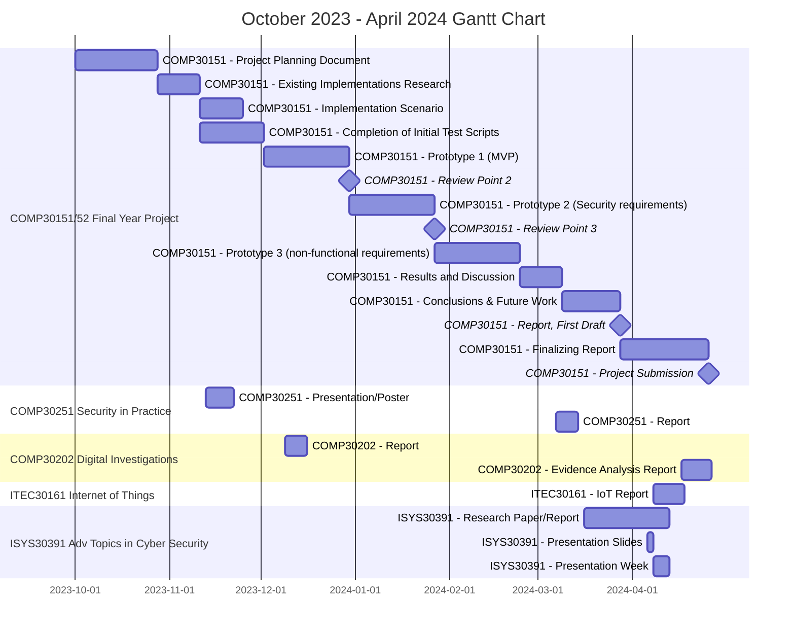

# Project Planning Document

## Table of Contents

- [Project Planning Document](#project-planning-document)
  - [Table of Contents](#table-of-contents)
  - [1 Introduction](#1-introduction)
  - [2 Aims and Objectives](#2-aims-and-objectives)
    - [2.1 Project Aims](#21-project-aims)
      - [2.2 Objectives](#22-objectives)
  - [3 Tasks and Deliverables](#3-tasks-and-deliverables)
    - [3.1 Tasks](#31-tasks)
      - [3.1.1 Research \& Case-study](#311-research--case-study)
      - [3.1.2 Requirements \& Test Definition](#312-requirements--test-definition)
      - [3.1.3 Implementation of functional requirements](#313-implementation-of-functional-requirements)
      - [3.1.4 Implementation of non-functional and security Requirements](#314-implementation-of-non-functional-and-security-requirements)
    - [3.2 Expected Outcomes](#32-expected-outcomes)
    - [3.3 Expected Project Scope](#33-expected-project-scope)
      - [3.3.1 Scope of Security Enforcing Functions (SEFs) \& Security Requirements](#331-scope-of-security-enforcing-functions-sefs--security-requirements)
    - [3.4 Project Milestones](#34-project-milestones)
  - [4 Gantt Chart](#4-gantt-chart)
  - [5 Resources](#5-resources)
    - [5.1 Research Resources](#51-research-resources)
    - [5.2 Testing Resources](#52-testing-resources)
  - [6 Risks](#6-risks)
  - [7 Career Aspirations](#7-career-aspirations)
  - [8 Legal, Social, Ethical and Professional Issues (LSEPIs)](#8-legal-social-ethical-and-professional-issues-lsepis)
    - [8.1 Legal Issues](#81-legal-issues)
      - [8.1.1 DMS’ potential use as an ‘article’ for Cybercrime](#811-dms-potential-use-as-an-article-for-cybercrime)
    - [8.1.2 Risk of the user accidentally committing a cybercrime via the DMS](#812-risk-of-the-user-accidentally-committing-a-cybercrime-via-the-dms)
  - [8.2 Social Issues](#82-social-issues)
  - [8.3 Ethical Issues](#83-ethical-issues)
    - [8.3.1 Potential Ethical Issues regarding DMS misuse in non-DV contexts.](#831-potential-ethical-issues-regarding-dms-misuse-in-non-dv-contexts)
    - [8.3.2 Potential Ethical Issues relating to project context (Domestic Violence)](#832-potential-ethical-issues-relating-to-project-context-domestic-violence)
  - [8.4 Professional Issues](#84-professional-issues)
    - [8.4.1 Duty to Relevant Authority (Nottingham Trent University)](#841-duty-to-relevant-authority-nottingham-trent-university)
    - [8.4.2 Duty to the Profession](#842-duty-to-the-profession)
  - [9 References](#9-references)

## 1 Introduction

A Dead Man's Switch (henceforth abbreviated DMS) is any safety mechanism that activates when an intended state or outcome fails to be so by change in machine, operator, or environment - digital or otherwise – that prevents maintenance of said state or outcome. In computer systems, the most well-known example is nuclear deterrence - for example, Russia's *Perimetr* (“Dead Hand”) system. Such use cases are generally considered morally and ethically contentious at best by anti-nuclear
movements. The DMS concept has also been applied for anti-forensic uses (Hephaest0s, 2023) and in malware such as the Logic Bomb. Ultimately and unfortunately – and perhaps due to its name and use as a film trope - the general surface view of the technology is that it is one that harms in all uses.

The initial 'known' usage of a DMS is as a fail-safe in operator safety in vehicles and machines, where it has seen repeated successful use in subway trains (Newman, A., 2010), with one variant - vigilance devices - requiring occasional re-application of the ‘prevention’ input to prevent fail states where it remains applied, as seen in one Driver Safety Device (DSD) manual (British Railways, n.d). In this context, the DMS is standardized to the extent that §1205.5 of the *U.S. Code of Federal Regulations* (2022) mandates its implementation in lawnmowers; its acknowledgement as a DMS appears to only exist in industry. Such usage can be viewed as entirely ethical, as its aim is to keep people safe, rather than to harm them - unfortunately this form of ethical use has not translated to the digital world to the same level of fame, which seems like an unusual outcome and something worthy of investigation.

The full gamut of possible ethical use cases is a topic that cannot be fully explored in this project; we instead intend to produce a configurable DMS system that allows the writing of custom 'observer' and 'payload' functions, and thus applying it to the social problem of domestic violence (DV), where a victim must contact a support network without the abuser’s discovery.

This reframes the typical use of the DMS to protect the criminal (who ‘defends’ and can only fail once) against the law and state (who ‘attacks’, needing just one big win) into one that protects a more sympathetic user. This 'David vs. Goliath' type scenario - including the support networks needed - is mirrored in the protection of journalists, whistleblowers, and activists from those that would prevent their work. The investigation of this particular context-of-use of a domestic violence situation will be modelled entirely upon a fictional case study and will be informed by existing literature on the subject where possible.

The efficacy of a technical solution to a social problem may be questioned, but one review (Kouzani, A.Z., 2023) shows that technology can allow for better DV outcomes. One of the areas defined, *Detection and Intervention*, will be the focused target of our DMS solution. However, usage of technology alone can backfire; If the victim's 'adversary' (in the threat modelling sense) is technically literate, there is a risk of the abuser's discovery of countermeasures culminating in an incident. The use of obfuscation measures to counter this on a 'compromised' (monitored) device may be difficult and thus the allyship of a friendly third-party with uncompromised devices might be assumed to ensure efficacy.

An abuser may prevent the spread of their actions by preventing communication (Flannery S., 2020) – greater DV communication may prevent this. One review (Mancini et al., 2006) notes that the United States Air Force (USAF)'s 1996 community-focused suicide prevention program reduced suicides significantly; said rates were since maintained, alongside reduction in other problems, namely Intimate Personal Violence (IPV).

The authors note the similarity of suicide prevention and IPV research; subsequent evaluations have also ruled out extraneous factors. Furthermore, a study of lesbian, bi and trans (LBT) survivors of DV (Bornstein et al., 2006) shows that victims struggled to identify abuse in forms *specific to the queer community;* the prevalence of heterosexual perspectives in DV support resources meant that *emotional* abuse was not easily identified. Thus, the dissemination of *relevant* information can be seen to improve outcomes.

Coercive tactics impede such efforts; many LBT DV survivors noted isolation from peers through threats and intimidation. Lack of anonymity combined with the small size of any support groups killed any attempts to reach out; abusers could access the same resources as victims and were well-liked within their communities – potential supporters were not only unhelpful, but actively malicious to the abuser. This makes it difficult to identify and escape the abuse; people that escaped subsequently struggled to find housing or safety.

The LGBTQ+ community frequently makes use of digital communications to explore early identity away from hostile environs (Craig & McInroy, 2014). Similarities between this usage and DV support networks are clear; said tools may also counter isolation efforts by abusers and these benefits may apply to DV victims outside of the community. Technology is most effective at controlling digital spaces, so a DMS that can sound the alarm if a person ‘disappears’ from social media could be a small - but *crucial* - tool.

## 2 Aims and Objectives

### 2.1 Project Aims

The main aim of this project is to produce a DMS toolset that allows for a *technically advanced* external contact of a DV victim to be alerted upon lack of activity for *incident response* purposes, potentially via the use of a known-secure medium of communication from a hidden device the abuser is unaware of. The DMS may be configurable by the contact to allow modification of the tool to work across a variety of DV scenarios.

Through the tool that will be produced, a secondary aim of the project is the creation of a framework that allows the design and connection of user-coded ‘triggers’ and ‘payloads’, to encourage incremental modifications of the DMS concept to changes in scenario, both DV and non-DV in nature.

#### 2.2 Objectives

1. Assess the current state of technical solutions to the DV issue, noting any potential implementations or considerations that could apply to the DMS.

2. Establish a *fictional* scenario where technology could be applied to improve the outcome for a DV victim; produce a threat model including capabilities, motivations, and power of any threat agents, alongside allies or resources the victim has. Subsequently, define an acceptable use-case for the DMS that would assist in helping the victim.

3. Note and discuss (if applicable) any potential ethical or legal concerns that may arise by implementing the DMS as a solution, using the BCS Code of Conduct as a basis.

4. Test, design and develop a prototype of the framework that meets the needed requirements for an MVP to be deployed in this context. If any additional requirements are realised during the process they should be noted in the report at this point.

5. Evaluate any potential risks to the efficacy of the *solution itself* via potential attacks from adversaries, or loss of resources or allies.

6. Identify shortcomings in the prototype that may contribute to noted risks and define what (if any) potential technical or social countermeasures may exist.

7. Report the efficacy of the project for this purpose - noting risks present in other DV contexts, and any potential ethical or legal considerations to be made in further work with the tool produced, related to the context or not.

## 3 Tasks and Deliverables

### 3.1 Tasks

#### 3.1.1 Research & Case-study

1. Collect existing research on technical countermeasures to the social issue of domestic violence, focusing on use-cases relevant to the application of the DMS. Note non-technical aspects of the issue that may be of relevance.

2. Produce a given scenario and threat model in which the DMS will be applied; explicitly define the technical capabilities of the abuser and contact and produce a threat register defining actor(s), impact and likelihood alongside any controls, preventions, or mitigations. Out of threats identified, consider the inclusion of any technical (DMS) countermeasures as additional requirements.

3. Identify any potential ethical or misuse concerns that may arise with the solution demonstrated via the DMS framework by the victim, contact or a threat actor that discovers the DMS.

4. Out of the concerns identified, assess which are controllable through additional DMS requirements, and which are out of scope and require non-technical countermeasures via socio-political means.

#### 3.1.2 Requirements & Test Definition

1. Define any additional requirements identified in prior analysis and consider whether any requirements must change priority (i.e., MUST → SHOULD) or be dropped from the project. **Explain rationale for changes made if not done prior.**

2. Define test scenarios and cases for high-level requirements using best practice. Where it would make sense to do so, break down any high-level requirements into their low-level dependencies.

3. Identify whether any low-level requirements can be scripted as unit tests to be implemented or require manual execution; if so, write them in the report at this point.

#### 3.1.3 Implementation of functional requirements

1. Going through the functional (**MUST**) requirements as deemed applicable, implement each unit, **beginning with generic (DMS) requirements first.** Units should follow any defined scripts and **must initially fail.**

2. Begin implementing code to make the test unit succeed according to the original test documentation. Show any relevant design or implementation detail as diagrams, prose, or code snippets. **If the script or requirement must be modified to continue, explain why and document any changes.**

3. Repeat previous steps such that an ‘ongoing log’ of progress is defined within the report as part of the agile development process.

#### 3.1.4 Implementation of non-functional and security Requirements

1. Identify any attack vectors that threat actors could take against the DMS prototype according to the victim’s threat model. Distinguish between **scenario-specific** (‘trigger’/’payload’) and **generic** vectors.

2. Discuss any risks that noted vectors pose to the victim or their supporters, and their significance. Discuss potential countermeasures, distinguishing between technical (in-scope) and non-technical (out of scope). Consider adding any technical measures as security requirements.

3. For each non-functional (**COULD**) and security (**SHOULD**) requirement, go through the same unit testing and implementation process explained in Sections [3.1.2](#312-requirements--test-definition) and [3.1.3](#313-implementation-of-functional-requirements). **Note any modifications or dropped requirements, with rationale.**

### 3.2 Expected Outcomes

After completion of the project MVP and evaluation of non-functional/security requirements and any attack vectors, the hopeful outcome of this project is to establish that there is potential in the idea of usage of a DMS to assist in protection of victims in DV situations - and that through proving this, encouraging that the MVP be applied to other contexts to allow for further exploration of the ethical and socially-inclined use of the DMS concept in future work.

### 3.3 Expected Project Scope

The project MVP is to produce a configurable DMS application that allows for the writing of custom 'observer' and 'payload' functions that are to run as separate processes that operate independently from the utility that initially launches them. The components of the DMS are to be connected such that they can send, receive, and propagate signals to and from other components to allow for context-dependent functionality - for example an observer process noting that a 'triggering' state has been achieved and to contact the payload to activate, or for one component to signal to its peers that it is exiting unexpectedly. Additional MVP requirements may be included as part of the written DV scenario in the report.

Requirements outside of this initial scope may include security and configuration features that in the underlying framework that may be of varying use to the scenario defined, such as anti-tamper measures or state persistence. If outcomes put the project ahead of its timeline, additional requirements and attack surface analysis will be first considered in the context of allowing the tool to adapt to *differing* DV threat models and scenarios, and then the application of the tool to general, potentially non-adversarial contexts.

Requirements will be defined by type – MVP (**MUST**), security (**SHOULD**) and non-functional (**COULD**) – level (**HLR/LLR**), and context; generic (**DMS**) or scenario (**DV**).

A preliminary requirements table is thus provided:

|  ID | Description |
| :-: | :---------- |
| `DMS-HLR-1` | The observer component **MUST** communicate any trigger events to the payload component. |
| `DMS-HLR-2` | The DMS setup utility **MUST** operate independently from any component processes so that the tool can be set up and left to work in the background. |
| `DMS-HLR-3` | The payload component **MUST** alert other components to the outcome of an activation. |
| `DMS-HLR-4` | Any given DMS component that dies unexpectedly **MUST** show this to components that depend on it to allow for failure state handling. |
| `DV-HLR-1` | The scenario-specific observer ‘trigger prevention mechanism’ **MUST** be reasonably accessible for the victim to use in terms of availability, setup and technical ability required. |
| `DV-HLR-2` | The scenario-specific payload **MUST** provide the victim’s support network with an alert that the victim has not used the prevention mechanism. |

#### 3.3.1 Scope of Security Enforcing Functions (SEFs) & Security Requirements

The DMS will be portably written to facilitate application to other contexts. Thus, the scope of security requirements and any resultant SEFs are limited, as the DMS will run on ring 3, the least privileged ring of the OS. The DMS cannot tolerate failures or interrupts from lower ringed processes (i.e., drivers or the kernel), and it is assumed that the OS is not in a frozen or sleeping state when the payload or observer threads need to respond to an event. Additional limitations may be realised as the project progresses.

### 3.4 Project Milestones

The following milestones are intended to be reached:

1. Ethics application submission (RP1)
2. Submission of PPD
3. Established scenario for implementation
4. Completion of Initial Test Scripts
5. Prototype 1 (Review Point 2, MVP)
6. Prototype 2 (*Security* requirements)
7. Prototype 3 (*non-functional* requirements)
8. Showcase Entry and Review Point 3
9. Report, First Draft
10. Project Submission
11. Project Showcase

## 4 Gantt Chart

## 5 Resources

### 5.1 Research Resources

- Zotero is an open-source reference manager for use in academic contexts. It will be used to store and annotate papers, books, and other resources during research, and to generate style-accurate citations and references.
  - `scite-zotero-plugin` is a Zotero plugin provided by scite.ai, an online service to evaluate discussion surrounding a paper. In the context of Zotero it is used to list the number of supporting/disputing citations and to access the scite.ai report itself (which does not require a paid subscription).

- Google Scholar will be used to search for and obtain papers related to the project.

- Given that some DMS-related literature is quite old, *WorldCat* will be sometimes used to find an equivalent book or document (such as a reprint) when a reference cited by a paper cannot be directly sourced.

- NTU’s Library OneSearch will be used to access papers or request interlibrary loans when an open-access version of a resource cannot be found.

### 5.2 Testing Resources

The main reference for following *Behaviour-Driven Development* practices will be Automation Panda’s *BDD 101* series (Knight, A., 2023). It provides reference on using `related tooling` and advice on how best to write Gherkin scripts for features, among general best practice.

## 6 Risks

To evaluate potential risks to the project, we will be using a *Risk Matrix*, following a blogpost by Asana (2022) as a guideline. Risks are identified by type, severity, likelihood, and impact. Risk *Types* that will be used are as follows:

- Strategic risks, relating to potential errors in decision, such as tools used or evaluated timelines.

- Operational risks, such as mistakes in planning or communication.

- Technical risks, such as loss of data or property damage.

Risks themselves are rated on a scale of 1-5 on severity and likelihood, and the resultant risk impact is a value of 1-25 calculated by the product of both.

It is as follows:

| Risk ID | Risk Type | Risk Description | Severity, 1-5 | Likelihood, 1-5 | Risk Impact | Countermeasure(s) |
| :-----: | :-------: | :--------------- | :-----------: | :-------------: | :---------: | :---------------- |
| 1 | *Technical* | Source-code and other deliverables could be lost, setting the project back. | 5 | 2 | 10 | All project code and documents are **regularly committed to a private *GitHub* repository and/or *OneDrive.** |
| 2 | *Operational* | Project completion could become difficult due to scope creep, either by the choice of scenario or due to subsequently identified non-functional and security requirements. | 3 | 3 | 9 | The requirement prioritization order (**MUST, SHOULD, COULD**) makes sure that the MVP is prioritised. In addition, **a *critical path* will be defined for optional requirements** to deal with those most important first. |
| 3 | *Strategic* | Test definition for requirements ends up taking longer than expected. | 2 | 2 | 4 | Unit tests can be dropped in favour of **manual testing with appropriate alternate evidence** of requirements being fulfilled. |
| 4 | *Strategic* | Insufficient information is found on the efficacy of technological aids in DV situations, leading to an inadequate solution. | 3 | 2 | 6 | Research instead moves to focusing **on non-DV case studies where a dead man’s switch is used against an adversary**, to help create a theoretically sound solution. |
| 5 | *Operational* | The state of the project misaligns with the desired deliverables and outcomes due to lack of communication with the project supervisor. | 2 | 4 | 8 | As suggested in lectures, **weekly contact with the supervisor** will be aspired to. This may be in the form of updates or arranged meetings, depending on whether discussion is required. |
| 6 | *Operational* | Tasks take longer to fulfil than their stated timeframe on the Gantt Chart. | 2 | 2 | 4 | **Tasks are rescheduled according to circumstance** and other commitments may be rescheduled or dropped as required. |
| 7 | *Technical* | Tools chosen for development are unsuitable for fulfilling certain requirements. | 1 | 2 | 2 | Due to the development methodology being followed this **should be caught when attempting to implement the requirement.** It will be noted at that point in the report and any changes made in libraries used or implementations will be noted. |
| 8 | *Strategic* | The secondary objective to provide a flexible DMS tool for use in other areas makes it difficult to fulfil the scenario-specific requirements due to scale. | 3 | 3 | 6 | All generic requirements **not directly related to the solution required by the scenario** will be non-functional (**COULD**) and handled after the MVP has been developed and tested adequately. |
| 9 | *Strategic* | The scenario solution provided could be inadvertently exploited by an adversary to worsen the victim’s situation via tech abuse. | 5 | 1 | 5 | The threat model produced will **accurately define resources and skills of any adversaries.** In addition, a threat register of any potential attack vectors in the MVP will be added alongside relevant security requirements. |
| 10 | *Strategic* | The solution provided would not be easily usable by the end user due to technical complexity. | 3 | 2 | 6 | As part of scenario definition, the technical capabilities of the victim and persons in their support network will be defined. The trigger prevention mechanism may leverage **existing, familiar technology (e-mail, SMS, etc.).** |
| 11 | *Strategic* | The efficacy of the solution provided is limited by the victim’s access to trusted devices. | 3 | 4 | 12 | These will be exposed as threat vectors and **compartmentalization of the DMS** will allow for its use on **trusted, external devices of the support network.** |

## 7 Career Aspirations

[...][^1]

My familiarity with Python and its modules fits well for the open-ended nature of the demonstration scenario in this instance, so I have instead decided to leverage my familiarity with the language to gain familiarity with software development practices - not all of these will be used in many positions, but for all of this I will pick up a significant amount of transferrable skills: the method of development will allow me to better translate requirements into features; write good tests both as a software and test engineer and improve at writing documentation by putting it ‘first’ and get better at operating with ‘chunks’ of work in respect to Agile (which is popular in many organizations).

Such skills are difficult to learn through resources, notes, and revision, instead being best improved through immersion learning, which this project allows.

## 8 Legal, Social, Ethical and Professional Issues (LSEPIs)

### 8.1 Legal Issues

#### 8.1.1 DMS’ potential use as an ‘article’ for Cybercrime

The secondary aim of the project raises the possibility that a user could feasibly create a set of ‘observer’ and ‘payload’ functions that can be used with the DMS framework as malware. Such a usage could potentially make the project an ‘article’ under UK legislation; The original form of the *Computer Misuse Act 1990* itself does not contain a section relevant to this, but a subsequent (*Police and Justice*) Act passed in 2006 includes an amendment to *Section 3A* of the CMA via its own Section 37, and another (*Serious Crime*) Act passed in 2015 amends section 3A of the CMA to include section 3ZA via its own Section 41.

For the purposes of complete legal analysis, we will assume that any user that has used the tool in a malicious manner has committed a crime under all sections relevant (Section 1, 3 and 3ZA). The revised, digital edition of the CMA (Anon., 2023) will be referenced from this point.

Section 3A(4) of the CMA defines an article as *“any program or data held in electronic form”*, effectively encompassing any information that can be recorded as such and is usable for the purposes of violating the CMA, including instructions to commit an offence under the CMA itself (so long as it is a digital file). **The project outcome will meet this criterion.**

Subsequently, 3A(1) makes it an offence if someone *“makes, adapts, supplies or offers to supply any article intending for it to be used for an offence under [Sections 1, 3 and 3ZA]”*. **The disproving of intent is evident in consideration of this issue in the PPD.**

Section 3A(2) expands upon this to make it an offence to provide an article *“believing that it is likely to be used to commit, or to assist in the commission of, an offence under [section 1, 3 or 3ZA]”*. The term *“likely”* is vague, but the *Crown Prosecution Service*’s own legal guidance to prosecutors (2023) notes that *“the relevant mens rea is belief, and mere suspicion is not enough.”* **The outcome of this project is not believed to be usable for this purpose** as strong malware requires resilience to antivirus software, needing complex requirements that this solution will not meet.

Further relevant advice from the same source asks prosecutors to consider if “the article has been developed primarily, deliberately and for the sole purpose of committing a CMA offence” and whether the article is “widely used for legitimate purposes”. The secondary aim – and indeed the intended outcome for the project – shows that the tool is developed to explore *ethical* use-cases of a DMS in new contexts. **The DMS *will not* be developed for criminal use and is *expected* to be used legitimately.**

Perhaps most importantly, the ‘sharp edge’ of the DMS itself would be within the ‘payload’ function, which is **intended to be scripted by the user - and so would not be an “article” created by the author.** Caution should be taken to ensure this remains the case with the scenario-specific functions created.

To summarize; in the context and scope of this project as defined in this document, it is not believed that a violation of Section 3A of the *Computer Misuse Act 1990* would occur.

### 8.1.2 Risk of the user accidentally committing a cybercrime via the DMS

Under the context initially outlined (prevention of domestic violence), there is the possibility that a victim does not have access to a device they “own” themselves – it may be the abuser’s property instead. If any part of the DMS system is obfuscated from the abuser, this becomes a potential threat. Section 3(1) of the *Computer Misuse Act 1990* says that *“A person is guilty of an offence if - [(a) he does any unauthorised act in relation to a computer; (b) at the time when he does the act he knows that it is unauthorised; and (c\) either subsection (2) or subsection (3) below applies.]”*

A victim ***knowingly*** applying a DMS system to a **device their abuser owns** (for example a device they are the administrator of) already **meets the requirements of Sections 3(1)(a) and 3(1)(b).**

The DMS system itself in theory ***should not count* towards violation of 3(1)(c),** but if any part of the system attempts to **obfuscate itself** from the abuser, or **prevent its detection or removal** by existing software – and the **victim is *aware*** of this functionality, it would then meet the requirements of Section 3(1)(c\) through Section 3(2) via Sections 3(2)(b) – *“prevent or hinder access to any program or data held in any computer”* – or 3(2)(c\)– *“impair the operation of any such program or the reliability of any such data”.*

Within the UK, it appears *exceedingly* unlikely that a successful prosecution would occur against a victim in such a context assuming a sympathetic judge and jury – but the legal basis *is* present, and therefore there might be an *ethical* obligation to not allow this possibility by completing requirements that intentionally facilitate the hiding or ‘rooting’ of the DMS into an untrusted machine.

## 8.2 Social Issues

Referencing section 1 of the BCS *Code of Conduct* (2022), members of the organization must follow a set of requirements relating to the public interest, among which is the following:

>a. *[You shall] have due regard for public health, privacy, security and wellbeing of others and the environment.*
>d. *[You shall] promote equal access to the benefits of IT and seek to promote the inclusion of all sectors in society wherever opportunities arise.*

The context of use explored in this project will aim to leverage the idea that supportive social connection reduces instances of domestic violence, a significant social issue itself. The hope is that the outcome of the project will help bolster an already significant arsenal of technology that the victim can use to keep themselves safe, and hopefully work to level the playing field against abusers using similar technology to facilitate digital abuse. The additional outcome of a flexible tool to explore other use-cases is presented in the hopes that other peers will take the opportunity to help solve social, economic, and political issues in a similar vein to contribute to the improvement of society.

Furthermore, the use of the tool to keep the victim connected to their support network, and the intent to have this tool be accessible for use by anyone that can use a device should help ensure that as many people as possible can benefit from its effects.

## 8.3 Ethical Issues

The BCS *Code of Conduct* (2022) has Sections 1a, 1b and 1c regarding ethics in engineering:

>a. *[You shall] have due regard for **public health, privacy and wellbeing** of others and the environment.*
>b. *[You shall] have due regard for the **legitimate rights of Third Parties.***
>c. *[You shall] conduct your professional activities **without discrimination** on the grounds of sex, sexual orientation, marital status, nationality, colour, race, ethnic origin, religion, age or disability, or of any other condition or requirement.*

It is from these base principles that we shall begin our ethical analysis of the project.

### 8.3.1 Potential Ethical Issues regarding DMS misuse in non-DV contexts.

As has been discussed in Section 8.1 (Legal Issues), a proper analysis of the ethics of this project’s secondary aim cannot be undertaken without the consideration that it may be leveraged for criminal activities. Regardless of law, however, it must be acknowledged that some may leverage the tool for *legal* purposes that are in and of themselves unethical. The only true solution to this would be to create a bespoke solution for a pre-defined, ‘ethical’ scenario - which the author firmly believes would undermine the hypothesis that such technology has greater ethical uses beyond its use in mechanical safety systems, and the intent to support exploration of this through the project’s end result.

The best that we can do to prevent this is to try not to implement requirements that would be *primarily* used for unethical purposes (such as hiding from administrator users – see Section 8.1.2).

### 8.3.2 Potential Ethical Issues relating to project context (Domestic Violence)

Though it is believed that the application of the DMS to this use-case provides ethical countermeasures to a large-scale social issue, the subject of domestic violence is one fraught with complexity that requires the consideration of technological effects.

Firstly, section 1a: To some extent, privacy of the victim is synonymous with their health and wellbeing in a vulnerable situation, as it provides *autonomy* through obfuscation of action and intent – something many DV victims have very little of due to their abuser(s) and any sympathizers therein. The use of a DMS to alert a victim’s support network of their lack of activity is a violation of privacy, as it must monitor aspects of their life to know when a ‘trigger’ state should occur. It is assumed that this is a necessary evil and one the victim should consent to, but it is a violation, nonetheless.

The monitoring of information may very well present additional risk surface through the exposure of data and metadata – for example, knowing when the victim usually ‘resets’ the DMS could provide a ‘fake’ supporter with information that could be relayed back to a well-connected abuser (for example, within a secular community). This should be considered when deciding what requirements are needed for the DMS to be effective; each extra bit of ‘assurance’ (location data, for example) is another potentially exposed datapoint.

Section 1b should be considered in the sense that any requirements do not inflict on the rights of any person involved in the scenario (even the abuser). A carelessly designed solution in this manner could result in the victim or any supporters causing as such, putting them in a legally unsafe situation. This should only be an issue regarding any potential violations of privacy caused by the usage of the DMS with a device the victim does not own, which is a scenario we wish to avoid for legally ambiguous reasons also (see Section 8.1.2) and have thus discussed prior.

Finally, section 1c itself is primarily something to consider by ensuring that the solution produced is sufficiently usable, not only from the perspective of technical competence but also from an accessibility perspective for the disabled and in terms of any potential technology required, that may make the solution potentially unworkable for those of a lower socioeconomic background. The DMS should work to be usable on older, lower-spec machines to compensate for this, and might wish to have the ‘trigger reset’ mechanism integrate with any existing accessibility tools that are in use – in the interest of preventing scope creep, it might be best to work towards interoperability with existing protocols, standards, and tools to facilitate as such.

## 8.4 Professional Issues

The relevant sections in the BCS *Code of Conduct* here are Sections 3 (*Duty to Relevant Authority*) and 4 (*Duty to the Profession*). They will be treated separately for the purposes of analysis.

### 8.4.1 Duty to Relevant Authority (Nottingham Trent University)

Sections 3a, 3c and 3d of the BCS Code of Conduct correspond to Nottingham Trent University’s *Student Charter* (2023), though some sections are explicitly covered by separate documents that Students are obliged to adhere to as part of the charter.

Section 3a refers to the proper carrying out of professional responsibility with *“due care and diligence”*, which would be part of the responsibilities set out in the charter itself.

Section 3c, covering acceptance of *“professional responsibility”*, would fall under the University’s *Academic Integrity Policy*, which would be Section 17C, Part E (Regulations) of the associated *Quality Handbook.* (Nottingham Trent University, 2023). Compliance with this policy would involve the pledge to not commit any form of academic irregularity, nor to assist any other students with the process; this is something that the University as an authority would ensure as part of regular academic procedure when submitting work.

Section 3d refers to the concept of the misuse of confidential information relating to the authority, excluding when compelled to be legislation or when permission is given. From a student perspective, this would be primarily covered by adherence to the *Computer Use Regulations* (Nottingham Trent University, 2022). The demonstration of the Dead Man’s Switch scenario may brush up against these regulations, specifically section 7.5:

>7.5 *You must not install software on a University computer, or system, without gaining the prior approval of Digital Technologies Service Desk, by […]*

It is assumed that to some extent there is due process for demonstration of a final year project on University computers, but some additional measures for assurance’s sake may need to be undertaken by *Digital Technologies* to check that the demonstration of the chosen scenario does not violate any other sections of the policy.

### 8.4.2 Duty to the Profession

The first set of relevant sections (4a and 4c) of the BCS Code of Conduct refer to the upholding of the reputation of the profession and BCS respectively:

>a. *[You shall] accept your personal duty to uphold the reputation of the profession and not take any action which could bring the profession into disrepute.*
>c. *[You shall] uphold the reputation ad good standing of BCS, the Chartered Institute for IT.*

The reputation and good standing of both the profession and the BCS should be upheld through the demonstration and continued upholding of relevant standards of work through this document and the associated report.

Section 4b, on the other hand, is related to professional development:

>b. *[You shall] seek to improve professional standards through participation in their development, use and enforcement.*

The implementation of Agile methodology and Test/Behaviour-Driven Development as part of the development process - as defined in Section 3 (Tasks and Deliverables) - indicates that there is a vested interest in working with these software development standards by using them in a project to become a better engineer.

## 9 References

British Railways, n.d. British Railways Drivers Manual - Drivers Safety Device - DSD. Available at: <http://locodocs.co.uk/brmanuals/DSD-33056-4-Issue1.htm> [Accessed 22 October 2023].

Bornstein, D.R. et al., 2006. Understanding the Experiences of Lesbian, Bisexual and Trans Survivors of Domestic Violence: A Qualitative Study. *Journal of Homosexuality*, 51(1), pp.159–181. [10.1300/J082v51n01_08](https://doi.org/10.1300/J082v51n01_08).

British Computer Society, 2022. BCS Code of Conduct. Available at: <https://www.bcs.org/media/2211/bcs-code-of-conduct.pdf> [Accessed 5 October 2023].

Computer Misuse Act 1990 (c. 18). Available at: <https://www.legislation.gov.uk/ukpga/1990/18/contents> [Accessed 4 October 2023].

Craig, S.L., McInroy, L., 2014. You Can Form a Part of Yourself Online: The Influence of New Media on Identity Development and Coming Out for LGBTQ Youth. *Journal of Gay & Lesbian Mental Health*, 18(1), pp.95–109. [10.1080/19359705.2013.777007](https://doi.org/10.1080/19359705.2013.777007).

Crown Prosecution Service, 2023. Computer Misuse Act [online]. Available at: <https://www.cps.gov.uk/legal-guidance/computer-misuse-act> [Accessed 4 October 2023].
Flannery, S., 2020. When an Abuser Controls the Story [online blog]. *DomesticShelters.org*. Available at: <https://www.domesticshelters.org/articles/identifying-abuse/when-an-abuser-controls-the-story> [Accessed 22 October 2023].
Hephaest0s [pseud.], 2023. Hephaest0s/usbkill. Available at: <https://github.com/hephaest0s/usbkill> [Accessed 22 October 2023].

Knight, A., 2017. BDD [online blog]. *Automation Panda*. Available at: <https://automationpanda.com/bdd/> [Accessed 2 October 2023].

Kouzani, A.Z., 2023. Technological Innovations for Tackling Domestic Violence. *IEEE Access*, 11, pp.91293–91311. [10.1109/ACCESS.2023.3306022](https://doi.org/10.1109/ACCESS.2023.3306022).

Mancini, J.A. et al., 2006. Preventing Intimate Partner Violence: A Community Capacity Approach. *Journal of Aggression, Maltreatment & Trauma*, 13(3–4), pp.203–227. [10.1300/J146v13n03_08](https://doi.org/10.1300/J146v13n03_08).

Newman, A., 2010. Not the First Time the ‘Dead-Man’ Switch Did Its Job. *The New York Times* [online], 7 May. Available at: <https://archive.nytimes.com/cityroom.blogs.nytimes.com/2010/05/07/not-the-first-time-the-dead-man-switch-did-its-job/> [Accessed 22 October 2023].

Nottingham Trent University, 2023. Academic Integrity Policy. Available at: <https://www.ntu.ac.uk/__data/assets/pdf_file/0036/921987/17C-Academic-Integrity-Policy-Sept-2023.pdf> [Accessed 5 October 2023].

Nottingham Trent University, 2022. Computer Use Regulations. Available at: <https://www.ntu.ac.uk/__data/assets/pdf_file/0023/1048550/computer-use-regulations.pdf> [Accessed 5 October 2023].

Nottingham Trent University, 2023. Student Charter. Available at: <https://www.ntu.ac.uk/__data/assets/pdf_file/0025/1048606/ntu-student-charter-2023.pdf> [Accessed 5 October 2023].

Office of the Federal Register, 2023. Code of Federal Regulations §1205.5: 2023. *Walk-behind rotary power mower controls.* Available at: <https://www.ecfr.gov/current/title-16/part-1205> [Accessed 22 October 2023].

Police and Justice Act 2006 (c.48). Available at: <https://www.legislation.gov.uk/ukpga/2006/48/contents> [Accessed 4 October 2023].

Serious Crime Act 2015 (c.9). Available at: <https://www.legislation.gov.uk/ukpga/2015/9/contents> [Accessed 4 October 2023].

Team Asana [pseud.], 2022. Risk matrix template: How to assess risk for project success (with examples) [online]. *Asana*. Available at: <https://asana.com/resources/risk-matrix-template> [Accessed 2 October 2023].

[^1]: This part of the document mentions aspects of previous experience that has been redacted from this online version as a matter of good OPSEC.
